# Technical Design: LP-01 核心基础与 Idea 流程

- Status: F2 Technical Design
- FeatureId: `lp-01-core-idea-flow-7a4c1e9d2b60`
- Branch: `codex/lp-01-core-idea-flow`
- Requirements: [requirements.md](./requirements.md)
- RequirementsCommit: `42078fa3e2b20cb599ef795a88ee37377897c5ab`
- BaselineCommit: `30aa27129f21efe6e4ef2bfc17ffa0e1a7282682`

## 1. Background

LP-01 把当前纯文档仓库变成第一个可运行、可验证的业务切片。它负责建立工程工作区、
共享契约、PostgreSQL 持久化、版本化 API，以及 Idea 创建、澄清、显式推进和基础
读取能力。

本设计保持一个单工作空间、无用户系统的模块化单体。AI 写入凭据只证明调用来源有权
写入；`actor`、`proposer` 和 `role` 始终是声明归属，不是已认证用户身份。

## 2. Goals

- 从干净检出可重复安装、检查、测试和构建。
- 使用一个 PostgreSQL 权威源保存 Idea、澄清、项目、幂等结果和追加式历史。
- 分离已知陈述、待验证假设和待澄清问题，不补写缺失事实。
- 信息完整与进入执行解耦；只有明确推进命令才创建项目。
- 每个 Idea 最多创建一个首要验证项目。
- 对所有写入提供幂等、乐观并发、事务原子性和稳定错误语义。
- 提供公共只读、受凭据保护的 AI 写入、机器可读 OpenAPI 和准确健康状态。
- 保留结构化汇报 Schema 作为唯一共享契约，但不实现汇报业务。

## 3. Non-goals

- 不实现 LP-02 的执行进展、证据、结论、阻塞或高影响确认。
- 不实现 LP-03 的汇报提交、汇报渲染器或 Web 应用。
- 不实现 LP-04 的 Skill、演示数据或完整演示脚本。
- 不实现 LP-05 的生产部署、域名、TLS、备份或发布候选。
- 不实现注册、登录、多租户、用户身份或权限组。
- 不实现 Web 控制会话；LP-01 没有 Web 写入界面，因此本期必要控制面为空。
- 不实现消息队列、WebSocket、MCP、对象存储或微服务。
- 不引入 authorization engine、lifecycle simulator、GitHub authority checker 或
  大规模 mutation harness。

## 4. Runtime And Dependency Baseline

以下版本于 2026-07-30 通过官方 Node.js/PostgreSQL 发布页和 npm registry 核验。
实现使用精确版本、提交 `package-lock.json`，并以 `npm ci` 证明解析结果可重复。

| Component | Selected version | Decision |
| --- | --- | --- |
| Node.js | `24.18.0` LTS | 当前 LTS；根目录 `.nvmrc` 和 `engines` 固定 24.x |
| npm | `11.16.0` | 随选定 Node.js 发布，使用 package-lock v3 |
| PostgreSQL | `17.10` | 延续已确认架构的 17 主版本并采用当前安全补丁 |
| TypeScript | `6.0.3` | `typescript-eslint@8.65.0` 支持 `<6.1.0`；不采用不兼容的 7.x |
| Fastify | `5.11.0` | 版本化 HTTP API |
| TypeBox / provider | `1.3.8` / `6.1.0` | 请求、响应和 OpenAPI 的类型化 JSON Schema |
| `@fastify/swagger` | `9.8.1` | 从路由 Schema 生成 OpenAPI；不提供 Swagger UI |
| `@fastify/helmet` | `13.1.0` | 基础 HTTP 安全头 |
| Drizzle ORM / Kit | `0.45.2` / `0.31.10` | 类型化查询和可审阅 SQL migration |
| `pg` | `8.22.0` | PostgreSQL 驱动 |
| Ajv / formats | `8.20.0` / `3.0.1` | 共享 Schema 契约检查 |
| Pino | `10.3.1` | Fastify 结构化日志，使用字段脱敏 |
| Vitest | `4.1.10` | 单元、契约和集成测试 |
| ESLint / typescript-eslint | `10.8.0` / `8.65.0` | 静态检查 |
| Prettier | `3.9.6` | 格式检查 |
| tsx / ulid | `4.23.1` / `3.0.2` | TS 工具脚本和稳定、可排序 ID |
| `@types/node` | `24.13.3` | 与 Node.js 24 运行时主版本对齐 |

版本来源：

- [Node.js v24 archive](https://nodejs.org/en/download/archive/v24)
- [Node.js release policy](https://nodejs.org/en/about/previous-releases)
- [PostgreSQL versioning policy](https://www.postgresql.org/support/versioning/)
- [PostgreSQL 17.10 release notes](https://www.postgresql.org/docs/release/17.10/)

若实现时任一精确版本已撤回或无法形成兼容 lockfile，必须停在 F4 前修订本设计并重新
审查，不得静默换版本。

## 5. Repository And Module Boundaries

```text
apps/
  api/                    Fastify composition root, HTTP adapters, configuration
packages/
  contracts/              TypeBox API schemas, response/error types, OpenAPI generation
  domain/                 Framework-free entities, value objects and lifecycle policies
  application/            Commands, queries, ports, transaction orchestration
  db/                     Drizzle schema, repositories, PostgreSQL migrations
docs/
  feature/lp-01-core-idea-flow/
  feature/v0-1-project-plan/
```

依赖方向固定为：

```text
apps/api -> contracts + application + db
application -> domain + contracts
db -> application ports + domain
domain -> no framework, HTTP or database dependency
```

根 npm workspace 只注册 `apps/api` 和四个 packages。本期不创建 `apps/web` 空壳，
避免暗示 LP-03 Web 已开始。API composition root 负责配置、日志、认证、数据库连接、
路由和关闭顺序；业务规则不得写在路由 handler 或 SQL adapter 中。

## 6. Domain Model

### 6.1 Controlled values

| Type | LP-01 values |
| --- | --- |
| `IdeaIntakeStatus` | `IDEA`, `NEEDS_CLARIFICATION` |
| `StatementKind` | `FACT`, `HYPOTHESIS` |
| `ClarificationStatus` | `OPEN`, `ANSWERED` |
| `ProjectPhase` | `PLANNING` |
| `ProjectStatus` | `QUEUED` |
| `ActorType` | `HUMAN`, `AI`, `SYSTEM` |
| `DeclaredActorRole` | `PROPOSER`, `EXECUTOR`, `MAINTAINER`, `SYSTEM` |
| `View` | `proposer`, `executor` |

后续 LP 可增加值，但 LP-01 不接受、持久化或返回未实现的未来状态。

### 6.2 Idea aggregate

`Idea` 是创建、澄清和推进的并发边界：

| Field | Rule |
| --- | --- |
| `id` | 服务端 `idea_<ULID>`，不接受客户端值 |
| `workspaceId` | 固定为 `workspace_default` |
| `intentSummary` | 必填，去首尾空白后 1–4000 字符；忠实保留原始意图 |
| `proposer` | 必填的声明 `ActorContext`，role 必须为 `PROPOSER` |
| `desiredOutcome` | 可空，1–2000 字符；空时需要澄清 |
| `intakeStatus` | 由当前缺失项和开放问题确定 |
| `version` | 创建为 1；每次成功澄清或推进加 1 |
| `projectId` | 可空；成功推进后一次性指向唯一项目 |
| `createdAt` / `updatedAt` | 服务端 UTC 时间 |

已知陈述和假设保存在 `idea_statements` 中。每条记录包含 `kind`、内容、来源、
创建时间和可空的 `supersedesStatementId`。纠正通过追加新记录并指向旧记录完成；
旧记录不删除。当前投影选择未被后续记录取代的陈述。

创建请求可以显式提供问题。对于缺少 `desiredOutcome` 或没有当前假设的请求，领域层
还会生成稳定的字段型问题，例如“期望验证的结果是什么？”；问题本身不是业务事实，
不会把答案或假设补写为已知信息。

### 6.3 Clarification history

问题和回答分表保存：

- `clarification_questions` 保存问题、目标字段、状态和当前回答 ID；
- `clarification_answers` 追加保存回答正文、声明 Actor、原因、时间，以及可空的
  `supersedesAnswerId`；
- 回答命令可以同时提交显式分类的新增事实、假设或期望结果修订；
- 服务端只应用请求明确声明的字段，不从自由文本推断事实；
- 回答后重新计算开放问题和必要字段；条件完整时状态变为 `IDEA`，但不创建项目。

一个已回答问题需要纠正时，客户端再次提交回答并引用当前回答版本；系统追加回答，
更新当前回答指针并保留原回答。

### 6.4 Validation project

推进创建 `ValidationProject`：

| Field | Rule |
| --- | --- |
| `id` | 服务端 `proj_<ULID>` |
| `ideaId` | 唯一外键；数据库唯一约束保证每个 Idea 最多一个项目 |
| `workspaceId` | 固定工作空间 |
| `goal` | 从 Idea 当前 `desiredOutcome` 快照复制 |
| `phase` | 固定 `PLANNING` |
| `status` | 固定 `QUEUED`，含义为等待 LP-02 执行 |
| `version` | 初始为 1 |
| `createdAt` / `updatedAt` | 服务端 UTC 时间 |

`project_hypotheses` 在推进事务中复制 Idea 的当前假设，保留来源 statement ID。
后续对 Idea 的澄清不静默改写已创建项目；该变更属于后续显式项目流程。

推进前置条件全部满足才可提交：

1. Idea 存在且 `projectId` 为空；
2. `expectedVersion` 等于 Idea 当前版本；
3. 当前 `desiredOutcome` 非空；
4. 至少有一个当前 `HYPOTHESIS`；
5. 请求 `explicitIntent` 精确为 `PROMOTE`；
6. 声明 Actor 为 `HUMAN/PROPOSER`，或 ActorType 为 `AI` 且
   `onBehalfOfRole=PROPOSER`；
7. `reason` 非空。

重复推进不会创建第二个项目。相同幂等请求返回首个响应；使用新幂等键对已推进 Idea
再推进时返回 `ALREADY_PROMOTED`，并提供现有 `projectId`。

## 7. Persistence Design

初始 migration 只创建 LP-01 所需表：

| Table | Purpose and key constraints |
| --- | --- |
| `workspaces` | 预置 `workspace_default` |
| `ideas` | Idea 当前投影；`version >= 1`；`project_id` 可空且唯一 |
| `idea_statements` | 追加式事实/假设；自引用 supersedes 外键 |
| `clarification_questions` | 问题当前状态和当前回答指针 |
| `clarification_answers` | 追加式回答；自引用 supersedes 外键 |
| `validation_projects` | `idea_id UNIQUE NOT NULL`；LP-01 phase/status check |
| `project_hypotheses` | 项目假设快照；来源 statement 外键 |
| `idempotency_records` | `(workspace_id, idempotency_key)` 唯一；保存 `IN_PROGRESS`、`SUCCEEDED` 或 `REJECTED` 终态 |
| `audit_events` | 追加式成功业务历史 |
| `schema_migrations` | readiness 使用的 migration 版本记录 |

### 7.1 Storage conventions

- 所有业务 ID 在 API 中是 string，在 PostgreSQL 中是受格式 `CHECK` 约束的
  `varchar`。前缀分别为 `idea_`、`proj_`、`stmt_`、`ques_`、`ans_`、
  `hyp_`、`evt_` 和 `req_`，后接 26 位大写 ULID。
- API 时间统一序列化为 UTC RFC 3339（例如 `2026-07-30T16:00:00.123Z`）；
  PostgreSQL 使用 `timestamptz`，默认值只由数据库 `clock_timestamp()` 产生。
- 枚举在 PostgreSQL 中使用 `varchar` + `CHECK`，避免未来 LP 扩展值时被 PostgreSQL
  enum 的不可逆 DDL 阻塞；TypeBox 使用精确 literal union。
- 所有客户端 string 在 Schema 层先 trim；trim 后长度生效。未知属性被拒绝。
- `null` 只用于明确“尚不存在”的可空业务字段；缺省只用于请求可选字段。
- JSONB 只用于受 Schema 约束的 response/audit 摘要，不用于替代核心业务列。

### 7.2 Authoritative table fields

#### `workspaces`

| Column | SQL type / null | Owner/default | Constraint and API form |
| --- | --- | --- | --- |
| `id` | `varchar(64) NOT NULL` | migration seed | PK；固定 `workspace_default`；API string |
| `display_name` | `varchar(120) NOT NULL` | migration seed | `LP-01 Demo Workspace`；API `displayName` |
| `created_at` | `timestamptz NOT NULL` | database time | API `createdAt` |

LP-01 不提供 workspace route 或 mutation。

#### `ideas`

| Column | SQL type / null | Owner/default | Constraint and API form |
| --- | --- | --- | --- |
| `id` | `varchar(31) NOT NULL` | ID port | PK；`^idea_<ULID>$`；API `id` |
| `workspace_id` | `varchar(64) NOT NULL` | application | FK workspace；API 不重复暴露 |
| `intent_summary` | `varchar(4000) NOT NULL` | create request | API `intentSummary` |
| `proposer_actor_type` | `varchar(16) NOT NULL` | create request | `HUMAN/AI`；API `proposer.actorType` |
| `proposer_role` | `varchar(16) NOT NULL` | create request | 必须 `PROPOSER`；API `proposer.role` |
| `proposer_display_name` | `varchar(120) NOT NULL` | create request | API `proposer.displayName` |
| `proposer_client` | `varchar(120) NULL` | create request | API `proposer.client`，无值为 null |
| `desired_outcome` | `varchar(2000) NULL` | create/answer command | API `desiredOutcome` |
| `intake_status` | `varchar(32) NOT NULL` | domain | `IDEA/NEEDS_CLARIFICATION` |
| `version` | `integer NOT NULL` | domain / 1 | `>=1`；API integer |
| `project_id` | `varchar(31) NULL` | promote command | unique；FK project；创建后不可改绑 |
| `created_at` | `timestamptz NOT NULL` | database | API `createdAt` |
| `updated_at` | `timestamptz NOT NULL` | database | 每次成功 aggregate mutation 更新 |

索引：`(workspace_id, updated_at DESC, id DESC)` 支持列表；`project_id` 唯一索引支持
单项目和反查。

#### `idea_statements`

| Column | SQL type / null | Owner/default | Constraint and API form |
| --- | --- | --- | --- |
| `id` | `varchar(31) NOT NULL` | ID port | PK；`stmt_<ULID>`；API `id` |
| `workspace_id` | `varchar(64) NOT NULL` | application | FK workspace |
| `idea_id` | `varchar(31) NOT NULL` | command | FK idea；API `ideaId` 仅历史调试时省略 |
| `kind` | `varchar(16) NOT NULL` | request | `FACT/HYPOTHESIS`；API `kind` |
| `text` | `varchar(2000) NOT NULL` | request | API `text` |
| `source_type` | `varchar(32) NOT NULL` | command | `CREATE_REQUEST/CLARIFICATION_ANSWER/CORRECTION` |
| `source_ref` | `varchar(128) NOT NULL` | command | 创建为 idempotency key；回答为 answer ID |
| `supersedes_statement_id` | `varchar(31) NULL` | correction request | self FK；只能指向同 Idea、同 kind 的当前记录 |
| `recorded_at` | `timestamptz NOT NULL` | database | API `recordedAt` |

`supersedes_statement_id` 有非空唯一索引，防止同一当前记录被两条并发纠正分叉。当前投影
排除所有被 supersede 的记录，历史投影保留全部记录和关系。

#### `clarification_questions`

| Column | SQL type / null | Owner/default | Constraint and API form |
| --- | --- | --- | --- |
| `id` | `varchar(31) NOT NULL` | ID port | PK；`ques_<ULID>`；API `id` |
| `workspace_id` | `varchar(64) NOT NULL` | application | FK workspace |
| `idea_id` | `varchar(31) NOT NULL` | command | FK idea；索引 `(idea_id, created_at, id)` |
| `prompt` | `varchar(1000) NOT NULL` | caller/domain | API `prompt` |
| `target_field` | `varchar(32) NOT NULL` | caller/domain | `DESIRED_OUTCOME/HYPOTHESIS/FACT/OTHER` |
| `source` | `varchar(16) NOT NULL` | command | `CALLER/SYSTEM` |
| `status` | `varchar(16) NOT NULL` | domain / `OPEN` | `OPEN/ANSWERED` |
| `current_answer_id` | `varchar(30) NULL` | answer command | FK answer；null 仅在 OPEN 且从未回答 |
| `created_at` | `timestamptz NOT NULL` | database | API `createdAt` |
| `updated_at` | `timestamptz NOT NULL` | database | 回答/纠正时更新 |

同 Idea 上 `SYSTEM + OPEN + target_field` 有部分唯一索引，避免为同一缺失字段生成重复
系统问题。

#### `clarification_answers`

| Column | SQL type / null | Owner/default | Constraint and API form |
| --- | --- | --- | --- |
| `id` | `varchar(30) NOT NULL` | ID port | PK；`ans_<ULID>`；API `id` |
| `workspace_id` | `varchar(64) NOT NULL` | application | FK workspace |
| `idea_id` | `varchar(31) NOT NULL` | route/command | FK idea |
| `question_id` | `varchar(31) NOT NULL` | route/command | FK question；必须属于同 Idea |
| `answer_text` | `varchar(4000) NOT NULL` | request | API `answerText` |
| `desired_outcome_revision` | `varchar(2000) NULL` | request | API `desiredOutcomeRevision` |
| `actor_type` | `varchar(16) NOT NULL` | request | `HUMAN/AI` |
| `actor_role` | `varchar(16) NOT NULL` | request | `PROPOSER/EXECUTOR/MAINTAINER` |
| `actor_display_name` | `varchar(120) NOT NULL` | request | declared Actor |
| `actor_client` | `varchar(120) NULL` | request | declared client |
| `on_behalf_of_role` | `varchar(16) NULL` | request | `PROPOSER/EXECUTOR/MAINTAINER` |
| `reason` | `varchar(500) NOT NULL` | request | API/history `reason` |
| `supersedes_answer_id` | `varchar(30) NULL` | correction request | self FK；只能等于 question 当前 answer |
| `resulting_idea_version` | `integer NOT NULL` | domain | 成功后 Idea version |
| `created_at` | `timestamptz NOT NULL` | database | API `createdAt` |

新事实/假设不重复放入 JSONB；它们作为 `idea_statements` 保存，并以 `source_ref=answer.id`
关联。`supersedes_answer_id` 有非空唯一索引。

#### `validation_projects`

| Column | SQL type / null | Owner/default | Constraint and API form |
| --- | --- | --- | --- |
| `id` | `varchar(31) NOT NULL` | ID port | PK；`proj_<ULID>`；API `id` |
| `workspace_id` | `varchar(64) NOT NULL` | application | FK workspace |
| `idea_id` | `varchar(31) NOT NULL` | promote command | FK idea + unique；API `ideaId` |
| `goal` | `varchar(2000) NOT NULL` | Idea snapshot | API `goal` |
| `phase` | `varchar(16) NOT NULL` | domain | LP-01 只允许 `PLANNING` |
| `status` | `varchar(16) NOT NULL` | domain | LP-01 只允许 `QUEUED` |
| `source_idea_version` | `integer NOT NULL` | promote command | 记录推进所基于的 Idea version |
| `version` | `integer NOT NULL` | domain / 1 | LP-01 始终 1 |
| `created_at` | `timestamptz NOT NULL` | database | API `createdAt` |
| `updated_at` | `timestamptz NOT NULL` | database | LP-01 初始等于 created |

索引：`(workspace_id, updated_at DESC, id DESC)`；`idea_id` 唯一。

#### `project_hypotheses`

| Column | SQL type / null | Owner/default | Constraint and API form |
| --- | --- | --- | --- |
| `id` | `varchar(30) NOT NULL` | ID port | PK；`hyp_<ULID>`；API `id` |
| `workspace_id` | `varchar(64) NOT NULL` | application | FK workspace |
| `project_id` | `varchar(31) NOT NULL` | promote command | FK project |
| `source_statement_id` | `varchar(31) NOT NULL` | promote command | FK Idea statement；同来源只复制一次 |
| `text` | `varchar(2000) NOT NULL` | statement snapshot | API `text` |
| `position` | `smallint NOT NULL` | promote command | `0..19`；项目内 unique |
| `created_at` | `timestamptz NOT NULL` | database | API `createdAt` |

唯一约束：`(project_id, source_statement_id)` 和 `(project_id, position)`。

#### `idempotency_records`

| Column | SQL type / null | Owner/default | Constraint and API form |
| --- | --- | --- | --- |
| `workspace_id` | `varchar(64) NOT NULL` | command | composite PK；FK workspace |
| `idempotency_key` | `varchar(128) NOT NULL` | request header | composite PK；受安全字符 pattern 约束 |
| `operation` | `varchar(64) NOT NULL` | route | 稳定 command 名称 |
| `route_template` | `varchar(160) NOT NULL` | route | 不保存原 URL/query |
| `request_digest` | `char(64) NOT NULL` | application | 小写 SHA-256 hex |
| `first_request_id` | `varchar(30) NOT NULL` | application | `req_<ULID>` |
| `status` | `varchar(16) NOT NULL` | transaction | `IN_PROGRESS/SUCCEEDED/REJECTED` |
| `response_status` | `smallint NULL` | transaction | 终态必填，100–599 |
| `response_body` | `jsonb NULL` | transaction | 终态 envelope；序列化后最大 256 KiB |
| `created_at` | `timestamptz NOT NULL` | database | 首次有效意图时间 |
| `completed_at` | `timestamptz NULL` | database | 终态必填 |

`CHECK` 保证 `IN_PROGRESS` 没有 response/completed，终态三者齐全。LP-01 不提供读取
route，replay 只把原 envelope 返回给通过写认证的调用方。

#### `audit_events`

| Column | SQL type / null | Owner/default | Constraint and API form |
| --- | --- | --- | --- |
| `id` | `varchar(30) NOT NULL` | ID port | PK；`evt_<ULID>`；API `id` |
| `workspace_id` | `varchar(64) NOT NULL` | command | FK workspace |
| `aggregate_type` | `varchar(16) NOT NULL` | command | `IDEA/PROJECT` |
| `aggregate_id` | `varchar(31) NOT NULL` | command | API `aggregateId` |
| `aggregate_version` | `integer NOT NULL` | domain | `>=1` |
| `event_type` | `varchar(48) NOT NULL` | command | 受控值见 lifecycle 表 |
| `occurred_at` | `timestamptz NOT NULL` | database | API `occurredAt` |
| `actor_type/actor_role` | `varchar(16) NOT NULL` | request/domain | declared Actor |
| `actor_display_name` | `varchar(120) NOT NULL` | request/domain | declared Actor |
| `actor_client` | `varchar(120) NULL` | request | declared client |
| `on_behalf_of_role` | `varchar(16) NULL` | request | declared delegation |
| `reason` | `varchar(500) NOT NULL` | request/domain | API `reason` |
| `request_id` | `varchar(30) NOT NULL` | application | `req_<ULID>` |
| `idempotency_key` | `varchar(128) NOT NULL` | request | 关联原写请求 |
| `before_summary` | `jsonb NULL` | command | 最大 16 KiB、字段 allowlist |
| `after_summary` | `jsonb NOT NULL` | command | 最大 16 KiB、字段 allowlist |
| `related_event_id` | `varchar(30) NULL` | correction command | self FK |

LP-01 event type 只允许 `IDEA_CREATED`、`IDEA_CLARIFIED`、`IDEA_PROMOTED` 和
`CORRECTION_RECORDED`。摘要只允许 status、version、changedFieldNames、statementIds、
questionId、answerId、projectId；不保存完整 intent、answer、token 或连接信息。
索引为 `(aggregate_type, aggregate_id, occurred_at, id)` 和 `(request_id)`。

#### `schema_migrations`

| Column | SQL type / null | Owner/default | Constraint and API form |
| --- | --- | --- | --- |
| `id` | `varchar(128) NOT NULL` | migration file | PK；`0001_lp01_core` |
| `checksum` | `char(64) NOT NULL` | migration runner | SQL bytes SHA-256 |
| `applied_at` | `timestamptz NOT NULL` | database | 不通过业务 API 暴露 |

### 7.3 Core object lifecycle and retention

| Object | Creation / transition | Update owner and observable state | Delete, expire, archive and retention |
| --- | --- | --- | --- |
| Workspace | migration seed 一次创建 | 无业务更新；只作为所有对象边界 | LP-01 不删除、不归档、不失效；数据库寿命内保留 |
| Idea | create 为 version 1；`NEEDS_CLARIFICATION → IDEA`；promote 后设置不可换绑 project | clarification/promote command 持 row lock 更新；公开 detail 可见当前 version/status/link | 无 DELETE；无 TTL/归档；project 已关联后 LP-01 拒绝新 clarification；永久保留 |
| Statement | create/answer 追加；correction 追加 superseding statement | Idea aggregate owner；current 与 history 都可在 detail 观察 | 不物理更新正文、不删除、不失效；被 supersede 后只退出 current projection |
| Question | create 时 OPEN；answer 后 ANSWERED | answer command 更新 status/current answer；detail 可见 | 不删除、不归档；ANSWERED 不重新 OPEN；纠正追加 answer |
| Answer | answer command 追加；correction 追加 superseding answer | Idea aggregate owner；正文不可原地更新 | 不删除、不失效；被 supersede 后仍在 history |
| Project | promotion 一次创建 `PLANNING/QUEUED` version 1 | LP-01 无项目 mutation；公开 read 可见 | 不删除、不失效、不归档；后续 transition 属于 LP-02 |
| ProjectHypothesis | promotion 从当前 hypothesis 快照创建 | LP-01 不更新；project detail 可见 source statement | 不删除、不失效；即使 Idea 后续规则变化也保留推进快照 |
| IdempotencyRecord | 每个通过 envelope 校验的首次有效意图创建；同事务终结 | application transaction owner；仅认证 replay 可观察 | LP-01 无 cleanup、TTL 或 route；至少保留 workspace 寿命，未来清理需新需求/migration |
| AuditEvent | 每个成功业务命令同事务追加 | 无更新；Idea detail history 可见 allowlisted DTO | trigger 禁止 update/delete；无 TTL/归档；永久保留 |
| MigrationRecord | migration 成功时追加 | migration runner only；readiness 间接可见 | 不删除、不修改；checksum mismatch 导致 not-ready |

澄清只允许 `project_id IS NULL` 的 Idea。已推进 Idea 的纠错/重开需要同时处理项目快照，
属于 LP-02 或单独确认的兼容需求；LP-01 返回 `IDEA_ALREADY_PROMOTED`，不会制造两份
可写当前状态。

### 7.4 Baseline field and configuration changes

当前仓库没有运行时数据库或客户端，因此以下是设计兼容决定而非数据 migration：

| Baseline input | LP-01 authority | Change type and compatibility |
| --- | --- | --- |
| `Idea.id` 建议 `idea_<ulid>` | `idea_<ULID>` | 保留并正式锁定 |
| `Idea.intentSummary` | `intentSummary` | 保留；不使用曾考虑的 `rawIntent` |
| `Idea.desiredOutcome` | `desiredOutcome` | 保留；不重命名为 `expectedOutcome` |
| `Idea.proposer: ActorContext` | 完整 declared `ActorContext` columns | 保留；不降级为 display-name string |
| `Idea.title` | LP-01 request/table 不包含 | 延后；需求未要求且不得从意图自动编造 |
| `Statement.sourceType/sourceRef/recordedAt` | 同名 API，snake_case SQL | 保留并增加 correction link |
| Question 的 embedded answer | 独立 `clarification_answers` + current pointer | normalization；API history 显式返回 |
| Project future execution fields | LP-01 不建列、不返回 | 延后到对应 LP；不是移除既有运行时字段 |
| `AI_API_TOKEN` | `AI_API_TOKEN` | 保留基线名称；不引入 `AI_WRITE_TOKEN` alias |
| `WEB_CONTROL_TOKEN_HASH` 等 Web 配置 | LP-01 不读取 | 延后到 LP-03；未知 env 不产生能力 |
| Report Schema 原 docs 路径 | `packages/contracts/schemas/...` | Git move；协议链接同步，无双规范源 |

所有业务表使用外键和必要的 `CHECK`/唯一约束作为最后防线。应用事务隔离级别使用
`READ COMMITTED`，对更新 Idea 的命令执行 `SELECT ... FOR UPDATE` 后比较版本。
项目唯一性同时由领域规则和 `validation_projects.idea_id` 唯一约束保护。

`audit_events` 不提供更新或删除 repository 方法，并由数据库 trigger 拒绝
`UPDATE`/`DELETE`。历史纠正使用新的 `CORRECTION_RECORDED` 事件。

## 8. Command, Idempotency And Transaction Protocol

### 8.1 Common write envelope

所有写路由要求：

- `Authorization: Bearer <AI_API_TOKEN>`
- `Idempotency-Key: <caller-generated UUID or ULID>`
- 可选 `X-Request-Id`；缺省时服务端生成 ULID
- JSON body 中的 `actor` 和 `reason`
- 修改 Idea 的澄清和推进 body 还要求整数 `expectedVersion`

认证在查询幂等结果之前执行，避免无凭据调用方探测历史响应。

### 8.2 Idempotency algorithm

幂等 scope 是固定工作空间下的全局 `Idempotency-Key`。服务端计算：

```text
SHA-256(method + route-template + canonical-path-ids + canonical-json-body)
```

Authorization、Cookie、`X-Request-Id` 和日志上下文不进入 digest。canonical JSON
递归排序对象键，保留数组顺序，使用验证后的值。

认证、JSON Schema 和通用 envelope 校验在事务前完成；这些请求尚未形成有效业务意图，
不会占用 key。通过上述校验后，每个命令在一个数据库事务中：

1. 执行 `SET LOCAL lock_timeout = '2s'`，再用
   `INSERT ... ON CONFLICT DO NOTHING RETURNING idempotency_key` 尝试以
   `IN_PROGRESS` 插入 key、digest 和业务操作名；
2. 唯一冲突时读取现有记录：
   - digest 相同且为 `SUCCEEDED` 或 `REJECTED`：返回原 HTTP 状态和响应体，标记
     replay；
   - digest 不同：返回 `IDEMPOTENCY_CONFLICT`；
   - 首事务仍占用唯一键超过 2 秒：返回可重试的
     `IDEMPOTENCY_IN_PROGRESS`；
3. 在任何业务 mutation 前完成存在性、版本和 lifecycle 前置校验；
4. 对 404/409/422 等确定性业务拒绝，不写业务事实或 audit，把稳定错误响应保存为
   `REJECTED` 并提交；
5. 对合法命令执行业务写入并插入同事务 audit event；
6. 保存成功 HTTP 状态和响应 JSON，把记录更新为 `SUCCEEDED`；
7. 提交后才向客户端返回终态响应。

一旦有效业务意图绑定 key，相同 key 携带不同 digest 始终冲突，包括首次结果为确定性
业务拒绝的情况。调用方修正意图必须使用新 key；未知结果重试必须复用原 key。
数据库断连、事务提交失败或其他非确定性基础设施错误会回滚包括幂等记录在内的整个
事务，同 key 可安全重试。`IDEMPOTENCY_IN_PROGRESS` 也不改变首次事务。

PostgreSQL 会让 competing insert 等待未提交的同 key 行。若首次事务在 2 秒内提交，
第二个 insert 返回 0 行，随后在新 snapshot 中读取其终态；若首次事务回滚，第二个
insert 自己成功并成为 owner。若触发 SQLSTATE `55P03` lock timeout，当前事务立即整体
回滚，adapter 在事务外映射为 `IDEMPOTENCY_IN_PROGRESS`，绝不在 aborted transaction
中继续 SELECT。`IN_PROGRESS` 不会被单独提交，因此不存在需要 lease-steal 的僵尸行。

### 8.3 Optimistic concurrency

澄清和推进先锁定 Idea，再比较 `expectedVersion`。不一致时事务无业务写入并返回
`VERSION_CONFLICT`，details 包含 `resourceId`、`expectedVersion`、
`currentVersion` 和 `recovery=REFETCH_AND_RETRY`。服务端不自动合并过期意图。

### 8.4 Execution and data-flow diagrams

三类写命令共用同一执行路径；create 跳过 Idea row lock，clarify/promote 必须执行
`FOR UPDATE`。

```mermaid
sequenceDiagram
    participant C as "AI client"
    participant F as "Fastify / TypeBox"
    participant R as "Readiness gate"
    participant A as "Application command"
    participant D as "Domain policy"
    participant P as "PostgreSQL"

    C->>F: "POST create / clarify / promote"
    F->>R: "require READY"
    alt "database or migration not ready"
        R-->>C: "503 SERVICE_NOT_READY"
    else "ready"
        F->>F: "validate bearer, headers and body"
        alt "auth or schema invalid"
            F-->>C: "401 or 400; no idempotency key bound"
        else "valid business intent"
            F->>A: "typed command + digest + requestId"
            A->>P: "BEGIN; SET LOCAL lock_timeout=2s"
            A->>P: "INSERT idempotency IN_PROGRESS ON CONFLICT"
            alt "same key locked longer than 2s"
                P-->>A: "55P03"
                A->>P: "ROLLBACK"
                A-->>C: "409 IN_PROGRESS; retry same key"
            else "existing terminal row"
                P-->>A: "stored digest/status/body"
                alt "different digest"
                    A->>P: "ROLLBACK"
                    A-->>C: "409 IDEMPOTENCY_CONFLICT"
                else "same digest"
                    A->>P: "ROLLBACK read-only attempt"
                    A-->>C: "stored result; replay=true"
                end
            else "this transaction owns new key"
                opt "clarify or promote"
                    A->>P: "SELECT Idea FOR UPDATE"
                    P-->>A: "Idea + current version"
                end
                A->>D: "validate lifecycle and expectedVersion"
                alt "deterministic 404/409/422 rejection"
                    D-->>A: "typed rejection"
                    A->>P: "idempotency = REJECTED + error body"
                    A->>P: "COMMIT (no business fact, no audit)"
                    A-->>C: "stable rejection"
                else "legal mutation"
                    D-->>A: "new aggregate facts + event"
                    A->>P: "write Idea/answer/project snapshot"
                    A->>P: "append audit event"
                    A->>P: "idempotency = SUCCEEDED + response"
                    A->>P: "COMMIT"
                    A-->>C: "201/200 success"
                else "database/audit/commit failure"
                    P-->>A: "infrastructure error"
                    A->>P: "ROLLBACK"
                    A-->>C: "unknown result policy; retry same key"
                end
            end
        end
    end
```



```mermaid
stateDiagram-v2
    [*] --> NeedsClarification: "create missing outcome/hypothesis or open question"
    [*] --> IdeaPool: "create complete"
    NeedsClarification --> NeedsClarification: "answer but other questions remain"
    NeedsClarification --> IdeaPool: "answer closes final missing item"
    IdeaPool --> Promoted: "explicit PROMOTE + proposer intent"
    Promoted --> Promoted: "reads and idempotent replay only"
    NeedsClarification --> NeedsClarification: "promotion rejected; no mutation"
    IdeaPool --> IdeaPool: "illegal/repeated intent rejected; no mutation"
```

`Promoted` 是读取组合状态：数据库仍保存 `intake_status=IDEA`，同时
`project_id != null`。它不是第三个 intake enum。LP-01 不提供 delete、archive、
unpromote 或 post-promotion clarify transition。

## 9. Public API Contract

API base path 为 `/api/v1`。写入受 bearer token 保护；读取和健康检查公开。

| Method and path | Access | Purpose |
| --- | --- | --- |
| `POST /api/v1/ideas` | AI write | 创建完整或不完整 Idea |
| `POST /api/v1/ideas/:ideaId/clarifications/:questionId/answers` | AI write | 追加回答和显式修订 |
| `POST /api/v1/ideas/:ideaId/promotions` | AI write | 显式推进并创建唯一项目 |
| `GET /api/v1/ideas` | Public read | 游标分页 Idea 列表 |
| `GET /api/v1/ideas/:ideaId` | Public read | Idea、澄清和历史详情 |
| `GET /api/v1/projects` | Public read | 游标分页基础项目列表 |
| `GET /api/v1/projects/:projectId` | Public read | 项目目标、假设和来源详情 |
| `GET /health/live` | Public | 进程存活 |
| `GET /health/ready` | Public | 数据库和 migration readiness |
| `GET /openapi.json` | Public | 机器可读 OpenAPI 3.1 |

### 9.1 Write requests

创建请求核心字段：

```json
{
  "intentSummary": "string",
  "proposer": {
    "actorType": "HUMAN",
    "role": "PROPOSER",
    "displayName": "string"
  },
  "desiredOutcome": "optional string",
  "facts": [{"text": "string"}],
  "hypotheses": [{"text": "string"}],
  "clarificationQuestions": [
    {"prompt": "string", "targetField": "EXPECTED_OUTCOME|HYPOTHESIS|OTHER"}
  ],
  "actor": {
    "actorType": "HUMAN|AI",
    "role": "PROPOSER|EXECUTOR",
    "displayName": "string",
    "client": "optional string",
    "onBehalfOfRole": "optional PROPOSER|EXECUTOR"
  },
  "reason": "string"
}
```

回答请求除 `expectedVersion`、`answerText`、`actor`、`reason` 外，可以显式提交
`desiredOutcomeRevision`、`newFacts`、`newHypotheses`、`supersedesAnswerId` 和
statement correction；所有可选变更分别校验并追加。

推进请求：

```json
{
  "expectedVersion": 3,
  "explicitIntent": "PROMOTE",
  "actor": {
    "actorType": "HUMAN|AI",
    "role": "PROPOSER|EXECUTOR",
    "displayName": "string",
    "onBehalfOfRole": "optional PROPOSER"
  },
  "reason": "string"
}
```

### 9.2 Success and error envelopes

成功：

```json
{
  "ok": true,
  "data": {},
  "meta": {
    "requestId": "01...",
    "idempotentReplay": false
  }
}
```

失败：

```json
{
  "ok": false,
  "error": {
    "code": "VERSION_CONFLICT",
    "message": "Idea changed since the supplied version.",
    "retryable": false,
    "details": {
      "field": "expectedVersion",
      "currentVersion": 4,
      "recovery": "REFETCH_AND_RETRY"
    }
  },
  "meta": {"requestId": "01..."}
}
```

稳定错误映射：

| HTTP | Code | Meaning |
| --- | --- | --- |
| 400 | `VALIDATION_FAILED` | JSON、字段、大小或格式错误 |
| 401 | `WRITE_CREDENTIAL_REQUIRED` | 写入凭据缺失或无效 |
| 404 | `IDEA_NOT_FOUND`, `QUESTION_NOT_FOUND`, `PROJECT_NOT_FOUND` | 资源不存在 |
| 409 | `VERSION_CONFLICT` | 预期版本过期 |
| 409 | `IDEMPOTENCY_CONFLICT` | 同 key 不同意图 |
| 409 | `IDEMPOTENCY_IN_PROGRESS` | 并发首次请求仍未确定，可重试 |
| 409 | `ALREADY_PROMOTED` | 使用新 key 重复推进 |
| 409 | `IDEA_ALREADY_PROMOTED` | 已推进 Idea 不接受 LP-01 澄清 mutation |
| 422 | `PROMOTION_PRECONDITION_FAILED` | 目标、假设或明确意图不足 |
| 503 | `SERVICE_NOT_READY` | 数据库或 migration 未就绪 |
| 500 | `INTERNAL_ERROR` | 已脱敏的意外错误 |

### 9.3 Reads and projections

列表使用 `limit`（默认 20，最大 100）和服务端生成的不透明 cursor；排序键为
`updatedAt DESC, id DESC`。非法 cursor 返回 `VALIDATION_FAILED`。

`view=proposer|executor` 只改变字段组织：

- proposer 投影优先显示原始意图、已知陈述、开放问题和推进历史；
- executor 投影优先显示期望结果、假设、澄清完整度和项目等待状态；
- 两者必须使用相同 `id`、状态、版本、项目关联和数据库查询源；
- view 不是权限检查，也不创建、缓存或修改另一份业务状态。

Idea detail 返回当前陈述、全部问题和回答历史、项目摘要以及 LP-01 audit history。
Project detail 返回目标、假设快照、来源 Idea 和当前排队状态，不包含 LP-02 进展字段。

### 9.4 Authoritative API field schemas

以下矩阵是 TypeBox 实现的权威 Shape。未列字段禁止出现；所有 object
`additionalProperties=false`。响应 envelope 的 `data` 必须匹配本节，不允许使用任意
`Record<string, unknown>`。

#### Common values

| Shape | Fields |
| --- | --- |
| `ActorContext` | `actorType: HUMAN\|AI\|SYSTEM`、`role: PROPOSER\|EXECUTOR\|MAINTAINER\|SYSTEM`、`displayName: string(1..120)`、`client?: string(1..120)`、`onBehalfOfRole?: PROPOSER\|EXECUTOR\|MAINTAINER` |
| `PageQuery` | `view?: proposer\|executor`（默认 proposer）、`limit?: integer(1..100)`（默认 20）、`cursor?: string(1..512)` |
| `PageMeta` | `limit: integer`、`nextCursor: string\|null` |
| `WriteMeta` | `requestId: req_<ULID>`、`idempotentReplay: boolean` |
| `ReadMeta` | `requestId: req_<ULID>` |

`SYSTEM` Actor 只由领域生成问题时使用，客户端写请求拒绝 `SYSTEM`。`client` 和
`onBehalfOfRole` 缺省时响应为 null，不在数据库中制造空字符串。

#### Create request

| Field | Required | Type and validation |
| --- | --- | --- |
| `intentSummary` | yes | string 1..4000 |
| `proposer` | yes | `ActorContext`；role 必须 `PROPOSER`，actorType 不得 SYSTEM |
| `desiredOutcome` | no | string 1..2000 |
| `facts` | yes | array 0..20 of `{text: string(1..2000)}` |
| `hypotheses` | yes | array 0..20 of `{text: string(1..2000)}` |
| `clarificationQuestions` | yes | array 0..20 of `{prompt: string(1..1000), targetField: DESIRED_OUTCOME\|HYPOTHESIS\|FACT\|OTHER}` |
| `actor` | yes | client `ActorContext` |
| `reason` | yes | string 1..500 |

整个 JSON body 上限 64 KiB。相同数组内 trim 后重复的 text/prompt 返回
`VALIDATION_FAILED`，不静默去重。

#### Answer request

| Field | Required | Type and validation |
| --- | --- | --- |
| `expectedVersion` | yes | integer >= 1 |
| `answerText` | yes | string 1..4000 |
| `desiredOutcomeRevision` | no | string 1..2000；target DESIRED_OUTCOME 时必填 |
| `newFacts` | yes | array 0..20 of `StatementInput` |
| `newHypotheses` | yes | array 0..20 of `StatementInput`；target HYPOTHESIS 时至少 1 |
| `supersedesAnswerId` | no | `ans_<ULID>`；question 已回答时必须等于 current answer |
| `actor` | yes | client `ActorContext` |
| `reason` | yes | string 1..500 |

`StatementInput` 为 `{text: string(1..2000), supersedesStatementId?: stmt_<ULID>}`。
supersedes 目标必须属于 route Idea、与数组 kind 相同且仍是 current。target `FACT`
要求 `newFacts` 至少 1；target `OTHER` 只要求 answerText。

#### Promotion request

| Field | Required | Type and validation |
| --- | --- | --- |
| `expectedVersion` | yes | integer >= 1 |
| `explicitIntent` | yes | literal `PROMOTE` |
| `actor` | yes | `HUMAN/PROPOSER`，或 `AI` 且 `onBehalfOfRole=PROPOSER` |
| `reason` | yes | string 1..500 |

#### Read DTOs

`IdeaAuthorityDto`：

| Field | Type | Source |
| --- | --- | --- |
| `id` | `idea_<ULID>` | ideas.id |
| `intentSummary` | string | ideas.intent_summary |
| `proposer` | `ActorContext`，onBehalf null | proposer columns |
| `desiredOutcome` | string or null | ideas.desired_outcome |
| `intakeStatus` | `IDEA\|NEEDS_CLARIFICATION` | ideas.intake_status |
| `version` | integer | ideas.version |
| `projectId` | `proj_<ULID>` or null | ideas.project_id |
| `createdAt` / `updatedAt` | RFC 3339 string | database time |

`StatementDto` 为 `id`、`kind`、`text`、`sourceType`、`sourceRef`、
`supersedesStatementId: string|null`、`recordedAt`。`QuestionDto` 为 `id`、
`prompt`、`targetField`、`source`、`status`、`currentAnswerId: string|null`、
`createdAt`、`updatedAt`、`answers: AnswerDto[]`。`AnswerDto` 为 `id`、
`answerText`、`desiredOutcomeRevision: string|null`、`declaredActor`、
`reason`、`supersedesAnswerId: string|null`、`resultingIdeaVersion`、`createdAt`。

`AuditEventDto` 为 `id`、`aggregateType`、`aggregateId`、`aggregateVersion`、
`eventType`、`occurredAt`、`declaredActor`、`reason`、`requestId`、
`beforeSummary: object|null`、`afterSummary: object`、`relatedEventId: string|null`；
不返回 idempotency key。

`IdeaSummaryDto` 为：

```text
authority: IdeaAuthorityDto
openQuestionCount: integer >= 0
currentFactCount: integer >= 0
currentHypothesisCount: integer >= 0
focus:
  proposer -> {view, intentSummary, openQuestions[{id,prompt,targetField}]}
  executor -> {view, desiredOutcome, hypotheses[{id,text}], readyToPromote}
```

`IdeaDetailDto` 为：

```text
authority: IdeaAuthorityDto
currentStatements: StatementDto[]
statementHistory: StatementDto[]
clarificationQuestions: QuestionDto[]
project: ProjectSummaryDto | null
history: AuditEventDto[]
focus: same discriminated proposer/executor focus
```

`ProjectSummaryDto` 为 `id`、`ideaId`、`goal`、`phase`、`status`,
`sourceIdeaVersion`、`version`、`createdAt`、`updatedAt`。`ProjectDetailDto` 在此基础
上增加 `hypotheses: ProjectHypothesisDto[]` 和
`sourceIdea: IdeaAuthorityDto`。`ProjectHypothesisDto` 为 `id`、
`sourceStatementId`、`text`、`position`、`createdAt`。项目 focus 只重新排列 goal、
hypotheses 和 source idea 摘要，不增加状态字段。

#### Route response data

| Route | Success status | `data` Shape |
| --- | --- | --- |
| `POST /ideas` | 201 first / 201 replay | `{idea: IdeaAuthorityDto, created: {statementIds: string[], questionIds: string[]}}` |
| `POST /ideas/:id/clarifications/:id/answers` | 200 | `{idea: IdeaAuthorityDto, answer: AnswerDto, createdStatementIds: string[], openQuestionCount: integer}` |
| `POST /ideas/:id/promotions` | 201 | `{idea: IdeaAuthorityDto, project: ProjectDetailDto}` |
| `GET /ideas` | 200 | `{items: IdeaSummaryDto[], page: PageMeta, view}` |
| `GET /ideas/:id` | 200 | `{idea: IdeaDetailDto, view}` |
| `GET /projects` | 200 | `{items: ProjectSummaryDto[], page: PageMeta, view}` |
| `GET /projects/:id` | 200 | `{project: ProjectDetailDto, view}` |
| `GET /health/live` | 200 | `{status: "live"}` |
| `GET /health/ready` | 200/503 | `{status: "ready"}` or error envelope |

写 replay 返回首次保存的原 status/body，只把 `meta.idempotentReplay` 在保存时设置为
false 会导致 replay 不可辨识，因此保存 response data/status，replay 时重新包装相同
data 并把该布尔值设置为 true；其余字段和首次 requestId 保持不变。

#### Error `details`

| Code | Exact details |
| --- | --- |
| `VALIDATION_FAILED` | `{issues: [{path, keyword, message}], recovery: "FIX_REQUEST"}` |
| `WRITE_CREDENTIAL_REQUIRED` | `{recovery: "PROVIDE_VALID_WRITE_CREDENTIAL"}` |
| `*_NOT_FOUND` | `{resourceType, resourceId, recovery: "VERIFY_ID_AND_REFETCH"}` |
| `VERSION_CONFLICT` | `{resourceId, expectedVersion, currentVersion, recovery: "REFETCH_AND_RETRY_WITH_NEW_KEY"}` |
| `IDEMPOTENCY_CONFLICT` | `{originalOperation, recovery: "USE_NEW_KEY_OR_REPLAY_ORIGINAL"}` |
| `IDEMPOTENCY_IN_PROGRESS` | `{retryAfterMs: 250, recovery: "RETRY_SAME_KEY"}` |
| `ALREADY_PROMOTED` | `{ideaId, projectId, recovery: "READ_EXISTING_PROJECT"}` |
| `IDEA_ALREADY_PROMOTED` | `{ideaId, projectId, recovery: "READ_ONLY_IN_LP01"}` |
| `PROMOTION_PRECONDITION_FAILED` | `{missing: ("DESIRED_OUTCOME"\|"HYPOTHESIS"\|"EXPLICIT_INTENT"\|"PROPOSER_INTENT")[], recovery: "CLARIFY_AND_RETRY_WITH_NEW_KEY"}` |
| `SERVICE_NOT_READY` | `{reason: "DATABASE_UNREACHABLE"\|"MIGRATION_MISSING"\|"MIGRATION_MISMATCH", recovery: "RETRY_LATER"}` |
| `INTERNAL_ERROR` | `{recovery: "RETRY_WITH_SAME_KEY_IF_RESULT_UNKNOWN"}` |

`message` 是稳定、非秘密的英文开发者说明；客户端逻辑只依赖 code/details。数据库错误、
stack、SQL、token、URL 和 digest 不进入任何 details。

Cursor 是 base64url 编码的
`{"v":1,"updatedAt":"<RFC3339>","id":"<typed-id>"}`；解码后严格校验版本、字段和 ID，
再使用 `(updated_at,id)` keyset 条件。cursor 不包含权限或业务状态，不需要签名。

## 10. Contract Ownership

TypeBox 路由 Schema 是 LP-01 API 请求、响应和 OpenAPI 的唯一规范源。CI 从同一 Schema
生成 `openapi.json` 并执行 drift check，不手写第二份 OpenAPI。

现有
`docs/feature/v0-1-project-plan/schemas/structured-report.v1.schema.json`
在实现时移动到
`packages/contracts/schemas/structured-report.v1.schema.json`，并同步更新协议文档链接。
只保留移动后的文件作为结构化汇报唯一 Schema；Ajv 契约测试验证其自身和代表性合法/
非法样例。LP-01 不注册报告路由，不导入报告到领域或数据库层。

## 11. Access, Privacy And Logging

- `AI_API_TOKEN` 和 `DATABASE_URL` 仅从环境读取，启动时只报告配置是否存在。
- bearer token 先做 SHA-256 再用恒定时间比较，不记录原 token、摘要或 header。
- Pino 对 `authorization`、`cookie`、`set-cookie`、数据库 URL 和请求 body 默认脱敏；
  日志只记录 request ID、route、status、latency、entity ID 和稳定错误码。
- audit history 保存声明 Actor、reason 和字段级摘要，不保存 token、连接串或完整正文。
- 所有字符串有长度上限，数组有数量上限，额外 JSON 字段被拒绝。
- 公共读取契约和 README 明确演示环境不得保存真实秘密、个人数据或商业机密。
- 写入 token 不把声明 Actor 提升为认证人；响应使用 `declaredActor` 命名避免误解。

### 11.1 Runtime configuration contract

| Environment field | Required/default | Validation and owner |
| --- | --- | --- |
| `NODE_ENV` | default `development` | `development/test/production` |
| `HOST` | default `127.0.0.1` | valid IP/hostname；LP-05 可显式改为 `0.0.0.0` |
| `PORT` | default `3000` | integer 1..65535 |
| `DATABASE_URL` | required | PostgreSQL URL；只传给 `pg`，永不记录 |
| `AI_API_TOKEN` | required | trim 后至少 32 字符；原始值只驻留进程内存 |
| `LOG_LEVEL` | default `info` | `fatal/error/warn/info/debug/trace/silent` |
| `DB_POOL_MAX` | default `10` | integer 1..20 |
| `DB_CONNECT_TIMEOUT_MS` | default `2000` | integer 100..10000 |
| `SHUTDOWN_GRACE_MS` | default `10000` | integer 1000..30000 |

`IDEMPOTENCY_LOCK_TIMEOUT_MS=2000`、request body 64 KiB、readiness probe 500 ms 和期望
migration ID 是编译时业务常量，不允许环境变量静默改变验收语义。测试使用独立
`TEST_DATABASE_URL`，生产 app 不读取该字段。不存在 `AI_WRITE_TOKEN` alias；
`WEB_CONTROL_*` 在 LP-01 不读取。配置缺失或格式非法时进程在监听前退出并只打印字段名。

## 12. Health, Observability And Operations

`/health/live` 只证明事件循环可响应，不访问数据库。

`/health/ready` 在短超时内同时验证：

1. PostgreSQL `SELECT 1` 成功；
2. `schema_migrations` 存在；
3. 当前 migration ID 等于应用期望 ID。

配置合法后 Fastify 始终注册并监听 health、OpenAPI 和 `/api/v1` 路由，不等待数据库。
进程内 readiness 状态初始为 `NOT_READY`。`/health/ready` 强制执行一个最多 500 ms 的
新 probe 并返回 200/503；所有 `/api/v1` 路由共享一个 preHandler，先读取不超过 1 秒的
probe 结果，过期时等待新 probe。状态不是 `READY` 时统一返回
`SERVICE_NOT_READY`，不进入认证、幂等或 repository。`/health/live`、
`/health/ready` 和 `/openapi.json` 不经过业务 gate。

因此启动期数据库不可达、migration 未执行以及运行期数据库故障都保持 listener 可观察：
live 为 200，ready 为 503，业务 API 为 503；恢复并通过下一次 probe 后无需重启即可
恢复业务请求。配置本身非法是唯一不监听的启动失败。

应用处理 `SIGTERM`/`SIGINT`：停止接收新请求、等待在途请求的有限宽限期、关闭连接池。
本期只提供结构化日志和 health，不引入指标后端或分布式追踪服务。

## 13. Failure And Recovery

| Failure | Behavior | Recovery |
| --- | --- | --- |
| 输入不完整但可保存 | 创建 `NEEDS_CLARIFICATION` Idea | 回答开放问题 |
| JSON/大小非法 | 400，无业务写入 | 修正请求 |
| 相同 key、相同 digest | 返回原成功或确定性拒绝响应 | 按原 recovery 行动 |
| 相同 key、不同 digest | 409，保留首次结果 | 读取原结果或使用新 key |
| 版本过期 | 409，无覆盖 | 重新读取并提交新意图 |
| 推进条件不足 | 422，Idea 不变；原 key 绑定拒绝结果 | 补齐后使用新 key 明确推进 |
| 并发重复推进 | 一个提交；另一个 replay 或确定性冲突 | 使用返回的现有项目 |
| 事实或 audit 写入失败 | 整个事务回滚，不报告成功 | 同 key 重试未知结果 |
| 数据库不可达 | readiness 503；业务失败脱敏 | 恢复数据库后重试 |
| migration 不匹配 | readiness 503 | 执行仓库 migration |

初始 migration 是从无数据库状态向前创建。应用回滚通过部署上一提交完成，已创建的
LP-01 表保持兼容且不自动删除；只有一次性本地测试数据库可使用明确的 reset 命令。
任何共享环境回滚都不得执行自动 drop。

## 14. Verification Strategy

### 14.1 Static and build gates

- `npm ci`
- format check
- ESLint
- TypeScript project references check
- workspace build
- OpenAPI generation and drift check
- report JSON Schema contract check

### 14.2 Automated behavior

- domain unit tests：状态计算、缺失字段、推进条件、纠正链；
- contract tests：所有路由成功/错误 envelope、OpenAPI、report Schema；
- repository integration tests：约束、排序、投影和 migration；
- API integration tests：创建、澄清、保持不推进、推进、基础读取；
- concurrency tests：幂等 replay/conflict/in-progress、版本冲突、唯一项目；
- fault-injection tests：业务写入后 audit 失败、连接中断、migration 不匹配；
- security tests：无效 token、公开读取、日志脱敏、额外字段和大小边界；
- clean-checkout test：只依赖提交文件和隔离 PostgreSQL 17.10。

不以 mock 持久化证明事务、唯一约束或并发验收；这些场景必须使用真实隔离 PostgreSQL。

### 14.3 Objective acceptance scenario

LP1-AC-014 由一个可重复集成测试执行：

1. 用同一 idempotency key 两次创建同一个不完整 Idea；
2. 断言只有一个 Idea、状态待澄清、无项目；
3. 回答问题并断言问题和回答历史保留；
4. 读取并证明没有推进命令时仍无项目；
5. 以当前版本和明确提出者意图推进；
6. 以新 key 再次推进并断言确定性拒绝；
7. 断言最终只有一个项目，版本、状态和 audit 序列准确。

测试输出保存命令、提交 SHA、通过/失败和必要摘要；不提交运行时 token、数据库 URL 或
完整敏感请求。

## 15. Traceability

| Requirement / AC | Design coverage |
| --- | --- |
| LP1-REQ-001, LP1-AC-001 | §4–5、§14.1 |
| LP1-REQ-002–006, LP1-AC-002–003 | §6–7、§8.3 |
| LP1-REQ-007–010, LP1-AC-004–005 | §6.4、§9.1 |
| LP1-REQ-011–014, LP1-AC-006–008 | §7–8 |
| LP1-REQ-015–017, LP1-AC-009–010 | §9 |
| LP1-REQ-018–019, LP1-AC-011 | §11 |
| LP1-REQ-020, LP1-AC-012 | §10 |
| LP1-REQ-021, LP1-AC-014 | §14 |
| LP1-REQ-022, LP1-AC-013 | §12 |

## 16. Compatibility, Release And Open Decisions

LP-01 创建首个运行时公共契约，没有旧客户端或数据库需要迁移。后续 LP 必须兼容本期
ID、版本、错误、幂等、Actor 和读取约定；破坏性变更需要新需求和迁移说明。

LP-01 验收不等于 v0.1 发布，不部署生产环境、不配置真实凭据、不创建版本标签。验收后
只更新 LP-01 计划状态和证据，并解除 LP-02 的需求规划依赖。

无阻塞性开放决定。精确字段、状态、路由、表、并发协议和版本基线由本设计锁定；
技术计划 Review 可以要求纠正与已确认需求不一致之处，但不得把明确排除的后续能力或
自研治理系统加入 LP-01。
