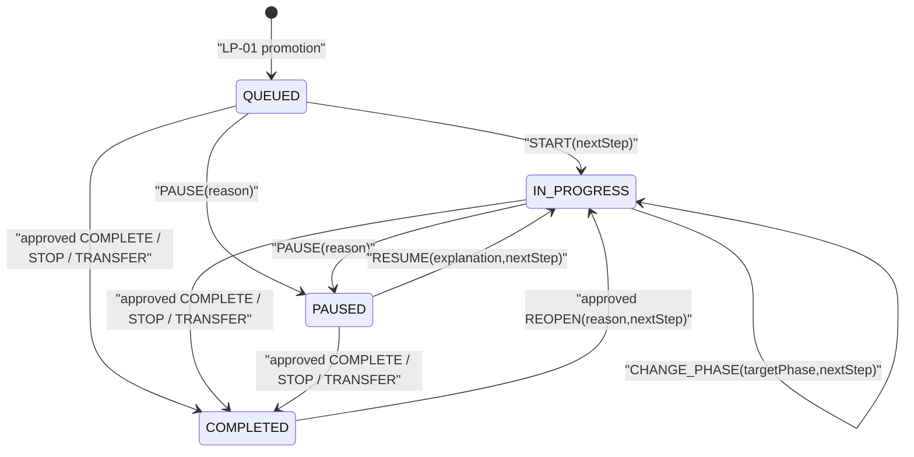

# Technical Design: LP-02 项目执行与决策闭环

- Status: Proposed — awaiting independent Technical Plan Review
- FeatureId: `lp-02-execution-decisions-4e8a2c7d91b3`
- Branch: `codex/lp-02-execution-decisions`
- Requirements: [requirements.md](./requirements.md)
- Requirements commit: `6620cef41b7fe2e040a21ebc3fb88f917668caf1`
- Runtime baseline: `b562a3c0ede8384afef2007b8057a1250650a39f`

## 1. Background And Current Behavior

LP-01 已交付可运行的 Node.js 24/npm workspace、Fastify `/api/v1`、TypeBox
契约、PostgreSQL 17 persistence、全局幂等、乐观并发、追加式审计、公开读取与
readiness gate。Idea 可以被澄清并显式推进为唯一项目，但项目 Schema、数据库
`CHECK` 和领域类型目前都只允许：

```text
phase = PLANNING
status = QUEUED
version = 1
```

现有 `GET /api/v1/projects` 和 `GET /api/v1/projects/:projectId` 从同一
PostgreSQL 权威数据生成 proposer/executor 投影；不存在项目写路由，也没有进展、
关注事项、Evidence、结论或人类确认表。

LP-02 在这条主线上增加执行事实和决策闭环，不建立第二份状态、不引入 Web、身份
系统、通知系统、通用审批编排器或外部内容抓取。

## 2. Goals

- 让排队项目通过显式命令开始、暂停、恢复和改变工作阶段。
- 追加保存进展、三类关注事项、回应、Evidence、纠正和完整历史。
- 形成不可变的结论版本及 `CONTINUE | ADJUST | STOP | TRANSFER` 建议。
- 只对最终结论以及完成、停止、移交和重开使用专用人类确认。
- 把确认绑定到确切操作摘要、结论版本和项目版本，并保证过期与单次消费。
- 延续 LP-01 的幂等、版本、事务、审计、错误、访问与 readiness 语义。
- 保留 LP-01 数据和路由，提供显式契约演进与迁移说明。
- 为 LP-03 提供稳定执行数据，但不实现汇报协议写入或页面。

## 3. Non-goals

- 不增加 `apps/web`、登录、账户、RBAC、多租户或自然人身份认证。
- 不实现通用审批流、工作流引擎、消息队列、通知或外部协作工具。
- 不上传文件、不抓取 URL、不执行 Evidence 内容、不验证外部声明真伪。
- 不实现结构化汇报提交/渲染、AI Skill、演示编排、生产部署或发布。
- 不自动执行移交到产品线等外部动作；只保存确认后的项目结果。
- 不改写 `0001_lp01_core.sql`、LP-01 历史、既有 ID 或已保存幂等结果。
- 不建设 Engineering Lifecycle checker、simulator 或 mutation harness。

## 4. Runtime, Repository And Ownership Boundaries

LP-02 不升级依赖版本；实现继续使用 LP-01 锁定的 Node.js、npm、Fastify、
TypeBox、Drizzle、PostgreSQL、Pino 和 Vitest 版本。若实现必须升级依赖或 lockfile，
先修订计划并重新评审。

```text
apps/api
  HTTP composition, readiness, AI write auth, human-control auth, cookies
packages/contracts
  TypeBox request/response/error schemas and OpenAPI generation
packages/domain
  project lifecycle, attention, evidence, conclusion and confirmation policies
packages/application
  command/query ports, digest rules and transaction orchestration contracts
packages/db
  PostgreSQL migration, repositories, locking, atomic writes and projections
```

依赖方向保持：

```text
apps/api -> contracts + application + db
application -> domain + contracts
db -> application ports + domain
domain -> no framework, HTTP, cookie or database dependency
```

业务状态机不得进入 Fastify handler；cookie/token 解析不得进入领域层；SQL adapter
不得自行决定允许的生命周期转换。

## 5. Core Decisions And Invariants

1. `ValidationProject` 仍是唯一聚合根和并发边界；所有 LP-02 业务写先
   `SELECT ... FOR UPDATE` 锁定项目，再比较 `expectedVersion`。
2. 每个成功 LP-02 业务命令只递增一次项目 `version`，并在同一事务追加一个
   `AuditEvent`。一个命令可原子新增多个从属记录，但不重复递增版本。
3. `phase` 与 `status` 分开。进展、关注事项、Evidence、结论和读取都不能改变
   `phase/status`；只有 transition 或确认后的终态命令可以改变。
4. 原始业务内容是追加式记录。纠正、回应、关闭、拒绝、取代和重开使用新记录或
   状态事件，不提供业务 DELETE。
5. 所有 Evidence 引用在事务内验证同一 `workspace/project`；无效、已撤回或跨项目
   引用不产生部分写入。
6. 结论内容版本不可变；状态变化保存在独立 `conclusion_state_events` 中。
7. `COMPLETED` 项目必须由 `COMPLETE | STOP | TRANSFER` 的已批准确认产生，并引用
   一个 `CONFIRMED` 结论。重开只改变当前投影，原终态 transition 和结论保留。
8. 创建确认机会后，确认绑定的是该事务提交后的项目版本。此后任何成功项目命令都会
   使原确认失效。
9. AI bearer 无法创建或决定确认。确认机会由独立 human-control 凭据创建，决定只
   接受与该机会绑定的短期、单次 capability cookie。
10. proposer/executor 只是同一数据的两种组织方式，不是权限或第二状态台账。

## 6. Controlled Values And Project Lifecycle

| Type | Values |
| --- | --- |
| `ProjectPhase` | `PLANNING`, `BUILDING`, `VALIDATING`, `CONCLUDING` |
| `ProjectStatus` | `QUEUED`, `IN_PROGRESS`, `PAUSED`, `COMPLETED` |
| `ProjectTransitionKind` | `START`, `PAUSE`, `RESUME`, `CHANGE_PHASE`, `COMPLETE`, `STOP`, `TRANSFER`, `REOPEN` |
| `AttentionType` | `BLOCKER`, `DECISION_REQUEST`, `SUPPORT_REQUEST` |
| `AttentionStatus` | `OPEN`, `NEEDS_INFO`, `RESOLVED`, `CLOSED` |
| `AttentionEventKind` | `COMMENT`, `REQUEST_INFO`, `PROVIDE_INFO`, `RESOLVE`, `CLOSE`, `CORRECT_RESPONSE` |
| `EvidenceKind` | `LINK`, `ARTIFACT`, `METRIC`, `NOTE` |
| `EvidenceState` | `ACTIVE`, `RETRACTED`, derived from append-only events |
| `ConclusionStatus` | `DRAFT`, `PENDING_CONFIRMATION`, `CONFIRMED`, `SUPERSEDED` |
| `Recommendation` | `CONTINUE`, `ADJUST`, `STOP`, `TRANSFER` |
| `ConfirmationOperation` | `CONFIRM_CONCLUSION`, `COMPLETE_PROJECT`, `STOP_PROJECT`, `TRANSFER_PROJECT`, `REOPEN_PROJECT` |
| `ConfirmationDecision` | persisted `PENDING`, `APPROVED`, `REJECTED` |
| `ConfirmationUsability` | derived `ACTIVE`, `EXPIRED`, `STALE`, `CONSUMED` |

`CHANGE_PHASE` 只允许 `IN_PROGRESS` 项目，目标必须不同，但可以向前或向后调整；原因和
下一步必填。该选择允许验证过程中回到构建或规划，而不把“调整”误建为新的项目状态。



终态建议匹配：

| Operation | Allowed conclusion recommendation |
| --- | --- |
| `CONFIRM_CONCLUSION` | any recommendation; project status unchanged |
| `COMPLETE_PROJECT` | `CONTINUE` or `ADJUST` |
| `STOP_PROJECT` | `STOP` |
| `TRANSFER_PROJECT` | `TRANSFER` |
| `REOPEN_PROJECT` | no new conclusion required; references latest terminal transition |

## 7. Data Contract

除明确标为 optional/null 的字段外，字段都必填。客户端输入 string 在 Schema 层 trim
后校验；响应所有 object 使用 `additionalProperties=false`。

### 7.1 `ValidationProject` Changed Fields

现有 `id`、`workspaceId`、`ideaId`、`goal`、`sourceIdeaVersion`、`createdAt` 保持
不变。

| Field | Change | Type / null | Owner/default | Validation and compatibility |
| --- | --- | --- | --- | --- |
| `phase` | widened | `ProjectPhase` | promotion=`PLANNING` | 原值保持有效；只由 `CHANGE_PHASE` 改变 |
| `status` | widened | `ProjectStatus` | promotion=`QUEUED` | 原值保持有效；只由 transition/approved terminal command 改变 |
| `version` | widened | integer | promotion=1 | 从 `=1` 改为 `>=1`；每个成功命令 +1 |
| `currentNextStep` | new | string or null | null | trim 1..2000；START/RESUME/CHANGE_PHASE/progress 可更新 |
| `latestProgressUpdateId` | new | typed ID or null | null | 指向同项目最新有效进展 |
| `activeConclusionId` | new | typed ID or null | null | 指向最新非 superseded 结论；重开不删除旧结论 |
| `completedAt` | new | instant or null | null | 终态批准时设置；重开时当前值清空，历史保存在 transition |
| `completionKind` | new | `COMPLETE\|STOP\|TRANSFER` or null | null | 终态批准时设置；重开时清空 |
| `updatedAt` | existing | instant | database | 每个成功项目命令更新 |

### 7.2 `ProjectTransition`

| Field | Type / required | Owner and validation |
| --- | --- | --- |
| `id` | `trn_<ULID>` | server |
| `projectId` | project ID | same locked aggregate |
| `kind` | `ProjectTransitionKind` | domain policy |
| `fromStatus` / `toStatus` | `ProjectStatus` | server snapshot |
| `fromPhase` / `toPhase` | `ProjectPhase` | server snapshot |
| `explanation` | string 1..2000 | required for pause/resume/reopen; reason snapshot for other transitions |
| `nextStep` | string or null | required for start/resume/change phase/reopen |
| `conclusionId` | conclusion ID or null | required for complete/stop/transfer |
| `confirmationId` | confirmation ID or null | required for complete/stop/transfer/reopen |
| `relatedTransitionId` | transition ID or null | reopen points to the latest terminal transition |
| `resultingProjectVersion` | integer >=2 | server |
| `declaredActor` | `ActorDto` columns | request actor; terminal decision requires `HUMAN` |
| `recordedAt` | instant | database |

Rows are immutable and sorted by `resultingProjectVersion,id`.

### 7.3 `ProgressUpdate`

| Field | Type / required | Owner and validation |
| --- | --- | --- |
| `id` | `prog_<ULID>` | server |
| `projectId` | project ID | locked aggregate |
| `sequence` | integer >=1 | server, unique per project |
| `summary` | string 1..2000 | client |
| `completedWork` | array 1..20 of string 1..1000 | client; order preserved |
| `nextStep` | string 1..2000 | client; also becomes current project next step |
| `projectStatusAtSubmission` | `ProjectStatus` | server snapshot |
| `phaseAtSubmission` | `ProjectPhase` | server snapshot |
| `evidenceIds` | array 0..20, unique | same-project active Evidence only |
| `occurredAt` | RFC 3339 | client; not authoritative commit time |
| `submittedAt` | instant | database |
| `submittedBy` | `ActorDto` columns | request actor |
| `correctsProgressId` | progress ID or null | optional; must reference the current leaf in same project |
| `resultingProjectVersion` | integer | server |

A correction is a complete new progress row. A unique partial constraint permits at most one direct
successor for a corrected row; the original remains visible and the latest leaf is the current
interpretation.

### 7.4 `AttentionItem` And `AttentionEvent`

Common item fields:

| Field | Type / required | Validation |
| --- | --- | --- |
| `id` | `attn_<ULID>` | server |
| `projectId` | project ID | same project |
| `type` | `AttentionType` | immutable discriminator |
| `title` | string 1..300 | client |
| `status` | `AttentionStatus` | initial `OPEN`; current pointer only |
| `background` | string 1..2000 | blocker and decision request |
| `impact` | string 1..2000 | blocker/support; optional for decision request only |
| `options` | array 0..10 of string 1..500 | decision request requires options or recommendation |
| `recommendation` | string 1..1000 or null | decision request |
| `decisionImpact` | string 1..2000 or null | required for decision request |
| `waitingForRole` | proposer/executor/maintainer or null | decision request |
| `supportNeeded` | string 1..2000 or null | support request |
| `requestReason` | string 1..2000 or null | support request |
| `expectedResponderRole` | proposer/executor/maintainer or null | support request |
| `createdBy` / `createdAt` | actor / instant | server time |
| `updatedAt` / `resolvedAt` | instant / instant or null | updated only through appended event |
| `resultingProjectVersion` | integer | version at creation |

Unused discriminator fields are SQL null and JSON null; contract unions prevent callers from sending
fields for another type.

Every response or state change appends an `AttentionEvent`:

| Field | Type / required | Validation |
| --- | --- | --- |
| `id` | `atnevt_<ULID>` | server |
| `attentionItemId` / `projectId` | IDs | composite same-project FK |
| `kind` | `AttentionEventKind` | policy-controlled |
| `message` | string 1..2000 | always required |
| `fromStatus` / `toStatus` | `AttentionStatus` | server |
| `resolution` | string or null | required when resolving blocker |
| `selectedOption` / `decisionText` | string or null | decision resolution requires one |
| `supportSummary` | string or null | support resolution requires |
| `correctsEventId` | event ID or null | required only for `CORRECT_RESPONSE`; same-item current correction leaf |
| `correctedKind` | non-correction `AttentionEventKind` or null | required only for `CORRECT_RESPONSE`; equals root event kind |
| `declaredActor` / `recordedAt` | actor / instant | server time |
| `resultingProjectVersion` | integer | server |

State transitions are exact:

| Event kind | Allowed current status | Result status |
| --- | --- | --- |
| `COMMENT` | any | unchanged |
| `REQUEST_INFO` | `OPEN`, `RESOLVED` | `NEEDS_INFO` |
| `PROVIDE_INFO` | `NEEDS_INFO`, `RESOLVED` | `OPEN` |
| `RESOLVE` | `OPEN`, `NEEDS_INFO` | `RESOLVED` |
| `CLOSE` | `OPEN`, `NEEDS_INFO`, `RESOLVED` | `CLOSED` |
| `CORRECT_RESPONSE` | any | unchanged |

`CORRECT_RESPONSE` corrects only the human-readable response fields of a prior event; it never
replays or reverses that event's `fromStatus -> toStatus`. The request must target the current
correction leaf of a same-item root event. Its replacement discriminator equals the root kind and
contains:

| Corrected root kind | Replacement fields |
| --- | --- |
| `COMMENT`, `REQUEST_INFO`, `PROVIDE_INFO`, `CLOSE` | `message` |
| `RESOLVE` on blocker | `message`, `resolution` |
| `RESOLVE` on decision request | `message`, exactly one of `selectedOption` / `decisionText` |
| `RESOLVE` on support request | `message`, `supportSummary` |

A correction may target a prior `CORRECT_RESPONSE` leaf; `correctedKind` still names the original
non-correction kind. A unique partial index on `corrects_event_id` permits one direct successor, so
concurrent corrections produce one winner and one version conflict. `AttentionEventHistoryDto`
groups:

```text
original: the non-correction AttentionEventDto
corrections: ordered CORRECT_RESPONSE rows
effectiveResponse: fields from the latest correction leaf, or original fields
stateEffect: original fromStatus/toStatus
```

If the original state effect itself was wrong, the caller appends a normal state event
(`REQUEST_INFO`, `PROVIDE_INFO`, `RESOLVE` or `CLOSE`) under the table above; correction cannot
silently rewrite historical state. Original item fields and all earlier events remain visible.

### 7.5 `Evidence`

| Field | Type / required | Validation |
| --- | --- | --- |
| `id` | `evd_<ULID>` | server |
| `projectId` | project ID | owning project |
| `kind` | `LINK\|ARTIFACT\|METRIC\|NOTE` | immutable |
| `title` | string 1..300 | client |
| `summary` | string 1..2000 | client |
| `locator` | string or null | LINK: HTTPS URL <=2048 without user-info; ARTIFACT: `artifact_<ULID>`; otherwise null |
| `metricName` | string or null | METRIC only, 1..200 |
| `metricValue` | string or null | METRIC only, 1..200; string avoids silent unit/precision conversion |
| `metricUnit` | string or null | METRIC optional, 1..80 |
| `capturedAt` | RFC 3339 | client fact time |
| `recordedAt` | instant | database |
| `recordedBy` | `ActorDto` columns | request actor |
| `resultingProjectVersion` | integer | server |

Evidence content is immutable. `evidence_events` appends `CORRECT` or `RETRACT` with reason,
optional replacement Evidence ID, actor, time and resulting project version. A correction creates a
new Evidence row and event atomically; a retraction creates only an event. Reads derive
`ACTIVE|RETRACTED` and the replacement chain. Existing progress/conclusion references continue to
show the exact Evidence version originally cited.

### 7.6 `ValidationConclusion` And State Events

| Field | Type / required | Validation |
| --- | --- | --- |
| `id` | `conc_<ULID>` | each immutable version has a new ID |
| `projectId` | project ID | same project |
| `sequence` | integer >=1 | server, unique per project |
| `evidenceSummary` | string 1..4000 | client |
| `evidenceIds` | array 1..50, unique | active same-project Evidence |
| `limitations` | array 1..20 of string 1..1000 | at least one explicit item |
| `uncertainties` | array 1..20 of string 1..1000 | at least one explicit item |
| `recommendation` | `Recommendation` | client |
| `recommendationNote` | string 1..2000 | client |
| `supplementalNote` | string or null | optional 1..2000 |
| `supersedesConclusionId` | conclusion ID or null | previous current version in same project |
| `submittedBy` / `submittedAt` | actor / instant | server time |
| `resultingProjectVersion` | integer | server |

Content rows never change. `conclusion_state_events` appends one of the four statuses plus
`confirmationId`, reason, actor, time and resulting project version. Creating a conclusion always
adds `DRAFT`; creating a newer version also adds `SUPERSEDED` to the previous current conclusion.
If that previous version had a pending confirmation, the project-version increment makes that
confirmation stale.

The operation-specific state matrix is authoritative:

| Operation / current conclusion state | Confirmation creation | APPROVE | REJECT | Expired or stale while pending |
| --- | --- | --- | --- | --- |
| `CONFIRM_CONCLUSION` / `DRAFT` | append `PENDING_CONFIRMATION` | append `CONFIRMED`; project stays non-terminal | append `DRAFT` | effective status becomes `DRAFT`; no new state row |
| `COMPLETE_PROJECT`, `STOP_PROJECT`, `TRANSFER_PROJECT` / `DRAFT` | append `PENDING_CONFIRMATION` | append `CONFIRMED` and terminal transition atomically | append `DRAFT`; no terminal transition | effective status becomes `DRAFT`; no new state row |
| same terminal operations / `CONFIRMED` | create confirmation, **no conclusion event** | keep `CONFIRMED`; append only terminal transition | keep `CONFIRMED`; no conclusion event | keep `CONFIRMED`; no conclusion event |
| `REOPEN_PROJECT` / no conclusion input | create confirmation, **no conclusion event** | append only REOPEN transition | no conclusion event | no conclusion event |

`CONFIRM_CONCLUSION` rejects `CONFIRMED`, `PENDING_CONFIRMATION` and `SUPERSEDED`.
Terminal operations reject `PENDING_CONFIRMATION` and `SUPERSEDED`, require the current
`activeConclusionId`, and enforce the recommendation matrix in §6. REOPEN requires
`status=COMPLETED` and the latest terminal transition; it never changes any conclusion state,
including the conclusion referenced by the prior completion.

At most one **usable** pending confirmation may exist per project. Usable means persisted
`decision=PENDING`, not expired, and `expectedProjectVersion=current project.version`. Creation
while one is usable returns `CONFIRMATION_ALREADY_PENDING`. Decided, expired or stale records remain
history and do not prevent a new opportunity.

The current conclusion projection reads the latest persisted state event, then resolves a latest
`PENDING_CONFIRMATION` as:

- `PENDING_CONFIRMATION` only while its confirmation is usable;
- `DRAFT` when the linked pending confirmation is expired or stale;
- `CONFIRMED`/`DRAFT` from the mandatory event written by approval/rejection.

`SUPERSEDED` always wins for a non-current version. This computation has one implementation in the
query layer and shared contract/integration fixtures.

### 7.7 `HumanConfirmation`

| Field | Type / required | Owner and validation |
| --- | --- | --- |
| `id` | `confirm_<ULID>` | server |
| `projectId` | project ID | locked aggregate |
| `operation` | `ConfirmationOperation` | human-control request |
| `conclusionId` | conclusion ID or null | required except reopen |
| `terminalTransitionId` | transition ID or null | reopen references latest terminal transition |
| `completionSummary` | string or null | required for complete/stop/transfer; immutable after creation |
| `reopenReason` / `nextStep` | string or null | required only for reopen; immutable after creation |
| `payloadDigest` | lowercase SHA-256 | canonical immutable operation summary |
| `payloadSummary` | `ConfirmationPayloadSummary` JSONB | exact discriminated Shape in §10.2; max 64 KiB |
| `expectedProjectVersion` | integer | **resulting version of confirmation creation transaction** |
| `capabilityHash` | SHA-256 | hash of derived cookie; raw capability never stored |
| `expiresAt` | instant | creation + 30 minutes; compile-time constant |
| `decision` | `PENDING\|APPROVED\|REJECTED` | persisted values exactly match these public values |
| `decidedBy` / `decidedAt` / `decisionNote` | nullable | decision route only; actor must declare HUMAN |
| `decisionIdempotencyKey` | string or null | permits exact replay after consumption |
| `resultingProjectVersion` | integer or null | decision success version |
| `createdAt` | instant | database |

The raw capability is derived with HMAC-SHA-256 from the configured human-control secret,
confirmation ID, payload digest, expiry and confirmation-request idempotency key. Only its SHA-256
hash is persisted. Replaying the same confirmation-creation request deterministically reissues the
same cookie without storing plaintext.

`HumanConfirmationSummaryDto` adds a derived `usability`:

```text
ACTIVE    -> PENDING, unexpired, expectedProjectVersion equals current project version
EXPIRED   -> PENDING and expiresAt <= database clock
STALE     -> PENDING, unexpired, but project version or recomputed payload differs
CONSUMED  -> decision is APPROVED or REJECTED
```

`EXPIRED` and `STALE` are not persisted decision values and never masquerade as human decisions.

## 8. Persistence And Migration

Add `packages/db/migrations/0002_lp02_execution_decisions.sql`; never edit `0001`.

### 8.1 Schema Changes

- Replace `validation_projects_phase`, `validation_projects_status` and
  `validation_projects_version` checks with the LP-02 unions/`version >= 1`.
- Add the nullable current-projection columns defined in §7.1.
- Create:
  - `project_transitions`
  - `progress_updates` and `progress_update_evidence`
  - `attention_items` and `attention_events`
  - `evidence_items` and `evidence_events`
  - `validation_conclusions`, `conclusion_evidence` and `conclusion_state_events`
  - `human_confirmations`
- Expand `audit_events.event_type` with explicit LP-02 event names; do not replace old values.
- Add composite unique keys and FKs such as `(id,project_id)` so Evidence, correction,
  conclusion and attention references cannot cross projects.
- Add append-only triggers rejecting `UPDATE/DELETE` for transition, progress, attention event,
  Evidence content/event, conclusion content/state-event and audit rows.
- `attention_items` and `human_confirmations` permit only allowlisted current-state columns to be
  updated by guarded SQL functions; original payload columns remain immutable.
- Add indexes for `(project_id,resulting_project_version,id)`, current open attention items,
  conclusion sequence, confirmation expiry and public cursor reads.

### 8.2 Migration Runner And Readiness

`packages/db/src/migrate.ts` changes from one file constant to an ordered immutable migration
catalog. For each migration it:

1. validates an existing row checksum;
2. applies a missing migration in its own transaction;
3. inserts the ID/checksum only after its SQL succeeds.

Readiness requires every expected catalog entry with an exact checksum and rejects a missing,
mismatched or out-of-order catalog. Extra unknown migrations fail closed. `0001` data is never
rebuilt; an LP-01 project becomes immediately eligible for `START` after `0002`.

The SQL is additive except for widening named `CHECK` constraints. There is no down migration and no
automatic table drop. A raw rollback to the old LP-01 binary will fail readiness because it only
recognizes `0001`; operational rollback therefore uses forward-fix or database restoration in an
isolated environment, not destructive ad-hoc DDL. LP-02 is not a production deployment feature.

### 8.3 Object Lifetime

| Object | Creation / mutation | Expiry / deletion |
| --- | --- | --- |
| Project current row | LP-01 promotion; controlled current-column updates | never deleted |
| Transition/progress/attention event/Evidence/conclusion/state event | append in project transaction | never physically deleted |
| Attention item | create immutable body; only current status/time pointer changes | never deleted |
| Human confirmation | create pending; one decision transition | pending becomes time-derived expired; never deleted |
| Capability | deterministic raw value only in secure cookie; hash in confirmation | cookie and opportunity expire after 30 minutes |
| Idempotency/audit | unchanged LP-01 lifetime | no LP-02 cleanup |

## 9. Command, Concurrency And Idempotency Protocol

All LP-02 business writes require:

```text
Idempotency-Key: caller UUID/ULID
expectedVersion: integer >= 1
actor: declared ActorInput
reason: non-empty string
```

AI execution routes additionally require `Authorization: Bearer <AI_API_TOKEN>`. Human-control
creation requires `X-Human-Control-Token`; decision requires only the scoped capability cookie.

The LP-01 global key/digest algorithm remains unchanged. The canonical digest includes method,
route template, path IDs and normalized body; headers, cookies and credentials never enter it.
Authentication and Schema validation occur before binding the key.

For a new valid intent:

1. begin transaction, set the existing 2-second lock timeout and acquire idempotency ownership;
2. lock project row and compare `expectedVersion`;
3. validate lifecycle, same-project references and confirmation binding;
4. write the business record(s);
5. update the project exactly once to `version+1` and `updated_at=clock_timestamp()`;
6. append one allowlisted audit event with the resulting version;
7. persist the success payload in the idempotency row and commit.

Deterministic 404/409/422 rejections preserve the LP-01 `REJECTED` replay contract and create no
business/audit record. Infrastructure, audit, capability, confirmation or commit failures roll back
the entire transaction so the same key can retry.

```mermaid
sequenceDiagram
    participant C as "AI or human-control client"
    participant F as "Fastify + TypeBox"
    participant A as "Project command service"
    participant D as "Domain policy"
    participant P as "PostgreSQL"

    C->>F: "authenticated write + idempotency key"
    F->>A: "normalized command + request digest"
    A->>P: "BEGIN; own idempotency key"
    A->>P: "SELECT project FOR UPDATE"
    P-->>A: "current project/version"
    A->>D: "validate version, lifecycle, references"
    alt "deterministic rejection"
        D-->>A: "typed error"
        A->>P: "idempotency=REJECTED; COMMIT"
        A-->>C: "stable 4xx"
    else "valid command"
        D-->>A: "facts + resulting snapshot"
        A->>P: "append facts; update project version once"
        A->>P: "append audit; idempotency=SUCCEEDED"
        A->>P: "COMMIT"
        A-->>C: "success / exact replay"
    else "infrastructure failure"
        A->>P: "ROLLBACK"
        A-->>C: "500/503; retry same key"
    end
```

## 10. Human Confirmation Protocol

### 10.1 Access Separation

Add required `HUMAN_CONTROL_TOKEN` as unpadded base64url that decodes to exactly 32 bytes
(`^[A-Za-z0-9_-]{43}$`). It is independent from `AI_API_TOKEN`, compared in constant time, and
accepted only by the confirmation-creation and summary routes. A process configured with equal
AI/human token text fails startup. Capability HMAC uses the decoded 32 bytes, not a re-encoded or
locale-dependent string.

The control token is a deployment capability, not a user identity. A declared `HUMAN` actor is still
not authenticated as a particular natural person.

### 10.2 Exact Confirmation Payload And Digest

`ConfirmationPayloadSummary` is a closed five-variant discriminated union. Every variant includes
exactly the common fields plus all fields listed for that operation; implementations may not add or
omit fields.

Common fields:

| Field | Type | Source |
| --- | --- | --- |
| `schemaVersion` | literal `1` | compile-time |
| `operation` | `ConfirmationOperation` | validated creation request |
| `projectId` | ProjectId | locked project |
| `projectVersion` | integer | confirmation transaction's resulting project version |
| `projectStatus` | `ProjectStatus` | locked project before confirmation creation |
| `projectPhase` | `ProjectPhase` | locked project before confirmation creation |

`ConclusionApprovalSnapshot`:

| Field | Type | Source |
| --- | --- | --- |
| `id`, `sequence` | ConclusionId, integer | immutable conclusion row |
| `statusAtRequest` | `DRAFT\|CONFIRMED` | effective state under §7.6 |
| `evidenceSummary` | string | immutable conclusion row |
| `evidenceIds` | ordered EvidenceId[] | `conclusion_evidence.position` |
| `limitations`, `uncertainties` | ordered string[] | immutable conclusion row |
| `recommendation`, `recommendationNote` | controlled enum, string | immutable conclusion row |
| `supplementalNote` | string or null | immutable conclusion row |

Operation Shapes:

```text
CONFIRM_CONCLUSION:
  common
  conclusion: ConclusionApprovalSnapshot (statusAtRequest=DRAFT)
  targetConclusionStatus: "CONFIRMED"

COMPLETE_PROJECT:
  common
  conclusion: ConclusionApprovalSnapshot (DRAFT or CONFIRMED)
  targetConclusionStatus: "CONFIRMED"
  completionSummary: string(1..2000)
  targetProjectStatus: "COMPLETED"
  completionKind: "COMPLETE"

STOP_PROJECT:
  common
  conclusion: ConclusionApprovalSnapshot (DRAFT or CONFIRMED, recommendation=STOP)
  targetConclusionStatus: "CONFIRMED"
  completionSummary: string(1..2000)
  targetProjectStatus: "COMPLETED"
  completionKind: "STOP"

TRANSFER_PROJECT:
  common
  conclusion: ConclusionApprovalSnapshot (DRAFT or CONFIRMED, recommendation=TRANSFER)
  targetConclusionStatus: "CONFIRMED"
  completionSummary: string(1..2000)
  targetProjectStatus: "COMPLETED"
  completionKind: "TRANSFER"

REOPEN_PROJECT:
  common (projectStatus="COMPLETED")
  terminalTransition: {
    id, kind: "COMPLETE"|"STOP"|"TRANSFER",
    conclusionId, confirmationId, resultingProjectVersion, recordedAt
  }
  completedAt: RFC3339
  reopenReason: string(1..2000)
  nextStep: string(1..2000)
  targetProjectStatus: "IN_PROGRESS"
  targetProjectPhase: current projectPhase
```

`completionSummary`, `reopenReason`, `nextStep` and `terminalTransitionId` are stored in first-class
`human_confirmations` columns and guarded against update. Conclusion data and the prior transition
come from immutable tables. Current project status/phase/version come from the row locked at create
or decide time. `payloadSummary` is a stored projection of those authorities, not the only copy of
an intended business value.

Canonicalization is identical in creation and decision:

1. request strings are `String.trim()` then Unicode NFC normalized before business persistence;
   internal whitespace and case are preserved;
2. IDs/enums are validated ASCII and unchanged; RFC 3339 instants use database UTC serialized by
   `Date.toISOString()` with milliseconds;
3. null is explicit for nullable fields; no `undefined` or omitted union field reaches the summary;
4. arrays preserve stored semantic order; duplicates were rejected by the request contract;
5. object keys are sorted recursively by ASCII code-unit order (all authority keys are fixed ASCII);
6. serialize with `JSON.stringify` without whitespace, encode the result as UTF-8.

The payload digest is:

```text
SHA-256(
  UTF8("idea-trace-validation\u0000lp02-confirmation-payload\u0000v1\u0000")
  || UTF8(canonicalJson(payloadSummary))
)
```

The lowercase 64-character hex value is persisted as `payload_digest`. Capability derivation uses
a separate domain:

```text
rawCapability = base64url-no-padding(
  HMAC-SHA-256(
    base64urlDecode(HUMAN_CONTROL_TOKEN),
    UTF8("idea-trace-validation\u0000lp02-confirmation-capability\u0000v1\u0000")
    || UTF8(confirmationId) || 0x00
    || UTF8(payloadDigest) || 0x00
    || UTF8(expiresAt.toISOString()) || 0x00
    || UTF8(confirmationRequestIdempotencyKey)
  )
)
capabilityHash = SHA-256(UTF8(rawCapability))
```

At decision, the service locks confirmation and project, reloads the immutable conclusion or prior
terminal transition, and rebuilds the complete Shape from first-class columns/current facts. It
requires:

- rebuilt canonical JSON byte-equals canonical JSON of stored `payload_summary`;
- rebuilt digest equals stored `payload_digest`;
- capability hash matches in constant time;
- `project.version=expected_project_version`, usable pending state and recommendation rules.

Any difference returns `CONFIRMATION_STALE` before decision, conclusion event or terminal transition
is written. Tests mutate each bound class independently: project version/status/phase, conclusion
ID/content/status/recommendation/Evidence ordering, completion summary, terminal transition,
completed time, reopen reason and next step. Each must invalidate the opportunity or be impossible
because an append-only/guard trigger rejects the mutation.

### 10.3 Two-step Flow

```mermaid
sequenceDiagram
    participant H as "Human control client"
    participant F as "Fastify"
    participant A as "Confirmation service"
    participant P as "PostgreSQL"

    H->>F: "POST project confirmation + X-Human-Control-Token"
    F->>A: "operation, exact payload, expectedVersion"
    A->>P: "lock project; validate conclusion/recommendation"
    A->>P: "insert pending confirmation bound to resulting project version"
    A->>P: "increment project; audit; commit"
    A-->>F: "confirmation summary + derivation inputs"
    F-->>H: "201 body without secret + Secure HttpOnly capability cookie"
    H->>F: "GET confirmation summary with control token or cookie"
    F-->>H: "immutable operation/effect/evidence summary"
    H->>F: "POST decision + capability cookie"
    F->>A: "APPROVE or REJECT + expectedVersion"
    A->>P: "lock confirmation and project"
    alt "expired, consumed, digest/version changed"
        A-->>H: "deterministic 409; no business mutation"
    else "reject"
        A->>P: "record rejection; operation matrix event or none; version+audit"
        A-->>H: "200 rejected; project non-terminal"
    else "approve"
        A->>P: "operation matrix conclusion event or none; optional transition"
        A->>P: "consume confirmation; version+audit; commit"
        A-->>H: "200 approved"
    end
```

Cookie attributes:

```text
HttpOnly; Secure; SameSite=Strict;
Path=/api/v1/human-confirmations/<id>;
Max-Age=min(secondsUntilExpiry,1800)
```

Raw control token and capability never enter body, URL, database, audit or logs. Pino additionally
redacts `x-human-control-token`, `cookie`, `set-cookie`, `capabilityHash`, `payloadDigest` and all
request bodies.

Decision follows the matrix in §7.6, recomputes the §10.2 payload, checks the bound project version
and uses a conditional `decision=PENDING` update. The same idempotency key may replay the stored
result after consumption; any new key receives `CONFIRMATION_ALREADY_DECIDED`. Expiry and staleness
write neither a decision nor a project/conclusion transition.

## 11. Public API Contract

Base path remains `/api/v1`.

### 11.1 Execution Writes

| Method and path | Access | Purpose |
| --- | --- | --- |
| `POST /projects/:projectId/transitions` | AI write | START, PAUSE, RESUME, CHANGE_PHASE |
| `POST /projects/:projectId/progress-updates` | AI write | append progress or a correcting progress |
| `POST /projects/:projectId/attention-items` | AI write | create discriminated attention item |
| `POST /projects/:projectId/attention-items/:itemId/events` | AI write | append response/status/correction event |
| `POST /projects/:projectId/evidence` | AI write | append Evidence metadata |
| `POST /projects/:projectId/evidence/:evidenceId/corrections` | AI write | correct with replacement or retract |
| `POST /projects/:projectId/conclusions` | AI write | append immutable DRAFT conclusion version |
| `POST /projects/:projectId/human-confirmations` | human control | create exact pending confirmation and capability |
| `POST /human-confirmations/:confirmationId/decisions` | capability cookie | approve or reject once |

`POST .../human-confirmations` returns 201 first/replay plus `Set-Cookie`; it is not callable with
AI bearer alone. Decision actor must declare `actorType=HUMAN`.

### 11.2 Reads

| Method and path | Access | Purpose |
| --- | --- | --- |
| existing project list/detail | Public | extended current authority and role focus |
| `GET /projects/:projectId/progress-updates` | Public | cursor-paginated immutable history |
| `GET /projects/:projectId/attention-items` | Public | current/filter + complete event history |
| `GET /projects/:projectId/evidence` | Public | Evidence and correction/retraction chain |
| `GET /projects/:projectId/conclusions` | Public | versions and confirmation state |
| `GET /projects/:projectId/history` | Public | stable transition/audit timeline |
| `GET /human-confirmations/:confirmationId` | human control or scoped cookie | exact pending/decided summary |

All collection reads use `limit` 1..100 and opaque cursor containing schema version,
`resultingProjectVersion` and typed ID. `attention-items` may filter by type/status without changing
authority.

Project detail adds an `execution` object:

```text
currentNextStep: string|null
latestProgress: ProgressUpdateDto|null
openAttentionPreview: AttentionItemSummaryDto[0..10]
openAttentionCount: integer
evidencePreview: EvidenceDto[0..10]
evidenceCount: integer
latestConclusion: ConclusionDto|null
allowedCommands: controlled operation[]
collectionPaths: stable relative API paths
```

Previews are ordered newest first and never claim completeness; full collections are paginated.
List focus remains compact.

### 11.3 Authoritative Request Shapes

Every request below also rejects unknown properties. `actor` uses the existing `ActorInput`;
AI-write routes accept `HUMAN|AI`, while human-control/decision routes require
`actor.actorType=HUMAN`.

`ProjectCommandBase`:

| Field | Required | Type and validation |
| --- | --- | --- |
| `expectedVersion` | yes | integer >=1 |
| `actor` | yes | existing `ActorInput` |
| `reason` | yes | string 1..500 |

Transition body is `ProjectCommandBase` plus exactly one discriminator:

| `transition` | Additional required fields |
| --- | --- |
| `START` | `nextStep: string(1..2000)` |
| `PAUSE` | `explanation: string(1..2000)` |
| `RESUME` | `explanation: string(1..2000)`, `nextStep: string(1..2000)` |
| `CHANGE_PHASE` | `targetPhase: ProjectPhase`, `nextStep: string(1..2000)` |

Progress body is `ProjectCommandBase` plus `summary`, `completedWork`, `nextStep`,
`evidenceIds`, `occurredAt` and optional `correctsProgressId` exactly as §7.3.

Attention creation is `ProjectCommandBase` plus `type`, `title` and the matching discriminator
payload from §7.4:

```text
BLOCKER -> background, impact
DECISION_REQUEST -> background, decisionImpact, waitingForRole,
                    options[0..10], recommendation|null
SUPPORT_REQUEST -> supportNeeded, requestReason, impact, expectedResponderRole
```

For `DECISION_REQUEST`, exactly one or both of non-empty `options` and `recommendation` may be
present; an empty pair is invalid.

Attention event body is `ProjectCommandBase` plus a closed union:

```text
COMMENT -> kind, message
REQUEST_INFO -> kind, message
PROVIDE_INFO -> kind, message
RESOLVE BLOCKER -> resolution
RESOLVE DECISION_REQUEST -> selectedOption or decisionText
RESOLVE SUPPORT_REQUEST -> supportSummary
CLOSE -> kind, message
CORRECT_RESPONSE -> {
  kind,
  correctsEventId: required same-item current correction leaf,
  correctedKind: root non-correction kind,
  replacement: the exact response fields permitted for correctedKind in §7.4
}
```

Only `CORRECT_RESPONSE` accepts `correctsEventId`, `correctedKind` or `replacement`.
Its server-produced `fromStatus` and `toStatus` both equal the item's current status. Its success
data is `{project, attentionItem, event, effectiveResponse}`; other attention events return
`effectiveResponse:null`.

Evidence creation is `ProjectCommandBase` plus the common `title`, `summary`, `capturedAt` and:

| `kind` | Additional fields |
| --- | --- |
| `LINK` | `locator: https URL(1..2048)` |
| `ARTIFACT` | `locator: artifact_<ULID>` |
| `METRIC` | `metricName`, `metricValue`, optional `metricUnit` |
| `NOTE` | none |

Evidence correction body:

```text
expectedVersion, actor, reason,
action: "CORRECT" | "RETRACT",
replacement: Evidence create payload without command fields (required only for CORRECT)
```

Conclusion body is `ProjectCommandBase` plus:

```text
evidenceSummary: string(1..4000)
evidenceIds: unique EvidenceId[1..50]
limitations: string(1..1000)[1..20]
uncertainties: string(1..1000)[1..20]
recommendation: CONTINUE | ADJUST | STOP | TRANSFER
recommendationNote: string(1..2000)
supplementalNote?: string(1..2000)
supersedesConclusionId?: ConclusionId
```

If a current conclusion already exists, `supersedesConclusionId` is required and must equal it. If
none exists, the field must be absent.

Human-confirmation creation requires the human-control header and:

| Field | Required | Type and validation |
| --- | --- | --- |
| `expectedVersion`, `actor`, `reason` | yes | `ProjectCommandBase`; actor HUMAN |
| `operation` | yes | `ConfirmationOperation` |
| `conclusionId` | conditional | required except REOPEN; current conclusion |
| `completionSummary` | conditional | string 1..2000 for COMPLETE/STOP/TRANSFER |
| `terminalTransitionId` | conditional | required for REOPEN; latest terminal transition |
| `reopenReason` / `nextStep` | conditional | string 1..2000 for REOPEN |

Decision body requires:

```text
expectedVersion: integer (must equal confirmation.expectedProjectVersion)
decision: APPROVE | REJECT
decisionNote: string(1..2000)
actor: ActorInput with actorType=HUMAN
reason: string(1..500)
```

### 11.4 Authoritative Response Shapes

`ProjectAuthorityDto` returns every existing LP-01 authority field plus all §7.1 fields; nullable
fields are present as JSON null and no field is optional.

`ProjectExecutionSnapshotDto` is the exact `execution` object listed in §11.2. Its
`collectionPaths` is:

```text
progressUpdates, attentionItems, evidence, conclusions, history: relative string paths
```

`HumanConfirmationSummaryDto` contains only:

```text
id, projectId, operation, conclusionId|null, terminalTransitionId|null,
payloadSummary: ConfirmationPayloadSummary, expectedProjectVersion, expiresAt,
decision: PENDING|APPROVED|REJECTED,
usability: ACTIVE|EXPIRED|STALE|CONSUMED,
decidedBy: ActorDto|null, decidedAt:null|RFC3339, decisionNote:string|null,
resultingProjectVersion:integer|null, createdAt
```

It never contains `payloadDigest`, `capabilityHash`, raw capability, idempotency key or credential.

All write success data includes the resulting `project: ProjectAuthorityDto` so the caller receives
the new aggregate version:

| Route family | Success | Exact `data` fields |
| --- | --- | --- |
| transition | 200 | `{project, transition}` |
| progress | 201 | `{project, progressUpdate}` |
| attention create | 201 | `{project, attentionItem}` |
| attention event | 201 | `{project, attentionItem, event, effectiveResponse}`; last field non-null only for correction |
| Evidence create | 201 | `{project, evidence}` |
| Evidence correction | 201 | `{project, evidence, event}`; evidence is replacement or original |
| conclusion | 201 | `{project, conclusion}` |
| confirmation create | 201 | `{project, confirmation}` plus `Set-Cookie` |
| confirmation decision | 200 | `{project, confirmation, conclusion, transition}`; last two nullable |

Collection success data is `{items, page}` plus only the applicable filter echo. Project list/detail
retain their existing `{items,page,view}` / `{project,view}` wrappers. Write/read `meta` remains the
LP-01 `WriteMeta`/`ReadMeta`.

Proposer and executor list focus remain discriminated:

```text
proposer.projectOutcome -> goal, status, currentNextStep,
                           latestProgressSummary|null,
                           openAttentionCount, latestRecommendation|null
executor.execution -> goal, phase, status, version, currentNextStep,
                      latestProgressId|null, openAttentionCount,
                      evidenceCount, latestConclusionId|null
```

Both return the same `ProjectAuthorityDto`; detail returns the same
`ProjectExecutionSnapshotDto` before applying role-specific focus.

### 11.5 Compatibility And OpenAPI

- Existing LP-01 route names, ID formats, success/error envelopes, view query, pagination and bearer
  behavior remain.
- Project `phase/status` unions widen and project detail gains an `execution` object. This is an
  explicit forward contract evolution; strict clients must regenerate from LP-02 OpenAPI.
- Preserve `openapi/lp01.v1.json` unchanged as the accepted LP-01 artifact.
- Generate the current contract to `openapi/lp02.v1.json`; `/openapi.json` serves this document.
- `npm run openapi:check` verifies both the immutable LP-01 artifact hash and LP-02 generated drift.
- Add `docs/migration-notes.md` explaining enum widening, the new required human-control config,
  new collection routes and the absence of delete routes.

### 11.6 Stable Error Additions

| HTTP | Code | Recovery |
| --- | --- | --- |
| 401 | `HUMAN_CONTROL_REQUIRED` | provide valid dedicated control credential |
| 401 | `CONFIRMATION_CAPABILITY_REQUIRED` | use the scoped unexpired cookie |
| 404 | `ATTENTION_ITEM_NOT_FOUND`, `EVIDENCE_NOT_FOUND`, `CONCLUSION_NOT_FOUND`, `CONFIRMATION_NOT_FOUND` | verify ID and refetch |
| 409 | `PROJECT_STATE_CONFLICT`, `PHASE_TRANSITION_INVALID`, `ATTENTION_STATE_CONFLICT` | read current state and submit new intent |
| 409 | `CROSS_PROJECT_REFERENCE`, `REFERENCE_NOT_ACTIVE` | use active records owned by this project |
| 409 | `CONCLUSION_STATE_CONFLICT`, `RECOMMENDATION_MISMATCH` | revise conclusion/operation |
| 409 | `CONFIRMATION_ALREADY_PENDING`, `CONFIRMATION_EXPIRED`, `CONFIRMATION_ALREADY_DECIDED`, `CONFIRMATION_STALE` | resolve/use the active opportunity or create a new one from current facts |
| 422 | `PROJECT_PRECONDITION_FAILED` | supply required reason/next step/content |

`VERSION_CONFLICT.details.resourceId` widens from Idea-only to `IdeaId|ProjectId`; existing Idea
payloads do not change.

All new error `details` include no free-form body or secret:

```text
*_NOT_FOUND -> {resourceType, resourceId, recovery:"VERIFY_ID_AND_REFETCH"}
PROJECT_STATE_CONFLICT -> {projectId,currentStatus,allowedTransitions,recovery:"REFETCH_AND_RETRY_WITH_NEW_KEY"}
PHASE_TRANSITION_INVALID -> {projectId,currentPhase,targetPhase,recovery:"CHOOSE_VALID_PHASE"}
ATTENTION_STATE_CONFLICT -> {attentionItemId,currentStatus,allowedEvents,recovery:"REFETCH_AND_RETRY_WITH_NEW_KEY"}
CROSS_PROJECT_REFERENCE -> {resourceType,resourceId,projectId,recovery:"USE_SAME_PROJECT_REFERENCE"}
REFERENCE_NOT_ACTIVE -> {resourceType,resourceId,recovery:"USE_ACTIVE_REPLACEMENT"}
CONCLUSION_STATE_CONFLICT -> {conclusionId,currentStatus,recovery:"CREATE_OR_SELECT_CURRENT_CONCLUSION"}
RECOMMENDATION_MISMATCH -> {operation,recommendation,allowedRecommendations,recovery:"REVISE_OPERATION_OR_CONCLUSION"}
CONFIRMATION_* -> {confirmationId,recovery:"CREATE_NEW_CONFIRMATION_FROM_CURRENT_STATE"}
PROJECT_PRECONDITION_FAILED -> {missing:string[],recovery:"FIX_REQUEST_AND_USE_NEW_KEY"}
```

## 12. Safety, Privacy And Observability

- Public reads continue to require fictional, non-sensitive demo data.
- Evidence is labeled unverified metadata; LINK parsing never performs DNS, HTTP or content work.
- All request bodies remain redacted. Logs contain request ID, route, status, latency, project ID and
  stable error/event code only.
- Audit summaries allowlist status, phase, version, operation and typed IDs; no full progress,
  Evidence, conclusion, token, cookie, digest, URL or human-control value.
- Input limits: body 64 KiB, bounded strings/arrays, no extra properties, unique ID arrays.
- The service exposes no metrics backend or distributed trace. Existing structured logs, readiness,
  request IDs, audit and objective test evidence are sufficient for LP-02.
- Capability derivation uses Node `crypto` HMAC/random-safe primitives already in the runtime; no new
  authentication dependency is introduced.

## 13. Failure And Recovery

| Failure | Behavior | Recovery |
| --- | --- | --- |
| illegal state/phase | deterministic 409, no mutation | read allowed commands; new key |
| invalid/cross-project Evidence | deterministic 404/409, no partial record | correct reference; new key |
| same key/same intent | exact first result | continue from returned version |
| same key/different intent | `IDEMPOTENCY_CONFLICT` | replay original or use new key |
| stale project version | `VERSION_CONFLICT` | refetch and submit new intent/key |
| incorrect progress/Evidence/response | original remains | append correction/retraction |
| revised conclusion | old content remains and becomes superseded | confirm newest version |
| expired/rejected/stale confirmation | project does not enter terminal state | create new opportunity from current facts |
| audit/confirmation/commit failure | whole transaction rollback | retry same key |
| migration missing/mismatch | readiness and business routes 503 | apply exact migration or restore correct binary |

## 14. Verification Strategy

### Static And Contract

- `npm ci`, Prettier, ESLint, TypeScript project references and build.
- TypeBox valid/invalid fixtures for every discriminated request/DTO/error.
- immutable LP-01 OpenAPI proof plus generated LP-02 OpenAPI drift check.
- configuration tests proving AI/human secrets are required, different and redacted.

### Domain And Persistence

- every legal/illegal transition and phase change;
- project version increments exactly once per successful command;
- migration from a populated LP-01 database, checksum/readiness and second-run idempotence;
- same-project composite FK, append-only triggers, sequences and cursor order;
- progress/attention/Evidence correction chains and original history;
- conclusion state/version rules and recommendation matching.

### Concurrency, Security And Fault Injection

- idempotent replay/conflict/in-progress and competing expected versions;
- concurrent terminal approvals produce one decision/transition;
- confirmation expiry, replay, new-key replay, payload/Conclusion/project-version changes;
- AI bearer rejected at control routes and human-control token rejected at AI routes;
- raw token/capability absent from DB, response body, URL, logs, errors and audit;
- injected failure after each business, project, confirmation and audit write rolls back all facts,
  then same-key recovery creates one result.

### Objective Acceptance

One reproducible PostgreSQL/API scenario performs LP2-AC-016 end to end:

1. start an LP-01 `QUEUED` project;
2. append Evidence and progress;
3. create all three attention types, respond, resolve/close and read original history;
4. submit a conclusion with Evidence, limitation and uncertainty;
5. prove AI bearer cannot confirm;
6. create a human-controlled terminal opportunity and approve completion;
7. create and approve a reasoned reopen;
8. assert one project authority, exact versions, transition order, conclusion/confirmation links,
   historical completion and no leaked secret.

The scenario also exercises an expired or stale confirmation and a transaction rollback/retry path.

## 15. Traceability

| Requirements / AC | Design coverage |
| --- | --- |
| LP2-REQ-001, LP2-REQ-026 / LP2-AC-001 | §4, §8, §11.5, §14 |
| LP2-REQ-002, LP2-REQ-003 / LP2-AC-002 | §5–6, §9 |
| LP2-REQ-004, LP2-REQ-005 / LP2-AC-003, LP2-AC-011 | §7.3, §9, §13 |
| LP2-REQ-006, LP2-REQ-007 / LP2-AC-005 | §7.4, §11 |
| LP2-REQ-008, LP2-REQ-009 / LP2-AC-004 | §7.5, §12 |
| LP2-REQ-010, LP2-REQ-011 / LP2-AC-006 | §7.6 |
| LP2-REQ-012, LP2-REQ-013, LP2-REQ-014, LP2-REQ-015, LP2-REQ-016, LP2-REQ-017, LP2-REQ-018, LP2-REQ-019 / LP2-AC-007, LP2-AC-008, LP2-AC-009, LP2-AC-010 | §6, §7.7, §10 |
| LP2-REQ-020 / LP2-AC-011 | §7.3–7.6, §8.3 |
| LP2-REQ-021, LP2-REQ-022, LP2-REQ-023 / LP2-AC-012 | §5, §9, §14 |
| LP2-REQ-024, LP2-REQ-025 / LP2-AC-013, LP2-AC-014 | §11–12 |
| LP2-REQ-027 / LP2-AC-001–LP2-AC-016 | §14 |
| LP2-REQ-028 / LP2-AC-015 | implementation plan final documentation slice |

## 16. Rollout, Release And Open Decisions

Rollout order is contracts/domain → additive migration → application/DB service → routes/OpenAPI →
tests/docs. Deploying code before `0002` leaves readiness false; applying `0002` before code is
additive but old LP-01 code remains intentionally not-ready once it observes an unknown latest
migration.

There is no tag, package, Release or production deployment. LP-02 may close through the same
acceptance-only/no-publish path as LP-01 only after code review, merge proof and explicit acceptance.

No blocking open decision remains. The plan deliberately chooses an API-only human-control flow:
the Web rendering and interactive experience remain LP-03, while LP-02 proves the security and
business protocol through contracts and objective tests.
