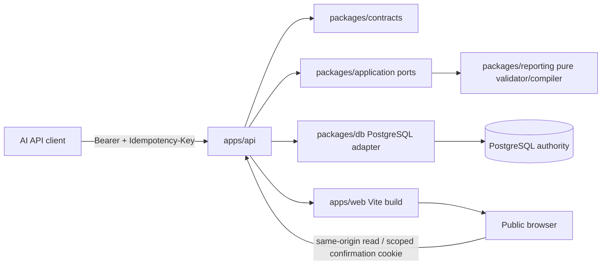
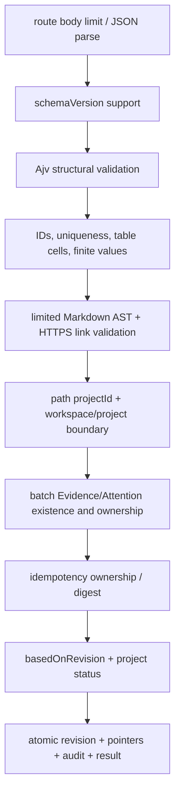

# Technical Design: LP-03 结构化汇报与双角色体验

- Status: Prepared for Technical Plan Review
- FeatureId: `lp-03-reporting-role-experience-9c4d7e1a6b20`
- Branch: `codex/lp-03-reporting-role-experience`
- Requirements: [requirements.md](./requirements.md)
- Requirements commit: `e8149c722f4c2eb88596fc8a80ab31cfae3bb436`
- Runtime baseline: `644af4f186b054a9c5d1c6db087a97e009f545a3`
- Prior lifecycle closure: LP-02 `ACCEPTED_NO_PUBLISH`

## 1. Background And Scope

LP-01 与 LP-02 已提供可运行的 Fastify API、PostgreSQL 权威数据、Idea 到项目执行、
关注事项、Evidence、结论、确认、幂等、审计和公开读取。当前仓库没有 Web，也没有
结构化汇报运行时。已有
`packages/contracts/schemas/structured-report.v1.schema.json` 和
`docs/feature/v0-1-project-plan/structured-report-protocol.md` 仍只是设计输入。

LP-03 增加两个相互约束的能力：

1. AI 通过受保护 API 提交声明式报告，服务端严格校验、原子保存不可变 revision，
   并向公开读取提供安全的渲染模型与回退信息。
2. 一个 React Web 从现有权威 API 与新增体验查询读取 proposer/executor 两种信息
   组织方式、项目详情、通用报告和受限确认页。

LP-03 不建立账户、身份、RBAC、第二套项目状态、项目专用报告组件、通用人工编辑、
外部内容抓取、LP-04 AI Skill、LP-05 部署发布或 Engineering Lifecycle checker。

## 2. Architecture And Ownership



| Area | Owner | Allowed responsibility | Forbidden responsibility |
| --- | --- | --- | --- |
| `packages/contracts` | transport contract | canonical JSON Schema, TypeBox API envelopes, OpenAPI | business state transitions, HTML rendering |
| `packages/reporting` | pure report rules | schema loading, semantic/security validation, canonical digest, safe render-model compilation | SQL, HTTP auth, React, project state mutation |
| `packages/application` | use-case boundary | report/experience ports, typed commands and results | Fastify/cookie/SQL implementation |
| `packages/db` | authority adapter | locking, immutable revisions, pointers, reference checks, hydration, transaction/audit | interpreting Markdown, Web presentation |
| `apps/api` | delivery/composition | auth, size/readiness gate, envelopes, routes, static hosting, CSP | report business rules, role-derived persisted state |
| `apps/web` | presentation | URL routing, query state, safe component renderer, accessible UI | bearer writes, business-state copies, raw HTML |

Dependency direction remains acyclic:

```text
apps/web -> contracts
apps/api -> contracts + application + db + reporting
packages/db -> application + domain + contracts
packages/application -> domain + contracts
packages/reporting -> contracts canonical schema only
packages/domain -> no framework, HTTP, SQL or React dependency
```

## 3. Core Decisions And Invariants

1. PostgreSQL remains the only business authority. A report is presentation content, never a project
   status, phase, confirmation, actor, permission, Evidence or audit authority.
2. The checked-in Draft 2020-12 JSON Schema is the single structural source. Runtime types and
   fixtures are derived from it; there is no second handwritten report union.
3. `evidenceId` in the existing schema changes from proposed `evi_` to the accepted LP-02
   `evd_` prefix before the first LP-03 revision exists. This is a correction to an unimplemented
   input, not a migration of persisted reports.
4. Every project owns one stable `rpt_<ULID>` report aggregate and zero or more immutable revisions.
   Revision numbers begin at 1 and are contiguous within the aggregate.
5. Submission identity is unambiguous: HTTP `Idempotency-Key` is required and must equal body
   `clientRequestId`. Mismatch is rejected before persistence. Fastify `requestId` remains a separate
   server correlation ID.
6. Report submitter authority comes only from the credential-bound server `WritePrincipal` attached
   after successful bearer authentication. It is never read from report `generator`, source content,
   headers other than the bearer, or public role view. The single v0.1 bearer maps to a closed AI
   principal configured by the deployment and the report body remains presentation-only.
7. A successful submission atomically writes revision, accepted/renderable pointer, idempotency
   result and a redacted audit event. Failed validation or transaction writes none of them.
8. Canonical digest excludes transport-only variability but includes the complete normalized report
   intent. Object keys are sorted; array order and string content are preserved.
9. The global API string-trim hook does not run on report bodies because Markdown and document
   whitespace are content. Report semantic validation rejects blank required strings without mutating
   accepted source JSON.
10. Reports store only stable Evidence/Attention IDs. Read-time batch hydration supplies current
   authoritative labels, states and links; cross-project references are rejected at submission.
11. Accepted source and compiled render model are immutable. Runtime React failure never modifies
    a revision or pointer; the current response already contains a previous compatible render model
    for client-side fallback.
12. proposer/executor are URL-visible presentation modes, not identities. Both derive from the same
    Idea/project rows and versions and never persist client-derived business status.
13. Public Web is read-only except the already accepted LP-02 single-confirmation capability flow.
    No generic Web write token or general edit form is introduced.

## 4. Canonical Report Contract

### 4.1 Source And Type Generation

`packages/contracts/schemas/structured-report.v1.schema.json` remains canonical and uses
`additionalProperties: false` at every object boundary. A deterministic generation/check script
creates a TypeScript type module from that exact file. CI fails when the generated artifact is stale.
Ajv 2020 in strict mode compiles the same file at service startup and in contract tests.

The schema retains the confirmed v1 bounds:

| Shape | Required fields | Bounds / notes |
| --- | --- | --- |
| report root | `schemaVersion`, `projectId`, `clientRequestId`, `basedOnRevision`, `locale`, `title`, `sections` | body at most 262,144 bytes; 1–20 sections |
| section | `id`, `title`, `blocks` | 1–30 blocks; IDs unique in report |
| `text` | `id`, `type`, `markdown` | Markdown 1–10,000 chars; limited AST only |
| `metrics` | `id`, `type`, `items` | 1–12 metrics; finite numbers only |
| `list` | `id`, `type`, `ordered`, `items` | 1–50 items |
| `table` | `id`, `type`, `columns`, `rows` | 1–8 unique columns; at most 100 rows; cell keys exactly match columns |
| `timeline` | `id`, `type`, `items` | 1–50 items; unique item IDs; Evidence IDs authoritative |
| `evidence_refs` | `id`, `type`, `evidenceIds` | 1–20 unique same-project `evd_` IDs |
| `action_refs` | `id`, `type`, `attentionItemIds` | 1–20 unique same-project `attn_` IDs |

`summary`, `generatedAt`, and `generator` remain optional display metadata. Client-provided time and
generator are never used as audit time or actor authority.

### 4.2 Validation Pipeline

Validation is fail-closed and runs in this order:



At most 50 validation details are returned, sorted by JSON Pointer then stable code. Details contain
only `path`, `code`, and a bounded generic message. They never echo offending values or full input.

Markdown is parsed to an AST. Allowed nodes are paragraph, text, emphasis, strong, inline code,
ordered/unordered list, list item, line break and link. Links must be absolute `https:` URLs, contain
no userinfo and meet length bounds. HTML, images, definitions, headings, code blocks, autolink
protocols, inline styles and unknown nodes are rejected. React receives only a compiled safe token
tree and never calls `dangerouslySetInnerHTML`.

### 4.3 Normalization And Digest

The persisted `source_document` is the validated JSON exactly as accepted. The content digest uses a
canonical JSON serialization with sorted object keys, preserved arrays, preserved strings and finite
JSON numbers. The request body `clientRequestId` is excluded from the business-content digest so
transport identity is checked independently; `projectId`, `basedOnRevision`, schema version and all
presentation content remain included. The digest algorithm is `sha256` and is stored as lowercase
hex.

## 5. Persistence Model And Lifecycle

Migration `0003_lp03_reporting_experience.sql` is additive and never edits `0001` or `0002`.

### 5.1 Tables

#### `project_reports`

| Column | Type / null | Owner / invariant |
| --- | --- | --- |
| `id` | text not null | server `rpt_<ULID>`, primary key |
| `workspace_id` | text not null | current single workspace; included in uniqueness |
| `project_id` | text not null | FK, unique with workspace; one aggregate per project |
| `current_accepted_revision` | integer not null default 0 | greatest committed revision |
| `current_renderable_revision` | integer null | latest revision compiled by supported renderer |
| `created_at`, `updated_at` | timestamptz | database clock |

#### `report_revisions`

| Column | Type / null | Owner / invariant |
| --- | --- | --- |
| `report_id`, `revision` | text, integer | composite PK; revision >= 1 |
| `project_id`, `workspace_id` | text | immutable ownership snapshot |
| `previous_revision` | integer null | null for 1, otherwise revision - 1 |
| `schema_version` | text | accepted `1.0` |
| `content_sha256` | char(64) | canonical business-content digest |
| `source_document` | jsonb | immutable validated declaration |
| `render_model` | jsonb | immutable safe compiled model |
| `render_status` | text | `RENDERABLE` or future compatibility status |
| `compiler_version` | text | deterministic compiler version |
| `submitted_by_type` | text not null | credential principal; fixed `AI` |
| `submitted_by_role` | text not null | credential principal; fixed `EXECUTOR` for v0.1 report writes |
| `submitted_by_display_name` | varchar(120) not null | validated deployment config snapshot |
| `submitted_by_client` | varchar(120) null | validated deployment config snapshot or null |
| `submitted_on_behalf_of_role` | varchar(16) null | fixed null; report writes do not assert delegation |
| `accepted_at` | timestamptz | server authority |

An update/delete trigger rejects mutation of `report_revisions`. Foreign keys and checks enforce
project/report ownership and pointer validity.

#### `report_submission_keys`

| Column | Type / null | Owner / invariant |
| --- | --- | --- |
| `workspace_id`, `project_id`, `client_request_id` | text | composite primary identity |
| `content_sha256` | char(64) | first intent owns key |
| `state` | text | `IN_PROGRESS` or `COMPLETED` |
| `response_status`, `response_body` | integer, jsonb null | exact completed replay |
| `created_at`, `completed_at` | timestamptz | server authority |

The project-scoped key prevents unrelated projects from colliding while preserving the confirmed
same-project retry contract.

### 5.2 Atomic Submission And Lock Order

```mermaid
sequenceDiagram
    participant C as AI client
    participant A as Report API
    participant D as PostgreSQL
    C->>A: POST report (header key == body clientRequestId)
    A->>A: validate bearer; attach credential WritePrincipal
    A->>A: size/schema/semantic/security validation
    A->>D: BEGIN; claim/lock report_submission_keys
    alt completed same digest
        D-->>A: stored status/body
        A-->>C: exact replay, no new revision
    else different digest
        A-->>C: 409 IDEMPOTENCY_KEY_REUSED
    else owner
        A->>D: lock project + project_reports; check status/revision/refs
        A->>D: insert immutable revision + update pointers
        A->>D: append redacted REPORT_REVISION_ACCEPTED audit
        A->>D: complete idempotency record; COMMIT
        A-->>C: 201 revision result
    end
```

Lock acquisition is always idempotency key, then project/report aggregate. A two-second contention
deadline maps to `409 IDEMPOTENCY_IN_PROGRESS` with `retryable: true`. Replay lookup precedes stale
`basedOnRevision` evaluation, so a successful unknown-result retry remains successful. New intent with
an old revision returns `409 REPORT_REVISION_CONFLICT` and `currentRevision`.

First submission requires `basedOnRevision = 0`. Later submission must equal
`current_accepted_revision`. A `COMPLETED` project returns `409 PROJECT_REPORT_FROZEN`; after LP-02
reopen, the existing report aggregate and all revisions remain and the next revision continues.

The audit event adds aggregate type `REPORT` and event `REPORT_REVISION_ACCEPTED`; its aggregate
version equals report revision. The revision submitter columns and audit actor fields are copied from
the same immutable request `WritePrincipal`: `actor_type=AI`, `actor_role=EXECUTOR`, validated
`display_name`, optional `client`, and null `on_behalf_of_role`. Audit `reason` is the server constant
`Submit structured project report revision`; `request_id` is Fastify's request ID and
`idempotency_key` is the already matched request identity. `before_summary` contains only the prior
revision/digest/schema (or null on first submit), while `after_summary` contains the new
revision/digest/schema/compiler. Neither summary contains source/render content. Report writes do not
increment LP-02 project version.

`authenticateWrite` is extended to attach this typed principal after constant-time token validation.
Existing LP-01/LP-02 command bodies and declared-actor semantics do not change. `AppConfig` adds the
non-secret optional fields `AI_WRITE_DISPLAY_NAME` (default `LP-03 report writer`, explicit values
trimmed and 1–120 characters) and `AI_WRITE_CLIENT` (unset means null; explicit values trimmed and
1–120 characters). Type, role and delegation are not configurable. Invalid explicit values fail
startup. The principal object is never accepted from the request and bearer/token material is never
persisted or logged.

## 6. Public API Contract

All routes remain under `/api/v1`, use existing success/error envelopes, correlation, readiness and
authentication conventions. Existing LP-01/LP-02 routes and frozen OpenAPI proofs remain unchanged.

### 6.1 Report Routes

| Method / route | Access | Request | Success |
| --- | --- | --- | --- |
| `POST /projects/:projectId/reports` | AI bearer | required `Idempotency-Key`; canonical v1 body; 256 KiB route limit | `201` first commit or stored replay with report ID, revision, digest, acceptedAt |
| `GET /projects/:projectId/reports/current` | public read | project path | accepted revision plus closed primary/runtime-fallback render slots |
| `GET /projects/:projectId/reports` | public read | `limit`, opaque `cursor` | stable descending revision summaries |
| `GET /projects/:projectId/reports/:revision` | public read | positive revision | immutable revision plus compatibility/render descriptor and hydrated refs |

The current response has an explicit `displayMode`:

| Mode | Meaning |
| --- | --- |
| `EMPTY` | no accepted revision |
| `CURRENT` | accepted revision is supported and renderable |
| `FALLBACK` | accepted revision unavailable to renderer; prior renderable supplied |
| `UNSUPPORTED` | no supported renderable revision; source retained but not guessed/rendered |

`acceptedRevision`, `renderedRevision`, `fallbackFromRevision`, `compatibilityCode` and a bounded
diagnostic are separate fields. The API never labels a fallback as current content.

The current response is one closed `ReportCurrentDto`:

| Field | Type / null | Selection and meaning |
| --- | --- | --- |
| `projectId` | project ID, non-null | requested authority project in every variant |
| `reportId` | report ID or null | null only in `EMPTY`, before a report aggregate exists |
| `displayMode` | `EMPTY\|CURRENT\|FALLBACK\|UNSUPPORTED` | server protocol/compiler compatibility decision |
| `accepted` | `AcceptedReportDto \| null` | latest accepted revision; null only for `EMPTY` |
| `primary` | `ReportRenderSlotDto \| null` | accepted slot for `CURRENT`; greatest supported/renderable revision <= accepted for `FALLBACK`; null for `EMPTY/UNSUPPORTED` |
| `runtimeFallback` | `ReportRenderSlotDto \| null` | greatest supported/renderable revision strictly below `primary.revision`; null when primary is null or no earlier candidate exists |
| `compatibilityCode` | bounded enum or null | why accepted differs from primary, never a runtime exception/body |

`AcceptedReportDto` is closed and contains `revision`, nullable `previousRevision`, `schemaVersion`,
`contentSha256`, `sourceDocument`, `submittedBy` (the five-field ActorDto snapshot), and `acceptedAt`.
`ReportRenderSlotDto` is closed and contains `revision`, `schemaVersion`, `compilerVersion`,
`contentSha256`, `acceptedAt`, `renderModel`, and `hydratedRefs`. `hydratedRefs` is a closed object with
stable-ordered `evidence` and `attentionItems`. Hydrated Evidence entries contain `id`, `kind`, `title`,
`summary`, current `state`, `detailPath` and `historyPath`; Attention entries contain `id`, `type`,
`title`, current `status`, nullable `waitingForRole`, `detailPath` and `historyPath`. Paths are
same-origin relative paths. Each slot is independently hydrated against its own reference IDs. The
source declaration is returned only under `accepted`; the runtime candidate never needs or exposes
source to render.

The database current query loads the accepted row, then selects `primary` by descending revision
among supported/renderable rows at or below accepted, then selects `runtimeFallback` by descending
revision strictly below primary. It unions reference IDs with a slot tag, batch-hydrates authority,
and partitions results back into each slot. Thus `CURRENT` always has a candidate when any earlier
supported revision exists; if the primary React subtree throws, the Web switches only its local
dynamic-region presentation to `runtimeFallback`, labels the primary and fallback revisions and uses
the fixed code `REPORT_RENDER_RUNTIME_FAILED`. `displayMode` is not mutated. With null candidate the
dynamic region shows a safe empty state while the fixed authority region remains.

### 6.2 Experience Query Routes

LP-03 adds projections rather than widening frozen LP-01/LP-02 DTOs:

| Method / route | Query | Result authority |
| --- | --- | --- |
| `GET /experience/proposer/ideas` | `category`, `limit`, `cursor` | Idea plus linked project status/version, latest progress, proposer-waiting items, latest confirmed conclusion |
| `GET /experience/executor/projects` | `group=OPEN\|COMPLETED`, `limit`, `cursor` | project status/phase/version, next step, blockers, pending confirmations, support requests, latest conclusion |
| `GET /experience/projects/:projectId` | `view=PROPOSER\|EXECUTOR` | fixed authority header, role summary, preview counts and collection links |

`category` is a server-derived controlled value:

| Category | Rule |
| --- | --- |
| `IDEA` | `projectId IS NULL AND intakeStatus = IDEA` |
| `NEEDS_CLARIFICATION` | `projectId IS NULL AND intakeStatus = NEEDS_CLARIFICATION` |
| `AWAITING_EXECUTION` | unique linked project exists and status is `QUEUED` |
| `IN_PROGRESS` | unique linked project exists and status is `IN_PROGRESS` |
| `PAUSED` | unique linked project exists and status is `PAUSED` |
| `COMPLETED` | unique linked project exists and status is `COMPLETED` |

The linked-project branch takes precedence for promoted Ideas, so stale/intake display fields cannot
place them into an unpromoted category. The existing uniqueness relation guarantees at most one
linked project; a violated invariant fails the query rather than duplicating a card. Each Idea appears
once. Server SQL/query composition owns the rule; React never recomputes it.
Experience DTOs carry the same IDs and authoritative version fields as existing DTOs. Full Evidence,
attention, confirmation and history remain available through existing cursor-paginated routes.

### 6.3 Stable Errors

| HTTP | Code | Boundary |
| --- | --- | --- |
| 400 | `REPORT_IDENTITY_MISMATCH` | header/body request identity differs |
| 400 | `REPORT_SCHEMA_UNSUPPORTED` | unsupported schema version |
| 400 | `REPORT_VALIDATION_FAILED` | structural/semantic/table/path error with bounded details |
| 400 | `REPORT_UNSAFE_CONTENT` | forbidden Markdown/URL/executable shape |
| 400 | `REPORT_REFERENCE_INVALID` | missing, cross-project or wrong-type stable reference |
| 401/403 | existing auth codes | missing/invalid AI write bearer |
| 404 | `PROJECT_NOT_FOUND`, `REPORT_REVISION_NOT_FOUND` | authority lookup |
| 409 | `IDEMPOTENCY_IN_PROGRESS`, `IDEMPOTENCY_KEY_REUSED` | retry ownership |
| 409 | `REPORT_REVISION_CONFLICT` | stale `basedOnRevision`; includes current revision |
| 409 | `PROJECT_REPORT_FROZEN` | completed project |
| 413 | `REQUEST_TOO_LARGE` | route body over 256 KiB |
| 503 | existing readiness code | database not ready |

## 7. Safe Rendering And Reference Hydration

`compileReportView` is a pure function from a validated v1 document to a discriminated safe render
model. It preserves section/block order and compiles Markdown into allowed tokens. The Web renderer
switches only on the seven frozen `type` values. It cannot branch on project ID/title, load remote
components, evaluate templates or render raw source.

Evidence and Attention blocks are hydrated in one batch per response. Hydrated entries contain the
stable ID, current authoritative label/state, project-relative same-origin URL and a historical-entry
link. Missing references after later data evolution are represented as `UNAVAILABLE` without changing
the immutable source; their prior report text is never promoted to authority.

The project page renders in this order:

1. fixed authoritative project header and role-context summary;
2. progress, next step, open attention, Evidence, latest conclusion, confirmations and history links;
3. clearly labelled “AI 结构化汇报” dynamic region;
4. report compatibility/fallback notice and rendered revision identity.

React wraps only the dynamic region in an error boundary. A component exception keeps the fixed
authority region mounted and renders the response-provided previous render model. If none exists it
shows a safe empty state. Diagnostics are fixed codes/revision IDs, never source content.

## 8. Web Information Architecture And State

`apps/web` is a React + TypeScript + Vite single-page application served same-origin by `apps/api`
in production-like local builds. Vite development proxies `/api` to Fastify. React Router owns role,
resource and filter state in path/search parameters.

| Route | Page | Core behavior |
| --- | --- | --- |
| `/proposer` | proposer overview | Idea categories, filters, pagination, proposer-facing next actions |
| `/executor` | executor workspace | open/completed grouping, status/phase, blockers and next steps |
| `/proposer/projects/:projectId` | proposer project detail | same authority with proposer emphasis and report region |
| `/executor/projects/:projectId` | executor project detail | same authority with execution emphasis and report region |
| `/confirmations/:confirmationId` | scoped confirmation | existing cookie-bound exact summary and approve/reject only |

Role switch rewrites the path and preserves a current project ID when applicable. It never sets a
credential or changes authorization. Domain objects are not stored in local/session storage. Server
data is refetched on direct navigation and browser history. During recoverable reload failure, the
page may keep an in-memory last display but labels it stale and offers retry.

The confirmation page relies only on the LP-02 HttpOnly, Secure, SameSite=Strict cookie scoped to the
single confirmation path. It does not read capability material in JavaScript or query parameters.
The only inputs are approve/reject, bounded note and declared human actor fields already required by
the LP-02 contract. Missing, expired, stale, mismatched or consumed capability shows a non-success
state and no other write controls.

### 8.1 Visual And Accessibility Direction

The non-authoritative visual reference uses a calm, evidence-first operational style: clear authority
header, restrained status chips with text labels, dense but readable cards, visible timestamps and
strong separation between fixed facts and AI narrative. Chinese is the primary UI language while
stable codes remain English.

All core actions are native buttons/links/controls with visible focus, labelled regions, heading
order and polite live-status announcements. Tables gain captions and horizontal containment; cards
reflow to one column on narrow screens. Loading uses labelled skeletons, empty and error states are
distinct, and color is never the sole status signal.

Superdesign is used only to explore visual hierarchy. Its canvas/drafts are not API, security or
acceptance authority, and no generated design may weaken this document or the confirmed requirements.
Because no frontend existed at design start, the brand-new-project path is used and
`.superdesign/init/` is intentionally deferred until real `apps/web` code exists.

## 9. API Composition, Static Hosting And Security Headers

- `POST /reports` has a route-local 262,144-byte limit; the existing 65,536-byte default stays for
  every old route.
- The global trim normalization hook explicitly skips report submissions; old route behavior is
  unchanged.
- `@fastify/static` serves `apps/web/dist` only when the build directory/config is enabled. `/api/*`
  never falls through to SPA HTML; Web history fallback applies only to known UI routes.
- CSP defaults to self-only scripts/styles/connect/images/fonts, forbids object/frame/base embedding,
  and uses no inline/eval exception. External report links get `noopener noreferrer`.
- Logs contain request ID, route, status, report/project/revision IDs and stable error codes only.
  Bearers, cookies, database strings, report source and unsafe validation values are redacted/omitted.
- Report auth tests prove a missing/invalid bearer produces no principal/write, a valid bearer attaches
  the configured closed principal, invalid explicit principal configuration fails startup, and body
  `generator` metadata cannot replace revision/audit actor fields.
- Public Web uses virtual demo data only. The UI explains that proposer/executor are views, not
  authenticated identities.

## 10. Failure Recovery

| Failure | Persisted effect | Client behavior / recovery |
| --- | --- | --- |
| parse/size/schema/semantic/security/ref failure | none | correct payload; new intent/key as appropriate |
| same key, same content after unknown result | no new revision | exact stored success replay |
| same key, different content | none beyond first result | choose a new key for genuinely new intent |
| idempotency lock timeout | none | retry same key/content after delay |
| stale report revision | none | read current, merge, submit new key |
| database/audit failure | transaction rollback | retry same key/content; never report success |
| project completed | none | wait for accepted LP-02 reopen, then continue history |
| current protocol unsupported | source retained | use prior supported model or compatibility empty state |
| dynamic React exception | no server mutation | preserve authority region; render response fallback/empty |
| API/readiness/pagination failure | no client business mutation | distinguish error from empty; retain labelled stale data and retry |
| confirmation capability invalid | no decision | explain failure without exposing capability; obtain new scoped access |

## 11. Compatibility And Dependency Strategy

- Existing Node.js 24/npm workspace, Fastify, PostgreSQL, Drizzle, Pino, TypeBox and Vitest remain.
- New runtime dependencies are narrowly scoped: Ajv 2020 + format validation for the report package;
  a Markdown parser configured for AST-only processing; React, React DOM, React Router and
  `@fastify/static`; Vite for the Web build.
- Component tests use Testing Library + jsdom. Browser acceptance uses Playwright Chromium in CI.
- Exact versions are lockfile-controlled and must support Node 24 and ESM. Dependency installation
  must not change existing LP-01/LP-02 public behavior; any incompatible major change requires a plan
  revision and re-review.
- `npm run verify` grows to generate/check contracts, typecheck/build all workspaces, run unit,
  integration, API acceptance, component and browser tests. Existing commands remain usable.

## 12. Verification Design

| Layer | Required proof |
| --- | --- |
| schema/contract | all seven blocks; exact bounds; unknown fields/types; `evd_`; generated type freshness; frozen LP-01/LP-02 OpenAPI |
| reporting unit | canonical digest; blank/duplicate IDs; table alignment; finite metrics; Markdown AST allow/deny; HTTPS URL rules; bounded sorted details; compiler order |
| database integration | migration preservation; immutable trigger; principal/audit field mapping; first/next revision; idempotent replay/conflict/contention; stale revision; reference ownership; complete/reopen; dual-slot selection/hydration; rollback after revision/audit failure |
| API acceptance | auth/principal/config/size/identity/readiness/envelopes; closed accepted/primary/runtimeFallback DTO; current/history/specific reads; experience truth table; public read; frozen old routes |
| component | seven render components; authority/dynamic separation; primary and nullable runtime fallback slots; filters; loading/empty/error/stale states; confirmation failure/success; error-boundary fallback |
| browser | two structurally different reports; proposer/executor URL flows; refresh/back/forward/deep link; paginated collections; keyboard focus; narrow viewport; scoped confirmation; runtime fallback with and without candidate |
| security | no raw HTML/script/dangerous link/executable DOM; no secret in URL, DOM, log or diagnostic; cross-project refs denied; CSP present |
| management | LP-02 exact accepted-no-publish evidence; LP-03 Ready for Acceptance + objective evidence; LP-04 remains unconfirmed |

The principal end-to-end scenario creates two projects, submits different valid report structures,
verifies both role views and fixed authority, rejects an unsafe report without changing revision,
forces only the newest dynamic render path to throw, observes fallback, switches role/deep link, and
checks complete history.

## 13. Documentation, Rollout And Rollback

Implementation updates README/API instructions, OpenAPI, structured-report protocol compatibility
notes, migration notes, CHANGELOG, LP-02 lightweight plan, LP-03 lightweight plan and the single
project-management entry. Management status changes occur only after objective verification and say
`Ready for Acceptance`, never `Accepted`.

LP-03 has no external deployment, tag, release or package publication. Local rollout is migrate,
build, start API/static Web, readiness check and acceptance. Database migration is forward-only and
preserves prior data. Application rollback may run the prior LP-02 binary against the additive schema;
new report tables remain dormant. Report revision deletion or schema down-migration is not an
authorized rollback method.

## 14. Requirements Trace

| Requirements / AC | Design authority |
| --- | --- |
| LP3-REQ-001, 030 / AC-001 | Sections 2, 6, 9, 11, 12 |
| LP3-REQ-002–006, 009 / AC-002 | Sections 3–5, 12 |
| LP3-REQ-007–008, 017 / AC-003 | Sections 3, 5, 7 |
| LP3-REQ-009–012 / AC-004 | Sections 4–6, 10 |
| LP3-REQ-013–014, 019 / AC-005 | Sections 5–7, 10 |
| LP3-REQ-015–016 / AC-006 | Sections 4, 7, 8 |
| LP3-REQ-014, 017–019 / AC-007 | Sections 6–8, 10 |
| LP3-REQ-020–021, 026 / AC-008 | Sections 6, 8, 10 |
| LP3-REQ-022–023, 026 / AC-009 | Sections 6, 8 |
| LP3-REQ-023–025 / AC-010 | Sections 6, 8 |
| LP3-REQ-017, 025–026 / AC-011 | Sections 7, 8, 10 |
| LP3-REQ-028–029 / AC-012 | Sections 6, 8, 9 |
| LP3-REQ-026–027 / AC-013 | Sections 8, 10, 12 |
| LP3-REQ-004, 012, 018, 029–031 / AC-014 | Sections 4, 5, 7, 9, 10, 12 |
| LP3-REQ-032 / AC-015 | Sections 12–13 |
| LP3-REQ-001–032 / AC-016 | Sections 2–13 and principal E2E scenario |
