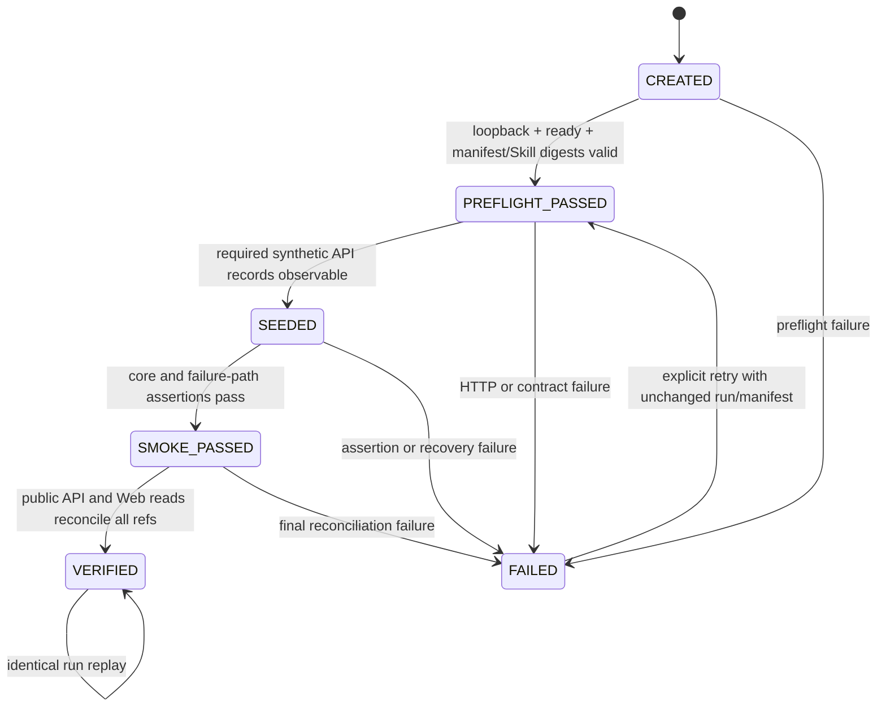
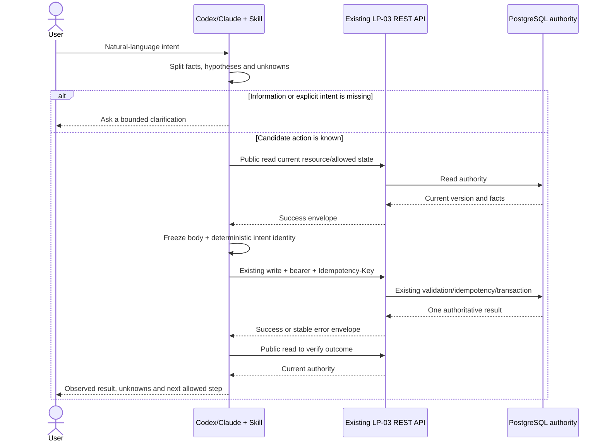
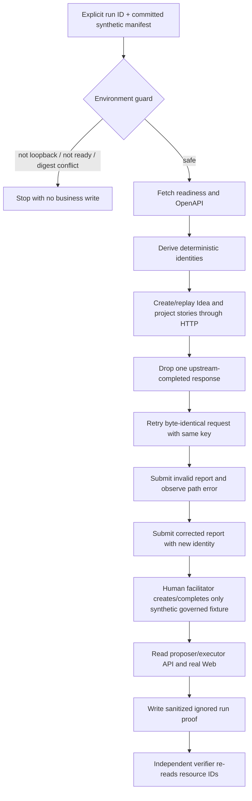

# Technical Design: LP-04 AI Skill 与可重复演示

- Status: Proposed
- FeatureId: `lp-04-ai-skill-demo-5f8c2a9d7e41`
- Branch: `codex/lp-04-ai-skill-demo`
- Authoritative baseline: `818671c504c8b8b8cd41f8ebc096f341ece6b18f`
- Requirements authority: `40e0edb4da153fbe9bc0c90edb0a39d9b085a520`
- Requirements: [requirements.md](./requirements.md)
- Current phase: F2 — Consumer contract and feature design

## 1. Background And Scope

LP-01 至 LP-03 已经通过唯一 PostgreSQL 权威状态和真实 REST API 提供 Idea、澄清、显式
推进、项目执行、事项、Evidence、结论、人类确认、结构化汇报及双角色 Web。LP-04 不改变
这些已验收行为，而是补齐两种面向使用者的交付：

1. 一份仓库版本化、客户端中立的 Markdown Skill，把自然语言意图约束为现有 API 的读取、
   写入、恢复和人类交接流程；
2. 一套只使用合成数据、可从已知状态重复执行的真实 HTTP 演示与客观证据。

当前仓库没有 `skills/` 目录、demo manifest、demo runner、真实 HTTP demo smoke、人工演示
说明或 Codex/Claude 实际验证记录。已有测试大量覆盖领域和 API 正确性，但不能证明一个刚
加载 Skill 的客户端会收集正确字段、保留未知信息、复用幂等身份并在人类确认处停止。

### 1.1 Goals

- 为 Codex、Claude 及采用同类 Markdown Skill 约定的客户端提供相同核心操作协议。
- 只把 `/openapi.json`、`openapi/lp03.v1.json` 和 API 读取结果视为业务权威。
- 用真实 HTTP 覆盖 Idea 创建/读取/澄清/推进、执行事实、汇报、错误修正和未知结果恢复。
- 让同一 demo run ID 可安全重放；不同 run ID 产生清楚隔离的合成记录。
- 把 AI bearer 与 human-control/capability 严格分开，并留下可复核、无秘密的证据。
- 更新使用文档、项目管理事实和 changelog，同时保留 LP-01 至 LP-03 的冻结门禁。

### 1.2 Non-goals

- 不新增或改变数据库表、领域对象、REST 路由、OpenAPI、报告协议或 Web 页面。
- 不建设 MCP Server、旁路 API、客户端状态数据库、agent runtime 或通用评测平台。
- 不让 AI 创建或决定 human confirmation，也不向 Skill 暴露 human-control token/cookie。
- 不自动清空共享数据库，不执行 `DROP`、全表 `TRUNCATE` 或生产数据 reset。
- 不重做 LP-03 视觉设计，不开始 LP-05 部署、tag、Release、package 或发布工作。
- 不声称只做静态 lint 的客户端已经完成真实 API 验证。

## 2. Architecture And Ownership

| Component | Planned location | Owner | Responsibility | Explicitly does not own |
| --- | --- | --- | --- | --- |
| Client-neutral Skill | `skills/idea-validation-workflow/SKILL.md` | LP-04 Skill | Intent classification, read-before-write, minimum-field collection, retry and stop rules | API schema copies, credentials, business state |
| Skill references | `skills/idea-validation-workflow/references/` | LP-04 Skill | Intent/API map, structured-report guidance, error recovery, Codex/Claude loading notes | Runtime-generated values or hidden parameters |
| OpenAI UI metadata | `skills/idea-validation-workflow/agents/openai.yaml` | LP-04 Skill | Discoverability metadata only | Core behavior or authorization |
| Demo fixtures | `demo/lp04/` | LP-04 demo | Versioned synthetic narrative and two differently structured reports | Generated resource IDs, secrets, real user data |
| Demo runtime | `scripts/lp04/` | LP-04 tooling | Environment guard, deterministic request identity, real HTTP orchestration, evidence sanitization and verification | Direct application/db service calls for business actions |
| Real HTTP acceptance | `apps/api/test/lp04-demo.acceptance.test.ts` | API acceptance | Start a real listener on an isolated PostgreSQL database and exercise demo runtime over TCP | Mock responses as core proof |
| Real-data browser proof | `apps/web/e2e/lp04-demo.spec.ts` plus LP-04 Playwright config | Web acceptance | Read demo-created authority through proposer/executor Web | Project-specific rendering or write bypass |
| Human demo guide | `docs/demo/lp04.md` | LP-04 docs | Preconditions, safe credentials, human handoff, expected API/Web observations, recovery and cleanup | Storing credentials or approving on behalf of a person |
| Client validation evidence | `docs/feature/lp-04-ai-skill-demo/evidence/` | Acceptance evidence | Sanitized Codex and Claude execution records bound to exact Skill commit and API resources | Raw transcripts, tokens, cookies or self-attested mock results |

The existing packages remain authoritative:

- `packages/contracts` and `openapi/lp03.v1.json` own request/response/error shapes.
- `packages/domain`, `packages/application` and `packages/db` own all business and persistence rules.
- `apps/api` owns authentication, readiness and HTTP composition.
- `apps/web` owns proposer/executor rendering and scoped confirmation UI.

LP-04 scripts may import shared TypeScript types and pure utilities for compile-time safety, but all demo business
effects and observations must cross the listening HTTP boundary. They must not instantiate application or database
services to create, update or read business records.

## 3. Core Decisions And Invariants

1. **No runtime contract change.** LP-04 consumes the exact LP-03 API. A missing public capability is a
   requirements blocker, not permission to extend earlier slices.
2. **Progressive Skill disclosure.** `SKILL.md` remains the concise decision workflow. Detailed route/error/report
   material lives one reference level below it and points to the frozen OpenAPI/JSON Schema instead of duplicating
   full payload definitions.
3. **One authority.** Conversation memory, Skill files, fixtures and demo evidence never become current business
   state. Before any versioned write, the client reads the target authority and allowed action again.
4. **One intent, one deterministic identity.** A run ID, manifest digest and semantic step derive a stable
   `Idempotency-Key`; report `clientRequestId` equals its request header identity. Changed intent requires a new key.
5. **Unknown-result recovery preserves bytes.** Only an identical method, path, body and key may be replayed after
   the result is unknown. The client never "helpfully" reconstructs a similar body.
6. **Human confirmation is out of Skill reach.** The Skill can explain the exact human step and public URL, then
   stops. A separately invoked demo-facilitator path may exercise the existing human API using environment-injected
   credentials, but is not referenced as an AI action.
7. **Demo safety is fail-closed and narrow.** Automated data creation accepts only an HTTP loopback origin and an
   explicit synthetic run ID. It never cleans arbitrary databases; replay or a fresh run ID provides repeatability.
8. **Evidence is not state.** Local run evidence is ignored by Git and is used only to correlate requests with
   authoritative reads. Committed client records contain sanitized facts that are independently rechecked over HTTP.
9. **No compatibility claim without execution.** Codex and Claude each require an actual successful run. Missing CLI,
   authentication or HTTP access remains a failed acceptance item.

## 4. Skill Consumer Contract

### 4.1 Folder And Trigger Contract

The Skill folder name is `idea-validation-workflow` (lowercase hyphen-case, under 64 characters). The required
frontmatter contains only:

- `name: idea-validation-workflow`;
- a `description` that names the supported Idea, project-execution, structured-report and recovery intents, so a
  compatible client can discover it without loading the body.

`agents/openai.yaml` is optional client UI metadata and cannot change the behavior described in `SKILL.md`.
Claude-specific loading notes stay in a reference and cannot fork the core workflow.

### 4.2 Logical Invocation Context

`SkillInvocationContext` is ephemeral conversation/runtime context. It is never serialized by LP-04 and is rebuilt
from the current user request plus API reads.

| Field | New/changed | Type | Required/default | Owner | Validation | Persistence / compatibility |
| --- | --- | --- | --- | --- | --- | --- |
| `apiBaseUrl` | New | absolute URL | Required; no default | Client operator | HTTP(S), no embedded credentials; demo runner further restricts to loopback | Runtime only; does not alter API |
| `aiWriteCredential` | New logical input | opaque secret reference | Required only for AI writes | Client secure runtime | Must be injected outside prompt/files; value must never be echoed | Runtime secret only; never persisted |
| `userIntent` | New | string | Required | Human user | Non-empty; retain original meaning | Conversation only |
| `declaredActor` | New | existing `ActorInput`/`ProposerInput` shape | Required for writes | User plus existing API contract | Role is declared attribution, never authentication | Sent only in existing request body |
| `resourceId` | New | existing Idea/project/child ID | Optional until selected or created | API | Must match returned ID and resource kind | Conversation only; revalidated by read |
| `knownFacts` | New | string array | Default `[]` | User | Only explicitly supplied or API-read facts | Conversation only |
| `hypotheses` | New | string array | Default `[]` | User/AI with label | Must remain explicitly labelled hypotheses | Conversation only |
| `unknowns` | New | string array | Default `[]` | User/AI | Must not be silently converted to facts | Conversation only |
| `lastReadVersion` | New | positive integer | Required before versioned write | API | Must come from immediately preceding authority read | Conversation only; stale values cause re-read |
| `intentRequestIdentity` | New | deterministic request identity | Required per write intent | Client | Stable for identical intent; new for changed intent | Runtime only; API idempotency remains authoritative |

There is deliberately no field for `HUMAN_CONTROL_TOKEN`, confirmation capability, cookie, database URL or
parallel client-side project state.

### 4.3 Intent Families

| Intent family | Read before write | Allowed existing write | Mandatory stop or clarification |
| --- | --- | --- | --- |
| Capture Idea | Optional duplicate-oriented list/read check | `POST /api/v1/ideas` | Ask when proposer attribution or intent is unknown; preserve missing desired outcome as a question |
| Clarify Idea | Idea detail and open question | clarification answer route | Do not invent answer, evidence or desired outcome |
| Promote Idea | Idea detail, version and readiness | promotion with literal `PROMOTE` | Require explicit promotion intent and preconditions; absence means remain in Idea pool |
| Record execution fact | Project detail/current version | transition, progress, attention, evidence or conclusion route that matches intent | Recording text must not imply a state transition; re-read if action is not allowed |
| Submit report | Project detail, report current/history and referenced resources | report submission with canonical v1 document | No HTML/code; changed report after an error uses new identity and current base revision |
| Human-governed action | Project/confirmation public context only | None for AI Skill | Explain and stop; never create/decide confirmation or request its credential |
| Read role experience | Public experience routes | None | Follow pagination; role changes presentation, not identity or permission |

## 5. New Tooling And Evidence Structures

These objects are LP-04 tooling contracts, not database/domain/API objects. No existing persisted field changes.

### 5.1 `DemoScenarioManifestV1`

The committed manifest is immutable synthetic input. TypeScript validation rejects unknown fields.

| Field | New/changed | Type | Required/default | Owner | Validation | Persistence / compatibility |
| --- | --- | --- | --- | --- | --- | --- |
| `schemaVersion` | New | literal `"1.0"` | Required | Demo fixture | Exact match | Committed; future formats require a new version |
| `scenarioId` | New | string | Required | Demo fixture | `^[a-z0-9-]{1,48}$` | Stable semantic fixture ID |
| `locale` | New | literal `"zh-CN"` | Required | Demo fixture | Exact match in v1 | Committed |
| `syntheticMarker` | New | literal `"SYNTHETIC_DEMO_DATA"` | Required | Demo safety | Exact match | Propagated into human-readable demo text |
| `actors` | New | proposer/executor display descriptors | Required | Demo fixture | Existing actor constraints; obviously synthetic names | Committed; no credentials |
| `ideas` | New | bounded keyed Idea templates | Required, 2–6 | Demo fixture | Existing request limits; keys unique | Committed; contains no generated IDs |
| `executionStories` | New | bounded keyed step arrays | Required | Demo fixture | References manifest keys only; allowed step vocabulary | Committed; API versions resolved at runtime |
| `reports` | New | two or more `StructuredReportV1` templates | Required | Demo fixture | Canonical JSON Schema except runtime IDs/request identity placeholders | Committed; two distinct structures/orders |
| `expectedViews` | New | expected category/group/label assertions | Required | Demo fixture | References manifest keys; no generated IDs | Committed acceptance oracle |

The v1 fixture contains at least: a needs-clarification Idea, an explicitly promoted/in-progress project, blocker,
decision request, support request, Evidence, conclusion, dynamic report and a completed project created by the
separate human facilitator step.

### 5.2 `DemoRunRecordV1`

The runner writes sanitized proof to `.lp04-demo/runs/<runId>/result.json`. The directory is ignored by Git. This
record helps resume and verify a run but never authorizes a business action.

| Field | New/changed | Type | Required/default | Owner | Validation | Persistence / compatibility |
| --- | --- | --- | --- | --- | --- | --- |
| `schemaVersion` | New | literal `"1.0"` | Required | Demo runtime | Exact match | Local ignored file |
| `runId` | New | string | Required | Operator/client | `^[a-z0-9][a-z0-9-]{0,31}$` | Part of deterministic narrative and identities |
| `manifestSha256` | New | lowercase SHA-256 | Required | Demo runtime | Digest of canonical committed manifest | Same run ID with different digest is rejected |
| `skillCommitSha` | New | 40-char Git SHA | Required | Demo runtime | Must resolve and contain the Skill | Binds evidence to exact instructions |
| `baseOrigin` | New | sanitized URL origin | Required | Demo runtime | Loopback HTTP only; no userinfo/path/query | Local evidence only |
| `phase` | New | run-state enum | Required | Demo runtime | Legal transition table below | Updated atomically in local proof file |
| `startedAt` / `finishedAt` | New | RFC3339 / nullable RFC3339 | Required | Demo runtime | UTC server/client clock | Evidence only, not API state |
| `requestTrace` | New | bounded sanitized entries | Default `[]` | Demo runtime | Step, method, path template, key digest, response request ID/status/error, resource refs; no headers/body | Evidence only |
| `resourceRefs` | New | manifest-key to authoritative ID map | Default `{}` | API response | IDs must be re-read before use | Evidence index, not current state |
| `assertions` | New | bounded assertion result array | Default `[]` | Verifier | Stable assertion ID and pass/fail/detail code | No raw response bodies |
| `result` | New | `PENDING`/`PASS`/`FAIL` | Default `PENDING` | Verifier | `PASS` only after all required reads | Evidence only |

`requestTrace` never stores Authorization, Cookie, full request/response bodies, database URLs or environment dumps.
The exact AI token is also registered with the redactor in memory so accidental matches fail evidence generation.

### 5.3 `ClientValidationRecordV1`

One immutable sanitized record is required for each actual client. Files are named by client and run ID so a new
attempt does not rewrite historical proof.

| Field | New/changed | Type | Required/default | Owner | Validation | Persistence / compatibility |
| --- | --- | --- | --- | --- | --- | --- |
| `schemaVersion` | New | literal `"1.0"` | Required | Evidence validator | Exact match | Committed JSON |
| `client` | New | `CODEX` or `CLAUDE` | Required | External client run | Exact enum | One PASS record required for each |
| `clientVersion` | New | string | Required | Client executable | Non-empty, sanitized | Evidence only |
| `skillCommitSha` | New | 40-char Git SHA | Required | Git | Must equal reviewed implementation head for final proof | Prevents stale Skill claims |
| `runId` | New | demo run ID | Required | Operator | Same v1 pattern; unique per client proof | Links local/HTTP evidence |
| `inputIntent` | New | synthetic natural-language text | Required | Acceptance scenario | Bounded; must carry synthetic marker or obviously synthetic content | Records the exact safe prompt intent |
| `startedAt` / `finishedAt` | New | RFC3339 | Required | Client runner | Ordered UTC values | Evidence only |
| `requestIds` | New | non-empty request ID array | Required | API response metadata | Existing request ID pattern; unique | Correlates API actions without secrets |
| `resourceRefs` | New | Idea/project/report IDs | Required | API | Must pass live public reads and belong to the run marker | Independently reverified |
| `webPaths` | New | relative paths | Required | Web/API | Must start with `/`; no origin, query secret or cookie | Reproducible human check |
| `objectiveChecks` | New | required check ID/result pairs | Required | Evidence verifier | All mandatory checks `PASS` | No subjective prose-only approval |
| `result` | New | literal `PASS` | Required for committed proof | Evidence verifier | Not emitted when client did not execute or verification failed | Cannot represent unexecuted compatibility |
| `evidenceSha256` | New | lowercase SHA-256 | Required | Evidence verifier | Digest of canonical record excluding this field | Tamper-evident record |

Raw client transcripts stay under `.lp04-demo/` and are never committed. The sanitizer scans raw output, the exact
runtime secrets and common credential assignments before creating the record. A static prompt response without
observed API request IDs and live-readable resource IDs cannot produce `PASS`.

### 5.4 `UnknownResultFaultPlan`

This object exists only in the acceptance-test fault proxy.

| Field | New/changed | Type | Required/default | Owner | Validation | Persistence / compatibility |
| --- | --- | --- | --- | --- | --- | --- |
| `method` | New | literal `POST` | Required | Test | Exact match | Ephemeral |
| `path` | New | exact path string | Required | Test | Single expected demo step | Ephemeral |
| `idempotencyKeySha256` | New | lowercase SHA-256 | Required | Test | Match without logging raw key | Ephemeral |
| `action` | New | `DROP_AFTER_UPSTREAM_RESPONSE` | Required | Test proxy | One supported action | Ephemeral |
| `remainingFaults` | New | integer | Default `1` | Test proxy | Must start and end at 1/0 | Ephemeral one-shot state |

The proxy forwards one request to the real listening API, waits for the upstream response, drops the downstream
connection before returning a body, and then permits a direct identical retry. It cannot match arbitrary traffic.

## 6. Object Lifecycles

LP-04 introduces no database, API or domain core object. Existing Idea/project/report/confirmation lifecycles remain
unchanged. The only new lifecycle-bearing objects are local tooling/evidence objects.

### 6.1 Demo Run Lifecycle

- **Creation:** an explicit run ID plus canonical manifest and exact Skill commit creates the record.
- **Persistence:** atomic write/rename inside ignored `.lp04-demo/runs/<runId>/`.
- **Update rule:** only legal state transitions; each API resource is re-read before another write.
- **Replay:** same run ID plus same manifest/Skill digest reuses deterministic request bodies and keys. Different
  manifest or Skill digest is a conflict requiring a new run ID.
- **Deletion:** local proof can be removed by exact explicit path after the run. Business records are not deleted.
- **Observable states:** phase, sanitized trace, API resource refs, assertion result and final result.

### 6.2 Skill Invocation Lifecycle

`COLLECT_INTENT → CLASSIFY → CLARIFY_OR_READ → PROPOSE_ACTION → EXECUTE_OR_HANDOFF → VERIFY → REPORT`.
Any authority/version change returns to `READ`. Any human-governed action moves to `HANDOFF` and terminates AI
automation for that intent. Invocation context expires with the client session and has no repository/database state.

### 6.3 Client Validation Record Lifecycle

Raw execution is first local and untrusted. The validator sanitizes it, verifies the exact Skill Git commit, re-reads
every recorded resource through public HTTP and evaluates mandatory checks. Only then does it emit an immutable
`PASS` record. A failed or unavailable client remains local and is listed as unpassed in `verification.md`; it is not
converted into a compatibility claim.

## 7. Data And Operation Flows

### 7.1 Skill-Guided Write

### 7.2 Reproducible Demo

### 7.3 Human Confirmation Boundary

The AI Skill may read public project context and explain why a human decision is required. It must not call
confirmation creation/decision routes, handle `X-Human-Control-Token`, read a scoped cookie or claim a decision.
The manual guide places the separately invoked facilitator step in a visibly different section and process. The
facilitator receives the human credential only from its environment, binds actions to the synthetic run, never prints
the credential/cookie and verifies the final public project state after the human API succeeds.

## 8. Request Identity, Concurrency And Ordering

`deriveRequestId(runId, manifestSha256, stepId, semanticAttempt)` computes a SHA-256 digest, encodes the first 130
bits with uppercase Crockford Base32 and prefixes `req_`. The result matches the existing request-ID pattern and is
used as the `Idempotency-Key`; report `clientRequestId` is identical. Inputs are versioned so algorithm changes cannot
silently reuse old identities.

- An identical replay must reuse the exact serialized canonical JSON body.
- A corrected validation request or newly chosen action increments `semanticAttempt` and therefore uses a new key.
- `VERSION_CONFLICT` and `REPORT_REVISION_CONFLICT` always trigger a fresh read and new intent identity.
- `IDEMPOTENCY_IN_PROGRESS` waits the advertised 250 ms and retries the same body/key, at most three times.
- The demo runner serializes writes per Idea/project. Only the one-shot unknown-result proxy creates controlled
  overlap; no general concurrency runner is added.
- Collection reads follow `nextCursor` until null with a 100-page safety ceiling and duplicate-cursor detection.
- Default demo capacity is at most six Ideas, four projects, two report revisions per project and 100 traced requests.

## 9. Failure And Recovery Contract

| Observation | Skill/demo response | Request identity rule | Success authority |
| --- | --- | --- | --- |
| Missing user information | Ask or preserve an explicit unknown/question | No write/key yet | User answer or stored clarification |
| Network result unknown / `INTERNAL_ERROR` after a write may have reached API | Re-send byte-identical request, then read authority | Same key and body only | Replay metadata plus public read |
| `IDEMPOTENCY_IN_PROGRESS` | Bounded wait using `retryAfterMs`, then replay | Same key/body | Later success or explicit stop |
| `IDEMPOTENCY_CONFLICT` / `IDEMPOTENCY_KEY_REUSED` | Stop; distinguish original replay from changed intent | Original intent reuses original bytes; changed intent needs explicit new key | User intent plus API response |
| `VERSION_CONFLICT` | Re-read current resource and allowed action; explain changed facts | New key only after renewed intent | Latest versioned read |
| `REPORT_REVISION_CONFLICT` | Re-read current report and project, regenerate from current base | New matching header/body request ID | Current report read |
| Validation/report path error | Show bounded field path; correct only known data | Changed body uses new key | Successful response and unchanged count after rejected revision |
| `WRITE_CREDENTIAL_REQUIRED` | Stop and ask operator to repair secure client configuration | Do not retry with guessed credentials | Later authenticated request |
| Human-control/capability error | Stop and hand off to human | AI creates no follow-up write | Human-observed existing flow |
| Not found/forbidden/not allowed | Verify ID, scope and current state; do not substitute another resource | New intent only after user correction | Public read or human correction |
| `SERVICE_NOT_READY` | Retry read/preflight at 250/500/1000 ms, then stop | No changed business intent | `/health/ready` and later request |
| Demo guard/digest conflict | Stop before write and require new explicit run ID or correct artifact | No request identity emitted | Local validation only |

The Skill reports a write as successful only when it has a success envelope or an idempotent replay plus a matching
public read. HTTP completion, tool exit code, generated text or a local proof file alone is insufficient.

## 10. Synthetic Demo Story

The manifest uses obviously fictitious Chinese names and `SYNTHETIC_DEMO_DATA` in narrative fields. It contains:

- an Idea with an open desired-outcome question that remains unpromoted;
- a second Idea explicitly promoted to a project, started and moved through progress;
- one blocker, one decision request and one support request;
- active Evidence and a conclusion;
- an invalid report followed by a corrected report;
- two valid project reports with different section/block order;
- a human-facilitated completed project;
- proposer and executor expectations over the same IDs.

Repeated execution with the same run ID is an idempotent reconciliation. A different run ID adds an isolated,
labelled synthetic story. Cleanup removes only the exact ignored local proof directory and optionally tears down the
exact dedicated compose project/volume that the operator started. It never deletes shared API data.

## 11. Client Validation Authority

Codex and Claude validations use separate run IDs and the exact committed Skill. Each client must:

1. load the repository Skill through its documented client entry point;
2. receive one recorded synthetic natural-language intent;
3. use the real loopback HTTP API and secure environment-injected AI token;
4. create/read a unique Idea and execute the assigned representative recovery or project step;
5. emit only a local raw trace;
6. pass the evidence validator, which re-reads the resource and binds the result to client version and Skill commit.

Availability is checked, not assumed. Main does not install clients, authenticate user accounts or downgrade a
missing Claude/Codex run to static inspection. If either cannot actually execute, AC-15 remains failed and the
implementation Goal is genuinely blocked until the external dependency is restored or Requirements changes.

## 12. Security, Privacy And Authorization

- Tokens come only from environment/secure client configuration. Commands and docs use variable names or
  `<redacted>` placeholders, never literal usable values.
- Demo runtime creates redacted structured logs; it never prints request headers, cookies, raw environment or full
  response bodies.
- `.lp04-demo/`, Playwright artifacts and local client transcripts are ignored and excluded from writer commits.
- Evidence generation fails on exact token matches, bearer/cookie assignments, common cloud-key patterns,
  credential-bearing URLs or non-synthetic personal/company content.
- Public Web role selection remains presentation only. Skill text must not call proposer/executor an authenticated
  identity.
- All demo write bodies use existing declared actor fields honestly; they cannot upgrade authorization.
- The human facilitator is a separately named command, refuses non-loopback origins, requires the synthetic marker
  and never becomes a Skill action.

## 13. Observability And Proof

Every demo step has a stable `stepId`. Sanitized evidence records method, path template, API request ID, status/error
code, resource IDs and assertion IDs. It does not record raw bodies or secrets. Required proof commands produce
machine-readable exit status plus a concise terminal summary:

- Skill structure/link/forbidden-instruction validation;
- fixture validation and deterministic identity tests;
- real HTTP demo acceptance including one-shot unknown-result recovery;
- real-data proposer/executor browser test;
- Codex evidence verification;
- Claude evidence verification;
- frozen OpenAPI and all LP-01–LP-03 repository gates.

`verification.md` records exact commands, commit, results and any unavailable external client. Screenshots are
optional local supporting proof and are not committed unless explicitly reviewed and sanitized.

## 14. Compatibility, Migration, Rollout And Rollback

### 14.1 Compatibility

- No database migration, API/OpenAPI change, runtime config change or Web behavior change.
- Existing frozen `openapi/lp01.v1.json`, `lp02.v1.json` and `lp03.v1.json` remain byte-governed by current checks.
- Skill references point to canonical contracts and must fail link/route checks if those artifacts move or drift.
- New npm scripts are additive; existing `npm run verify` remains the umbrella gate.

### 14.2 Rollout

Land the Skill, fixtures, tooling, tests and docs in one LP-04 feature branch after technical-plan approval. The
Skill is not published to an external marketplace. Final status is `Ready for Acceptance`; formal no-publish
acceptance still requires exact merge proof and separate user authorization.

### 14.3 Rollback And Downgrade

Reverting LP-04 removes only repository Skill/demo/docs/test assets and additive npm scripts. The LP-03 binary,
database and frozen contracts remain usable without data migration or backfill. Synthetic records already created
through public API remain ordinary traceable records and are not destructively removed. Operators can discard only
their exact isolated demo database/volume when they own it.

## 15. Verification Strategy

| Layer | Planned proof | Critical assertions |
| --- | --- | --- |
| Skill structure | frontmatter/link/reference validator plus Skill Creator `quick_validate.py` when available | discoverable name/description, one-level references, no secret or forbidden human action |
| Unit | deterministic IDs, canonical manifest digest, environment guard, run-state transitions, sanitization | same input same key; changed intent new key; non-loopback rejected; secret match fails |
| Contract | route/error names compared with frozen LP-03 OpenAPI and report JSON Schema | no hidden/missing route; no copied schema drift |
| Real HTTP acceptance | isolated PostgreSQL, listening Fastify API, demo runner | create/read, execution fact, report, rejection/correction, unknown-result replay, one business result |
| Human boundary | API acceptance plus separate facilitator test | AI bearer cannot use human route; facilitator secret absent from output; final state public-read verified |
| Browser | real demo data through proposer/executor routes without Playwright API mocks | same IDs, different role emphasis, two report structures, no write-boundary regression |
| Client | actual Codex and Claude runs plus evidence re-read | exact Skill commit/client version, observed request IDs, unique authoritative resources, no static-only claim |
| Regression | existing format/lint/type/build/OpenAPI/unit/contract/integration/acceptance/Web/browser suite | LP-01–LP-03 gates are retained and pass |

No test deletes, skips or relaxes an existing gate. Direct service/database access may be used only by test setup or
independent count assertions, never in place of the core demo HTTP calls.

## 16. Documentation And Project Management

Implementation updates the narrowest stable surfaces:

- `README.md`: install/use the repository Skill, run a local demo and understand credential boundaries;
- `docs/demo/lp04.md`: complete manual story, human handoff, recovery, expected API/Web output and exact safe cleanup;
- `docs/feature/lp-04-ai-skill-demo/verification.md`: objective implementation/client evidence;
- `docs/project-management.md` and `docs/implementation-plans/v0-1/lp-04-ai-skill-demo.md`: LP-03 exact closure,
  LP-04 actual `Ready for Acceptance` state and LP-05 still unstarted;
- `CHANGELOG.md`: Added/Docs/Test entries for the Skill and reproducible demo.

No document may mark LP-04 `Accepted`, published or deployed before post-merge Lifecycle acceptance.

## 17. Assumptions And Open Decisions

### 17.1 Confirmed Assumptions

- The exact LP-03 merge is the only runtime baseline and its public contract can complete confirmed LP-04 scenarios.
- Acceptance has a local/isolated PostgreSQL environment and loopback HTTP access.
- AI and human credentials are provided outside the repository.
- Codex and Claude executables/sessions can be made available for actual validation; absence blocks AC-15.
- Chinese is the narrative language; stable fields/error codes remain English.

### 17.2 Open Decisions

None. If implementation discovers that the frozen API cannot complete a confirmed scenario, Main must record the
reproducible gap and return to Requirements. It must not invent an API change under this plan.

## 18. Requirements Trace

| Requirements / AC | Design coverage |
| --- | --- |
| AC 1–5 | Sections 2–4, 7–9: Skill structure, intent map, read-before-write and existing API authority |
| AC 6 | Sections 3, 7.3, 9, 12: hard human boundary and separate facilitator |
| AC 7–8 | Sections 3, 8–9: deterministic identities, unknown-result replay and conflict recovery |
| AC 9 | Sections 4.3, 7.2, 9–10: report rejection, path correction and new revision identity |
| AC 10–14 | Sections 5–7, 10, 15: synthetic manifest, repeatable real HTTP and real-data Web story |
| AC 15 | Sections 5.3 and 11: exact Codex/Claude execution evidence, no static substitution |
| AC 16 | Sections 5.2–5.3 and 12–13: sanitization, ignored raw proof and secret scanning |
| AC 17 | Sections 14–15: additive delivery and full LP-01–LP-03 regression gates |
| AC 18 | Section 16: synchronized management/plan evidence without premature acceptance |
