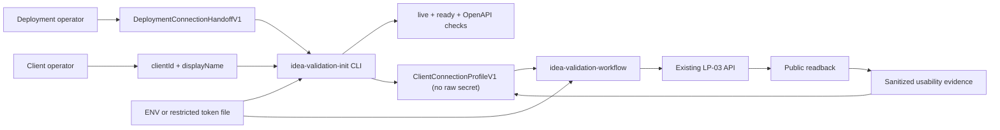
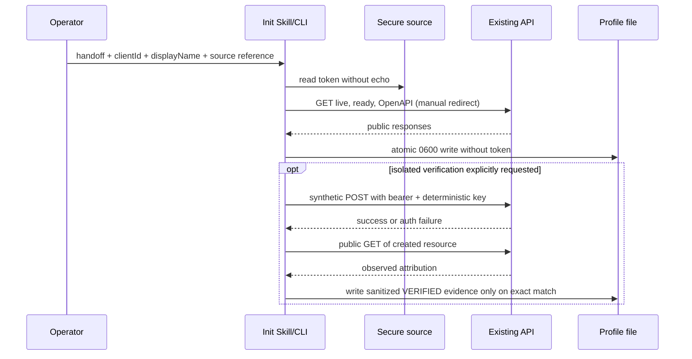

# Technical Design: LP-05 客户端连接资料与初始化 Skill

- FeatureId: `lp-05-client-connection-profile-6a2d9f4c1b70`
- Branch: `codex/lp-05-client-connection-profile`
- DeliveryMode: `AGILE_REVIEWED`
- Priority: P1
- Requirements authority: `817fd5ed6633ff6a09260545260dd39f492d4b2a`
- Status: Proposed

## Background

`idea-validation-workflow` 已经定义 Idea、项目执行、汇报、幂等恢复与人工确认边界，
但它假定客户端已从安全 operator configuration 获得 API 地址和 AI bearer。当前没有统一的
初始化入口，也没有可由 Codex、Claude 和兼容 Markdown-Skill 客户端共同消费的连接资料。
用户因此需要在对话中重复说明地址、token 来源和署名，部署操作者也无法交付一份明确绑定
release、Skill 和 credential identity 的非秘密资料。

本设计增加一个独立的 `idea-validation-init` Skill 和配套 CLI。它只建立、验证和更新客户端
连接资料；业务决策继续完全由现有 `idea-validation-workflow` 和 LP-03 OpenAPI 控制。

## Goals

- 用同一流程为 Codex、Claude 和兼容客户端初始化 `baseUrl`、AI credential 安全引用、
  稳定 `clientId` 与可读 `displayName`。
- 生成可版本化、无 raw secret、绑定 release/Skill/credential identity 的
  `ClientConnectionProfile`。
- 分别表达连接、OpenAPI、credential presence 和 credential usability，不制造认证通过结论。
- 为部署操作者提供独立、确定性的非秘密 handoff 生成命令，不修改部署控制器或生产环境。
- 让现有业务 Skill 从同一 profile 构造允许的 actor attribution，并保留 human-control 边界。

## Non-goals

- 不新增服务端 endpoint、数据库 schema、登录、OAuth、RBAC、API-key 管理平台或 secret manager。
- 不修改当前生产站点、token、部署 attempt、release/proposal 或历史证据。
- 不把 `clientId`、`displayName`、fingerprint 或 profile 当作认证或权限证明。
- 不自动发布 Skill、生成生产 token、轮换 credential 或执行生产写入。
- 不复制 `idea-validation-workflow` 的业务 decision loop。

## Current And Desired Boundaries

| Surface | Current authority | This feature | Explicitly excluded |
| --- | --- | --- | --- |
| Business API | `openapi/lp03.v1.json` | Read and compatibility-check only | New routes or relaxed auth |
| Business workflow | `skills/idea-validation-workflow` | Read initialized profile before use | Forked Codex/Claude loops |
| Client initialization | None | New `idea-validation-init` Skill and CLI | Business mutation orchestration |
| Credential | Operator-injected `AI_API_TOKEN` | Environment/file/provider reference and non-secret identity | Raw value in profile/prompt/log |
| Human control | Human token/capability cookie | Reject names, inputs and use | Delivery to AI clients |
| Deployment handoff | Ad-hoc instructions | Deterministic non-secret handoff command | Controller/state-machine changes |

## Package And File Ownership

| Owner | Planned path | Responsibility |
| --- | --- | --- |
| Initialization Skill | `skills/idea-validation-init/**` | Collect non-secret inputs, explain secure secret injection, call CLI, stop at human boundary |
| Profile runtime | `scripts/client-profile/**` | Closed schemas, validation, canonical JSON, safe I/O, URL/OpenAPI checks and credential probe |
| Canonical schema | `skills/idea-validation-init/references/client-connection-profile.v1.schema.json` | Portable profile contract shipped with the Skill |
| Existing Skill | `skills/idea-validation-workflow/**` | Load and enforce the initialized profile before business operations |
| Deployment handoff | `scripts/client-profile/create-deployment-handoff.ts` | Create a release-bound, non-secret operator handoff from explicit inputs |
| Static gates | `scripts/lp04/check-skill.ts`, tests and package scripts | Check both Skills, links, profiles, secret hygiene and contract drift |
| Operator docs | `README.md`, `docs/operations/lp05.md` | Install, initialize, update, rotate, recover and remove profile |

No new npm workspace package is introduced. The contract is a client/deployment artifact, not a server API.

## Core Objects

### DeploymentConnectionHandoffV1

The operator creates this non-secret input after a release target and HTTPS origin are known. It may be
distributed with installation instructions.

| Field | Type | Required | Owner | Validation / compatibility |
| --- | --- | --- | --- | --- |
| `schemaVersion` | literal `1` | Yes | generator | Closed object |
| `kind` | literal `idea-validation-deployment-handoff` | Yes | generator | Prevents profile/handoff confusion |
| `baseUrl` | string | Yes | operator | Canonical HTTPS origin; loopback HTTP only under explicit test flag |
| `openapiUrl` | string | Yes | generator | Exactly `<baseUrl>/openapi.json` |
| `releaseId` | bounded safe ID | Yes | release operator | 1–120 chars; not authorization |
| `sourceCommit` | 40-char Git SHA | Yes | release operator | Existing commit whose LP-03 OpenAPI digest equals the handoff and observed endpoint |
| `skillCommit` | 40-char Git SHA | Yes | release operator | Existing commit containing the exact local `skills/` tree |
| `skillVersion` | string | Yes | Skill metadata | Must equal repository package version at `skillCommit` |
| `skillTreeSha256` | 64 lowercase hex | Yes | generator | Canonical digest of the exact local `skills/` bytes proven against `skillCommit` |
| `openapiSha256` | 64 lowercase hex | Yes | generator | Digest of expected LP-03 OpenAPI artifact |
| `declaredAiScopes` | string array | Yes | operator | Closed allowlist; declarative only |
| `credentialId` | bounded safe ID | Yes | operator | Non-secret rotation identity |
| `expiresAt` | RFC3339 or `null` | Yes | operator | Unknown/no known expiry is explicit `null` |
| `issuedAt` | RFC3339 | Yes | generator | Deterministic explicit input in tests |
| `authoritySha256` | 64 lowercase hex | Yes | generator | Canonical binding of every preceding non-secret handoff field |

The handoff contains neither credential source nor token fingerprint because those are client-local facts.

### ClientConnectionProfileV1

The initializer combines the handoff, client attribution and a secure credential reference. This is a
non-secret local configuration file; it can be inspected and backed up, but should still use mode `0600`
because local paths and operational labels are not intended as public release content.

| Field | Type | Required | Owner | Validation / compatibility |
| --- | --- | --- | --- | --- |
| `schemaVersion` | literal `1` | Yes | initializer | Closed object |
| `kind` | literal `idea-validation-client-profile` | Yes | initializer | Prevents handoff confusion |
| `profileId` | `profile_<sha256 prefix>` | Yes | initializer | Derived from canonical non-secret identity inputs |
| `profileRevision` | positive integer | Yes | initializer | `1`; increments only on explicit replacement |
| `baseUrl` / `openapiUrl` | strings | Yes | handoff | Must retain canonical origin and exact endpoint |
| `releaseId` | string | Yes | handoff | Must equal the active handoff |
| `sourceCommit` | Git SHA | Yes | handoff | Verified source/OpenAPI binding |
| `skill` | object | Yes | handoff/local Skill | `commit`, `version`, `treeSha256` |
| `clientId` | string | Yes | client operator | 1–120 chars; `^[A-Za-z0-9][A-Za-z0-9._:-]*$` |
| `displayName` | string | Yes | client operator | Trimmed 1–120 chars; no control characters |
| `credential` | object | Yes | initializer | Non-secret ID, salted fingerprint, source kind/reference and expiry |
| `declaredAiScopes` | string array | Yes | handoff | Declarative; never used as local authorization proof |
| `validation` | object | Yes | initializer/probe | Independent connection/OpenAPI/presence/usability states |
| `issuedAt` | RFC3339 | Yes | handoff | Preserved across identical initialization |
| `updatedAt` | RFC3339 | Yes | initializer | Preserved when an identical run makes no semantic change |

`credential` is closed:

- `id`: exact non-secret `credentialId` from the handoff;
- `fingerprint`: `sha256:` plus SHA-256 of the domain-separated token bytes;
- `source`: exactly one of `{kind:"ENV", name:"..."}` or `{kind:"FILE", path:"..."}`;
- `expiresAt`: RFC3339 or `null`.

Environment names must match `^[A-Z][A-Z0-9_]{0,127}$` and must not contain `HUMAN`,
`CONTROL`, `COOKIE`, `CAPABILITY`, `PASSWORD` or `DATABASE`. File paths must be absolute regular files,
must not be symlinks, and on POSIX must have no group/other permission bits. The standard environment name is
`IDEA_VALIDATION_AI_TOKEN`; the standard file environment is `IDEA_VALIDATION_AI_TOKEN_FILE`.

`validation` is closed:

| Field | Values | Meaning |
| --- | --- | --- |
| `connection` | `VERIFIED` | `/health/live` and `/health/ready` passed without redirect |
| `openapi` | `VERIFIED` | Same-origin `/openapi.json` passed the compatibility predicate |
| `credentialPresence` | `PRESENT` | Secure source was readable and met minimum opaque-token bounds |
| `credentialUsability` | `VERIFIED` or `UNVERIFIED` | Only a real authorized request plus public read may produce `VERIFIED` |
| `verifiedAt` | RFC3339 | Connection/OpenAPI check time; stable on identical idempotent replay |
| `credentialEvidence` | object or `null` | Sanitized request/resource IDs and digest; never headers/body/token |

There is no `READY` boolean. Reads may use a connection/OpenAPI-verified profile. A write path must state
whether credential usability is `VERIFIED` or still `UNVERIFIED`; `UNVERIFIED` is not an authentication claim.

## Initialization Inputs And CLI Contract

The public command is additive:

```text
npm run client:init -- \
  --handoff <deployment-handoff.json> \
  --client-id <stable-id> \
  --display-name <label> \
  --credential-env IDEA_VALIDATION_AI_TOKEN \
  --output <client-profile.json>
```

`--credential-file <absolute-path>` is the mutually exclusive alternative. There is deliberately no
`--token`, stdin token prompt, human credential option, header option or arbitrary URL suffix. Raw token bytes
are read only inside the process, used for a bounded bearer request or fingerprint, then discarded.

An existing profile with the same canonical identity is revalidated but not rewritten; timestamps and bytes
remain stable. Any change to origin, release, Skill, attribution, credential ID/fingerprint or source reference
fails with `PROFILE_UPDATE_REQUIRED` unless `--replace` is supplied. Replacement increments the revision and
writes atomically after all checks pass.

## URL And OpenAPI Compatibility

1. Parse `baseUrl` with the platform URL parser.
2. Reject username/password, query, fragment and any path other than `/`.
3. Require HTTPS. `http://127.0.0.1`, `http://localhost` and `http://[::1]` are allowed only with
   `--allow-loopback-http`.
4. Build endpoints from the normalized origin; never accept caller-provided endpoint paths.
5. Use `redirect: "manual"`; any 3xx is a failure, including same-host redirects.
6. Require 200 success envelopes from `/health/live` and `/health/ready`.
7. Require `/openapi.json` to be OpenAPI 3.1, contain the existing LP-03 core read/write routes,
   use the `aiWrite` HTTP bearer security scheme and match the handoff `openapiSha256` compatibility artifact.
8. Before reading a credential, verify the authority digest, both Git commits, exact `skills/` file set/bytes/modes,
   repository version at `skillCommit`, and the LP-03 OpenAPI at `sourceCommit`.

The live document need not byte-equal the repository artifact because generated ordering may differ. The
compatibility digest is computed from the complete canonical OpenAPI document, covering every parameter,
request/response schema, actor field, security declaration and referenced component consumed by either Skill.

## Credential Verification

Presence validation checks only source readability and opaque-token bounds. It never reports usability.

Usability can become `VERIFIED` in one of two ways:

1. the initializer runs `--verify-synthetic-write` against an explicitly marked isolated environment, creates
   one synthetic Idea with a deterministic idempotency key, and publicly reads that Idea with matching
   `clientId`/`displayName`; or
2. a later business operation returns authenticated success and a matching public read, and the business Skill
   invokes the same profile updater with a sanitized evidence file.

Automated tests restrict synthetic verification to loopback. Non-loopback writes require separate external
authorization and are not performed by this feature. A 401, 403, expiry signal, scope failure, unknown result or
mismatched public read leaves usability `UNVERIFIED` and produces no success claim.

## Attribution Contract

For routes whose existing request body includes `actor` or `proposer`, the business Skill maps:

```json
{
  "actorType": "AI",
  "role": "PROPOSER or EXECUTOR",
  "displayName": "<profile.displayName>",
  "client": "<profile.clientId>"
}
```

Role continues to come from the selected existing workflow, not from profile identity. The Skill never adds a
field or header to routes that do not support caller attribution. Server-owned report attribution remains the
credential-bound `WritePrincipal` configured by `AI_WRITE_CLIENT` and `AI_WRITE_DISPLAY_NAME`.

## Flows





## Profile Lifecycle

| State | Entry | Allowed next step | Failure behavior |
| --- | --- | --- | --- |
| Absent | No profile | Validate all inputs | No file on failure |
| Configured | Secure source present | Authority plus connection/OpenAPI probe | Fail without changing the prior file |
| Connection verified | Public checks pass | Write profile with usability `UNVERIFIED` | Do not call business writes automatically |
| Write verified | Real auth success + public read match | Use existing business Skill | A current 401/403 durably downgrades to `UNVERIFIED`; unknown result returns non-success without a stale success claim |
| Update required | Identity input changed | Explicit `--replace` | Never silently reuse old proof |
| Invalid/corrupt | Schema/digest mismatch | Reinitialize | Fail closed before token use |
| Removed | Explicit uninstall command | Reinitialize later | Remove profile only; never delete secret source |

Profiles do not expire automatically when `expiresAt` is `null`. A known expired value, suspected leak,
permission/scope change, release/Skill mismatch or explicit policy marks the profile update-required. Rotation
changes credential identity and fingerprint, requires `--replace`, and must separately prove the old token is no
longer authorized before recording rotation complete.

## Safe I/O And Diagnostics

- Profile and temporary files use atomic create/rename; temporary files are mode `0600` and cleaned on failure.
- Existing output symlinks, directories, non-regular files and unsafe parent permissions fail closed.
- stdout contains only status codes, profile path, non-secret IDs and remediation; stderr uses the same redactor
  as LP-05 plus token-specific exact-value suppression.
- Errors never include environment dumps, raw fetch options, headers, token length, token prefix/suffix or
  response bodies that may echo credentials.
- The CLI exposes bounded error kinds such as `BASE_URL_INVALID`, `REDIRECT_REJECTED`,
  `OPENAPI_INCOMPATIBLE`, `CREDENTIAL_SOURCE_INVALID`, `CREDENTIAL_REQUIRED`,
  `CREDENTIAL_UNVERIFIED`, `PROFILE_UPDATE_REQUIRED` and `PROFILE_WRITE_UNSAFE`.

## Idempotency And Concurrency

- Canonical JSON and SHA-256 bind handoff and profile identity.
- The initializer takes an exclusive lock adjacent to the output profile and uses bounded stale-lock recovery.
- Same inputs plus same observed compatibility return the existing profile without rewriting it.
- Changed inputs require `--replace`; a concurrent writer that changes the file after read causes a conflict.
- Synthetic verification derives its idempotency key from profile identity and fixed synthetic intent; retries
  obey the existing LP-04 unknown-result rules and never change body bytes under the same key.

## Compatibility And Migration

- Existing clients without a profile continue to read public GETs, but the updated Skill refuses AI writes and
  directs the operator to initialization.
- Existing API, OpenAPI, database and Web contracts are unchanged.
- Standard variable names are additive; legacy `AI_API_TOKEN` may be referenced explicitly but is not copied.
- Profile schema `1` is closed. Unknown future versions fail closed and require a newer initializer.
- Removing the feature consists of uninstalling the initialization Skill and deleting the local profile; it does
  not revoke or delete the underlying credential.

## Test Strategy

### Unit and contract

- Closed handoff/profile schemas and canonical digest stability.
- URL normalization, userinfo/query/fragment/path rejection, HTTPS and loopback exception.
- Redirect rejection and complete canonical OpenAPI compatibility binding.
- Nonexistent source/Skill commits, wrong local Skill tree, wrong Skill version and release-authority tampering.
- `clientId`/`displayName`, credential ID, expiry and scope validation.
- Environment/file source restrictions, symlink/mode checks and exact secret redaction.
- Identical replay, explicit replacement, revision increment, lock contention and atomic-write recovery.
- No token/human credential in profile, stdout, stderr, logs, fixtures, Git diff or evidence.

### HTTP integration

- Local synthetic server for live/ready/OpenAPI, wrong origin and redirect failures.
- Wrong/expired/human-control-as-AI token receives 401/403 and creates no Idea.
- Correct token performs one deterministic synthetic create and public read with matching attribution.
- Unknown result replays exact bytes/key and reconciles by public read.

### Client compatibility

- One Codex and one Claude/compatible Markdown-Skill run load `idea-validation-init`, produce the same schema,
  load `idea-validation-workflow`, perform isolated synthetic write/read, and emit sanitized evidence.
- Evidence binds client version, exact Skill commit/tree digest, profile digest, request/resource IDs and public
  read result. Raw transcripts remain ignored and local.

### Repository gates

- `npm run skill:check`
- targeted client-profile unit/integration tests
- `npm run typecheck:lp05`
- `npm run verify`
- exact-head required CI

## Rollout And Rollback

1. Land additive contract, CLI and tests without changing server behavior.
2. Land initialization Skill and update existing business Skill to require profile for writes.
3. Add deterministic deployment handoff generation and operator documentation.
4. Prove Codex/Claude isolated journeys and exact-head CI.
5. After merge, build a new candidate/proposal; any production delivery, token operation or Skill publication
   requires separate explicit authorization.

Rollback reverts additive files and Skill references. Existing profiles are ignored by older Skills and contain
no secret. Rollback never deletes token files, rotates credentials or alters production history.

## Risks And Mitigations

| Risk | Mitigation |
| --- | --- |
| Token appears in model/tool output | No raw-token CLI argument; exact-value redaction and leak tests |
| Public GET is mistaken for auth success | Independent presence/usability states; only authenticated write + public read verifies |
| URL redirects exfiltrate bearer | Canonical origin and `redirect: manual`; no arbitrary endpoint input |
| Attribution is treated as identity | Schema/docs explicitly label it declared audit metadata only |
| Release/profile drift | Exact release, source, Skill and OpenAPI bindings; explicit replacement |
| Initializer grows into a second workflow | New Skill stops after profile; business actions remain in existing Skill |
| Production change sneaks into acceptance | Loopback-only automated write verification and explicit external authority boundary |

## Decisions And Open Questions

All product/security decisions needed for implementation are closed by the confirmed requirements. Implementation
may choose internal helper names, but any need for a new server endpoint, changed auth scheme, report attribution
change, production secret handling or release authority must return to Requirements.
