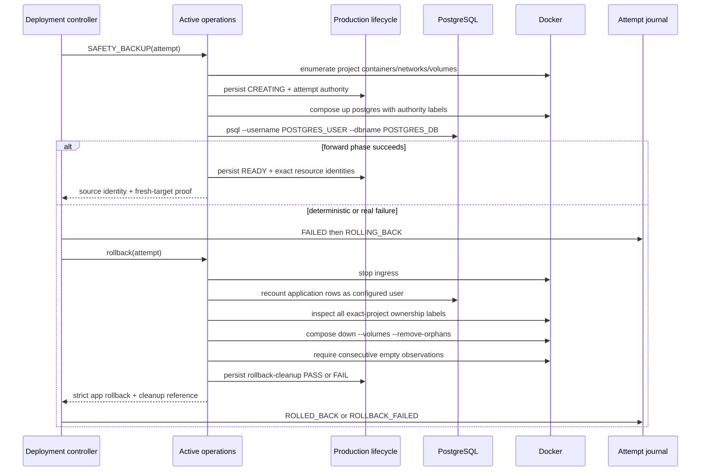
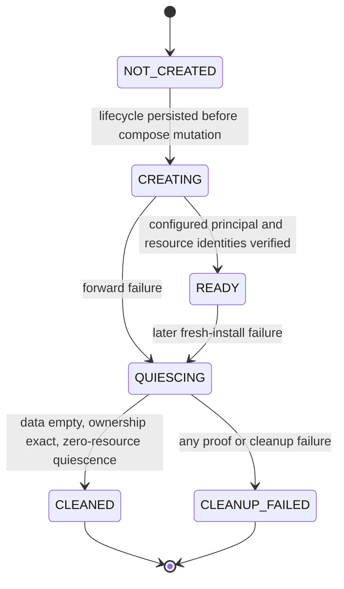

# Technical Design: LP-05 production deployment rollback hotfix

- Status: Proposed for technical-plan review
- FeatureId: `lp-05-deploy-rollback-hotfix-4b7e2c9a6d10`
- Branch: `codex/lp-05-deploy-rollback-hotfix`
- Requirements authority: `requirements.md` at `e2d9b0a30e1e98b227b13ca7fd5c59d46e618b0a`
- Code baseline: `99734e8e6c456e0366d28ce7d9a731b3544f0a56`
- Related failed attempt: `deploy_3a6d65e723939cba_20260804t0237`

## 1. Problem and design boundary

The failed production attempt exposed two defects in otherwise independent paths:

1. both live production database identity readers execute `psql` as the container OS user but omit the database
   `--username`; a PostgreSQL image configured with only the `idea_validation` role therefore falls back to the
   nonexistent `postgres` database role;
2. the active rollback operation returns application rollback fields plus `restoreCleanup`, while the attempt
   projection intentionally accepts only the closed application rollback shape. The extra field converts valid
   cleanup into `ROLLBACK_FAILED`. The same path also lacks a safe fresh-install production-resource cleanup.

This design fixes those paths without changing the product API, business schema, Web application, Skill, deployment
authorization model, attempt state graph, or existing immutable evidence. No production operation is part of this
feature. After merge, the existing candidate/proposal is retired and a new candidate/proposal must be built from the
new merge commit.

## 2. Goals and non-goals

### Goals

- Bind every production identity/read query to validated `POSTGRES_USER` and `POSTGRES_DB` values.
- Preserve the exact closed `rollback` projection and move resource-cleanup authority to an attempt-bound record.
- On a fresh target only, delete production resources after proving: no previous release, no application rows, an
  exact compose project, and exact attempt/target/candidate ownership labels.
- Re-enumerate containers, networks, and volumes after cleanup and require all three sets to remain empty for the
  configured quiescence window before reporting success.
- Preserve all previous attempt, transition, envelope, proposal, and manual-cleanup evidence byte-for-byte.

### Non-goals

- No general Docker garbage collector or change to upgrade rollback.
- No compatibility `postgres` database role or superuser.
- No automatic deletion of unlabelled, shared, foreign-project, foreign-attempt, or non-empty resources.
- No production deployment, server patch, tag, GitHub Release, package publication, or release authorization.

## 3. Affected boundaries

| Boundary | Change | Compatibility |
| --- | --- | --- |
| `scripts/lp05/database/production-runtime.ts` | Require a database username and pass it to both `psql` identity calls | Internal TypeScript call sites change; returned identity shape is unchanged |
| `deploy/compose.production.yaml` | Add non-secret attempt/target/candidate authority labels to production resources | Existing Compose project and service names remain unchanged |
| `scripts/lp05/deploy/host-active-operations.ts` | Persist production lifecycle before fresh mutation; perform fail-closed cleanup; return application rollback separately | Forward phase and attempt-state contracts remain unchanged |
| `scripts/lp05/deploy/active-oracles.ts` | Bind cleanup-record reference into rollback transition evidence without projecting it into `attempt.rollback` | Existing `DeploymentAttemptV1.rollback` remains byte-compatible and closed |
| New `scripts/lp05/deploy/rollback-cleanup.ts` | Closed lifecycle/evidence parser, persistence, ownership inspection, and reference creation | Additive internal evidence file; old attempts need no migration |

There is no public HTTP/OpenAPI, database business-schema, Web, or Skill surface change.

## 4. Database principal contract

Both identity functions receive the same closed input contract:

| Field | Type | Required | Owner | Validation and use |
| --- | --- | --- | --- | --- |
| `target` | `DeploymentTargetV1` | yes | authorization envelope | Existing target parser; compose project must match live labels |
| `databaseUser` | string | yes | validated deployment config `POSTGRES_USER` | Passed as the literal argument after `--username`; never read from ambient `PGUSER` |
| `databaseName` | string | yes | validated deployment config `POSTGRES_DB` | Passed after `--dbname`; returned `current_database()` must equal it |
| `runDocker` | command adapter | no | runtime/test harness | Existing injection point; production default retains restricted environment |

The container process may continue to run as OS user `postgres`; database authentication is independently and
explicitly selected with `--username <databaseUser>`. A nonexistent or mismatched configured user fails. There is no
fallback to `postgres`, another role, `.psqlrc`, `PGUSER`, or a newly created compatibility role.

## 5. Resource ownership labels

Every production container, network, and named volume created by the authorized Compose invocation carries these
labels in addition to existing Compose/environment/role labels:

| Label | Value source | Validation |
| --- | --- | --- |
| `io.idea-validation.attempt-id` | current `attempt.attemptId` | exact equality |
| `io.idea-validation.target-id` | `attempt.target.targetId` | exact equality |
| `io.idea-validation.candidate-manifest-sha256` | `attempt.candidate.manifestSha256` | exact lowercase SHA-256 |

The active-operation layer creates an attempt-scoped environment from parsed attempt authority and uses it for every
production Compose command. These values are not accepted from the caller's ambient environment. Before a fresh
`compose up postgres`, it enumerates project containers, networks, and volumes and requires all three sets to be
empty. The lifecycle record is persisted in `CREATING` state before the Compose mutation.

An upgrade may contain resources labelled by a previous attempt; the new destructive cleanup is unreachable when
`previousRelease` is non-null. Existing upgrade rollback remains unchanged.

## 6. Rollback cleanup authority

### 6.1 Record path and closed shape

The sole aggregate cleanup authority is written atomically with mode `0600` at:

```text
<evidenceRoot>/<attemptId>/rollback-cleanup.json
```

`RollbackCleanupEvidenceV1` is closed and digest-bound:

| Field | Type | Required | Rule |
| --- | --- | --- | --- |
| `schemaVersion` | `"1.0"` | yes | exact literal |
| `attemptId` / `envelopeId` / `targetId` | string | yes | exact current attempt authority |
| `candidateManifestSha256` | SHA-256 | yes | exact current candidate |
| `composeProject` | safe name | yes | exact target project |
| `startedAt` / `finishedAt` | RFC 3339 string | yes | ordered timestamps |
| `applicationRollbackSha256` | SHA-256 | yes | digest of the existing strict application rollback result |
| `production` | closed result | yes | `PASS`, `NOT_APPLICABLE`, or `FAIL`; details below |
| `restoreLifecycleSha256` | SHA-256 or null | yes | reference only; the existing restore lifecycle remains its detail authority |
| `status` | `PASS` or `FAIL` | yes | PASS only when every applicable cleanup is proven |
| `reasonCode` | safe string | yes | deterministic diagnostic |
| `cleanupSha256` | SHA-256 | yes | canonical digest omitting this field |

For a fresh installation, `production` contains closed pre/post observations:

| Field | Rule |
| --- | --- |
| `status`, `reasonCode` | PASS only after all checks and post-cleanup quiescence |
| `databaseUser`, `databaseName` | validated non-secret config values |
| `applicationTableCount` | exact count across application-owned public tables; must be `0` |
| `observedBefore` | sorted container IDs, network IDs, volume names, plus canonical resource-set digest |
| `ownershipLabelSha256` | digest of the exact required label projection for every observed resource |
| `removedResourceSetSha256` | digest of the exact pre-cleanup resource identities |
| `observedAfter` | three empty sorted sets, zero counts, quiescence samples, and digest |

When no production mutation occurred, `production.status=NOT_APPLICABLE` records a no-resource observation. On an
upgrade, it records `NOT_APPLICABLE` because previous-release rollback owns recovery and production resources must
not be destroyed. A failed proof is persisted as `FAIL` when possible and can never authorize deletion.

The attempt keeps its original seven-field application `rollback` object. `restoreCleanup`, production cleanup, or
any unknown key in that object continues to fail `exactKeys`. The active rollback oracle returns an internal pair:
the strict application rollback and a verified cleanup reference. The controller projects only application rollback
and uses the canonical digest of both items as the terminal transition's `evidenceSha256`.

### 6.2 Fresh-install deletion rules

Before running `docker compose down --volumes --remove-orphans` the cleanup operation must prove all of the following:

1. `attempt.previousRelease === null`;
2. the attempt-bound production lifecycle exists and was persisted before the first Compose mutation;
3. the configured database user can read the configured database and the exact application row count is zero;
4. every project resource is enumerated by exact `com.docker.compose.project` and has all three matching authority
   labels; no additional project resource is uninspected;
5. the database container and volume belong to the recorded resource set; if either identity is ambiguous, cleanup
   stops before deletion.

The command is issued only after the complete pre-cleanup set passes. Afterwards the operation repeatedly enumerates
containers, networks, and volumes and requires the configured number of consecutive empty samples. It records
`PASS` only after quiescence. A missing label, foreign value, nonzero application count, partial cleanup, unknown
field, digest mismatch, or post-cleanup reappearance produces `FAIL`/`ROLLBACK_FAILED` and preserves diagnostics.

## 7. Operation and state flow





The existing attempt graph remains `FAILED -> ROLLING_BACK -> ROLLED_BACK|ROLLBACK_FAILED`. A successful fresh
cleanup pairs application rollback `NOT_APPLICABLE` with cleanup `PASS`, producing `ROLLED_BACK`. Either application
or cleanup failure produces `ROLLBACK_FAILED`.

## 8. Persistence, idempotency, and concurrency

- Lifecycle and cleanup files use existing canonical JSON, atomic write, `0600`, digest, and evidence-root safety
  helpers.
- Existing valid records are re-read and verified against the exact attempt. Replaying a completed cleanup requires
  current resources to remain empty and returns the same authority; conflicting content fails.
- The controller's existing exclusive attempt/recovery lock remains the mutation owner. Cleanup still joins all
  forward actors before rollback, so no forward mutation can recreate resources after `CLEANED`.
- Destructive cleanup never relies on name prefixes, ambient environment, caller-authored PASS, or a partial label.
- Cleanup and application rollback errors are aggregated only after each branch has attempted to persist its own
  diagnostic authority. Raw logs and secrets are never stored.

## 9. Failure and recovery matrix

| Failure | Required result | Automatic deletion |
| --- | --- | --- |
| Configured database role missing/mismatched | identity or empty-data proof fails; `ROLLBACK_FAILED` | no |
| Database contains application rows | record count/digest and require manual handling | no |
| Foreign/unlabelled/mixed project resource | record ownership failure and exact resource digest | no |
| Cleanup command partially succeeds | re-enumerate; nonzero set yields `ROLLBACK_FAILED` | no further broad deletion |
| Restore lifecycle cleanup fails | aggregate cleanup FAIL; existing lifecycle retains detail | production cleanup may run only if independently authorized by proofs |
| Application rollback fails | aggregate FAIL; attempt `ROLLBACK_FAILED` | fresh cleanup may run only if independently authorized by proofs |
| Cleanup evidence has extra field/wrong binding/digest | parser rejects; no success transition | no |
| No production resources were created | strict no-resource `NOT_APPLICABLE` result | no-op |

## 10. Security, privacy, and audit

- The database username and database name are operational identifiers, not credentials. Passwords, database URLs,
  tokens, age identities, and raw response bodies remain excluded.
- Resource deletion is authorized by the already accepted attempt envelope plus live ownership/data proofs; this
  hotfix adds no new release authority.
- Historical attempt `deploy_3a6d65e723939cba_20260804t0237`, manual-cleanup digest
  `99a28b051693aaab170fd5356c352076563b82042061e5dad9171018f449cd14`, and old proposal/envelope remain immutable.
- The old proposal SHA `3a6d65e723939cbac0ffebc80abcdc93d28362ada42f08fd34eca9af7bebd7b3`
  must never be replayed.

## 11. Verification strategy

1. Unit/contract tests assert both identity commands contain exact `--username` and reject wrong principals without
   fallback.
2. Closed-record tests reject every omitted/extra field, wrong digest, and wrong attempt/target/candidate binding.
3. Docker-backed acceptance starts PostgreSQL 17.10 with `idea_validation`, proves role `postgres` is absent, and
   exercises both source and full identity readers.
4. Docker-backed fault acceptance starts an empty, uniquely named project, persists lifecycle authority, creates
   PostgreSQL, injects the next forward failure, and drives the real controller recovery to `ROLLED_BACK`; final
   container/network/volume counts are all zero.
5. Negative resource fixtures prove foreign project, foreign attempt, missing label, nonzero application rows,
   partial cleanup, false zero-resource claims, and extra keys fail closed without deleting the foreign resource.
6. Existing LP-05 deployment unit/authority/restore-chain/local readiness checks and the repository `verify` command
   remain green.

## 12. Rollout and compatibility

The code lands through normal plan approval, Goal implementation, exact-head code review, and external squash merge.
No old record is migrated. After merge, Main rebuilds a candidate from the new merge commit and prepares a new
proposal SHA. Production deployment remains separately authorized and is explicitly outside this feature.

## 13. Open decisions

None. Any need to broaden deletion authority, public contracts, production access, historical mutation, or release
authorization returns to Requirements.
