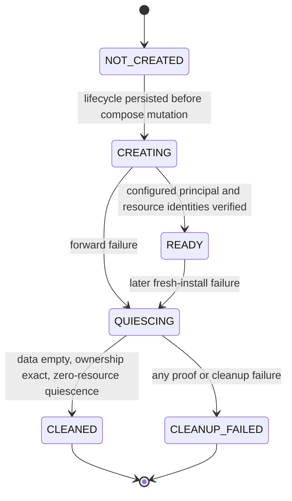

# Technical Design: LP-05 production deployment rollback hotfix

- Status: Proposed for technical-plan review
- FeatureId: `lp-05-deploy-rollback-hotfix-4b7e2c9a6d10`
- Branch: `codex/lp-05-deploy-rollback-hotfix`
- Requirements authority: `requirements.md` at `e2d9b0a30e1e98b227b13ca7fd5c59d46e618b0a`
- Code baseline: `99734e8e6c456e0366d28ce7d9a731b3544f0a56`
- Related failed attempt: `deploy_3a6d65e723939cba_20260804t0237`

## 1. Problem and design boundary

The failed production attempt exposed two defects in otherwise independent paths:

1. both live production database identity readers execute `psql` as the container OS user but omit the database
   `--username`; a PostgreSQL image configured with only the `idea_validation` role therefore falls back to the
   nonexistent `postgres` database role;
2. the active rollback operation returns application rollback fields plus `restoreCleanup`, while the attempt
   projection intentionally accepts only the closed application rollback shape. The extra field converts valid
   cleanup into `ROLLBACK_FAILED`. The same path also lacks a safe fresh-install production-resource cleanup.

This design fixes those paths without changing the product API, business schema, Web application, Skill, deployment
authorization model, attempt state graph, or existing immutable evidence. No production operation is part of this
feature. After merge, the existing candidate/proposal is retired and a new candidate/proposal must be built from the
new merge commit.

## 2. Goals and non-goals

### Goals

- Bind every production identity/read query to validated `POSTGRES_USER` and `POSTGRES_DB` values.
- Preserve the exact closed `rollback` projection and move resource-cleanup authority to an attempt-bound record.
- On a fresh target only, delete production resources after proving: no previous release, no application rows, an
  exact compose project, and exact attempt/target/candidate ownership labels.
- Re-enumerate containers, networks, and volumes after cleanup and require all three sets to remain empty for the
  configured quiescence window before reporting success.
- Preserve all previous attempt, transition, envelope, proposal, and manual-cleanup evidence byte-for-byte.

### Non-goals

- No general Docker garbage collector or change to upgrade rollback.
- No compatibility `postgres` database role or superuser.
- No automatic deletion of unlabelled, shared, foreign-project, foreign-attempt, or non-empty resources.
- No production deployment, server patch, tag, GitHub Release, package publication, or release authorization.

## 3. Affected boundaries

| Boundary | Change | Compatibility |
| --- | --- | --- |
| `scripts/lp05/database/production-runtime.ts` | Require a database username and pass it to both `psql` identity calls | Internal TypeScript call sites change; returned identity shape is unchanged |
| `deploy/compose.production.yaml`, `deploy/compose.restore.yaml` | Add non-secret attempt/target/candidate authority labels to production and isolated-restore resources | Existing Compose project and service names remain unchanged |
| `scripts/lp05/deploy/host-active-operations.ts` | Persist production/restore lifecycle before mutation; perform fail-closed cleanup; return application rollback separately | Forward phase and attempt-state contracts remain unchanged |
| `scripts/lp05/deploy/active-oracles.ts` | Bind cleanup-record reference into rollback transition evidence without projecting it into `attempt.rollback` | Existing `DeploymentAttemptV1.rollback` remains byte-compatible and closed |
| New `scripts/lp05/deploy/rollback-cleanup.ts` | Closed lifecycle/evidence parser, persistence, ownership inspection, and reference creation | Additive internal evidence file; old attempts need no migration |

There is no public HTTP/OpenAPI, database business-schema, Web, or Skill surface change.

## 4. Database principal contract

Both identity functions receive the same closed input contract:

| Field | Type | Required | Owner | Validation and use |
| --- | --- | --- | --- | --- |
| `target` | `DeploymentTargetV1` | yes | authorization envelope | Existing target parser; compose project must match live labels |
| `databaseUser` | string | yes | validated deployment config `POSTGRES_USER` | Passed as the literal argument after `--username`; never read from ambient `PGUSER` |
| `databaseName` | string | yes | validated deployment config `POSTGRES_DB` | Passed after `--dbname`; returned `current_database()` must equal it |
| `runDocker` | command adapter | no | runtime/test harness | Existing injection point; production default retains restricted environment |

The container process may continue to run as OS user `postgres`; database authentication is independently and
explicitly selected with `--username <databaseUser>`. A nonexistent or mismatched configured user fails. There is no
fallback to `postgres`, another role, `.psqlrc`, `PGUSER`, or a newly created compatibility role.

## 5. Resource authority and lifecycle contracts

Every production and isolated-restore container, network, and named volume created by an authorized Compose
invocation carries the three authority labels below plus exact Compose project, environment, and role labels.
Production environment is `production`; restore environment is `isolated-restore`; each declarative service,
network, and volume has one fixed safe role value in its Compose file.

| Label | Fixed interpolation key | Value source / validation |
| --- | --- | --- |
| `io.idea-validation.attempt-id` | `IDEA_VALIDATION_ATTEMPT_ID` | exact current `attempt.attemptId` |
| `io.idea-validation.target-id` | `IDEA_VALIDATION_TARGET_ID` | exact `attempt.target.targetId` |
| `io.idea-validation.candidate-manifest-sha256` | `IDEA_VALIDATION_CANDIDATE_MANIFEST_SHA256` | exact lowercase `attempt.candidate.manifestSha256` |

The active-operation layer overwrites those three keys from parsed attempt authority for every production and
restore Compose command; caller-provided values are ignored. Static render checks require the resulting labels on
every service, network, and named volume in `compose.production.yaml` and `compose.restore.yaml`.

### 5.1 Closed resource identity and observation

All records in §§5-6 use closed objects and reject unknown or missing keys. `safeString` means an existing
repository-safe identifier of 1-256 UTF-8 bytes with control characters, path separators, `.` and `..` rejected;
`safeName` uses the existing Docker/config name parser; `sha256` is exactly 64 lowercase hexadecimal characters;
and timestamps are canonical UTC RFC 3339 strings. Arrays are bounded to 10,000 entries. There are no implicit
defaults: every nullable field is present as `null`, and every non-null field is required.

`DockerResourceIdentityV1` is a closed discriminated union with this exact matrix:

| Field | Type | Owner / validation |
| --- | --- | --- |
| `kind` | `CONTAINER|NETWORK|VOLUME` | live Docker object type |
| `locator` | `safeString` | immutable 64-hex Docker ID for container/network; exact `safeName` for volume |
| `dockerId` | 64-hex ID or null | equals locator for container/network; null for volume |
| `name`, `composeProject` | `safeName` | live object name and exact Compose project label |
| `service` | `safeName` or null | exact Compose service for containers; null for network/volume |
| `role` | `safeName` | exact declarative role label for every service, network, and volume |
| `attemptId`, `targetId` | `safeString` | exact authority-label values and current attempt equality |
| `candidateManifestSha256` | `sha256` | exact authority-label value and current candidate equality |
| `createdAt` | timestamp | live Docker inspection value |
| `driver`, `scope`, `mountpointSha256`, `imageId` | safe string, SHA-256, or null | variant-specific live inspection values below; the host mountpoint itself is never persisted |
| `requiredLabelsSha256` | `sha256` | canonical required-label projection digest |
| `identitySha256` | `sha256` | canonical complete identity digest |

| Variant | Locator | Required variant rules |
| --- | --- | --- |
| `CONTAINER` | immutable container ID | `dockerId=locator`; exact service, name, creation time, image ID and required labels enter the identity digest; driver/scope/mountpoint digest are null |
| `NETWORK` | immutable network ID | `dockerId=locator`, `service=null`; exact name, driver, scope, creation time and labels enter the digest; mountpoint digest/image are null |
| `VOLUME` | exact volume name | `dockerId=null`, `service=null`; exact name, driver, scope, mountpoint SHA-256, creation time and labels enter the digest; image is null |

`requiredLabelsSha256` is the canonical digest of exactly the Compose project, environment, role, and three
authority labels.
Any missing or mismatched required label rejects the identity. `identitySha256` is the canonical digest of the
complete closed identity with that field omitted.

`DockerResourceObservationV1` contains exactly `schemaVersion`, `observedAt`, `containers`, `networks`, `volumes`,
`counts`, and `resourceSetSha256`. Each array is sorted by `locator`, has no duplicate locator or name, and contains
only parsed identities. `counts` is the closed safe-integer object `{containers,networks,volumes}` and equals the
array lengths. `resourceSetSha256` is the canonical digest of the three arrays and counts; `observedAt` is excluded
from set equality.

| Observation field | Type / bound | Source / validation |
| --- | --- | --- |
| `schemaVersion` | literal `"1.0"` | parser-owned |
| `observedAt` | timestamp | live enumeration completion time |
| `containers`, `networks`, `volumes` | arrays of the matching identity variant, 0-10,000 | one complete exact-project enumeration |
| `counts` | closed `{containers,networks,volumes}` of safe integers 0-10,000 | exact array lengths |
| `resourceSetSha256` | `sha256` | canonical `{containers,networks,volumes,counts}` digest |

### 5.2 `CleanupPolicyV1`

The closed policy has exactly `emptySampleCount=3`, `sampleIntervalMs=250`, `maximumSamples=15`, and
`maximumDurationMs=30000`. These constants are stored in each lifecycle digest; they cannot come from ambient
configuration or caller input.

### 5.3 `ProductionLifecycleV1`

The record is atomically persisted mode `0600` at
`<evidenceRoot>/<attemptId>/production-lifecycle.json` before any fresh-target Compose mutation.

| Field | Type / required | Owner, validation, and default |
| --- | --- | --- |
| `schemaVersion` | `"1.0"`, required | literal |
| `attemptId`, `envelopeId`, `targetId` | safe strings, required | byte-equal current attempt; no default |
| `candidateManifestSha256` | SHA-256, required | byte-equal candidate; no default |
| `composeProject` | safe name, required | byte-equal target; no default |
| `authorityLabels` | closed three-key object, required | values derived from attempt; live equality required |
| `state` | `CREATING|READY|QUIESCING|CLEANED|CLEANUP_FAILED`, required | legal transition below |
| `preMutation` | observation, required | all counts zero; immutable after CREATING |
| `ownedBeforeCleanup` | observation or null, required | null until QUIESCING; then exact frozen set |
| `cleanupReference` | `CleanupReferenceV1` or null, required | null before terminal state |
| `policy` | `CleanupPolicyV1`, required | exact fixed constants |
| `createdAt`, `updatedAt` | RFC 3339 strings, required | ordered; createdAt immutable |
| `previousLifecycleSha256` | SHA-256 or null, required | null only at CREATING; otherwise exact prior record |
| `lifecycleSha256` | SHA-256, required | canonical digest with this field omitted |

`CREATING` requires zero pre-mutation counts, null cleanup fields, and null previous digest. `READY` chains from
CREATING and records a nonempty exact owned observation. `QUIESCING` chains from CREATING or READY and freezes
`ownedBeforeCleanup`. `CLEANED` requires a PASS cleanup reference whose post-observation is zero. `CLEANUP_FAILED`
requires a FAIL reference. A byte-identical current record is replayable only after live reconciliation; conflicting
authority/state/digest fails. Records are retained with their attempt and never synthesized for old attempts.

Before fresh `compose up postgres`, all three project resource classes must be empty and the zero observation must
already be in CREATING. An upgrade may contain labels from a previous attempt; fresh destructive cleanup is
unreachable when `previousRelease` is non-null, so existing upgrade rollback remains unchanged.

## 6. Rollback cleanup authority

### 6.1 References and aggregate record

`CleanupReferenceV1` contains exactly `schemaVersion="1.0"`, `kind`, `attemptId`, `relativePath`, `status`, and
`cleanupSha256`. `kind="ROLLBACK_CLEANUP"` fixes `relativePath="rollback-cleanup.json"`;
`kind="FORWARD_RESTORE_CLEANUP"` fixes `relativePath="forward-restore-cleanup.json"` and is valid only for the
restore lifecycle. Each resolver joins only its fixed relative path to the validated attempt evidence directory,
rejects traversal/alternate paths, loads the closed record, and requires exact authority/status/digest equality.

The sole aggregate cleanup authority is atomically written mode `0600` at
`<evidenceRoot>/<attemptId>/rollback-cleanup.json`. `RollbackCleanupEvidenceV1` contains exactly:

| Field | Type / required | Rule |
| --- | --- | --- |
| `schemaVersion` | `"1.0"`, required | literal |
| `attemptId`, `envelopeId`, `targetId` | safe strings, required | exact current attempt |
| `candidateManifestSha256` | SHA-256, required | exact candidate |
| `composeProject` | safe name, required | exact production target |
| `startedAt`, `finishedAt` | timestamps, required | ordered |
| `applicationRollbackSha256` | SHA-256, required | digest of existing strict application rollback |
| `production`, `restore` | `CleanupResultV1`, required | scoped variants below |
| `status` | `PASS|FAIL`, required | PASS only when application rollback and all applicable cleanup succeed |
| `reasonCode` | safe string, required | deterministic diagnostic |
| `cleanupSha256` | SHA-256, required | canonical digest with this field omitted |

`CleanupResultV1` always has the exact keys `scope`, `status`, `reasonCode`, `authorityLifecycleSha256`,
`databasePrincipal`, `applicationTableCount`, `observedBefore`, `removedResourceSetSha256`, `observedAfter`, and
`errorSha256`; fields are never omitted.

| Result field | Type / bound | Owner / validation |
| --- | --- | --- |
| `scope` | `PRODUCTION|RESTORE` | fixed by cleanup branch |
| `status` | `PASS|NOT_APPLICABLE|FAIL` | derived from the variant invariants |
| `reasonCode` | `safeString` | deterministic implementation-owned enum value, never raw command output |
| `authorityLifecycleSha256` | `sha256` or null | exact QUIESCING lifecycle digest when lifecycle exists |
| `databasePrincipal` | closed `{databaseUser:safeName,databaseName:safeName}` or null | non-null only for production PASS after trusted identity/row proof |
| `applicationTableCount` | safe integer 0-9,007,199,254,740,991 or null | production PASS requires exact `0`; otherwise null |
| `observedBefore`, `observedAfter` | observation or null | complete live observations; null only for FAIL before a trustworthy enumeration |
| `removedResourceSetSha256` | `sha256` or null | digest of exact delete arguments; empty-set digest for NOT_APPLICABLE; null only for pre-delete FAIL |
| `errorSha256` | `sha256` or null | canonical redacted error digest; non-null only for FAIL |

| Variant | Required non-null values | Required null values / invariants |
| --- | --- | --- |
| `PASS` | lifecycle SHA, before/after observations, removed-set SHA; production also has principal and count `0` | error null; after counts all zero under fixed policy; restore principal/count null |
| `NOT_APPLICABLE` | reason, equal zero before/after observations, empty removed-set SHA | lifecycle may be null only when no lifecycle/resource exists; principal/count/error null |
| `FAIL` | error SHA, last trustworthy observations where available, lifecycle SHA when created | fields without trustworthy evidence are null; FAIL never authorizes terminal success |

`scope=PRODUCTION` uses `databasePrincipal={databaseUser,databaseName}` and exact application row count.
`scope=RESTORE` requires principal/count null and binds the RestoreLifecycleV2 QUIESCING digest. The aggregate does
not duplicate a lifecycle record; it binds its exact authority digest and observations.

Normal forward restore cleanup is finalized before later production-unchanged and public re-smoke phases. It writes
the immutable `ForwardRestoreCleanupEvidenceV1` at
`<evidenceRoot>/<attemptId>/forward-restore-cleanup.json` with exact attempt/envelope/target/candidate,
`restoreComposeProject`, `databaseName`, ordered timestamps, one closed restore `CleanupResultV1`, derived
`PASS|FAIL`, reason and canonical digest. Its reference transitions the exact QUIESCING RestoreLifecycleV2 to
`CLEANED|CLEANUP_FAILED` before the forward phase returns. If a later phase fails, rollback resolves this terminal
restore authority, proves the live restore project remains empty, performs no second deletion, and includes the same
restore result in the separate immutable rollback aggregate. A crash after the forward evidence write but before the
lifecycle transition can replay the exact evidence and finish the transition. A crash after the frozen RESTORE set
was deleted but before forward evidence was written recovers only when the persisted V2 lifecycle is exactly
`QUIESCING`, its frozen set is nonempty, the current exact project is empty, and the fixed consecutive-empty policy
passes. Recovery derives the removal-argument digest from that frozen set, writes no second delete, and may then
finalize either forward evidence or the rollback aggregate. A partial/nonempty mismatch fails closed. This recovery
is not available to production cleanup because database-principal and application-row proof cannot be reconstructed
from the lifecycle alone; conflicting evidence or identity remains a failure.

Actual rollback checks the fixed forward-evidence path before application rollback, production cleanup or restore cleanup. Absence permits the
lifecycle-only recovery above. Presence requires a complete parse, schema and canonical-digest check followed by
exact attempt, target, candidate, restore-project, database, status and QUIESCING lifecycle-authority resolution.
Valid matching evidence is finalized and reused by the rollback aggregate. Malformed, digest-invalid, wrong-bound,
wrong-state or authority-conflicting evidence aborts before application rollback, any new Docker delete, PASS aggregate or terminal
`ROLLED_BACK` record. When the lifecycle is already `CLEANED|CLEANUP_FAILED`, the same initial preflight resolves
that lifecycle's own fixed cleanup reference, requires its exact terminal state and previous-lifecycle authority,
and, for PASS, proves the live restore project is still empty. Malformed, digest-invalid or wrong-bound terminal
authority therefore fails before application rollback or production deletion. Unrelated files cannot replace the
terminal reference.

### 6.2 `RestoreLifecycleV2`

New attempts write `schemaVersion="2.0"` at the existing
`<evidenceRoot>/<attemptId>/restore-lifecycle.json` path. `RestoreLifecycleV2` contains exactly:

| Field | Type / required | Owner, validation, and default |
| --- | --- | --- |
| `schemaVersion` | literal `"2.0"` | parser-owned |
| `attemptId`, `envelopeId`, `targetId` | `safeString` | exact current attempt |
| `candidateManifestSha256` | `sha256` | exact current candidate |
| `restoreComposeProject`, `databaseName` | `safeName` | attempt-scoped restore runtime; no caller override |
| `isolatedTarget` | closed existing isolated-target object or null | exact restore-start output; null before creation or after partial creation with no trustworthy target |
| `authorityLabels` | closed three-key authority-label object | exact current attempt; resource identities separately bind project/environment/role |
| `state` | `CREATING|READY|QUIESCING|CLEANED|CLEANUP_FAILED` | same legal transition graph as production |
| `preMutation` | observation | all counts zero; immutable after CREATING |
| `ownedBeforeCleanup` | observation or null | null until QUIESCING; then exact frozen set |
| `cleanupReference` | cleanup reference or null | null before terminal state |
| `policy` | cleanup policy | exact fixed constants |
| `createdAt`, `updatedAt` | timestamps | ordered; createdAt immutable |
| `previousLifecycleSha256` | `sha256` or null | null only at CREATING; otherwise exact prior V2 record |
| `lifecycleSha256` | `sha256` | canonical digest with this field omitted |

V2 state invariants, atomic mode-`0600` persistence, current-attempt equality, replay/live reconciliation, conflict
failure and retention rules are identical to ProductionLifecycleV1. All restore containers, networks, and volumes
prove project/environment/role plus attempt/target/candidate labels. CLEANED requires all three counts zero.

Existing V1 records remain readable only for historical verification. They cannot authorize cleanup for a new
attempt and are never rewritten. The aggregate restore result binds the V2 QUIESCING digest; the final lifecycle
then references the aggregate cleanup digest, so the chain is directional and non-circular.

### 6.3 Terminal transition envelope

`TerminalRollbackEvidenceV1` is atomically written mode `0600` at
`<evidenceRoot>/<attemptId>/terminal-rollback-evidence.json`:

| Field | Type / required | Binding |
| --- | --- | --- |
| `schemaVersion` | literal `"1.0"` | parser-owned |
| `attemptId`, `envelopeId`, `targetId` | `safeString` | exact current attempt |
| `candidateManifestSha256` | `sha256` | exact current candidate |
| `applicationRollbackSha256` | `sha256` | canonical existing seven-field rollback digest |
| `cleanupReference` | cleanup reference | resolves to the sole aggregate record with exact status/digest |
| `terminalState` | `ROLLED_BACK|ROLLBACK_FAILED` | derived only from verified application and cleanup statuses |
| `reasonCode` | `safeString` | deterministic terminal reason |
| `evidenceSha256` | `sha256` | canonical digest of every preceding field |

`terminalState=ROLLED_BACK` requires application status `PASS|NOT_APPLICABLE`, cleanup status PASS, and byte-valid
referenced records; otherwise it is `ROLLBACK_FAILED`. The canonical digest omits only `evidenceSha256` and is the
exact terminal transition digest. Replay requires byte-identical envelope plus live lifecycle/reference
reconciliation; any conflicting field, resolver target, current-attempt binding, digest or terminal state fails.

The attempt retains its existing seven-field closed application `rollback`; `restoreCleanup` or any extra key still
fails `exactKeys`. The controller projects only the verified application rollback from the terminal envelope.

### 6.4 Identity-safe deletion rules

Before production or restore cleanup deletes anything it must prove:

1. production deletion additionally requires `previousRelease === null` and zero application rows read with the
   configured database principal;
2. the matching lifecycle was persisted before mutation and is now chained into QUIESCING;
3. every project resource is present in the frozen observation and proves exact project/attempt/target/candidate
   labels; database container/volume identities are unambiguous;
4. a second complete observation immediately before deletion is canonical-byte-equal to the frozen set.

No project-wide `compose down` or `--remove-orphans` is permitted. Cleanup removes only frozen identities, in order:
containers by immutable ID; volumes by exact name after a just-in-time full identity re-inspection; networks by
immutable ID. A disappeared or changed identity fails its delete. A new same-project resource is absent from the
frozen set and is never an argument; it remains, makes the post-observation nonzero, and produces FAIL. A same-name
replacement volume fails just-in-time equality and remains untouched.

Afterwards all three classes are enumerated under the fixed cleanup policy. PASS requires consecutive zero samples.
Missing labels, set drift, nonzero application rows, partial cleanup, digest mismatch, late additions/replacements,
or reappearance produce `ROLLBACK_FAILED` and preserved diagnostics.

## 7. Operation and state flow

```mermaid
sequenceDiagram
  participant C as Deployment controller
  participant A as Active operations
  participant L as Production or restore lifecycle
  participant P as PostgreSQL
  participant D as Docker
  participant J as Attempt journal

  C->>A: SAFETY_BACKUP(attempt)
  A->>D: enumerate project containers/networks/volumes
  A->>L: persist CREATING + closed authority and zero observation
  A->>D: compose up postgres with authority labels
  A->>P: psql --username POSTGRES_USER --dbname POSTGRES_DB
  alt forward phase succeeds
    A->>L: persist READY + exact resource identities
    A-->>C: source identity + fresh-target proof
  else deterministic or real failure
    C->>J: FAILED then ROLLING_BACK
    C->>A: rollback(attempt)
    A->>D: stop ingress
    A->>P: recount application rows as configured user
    A->>D: freeze exact identities and labels
    A->>D: re-enumerate; abort on set drift
    A->>D: remove only exact container IDs, reverified volume names, network IDs
    A->>D: require consecutive empty observations
    A->>L: persist rollback-cleanup PASS or FAIL
    A-->>C: strict app rollback + cleanup reference
    C->>J: ROLLED_BACK or ROLLBACK_FAILED
  end
```



The restore branch follows the same flow through RestoreLifecycleV2, including exact network observations. The
existing attempt graph remains `FAILED -> ROLLING_BACK -> ROLLED_BACK|ROLLBACK_FAILED`. A successful fresh
cleanup pairs application rollback `NOT_APPLICABLE` with cleanup `PASS`, producing `ROLLED_BACK`. Either application
or cleanup failure produces `ROLLBACK_FAILED`.

## 8. Persistence, idempotency, and concurrency

- Lifecycle, cleanup, and terminal-envelope files use existing canonical JSON, atomic write, `0600`, digest, and
  evidence-root safety helpers.
- Existing valid records are re-read and verified against the exact attempt. Replaying a completed cleanup requires
  current resources to remain empty and returns the same authority; conflicting content fails.
- The controller's existing exclusive attempt/recovery lock remains the mutation owner. Cleanup still joins all
  forward actors before rollback, so no forward mutation can recreate resources after `CLEANED`.
- Destructive cleanup never relies on name prefixes, broad Compose project deletion, ambient environment,
  caller-authored PASS, or a partial label. Delete arguments come only from a frozen, reverified identity set.
- Cleanup and application rollback errors are aggregated only after each branch has attempted to persist its own
  diagnostic authority. Raw logs and secrets are never stored.

## 9. Failure and recovery matrix

| Failure | Required result | Automatic deletion |
| --- | --- | --- |
| Configured database role missing/mismatched | identity or empty-data proof fails; `ROLLBACK_FAILED` | no |
| Database contains application rows | record count/digest and require manual handling | no |
| Foreign/unlabelled/mixed/late project resource | record ownership or set-drift failure and exact resource digest | no; it is never a delete argument |
| Cleanup command partially succeeds | re-enumerate; nonzero set yields `ROLLBACK_FAILED` | no further broad deletion |
| Restore lifecycle cleanup fails | aggregate cleanup FAIL; existing lifecycle retains detail | production cleanup may run only if independently authorized by proofs |
| Application rollback fails | aggregate FAIL; attempt `ROLLBACK_FAILED` | fresh cleanup may run only if independently authorized by proofs |
| Cleanup evidence has extra field/wrong binding/digest | parser rejects; no success transition | no |
| No production resources were created | strict no-resource `NOT_APPLICABLE` result | no-op |

## 10. Security, privacy, and audit

- The database username and database name are operational identifiers, not credentials. Passwords, database URLs,
  tokens, age identities, and raw response bodies remain excluded.
- Resource deletion is authorized by the already accepted attempt envelope plus live ownership/data proofs; this
  hotfix adds no new release authority.
- Historical attempt `deploy_3a6d65e723939cba_20260804t0237`, manual-cleanup digest
  `99a28b051693aaab170fd5356c352076563b82042061e5dad9171018f449cd14`, and old proposal/envelope remain immutable.
- The old proposal SHA `3a6d65e723939cbac0ffebc80abcdc93d28362ada42f08fd34eca9af7bebd7b3`
  must never be replayed.

## 11. Verification strategy

1. Unit/contract tests assert both identity commands contain exact `--username` and reject wrong principals without
   fallback.
2. Closed-record tests cover every lifecycle state and cleanup variant and reject omitted/extra fields, wrong digest,
   invalid nullability, illegal chain, unsafe resolver path, and wrong attempt/envelope/target/candidate/project binding.
3. Docker-backed acceptance starts PostgreSQL 17.10 with `idea_validation`, proves role `postgres` is absent, and
   exercises both source and full identity readers.
4. Docker-backed fault acceptance starts empty, uniquely named production and restore projects, persists V1/V2
   lifecycle authority, creates PostgreSQL, injects the next forward failure, and drives real controller recovery to
   `ROLLED_BACK`; both projects finish with zero container/network/volume counts.
5. Negative resource fixtures and real Docker hooks inject foreign project, foreign attempt, missing label, nonzero
   rows, partial cleanup, false zero claims, post-freeze same-project orphan, same-name replacement, and reappearance.
   Every sentinel remains untouched and cleanup fails.
6. Cleanup-reference resolution and `TerminalRollbackEvidenceV1` digest are independently recomputed in positive and
   negative cases.
7. Existing LP-05 deployment unit/authority/restore-chain/local readiness checks and the repository `verify` command
   remain green.

## 12. Rollout and compatibility

The code lands through normal plan approval, Goal implementation, exact-head code review, and external squash merge.
No old record is migrated. After merge, Main rebuilds a candidate from the new merge commit and prepares a new
proposal SHA. Production deployment remains separately authorized and is explicitly outside this feature.

## 13. Open decisions

None. Any need to broaden deletion authority, public contracts, production access, historical mutation, or release
authorization returns to Requirements.
