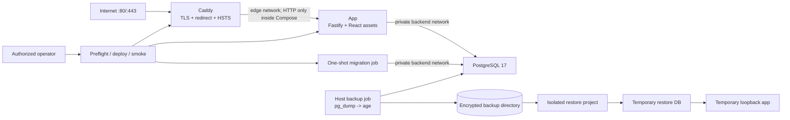
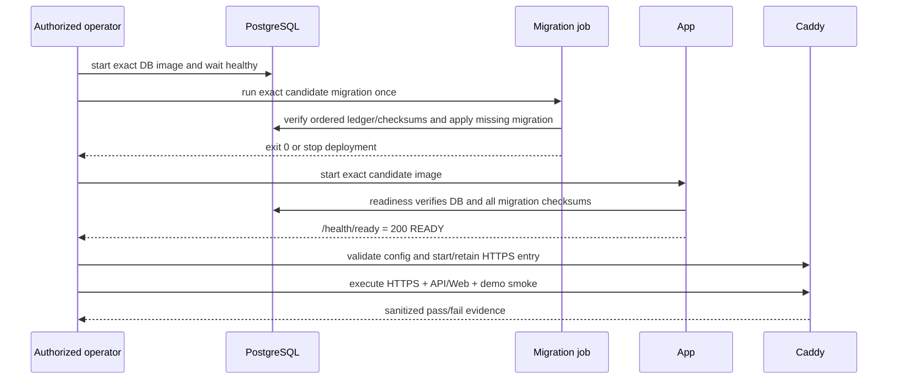
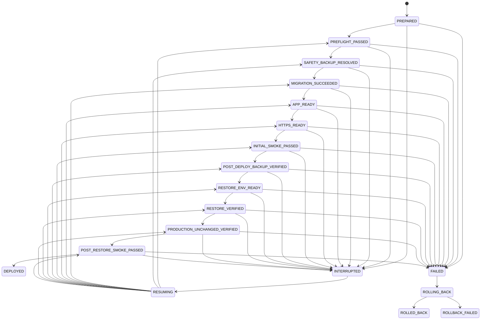
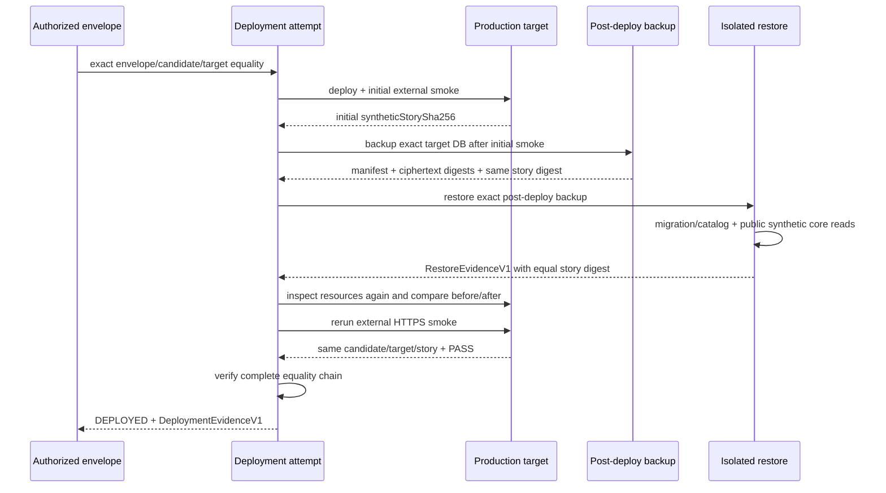

# Technical Design: LP-05 部署与发布就绪

- Status: Proposed
- FeatureId: `lp-05-deployment-release-8c3f1a6d5e20`
- Branch: `codex/lp-05-deployment-release`
- Authoritative baseline: `46e021d261fd8a663c83430a551f5674365ccf14`
- Requirements authority: `d273a79212723513d8ac7150fb141949f6b19472`
- Requirements: [requirements.md](./requirements.md)
- Current phase: F2 — Deployment contract and feature design
- Cycle 1 plan review: `TPR-001`–`TPR-003` from result
  `fc791d2a6b5e86b80bd655e5f87878be7a8be568da171fe56f055e6ad0287464`; closed in this
  revision by §§3.2, 5–7, 12 and the revised Implementation Plan before Cycle 2 re-review

## 1. Scope And Delivery Boundary

LP-05 把 LP-01 至 LP-04 已验收的 Node.js/TypeScript 模块化单体、React SPA、PostgreSQL
17 和合成演示打包成单服务器发布候选，并提供 HTTPS、迁移、备份、隔离恢复、smoke、凭据
轮换、回滚和运维证据。它不新增业务模型、API、数据库迁移、Skill 语义或 Web 旅程。

交付明确分成两个权限阶段：

1. **发布就绪实现阶段**：在本仓库实现并验证生产镜像、Compose/Caddy、运维脚本、隔离测试和
   文档；正常走技术计划审查、GoalRun、代码审查和外部合并。此阶段不连接生产服务器，不修改
   DNS，不使用生产秘密，也不对公网发布。
2. **外部部署与验收阶段**：代码合并后，等待用户提供精确服务器/域名/平台/备份位置/秘密交付
   方式和合成数据公开许可，并对精确 merge commit、候选摘要和目标给出独立显式授权。Main 先做
   只读预检，再按本设计执行最小变更并提交脱敏证据。没有这份授权时，功能保持
   `RELEASE_AWAITING_AUTHORIZATION`，不得声称 REQ-026/AC-019 通过。

### 1.1 Goals

- 从精确 Git 提交生成不挂载源码、可识别、可离线传输且不使用 `latest` 的应用 OCI 候选。
- 只暴露 80/443；应用与数据库不发布宿主端口，数据库仅在私有网络可达。
- 显式执行 `backup → migrate → app ready → HTTPS smoke → demo smoke`，失败即停止。
- 每日生成加密 PostgreSQL custom-format 备份并保留最近 7 份，至少完成一次隔离恢复证明。
- 保持 LP-01 至 LP-04 的 API、幂等、人类确认、安全 cookie、同源 Web 和合成演示契约。
- 产生绑定源提交、镜像 ID、目标、迁移、备份/恢复和 smoke 的脱敏证据。

### 1.2 Non-goals

- 不建设 Kubernetes、高可用、多区域、零停机、自动扩缩、企业监控或通用 CI/CD 平台。
- 不自动获取服务器、SSH、DNS、证书、备份或长期秘密权限。
- 不在本特性下创建 tag、GitHub Release、包、镜像仓库发布或外部 Skill 市场发布。
- 不自动 down migration，不自动恢复生产数据库，不清理业务历史来制造回滚成功。
- 不把公开读取重新描述为登录/鉴权，也不向 AI Skill 暴露 human-control 凭据。

## 2. Architecture And Ownership

| Component | Planned location | Owns | Must not own |
| --- | --- | --- | --- |
| App image | `deploy/Containerfile` | Node runtime, compiled packages/API, built Web, migrations, version metadata | Secrets, source mounts, production data |
| Secret-aware entrypoint | `deploy/runtime/entrypoint.mjs` | Read bounded Compose secret files, build runtime env, log safe release ID, exec one process | Printing secret values or accepting secret CLI args |
| Production Compose | `deploy/compose.production.yaml` | Service/network/volume/health/restart/resource boundary | Target-specific secrets or DNS mutations |
| Caddy config | `deploy/Caddyfile` | HTTP→HTTPS, public TLS, HSTS, proxying, dynamic no-store policy | Business authorization, body-schema validation, dynamic response cache |
| Candidate tooling | `scripts/lp05/candidate/**` | Build/inspect/export candidate and emit manifest | Registry publication or implied deployment success |
| Deployment tooling | `scripts/lp05/deploy/**` | Preflight, ordered transitions, rollback selection, evidence | SSH/DNS credential acquisition or unbounded retries |
| Backup/restore tooling | `scripts/lp05/database/**` | Encrypted stream backup, retention, isolated restore proof | Production reset/drop/automatic restore |
| Smoke tooling | `scripts/lp05/smoke/**` | HTTPS, headers, health, public API/Web, demo and credential rotation checks | Direct DB mutation as acceptance substitute |
| Versioned runbook | `docs/operations/lp05.md` | Human prerequisites, commands, failure/recovery and limits | Secret values or target-specific credentials |
| Lifecycle | installed `engineering-main` workflow | Requirements/plan/code/merge/acceptance/closure authority | Server configuration or business state |

Existing ownership remains unchanged: Fastify owns API limits and response contracts; PostgreSQL owns business
state; migration ledgers own schema readiness; Caddy is transport only; deployment evidence does not become a second
business-state authority.

## 3. Candidate And Image Contract

### 3.1 Immutable Build

`deploy/Containerfile` is multi-stage and uses reviewed base-image references pinned by version and digest in
`deploy/images.lock.json`. The builder runs `npm ci`, `npm run build` and production pruning. The runtime contains
only production dependencies, package manifests, compiled `dist` trees, `apps/web/dist`, the three immutable SQL
migrations, version metadata and the entrypoint. It runs as numeric non-root UID/GID, has no package manager cache,
Git metadata, test database, local demo journal or secret.

The candidate command builds for an explicit `linux/amd64` or `linux/arm64` platform, never supplies a secret build
argument, exports an OCI archive below ignored `.lp05-release/`, and verifies the loaded image ID. A local tag is a
human-readable alias only; image ID plus archive SHA-256 is authority. Runtime Compose refuses `latest` and refuses a
candidate whose manifest/source/platform/image ID does not match.

### 3.2 `ReleaseCandidateManifestV1`

The generator emits canonical JSON, rejects unknown fields and writes an immutable mode-0644 manifest beside the
ignored archive. Object keys use Unicode-code-point lexical order, arrays preserve the order defined below, strings
are NFC, integers use base-10 JSON and the UTF-8 output has no insignificant whitespace or trailing newline
(`canonical-json-v1`). `manifestSha256` is SHA-256 of the canonical object with that field omitted. A verifier
recomputes it before reading any nested authority.

| Field | Type | Required/default | Owner/source | Validation | Persistence/compatibility |
| --- | --- | --- | --- | --- | --- |
| `schemaVersion` | literal `"1.0"` | Required | candidate generator | Exact match | Immutable; a future format is a new version, never in-place migration |
| `manifestSha256` | lowercase SHA-256 | Required/derived | canonical serializer | Recomputed over all other fields | Immutable cross-record identity |
| `releaseId` | safe string | Required/derived | source commit + platform | `lp05-<12 hex>-<amd64|arm64>` | Human-safe candidate name; cannot be caller-overridden |
| `sourceCommit` | 40 lowercase hex | Required | clean checked-out Git HEAD or authoritative post-merge base | Pre-merge candidates equal the reviewed feature head; production candidates equal the authoritative merge commit and that commit must be reachable from the configured base ref | Git authority; a squash merge commit is never required to exist in feature-branch history |
| `sourceTree` | 40 lowercase hex | Required | `HEAD^{tree}` | Re-read from `sourceCommit` | Detects rewritten content |
| `createdAt` | RFC3339 UTC | Required | candidate generator clock | UTC, no fractional precision beyond milliseconds | Evidence time only |
| `platform` | enum | Required | operator/CI explicit input | `linux/amd64` or `linux/arm64` | Must equal later authorization target |
| `applicationVersion` | string | Required/derived | root package version + commit | `0.1.0+<12 hex>` for v0.1 | Safe runtime label |
| `imageName` | safe OCI local name | Required/derived | generator | Exact `idea-trace-validation:<releaseId>`; never `latest` | Alias only; `imageId` is authority |
| `imageId` | `sha256:<64 hex>` | Required | container-engine inspect | Loaded/built image ID and expected labels/files match | Exact runtime identity |
| `ociArchive` | `CandidateArchiveV1` | Required | exported regular file | Closed shape below | Retained with manifest until explicit exact-ID cleanup |
| `baseImages` | array of `CandidateBaseImageV1` | Required/exactly 3 | committed image lock | Unique ordered roles `builder`, `database`, `proxy` | Supply-chain trace; no floating ref |
| `migrationCatalog` | ordered array of `{id, sha256, ledger}` | Required/exactly current catalog | repository migration catalog | Safe IDs, lowercase digests, ledger `legacy|feature`, order equals runtime catalog | Frozen readiness compatibility |
| `webAssetsSha256` | lowercase SHA-256 | Required | canonical built Web tree | Recomputed from sorted relative paths+bytes | Build-content trace |
| `openapiSha256` | lowercase SHA-256 | Required | current frozen OpenAPI | Exact LP-03 baseline digest | Contract trace |
| `verification` | `CandidateVerificationV1` | Required | exact-head gate | Closed shape below and `PASS` | No raw log; log digest only |
| `syntheticDataOnly` | literal `true` | Required | confirmed requirements | Exact match | Public-demo safety declaration |

`CandidateArchiveV1`:

| Field | Type | Required/default | Owner/source | Validation | Persistence/compatibility |
| --- | --- | --- | --- | --- | --- |
| `basename` | safe filename | Required | generator | `<releaseId>.oci.tar`; no slash/dot-segment | Resolved only under exact candidate directory |
| `sizeBytes` | integer | Required | filesystem stat | `1..10 GiB` bound | Recomputed before transfer/load |
| `sha256` | lowercase SHA-256 | Required | exact archive bytes | Recomputed before every consume | Transfer integrity |
| `mediaType` | literal `application/vnd.oci.image.layout.v1+tar` | Required | generator | Exact match | v1 accepts no Docker-save ambiguity |

`CandidateBaseImageV1`:

| Field | Type | Required/default | Owner/source | Validation | Persistence/compatibility |
| --- | --- | --- | --- | --- | --- |
| `role` | enum | Required | image lock | `builder`, `database`, `proxy` | Array order is this enum order |
| `repository` | string | Required | image lock | Approved registry/repository allowlist | No credentials/userinfo |
| `versionTag` | string | Required | image lock | Exact non-`latest` version | Human trace only |
| `digest` | `sha256:<64 hex>` | Required | authoritative registry resolution | Manifest exists for candidate platform | Immutable pull authority |
| `platform` | platform enum | Required | registry manifest | Equals candidate platform | No implicit host-platform selection |

`CandidateVerificationV1`:

| Field | Type | Required/default | Owner/source | Validation | Persistence/compatibility |
| --- | --- | --- | --- | --- | --- |
| `command` | literal `npm run verify` | Required | repository gate | Exact match | v1 gate identity |
| `commit` | 40 lowercase hex | Required | Git HEAD at gate start/end | Equals candidate `sourceCommit`; tree remains clean | Prevents stale proof |
| `status` | literal `PASS` | Required | command exit | Exit 0 and every sub-gate present | No inferred/partial PASS |
| `completedAt` | RFC3339 UTC | Required | verifier clock | At/after candidate build start | Evidence time |
| `logSha256` | lowercase SHA-256 | Required | sanitized bounded gate log | Exact secret scan PASS; raw log remains ignored | Digest only in manifest |

The manifest contains no host, username, token, cookie, database URL, request body or business private text. It is
retained with final deployment evidence until separate explicit archival/deletion authority; failed or superseded
candidates remain distinguishable and are never silently rewritten to v1.

## 4. Production Topology And Configuration

### 4.1 Compose Services

| Service | Image/process | Network and exposure | Health/start rule | Runtime hardening |
| --- | --- | --- | --- | --- |
| `postgres` | pinned `postgres:17.10-alpine@sha256:…` | `backend` only; no `ports` | `pg_isready`; persistent named/bind volume | Official non-root process, read-only secrets, bounded restart |
| `migrate` | exact app image; `node packages/db/dist/cli/migrate.js` | `backend` only | Starts after DB healthy; must exit 0 | non-root, read-only rootfs, no public network, no restart |
| `app` | exact candidate image | `backend` + `edge`; no `ports` | Starts after migration success; `/health/ready` must pass | non-root, read-only rootfs, `tmpfs /tmp`, cap-drop all, no-new-privileges |
| `caddy` | pinned Caddy image | `edge`; host 80/443 only | Starts after app healthy; validates config before replacement | non-root/high internal ports, limited writable certificate volumes, cap-drop all |

`backend` is Compose-internal. `edge` contains only Caddy and app. PostgreSQL, app health port, backup location,
secret files and admin operations are never published. Named services are reached by Compose DNS; no host database
port is accepted by production config validation.

### 4.2 Startup Ordering

Compose dependency conditions are convenience gates; the deployment controller independently polls with bounded
deadlines and records results. Restart policy never converts a failed migration into success and never retries a
one-shot migration indefinitely.

### 4.3 Secret And Non-secret Inputs

Production uses an operator-owned directory outside Git and outside the Web root. Examples contain invalid
placeholders only.

| Input | Kind | Consumer | Rule |
| --- | --- | --- | --- |
| `DEPLOY_DOMAIN`, `ACME_EMAIL` | non-secret config | Caddy | Validated hostname/email; no URL credentials |
| `RELEASE_ID`, `SOURCE_COMMIT`, `APP_IMAGE_ID` | non-secret config | validator/Compose | Must match candidate manifest |
| DB name/user, deploy/backup roots | non-secret config | Compose/scripts | Safe bounded values and absolute approved roots |
| PostgreSQL password | Compose secret file | PostgreSQL and app entrypoint | At least 32 random bytes; never interpolated into a logged command |
| AI bearer | Compose secret file | app entrypoint | Distinct, bounded, never available to Caddy/Skill |
| human-control token | Compose secret file | app entrypoint | Base64url 32 bytes, distinct from AI bearer |
| age recipient | public config file | backup | Public key/fingerprint may be logged |
| age identity | external restricted file | restore only | Never mounted into normal app/DB/Caddy |
| TLS private material | Caddy data volume | Caddy only | Never copied into repo or evidence |

`entrypoint.mjs` reads only declared regular files below `/run/secrets`, rejects symlinks/oversize/empty values,
constructs `DATABASE_URL` in memory, exports runtime variables and starts Node without putting secrets in process
arguments. It logs only `releaseId`, `sourceCommit`, Node version and platform. Tests scan image layers, history,
Compose output and logs against exact in-memory fixture secrets.

### 4.4 HTTPS, Headers And Request Semantics

- Caddy obtains a trusted certificate only after authorized DNS/80/443 preflight; plain HTTP always redirects to
  the same HTTPS host.
- Caddy adds HSTS and preserves Fastify Helmet CSP, `X-Content-Type-Options`, frame and referrer protections.
- Dynamic `/api/**`, `/health/**` and `/openapi.json` responses receive `Cache-Control: no-store`; hashed Web assets
  retain the app's immutable cache behavior and SPA shells retain `no-cache`.
- Caddy passes method, path, query, body, `Authorization`, `Idempotency-Key`, cookie and standard forwarded metadata
  unchanged. It never logs auth/cookie header values.
- Fastify remains the only request-size/schema authority. The proxy must not decompress, rewrite, lower or bypass the
  existing 64 KiB ordinary and 256 KiB report behavior. Boundary smoke asserts the existing API statuses/envelopes.

## 5. Durable Authority Records And Deployment State

### 5.1 Common Record Protocol

All LP-05 authority records reject unknown fields and use `canonical-json-v1` from §3.2. A `*Sha256` identity is
computed over canonical UTF-8 bytes with only that record's own digest field omitted. Records never contain raw
authorization text, secret paths with usernames, secret values, full database URLs, cookies, response bodies or raw
logs.

Immutable records (`DeploymentAuthorizationEnvelopeV1`, `BackupManifestV1`, `RestoreEvidenceV1`,
`DeploymentEvidenceV1`) are created once with mode 0600, fsynced and atomically renamed. They are retained through
feature closure and afterward until separate explicit archival/deletion authorization. A future incompatible schema
uses a new version and new record ID; no v1 record is silently migrated or rewritten.

`DeploymentAttemptV1` is an append-only transition journal plus a current-state projection. Every update appends one
`AttemptTransitionV1`, recomputes `attemptRecordSha256`, fsyncs and atomically replaces the projection. Existing
transition entries are byte-equal on every rewrite. Consumers recompute the journal chain before trusting
`currentState`.

### 5.2 `DeploymentAuthorizationEnvelopeV1`

Main first presents the exact `proposal` object and its `proposalSha256`. The user authorization must identify that
digest or repeat every candidate/target/operation binding without conflict. Main then creates this immutable
envelope; requirements confirmation, plan/code approval and merge cannot populate `authorization`.

| Field | Type | Required/default | Owner/source | Validation | Persistence/compatibility |
| --- | --- | --- | --- | --- | --- |
| `schemaVersion` | literal `"1.0"` | Required | controller | Exact match | Immutable v1 |
| `envelopeId` | `auth_<32 lowercase hex>` | Required/derived | serializer | Prefix + first 32 hex of `envelopeSha256` | Stable human-safe ID |
| `envelopeSha256` | lowercase SHA-256 | Required/derived | serializer | Recomputed over canonical fields with both digest and derived ID omitted | Cross-record authorization identity |
| `proposal` | `DeploymentProposalV1` | Required | Main exact proposal | Closed shape below | Immutable authorized operations |
| `proposalSha256` | lowercase SHA-256 | Required | canonical proposal bytes | Recomputed and equals user-referenced digest | Prevents prose drift |
| `authorization` | `DeploymentAuthorityV1` | Required | explicit user response | Closed shape below; source task is current Main | Evidence binding only; no raw response |
| `createdAt` | RFC3339 UTC | Required | Main clock | At/after authorization time | Evidence time |

`DeploymentProposalV1`:

| Field | Type | Required/default | Owner/source | Validation | Persistence/compatibility |
| --- | --- | --- | --- | --- | --- |
| `workflowId` / `featureId` | exact IDs | Required | durable Lifecycle | Equal current LP-05 workflow/feature | Prevents cross-feature reuse |
| `mergeCommitSha` | 40 lowercase hex | Required | authoritative merged Review proof | Exact reviewed/merged LP-05 commit | Exact delivery authority |
| `candidate` | `{manifestSha256, releaseId, sourceCommit, sourceTree, imageId, archiveSha256, platform}` | Required | verified candidate manifest | Every value byte-equal to candidate; production `sourceCommit` equals `mergeCommitSha` | No post-merge source drift or partial substitution |
| `target` | `DeploymentTargetV1` | Required | read-only target preflight | Closed shape below | Exact host/domain authority |
| `backupPolicy` | `BackupPolicyV1` | Required | user + requirements | Closed shape below | Exact backup root/recipient/retention |
| `operations` | sorted unique operation enum array | Required | Main proposal + user | Subset of `LOAD_CANDIDATE`, `START_DATABASE`, `SAFETY_BACKUP`, `MIGRATE`, `START_APP`, `START_HTTPS`, `INITIAL_SMOKE`, `POST_DEPLOY_BACKUP`, `ISOLATED_RESTORE`, `POST_RESTORE_SMOKE`, optional `ROTATE_CREDENTIALS`, `APP_ROLLBACK`; all except optional rotation required | No implied DNS/DB restore/publication |
| `excludedOperations` | sorted enum array | Required | confirmed scope | Must include `DNS_CHANGE` unless separately authorized, `PRODUCTION_DB_RESTORE`, `TAG`, `GITHUB_RELEASE`, `PACKAGE_PUBLISH`, `REGISTRY_PUBLISH`, `SKILL_PUBLISH` | Fail closed on ambiguity |
| `syntheticPublicReadConsent` | literal `true` | Required | explicit user consent | Exact match | Real-data deployment prohibited |
| `previousRelease` | `ReleaseIdentityV1` or null | Required/default null | target preflight | Null only for proven fresh target | Rollback binding |
| `toolchain` | `HostToolchainV1` | Required | target preflight | Closed compatibility shape below | Prevents host-version guessing |
| `proposedAt` | RFC3339 UTC | Required | Main clock | Before authorization | Proposal evidence time |

`DeploymentTargetV1`:

| Field | Type | Required/default | Owner/source | Validation | Persistence/compatibility |
| --- | --- | --- | --- | --- | --- |
| `targetId` | `target_<32 hex>` | Required/derived | host fingerprint+domain+deploy root | Recomputed canonical digest prefix | Used by every backup/restore/smoke record |
| `hostFingerprintSha256` | lowercase SHA-256 | Required | read-only SSH/host-key preflight or local-console host identity | No raw key/login secret | A changed host requires new authorization |
| `domain` | DNS hostname | Required | user + DNS read | Lowercase IDNA ASCII, no wildcard/userinfo/path | Exact public origin host |
| `expectedIps` | sorted unique IP array | Required | authoritative DNS read | 1–8 public IPv4/IPv6; no private/loopback | Re-read before mutation/smoke |
| `platform` | platform enum | Required | host runtime | Equals candidate platform | No emulation as production proof |
| `os` | `{id, versionId}` | Required | `/etc/os-release` read | Supported allowlist/version | Sanitized host compatibility |
| `deployRoot` | absolute path | Required | user + preflight | Not `/`, home, repo, Web or backup root; resolved no symlink escape | Only its digest/approved value enters record |
| `composeProject` | safe string | Required/derived | controller | Exact `idea-validation-prod` unless user authorizes another safe name | Production label identity |

`BackupPolicyV1`:

| Field | Type | Required/default | Owner/source | Validation | Persistence/compatibility |
| --- | --- | --- | --- | --- | --- |
| `backupRoot` | absolute path | Required | user + preflight | Resolved, no symlink escape; distinct from root/home/repo/Web/deploy root | Exact authorized root |
| `retentionCount` / `schedule` | literal `7` / literal `daily` | Required | requirements | Exact | v1 policy |
| `ageRecipientFingerprint` | lowercase SHA-256 | Required | public age recipient | Recomputed; private identity absent | Encryption binding |
| `minimumFreeBytes` | positive integer | Required | user/preflight | At least twice expected backup size and configured floor | Preflight capacity gate |
| `responsibleOperator` | bounded non-secret label | Required | user | 1–120 chars, no credential/path | Operations ownership only |

`HostToolchainV1`:

| Field | Type | Required/default | Owner/source | Validation | Persistence/compatibility |
| --- | --- | --- | --- | --- | --- |
| `dockerEngineVersion` | semver | Required | `docker version` read | `>=27.5.0 <30.0.0` | Exact attempt compatibility |
| `composeVersion` | semver | Required | `docker compose version` read | `>=2.32.0 <3.0.0`; legacy standalone rejected | Exact Compose behavior |
| `ageVersion` | semver | Required | `age --version` read | `>=1.2.0 <2.0.0` | Backup-format compatibility |
| `dockerInstallationSource` | literal `OFFICIAL_DOCKER_PACKAGE` | Required | package-manager/runtime read | Exact | No unknown engine build |
| `ageInstallationSource` | enum | Required | package metadata/operator checksum proof | `OS_VENDOR_PACKAGE` or `OFFICIAL_RELEASE_CHECKSUM_VERIFIED` | Auditable install source |
| `observedAt` | RFC3339 UTC | Required | preflight clock | Same proposal/preflight window | Stale tool facts rejected |

Version parse failure, unsupported source/range, non-Linux host, missing Compose secrets/dependency capability or
platform mismatch fails preflight with `TOOLCHAIN_UNSUPPORTED`/`COMPOSE_CAPABILITY_MISSING` before mutation.

`DeploymentAuthorityV1`:

| Field | Type | Required/default | Owner/source | Validation | Persistence/compatibility |
| --- | --- | --- | --- | --- | --- |
| `authorizedBy` | bounded string | Required | explicit user response | 1–120 chars; no credential | Human trace label |
| `sourceThreadId` | task/thread ID | Required | Codex task routing | Exact current Main task | No cross-task authority |
| `authorizedAt` | RFC3339 UTC | Required | message/runtime clock | At/after proposal | Start window origin |
| `expiresAt` | RFC3339 UTC | Required | proposal + user authority | After authorization, at most 24 hours | Expired envelope cannot start/resume |
| `authorizationEvidenceSha256` | lowercase SHA-256 | Required | exact raw user response bytes | Recomputed by Main transport; raw response not persisted here | Evidence binding |

The attempt must start before expiry. One envelope may bind exactly one `attemptId`; terminal failure or target/
candidate/operation change requires a new proposal and authorization. Interrupted work may resume only under §5.4.

### 5.3 `DeploymentAttemptV1` And Nested Shapes

| Field | Type | Required/default | Owner/source | Validation | Persistence/compatibility |
| --- | --- | --- | --- | --- | --- |
| `schemaVersion` | literal `"1.0"` | Required | controller | Exact match | Append-only v1 journal |
| `attemptId` | `deploy_<26 safe chars>` | Required/generated once | controller | Unique under target state root | One envelope/one attempt |
| `attemptRecordSha256` | lowercase SHA-256 | Required/derived | serializer | Recomputed over current projection excluding itself | Detects rewrite/corruption |
| `envelopeId` / `envelopeSha256` | ID/digest | Required | exact authorization envelope | Byte-equal and envelope unexpired at start | Authorization chain root |
| `candidate` | `CandidateIdentityV1` | Required | envelope+candidate manifest | All values equal both records | Immutable during attempt |
| `target` | `DeploymentTargetV1` | Required | envelope | Deep byte equality | Immutable during attempt |
| `currentState` | state enum | Required/default `PREPARED` | transition projection | Equals last transition `to` | Never caller-written |
| `startedAt` / `updatedAt` / `finishedAt` | RFC3339/null | Required; `finishedAt` default null | controller clock | Ordered, attempt maximum 4 hours excluding one interruption resume window | Audit time |
| `resume` | `AttemptResumeV1` | Required/default `{count:0,...null}` | controller/operator | Max count 1; closed shape below | Bounded interrupted recovery |
| `previousRelease` | `ReleaseIdentityV1` or null | Required | envelope + target read | Byte-equal; null only with fresh-target proof | App rollback authority |
| `sourceDatabase` | `DatabaseIdentityV1` or null | Required/default null; may remain null through fresh-target `PREFLIGHT_PASSED`, then becomes non-null when the exact production DB is created and independently inspected before `SAFETY_BACKUP_RESOLVED`; upgrade paths bind it during preflight | PostgreSQL/Compose read | Closed shape below; never caller-supplied | Backup source identity |
| `safetyBackup` | `BackupRefV1`, `FreshTargetProofV1` or null | Required/default null; non-null at `SAFETY_BACKUP_RESOLVED` | backup/preflight | Upgrade requires backup; fresh requires no prior volume/release/data | Pre-migration protection |
| `migration` | `MigrationEvidenceV1` or null | Default null | migration/readiness reads | Closed shape below | Must match candidate catalog |
| `initialSmoke` | `SmokeEvidenceRefV1` or null | Default null | external smoke engine | Mode `EXTERNAL_INITIAL`; exact target/candidate | Defines expected synthetic story digest |
| `postDeployBackup` | `BackupRefV1` or null | Default null | backup command | Purpose `POST_DEPLOY_RECOVERABILITY`; exact attempt/target/source DB | AC 10/16 backup authority |
| `restoreEvidence` | `RestoreEvidenceRefV1` or null | Default null | isolated restore verifier | Exact post-deploy backup and attempt | AC 10/16 restore authority |
| `productionUnchangedSha256` | digest or null | Default null; required at `PRODUCTION_UNCHANGED_VERIFIED` | independent before/after inspect | Equal the restore ref and transition evidence | Production mutation guard |
| `postRestoreSmoke` | `SmokeEvidenceRefV1` or null | Default null | external smoke engine | Mode `EXTERNAL_POST_RESTORE`; story digest equals initial/restore | Final public re-smoke |
| `rollback` | `RollbackEvidenceV1` | Required/default `NOT_STARTED` | controller | Closed shape below; no DB restore | Failure recovery projection |
| `transitionLog` | ordered `AttemptTransitionV1[]` | Required/default initial transition | controller | Sequence starts 0, chained hashes, legal graph only, max 64 | Immutable history |
| `knownLimitations` | unique bounded strings | Default `[]` | controller/operator | Max 20 × 240 chars; cannot excuse missing mandatory proof | Final truth record |

Nested attempt contracts reject unknown fields:

| Object.field(s) | Type | Required/default | Owner/source | Validation | Persistence/compatibility |
| --- | --- | --- | --- | --- | --- |
| `CandidateIdentityV1.manifestSha256` / `archiveSha256` | lowercase digests | Required | candidate manifest | Deep-equal verified manifest/envelope | Immutable refs |
| `.releaseId` / `.sourceCommit` / `.sourceTree` / `.imageId` / `.platform` | candidate identity scalars | Required | candidate manifest | Exact §3.2 validation; production source equals merge | Immutable refs |
| `ReleaseIdentityV1.releaseId` / `.sourceCommit` / `.imageId` | identity scalars | Required | host release marker + container inspect | All observed independently; no default | Immutable observation |
| `.configSha256` | lowercase digest | Required | closed sanitized deployment config projection | Recomputed over `DeploymentConfig` excluding secret values | Rollback/config authority |

For an upgrade, the protected controller request also carries the closed non-secret Compose environment projection
whose canonical digest is `.configSha256`; fresh attempts require this projection to be null. The rollback adapter
revalidates that digest and the previous release/image/target, recreates only `app` and `caddy`, inspects the running
image and then performs readiness/core reads. Secret values are not part of the projection.
| `DatabaseIdentityV1.targetId` / `.project` | target/safe string | Required | attempt/Compose inspect | Equal authorized target/project | Immutable observation per phase |
| `.containerId` / `.volumeName` / `.volumeMountId` | safe runtime identities | Required | engine inspect | Existing exact labelled production resources | No caller values |
| `.systemIdentifier` / `.databaseName` / `.postgresVersion` | numeric string/safe strings | Required | `pg_control_system()`/server read | Expected DB/version; no URL | Exact source DB authority |
| `.databaseInstanceSha256` | lowercase digest | Required/derived | serializer | Covers target, system, DB name, volume mount | Cross-record DB identity |
| `MigrationEvidenceV1.catalogSha256` / `.appliedLedgerSha256` | lowercase digests | Required | candidate/runtime ledgers | Recomputed | Immutable phase evidence |
| `.entries` | ordered `{id,sha256,ledger}[]` | Required | expected+applied catalog | Exactly three; expected/applied byte-equal | v1 catalog order |
| `.status` / `.verifiedAt` | literal `PASS` / RFC3339 | Required | readiness verifier | PASS only after equality | Immutable phase evidence |
| `SmokeEvidenceRefV1.smokeId` / `.smokeSha256` | ID/digest | Required | accepted smoke record | Record exists and digest recomputes | Immutable ref |
| `.mode` / `.targetId` / `.candidateManifestSha256` / `.attemptId` | enums/refs | Required | smoke+attempt | Deep-equal expected phase | No mode coercion |
| `.observedAt` / `.origin` / `.syntheticStorySha256` / `.resourceIdsSha256` / `.assertionSetSha256` / `.status` | time/origin/digests/literal PASS | Required | smoke record | Closed §7.1 rules | Immutable ref projection |
| `BackupRefV1.backupId` / `.backupManifestSha256` / `.ciphertextSha256` | ID/digests | Required | backup manifest/file | Exact manifest/file equality | Immutable ref |
| `.purpose` / `.targetId` / `.databaseInstanceSha256` / `.attemptId` / `.candidateManifestSha256` | enum/refs | Required | backup manifest | Deep-equal expected phase/source | No cross-purpose/attempt reuse |
| `FreshTargetProofV1.kind` / `.targetId` / `.verifiedAt` | literal `FRESH_TARGET` / ID/time | Required | preflight | Exact target/current time | Immutable safety decision |
| `.assertions` | exact three PASS IDs | Required | host/engine/DB reads | No prior release marker, production volume label or app data; any contrary fact rejects proof | Cannot replace upgrade backup |
| `AttemptResumeV1.count` | integer | Required/default `0` | controller | `0..1` | Projection/history traced |
| `.interruptedState` / `.interruptedAt` / `.reasonCode` / `.lastTransitionSha256` / `.resumedAt` | nullable state/time/code/digest/time | Required/default nulls | controller/external reads | All null at count 0; all non-null and consistent at count 1 | Process interruption only |
| `RollbackEvidenceV1.status` / `.reasonCode` | enum/code | Required/default `NOT_STARTED`/null | controller | Legal status graph | Projection/history traced |
| `.previousRelease` / `.readinessSha256` / `.smokeSha256` / `.startedAt` / `.finishedAt` | nullable identity/digests/times | Required/default nulls | inspect/rollback verifier | State-dependent non-null rules; `NOT_APPLICABLE` only fresh+ingress disabled | No DB restore field |
| `AttemptTransitionV1.sequence` / `.from` / `.to` | integer / nullable state / state | Required | controller | Sequence 0 is exactly `from:null -> PREPARED`; later entries increment 1 and use only legal §5.4 edges | Append-only max 64 |
| `.occurredAt` / `.reasonCode` / `.evidenceSha256` / `.previousTransitionSha256` / `.transitionSha256` | time/code/digests | Required; previous null only sequence 0 | controller/oracle | Hash-chain recomputation; evidence mandatory after PREPARED | Immutable journal entry |

### 5.4 Complete External Acceptance State Machine

Pre-migration safety and post-deploy recoverability are distinct. `DEPLOYED` is unreachable until the exact
post-deploy backup has been restored and the real public service has been re-smoked afterward.

Every oracle failure is terminal `FAILED`; it is not retried under the same envelope. A process/transport
interruption may enter `INTERRUPTED` and resume once, within two hours and before the four-hour attempt limit, only
if the envelope is unexpired at resume and every completed external fact still deep-equals its evidence. The
controller skips proven idempotent steps, re-runs read-only oracles, and never blindly repeats migration/backup.
Otherwise a new proposal/authorization/attempt is required.

The production controller request contains no future evidence bundle and no caller-authored phase result. Each
phase is an active operation that writes one controller-owned, closed `ActivePhaseOutputV1` under the exact
attempt/phase path before the journal can advance. Existing outputs are accepted only after their phase-specific
reconciliation re-observes the live resource and canonical bytes still match. Authorization, candidate, target and
deadlines are re-read before each append. Crash recovery uses a separate exclusive recovery lease before removing a
dead owner's stale lock, then explicitly appends `INTERRUPTED -> RESUMING`; an ordinary second invocation cannot
continue a forward state. A competing live owner or a lock acquired during recovery is never removed.

An upgrade must have a verified `PRE_MIGRATION_SAFETY` backup. A fresh install may use `FreshTargetProofV1` only
before any production volume/release marker/data exists. After initial external smoke has created or verified the
LP-04 synthetic story, every attempt creates a new `POST_DEPLOY_RECOVERABILITY` backup from that exact production
DB. A pre-migration/fresh/old/local/other-target backup can never satisfy the post-deploy state.

If any phase after app replacement fails, public ingress is disabled before recovery. Upgrade rollback restores the
previous exact app/config and re-runs readiness/core reads; fresh install keeps DB/backup evidence but leaves Caddy/
app ingress stopped. A restore failure never invokes production DB restore.

## 6. Backup And Isolated Restore Contracts

### 6.1 `BackupManifestV1`

`pg_dump --format=custom` streams directly through `age` to an atomic encrypted file. Plaintext is never written to
disk. The immutable manifest is accepted only after ciphertext digest and bounded decrypted `pg_restore --list`
verification.

| Field | Type | Required/default | Owner/source | Validation | Persistence/compatibility |
| --- | --- | --- | --- | --- | --- |
| `schemaVersion` | literal `"1.0"` | Required | backup command | Exact | Immutable v1 |
| `backupId` | `backup_<26 safe chars>` | Required/generated | backup command | Unique under backup root | Manifest/ciphertext pair identity |
| `backupManifestSha256` | lowercase SHA-256 | Required/derived | serializer | Recomputed excluding self | Cross-record identity |
| `purpose` | enum | Required | attempt phase | `PRE_MIGRATION_SAFETY` or `POST_DEPLOY_RECOVERABILITY` | Purpose cannot be relabelled |
| `envelopeId` / `attemptId` | exact IDs | Required | attempt | Equal active authorization/attempt | No cross-attempt reuse |
| `targetId` | exact target ID | Required | attempt target | Deep equality | No local/wrong-target proof |
| `sourceDatabase` | `DatabaseIdentityV1` | Required | live production DB read | Deep-equals attempt DB identity at backup time | Exact source instance |
| `sourceRelease` | `ReleaseIdentityV1` | Required | live release marker/container | Post-deploy purpose must equal candidate; safety purpose equals prior release or fresh candidate DB bootstrap state | Version binding |
| `candidateManifestSha256` | digest | Required | attempt | Equal attempt candidate | Candidate binding |
| `migrationCatalogSha256` | digest | Required | live readiness/catalog | Equal candidate migration digest for post-deploy backup | Schema binding |
| `syntheticStorySha256` | digest or null | Required/default null | initial external smoke | Required/equal initial smoke for post-deploy; null for safety backup | Proves demo data timing |
| `createdAt` | RFC3339 UTC | Required | backup clock | Within active attempt | Freshness |
| `ciphertext` | `{basename,sizeBytes,sha256}` | Required | atomic encrypted file | Safe basename, positive bounded size, recomputed digest | Retained encrypted pair |
| `encryption` | `{algorithm,recipientFingerprint}` | Required | age command/policy | Algorithm literal `age-v1`; fingerprint equals envelope policy | No private key field |
| `tool` | `{pgDumpVersion,ageVersion,format}` | Required | observed binaries | Supported versions; format literal `custom` | Reproducibility |
| `verification` | `{status,verifiedAt,pgRestoreListSha256}` | Required | bounded decrypt/list oracle | Status literal `PASS`; digest non-empty canonical list | No data body in record |

Retention operates only on verified manifest/ciphertext pairs under the exact authorized root, keeps the newest
seven, and must retain every pair referenced by an active attempt or final `DeploymentEvidenceV1` even if older.
Symlink/root/workspace/Web path escape fails. A failed new backup never triggers retention.

### 6.2 `RestoreEvidenceV1`

| Field | Type | Required/default | Owner/source | Validation | Persistence/compatibility |
| --- | --- | --- | --- | --- | --- |
| `schemaVersion` | literal `"1.0"` | Required | restore verifier | Exact | Immutable v1 |
| `restoreId` | `restore_<26 safe chars>` | Required/generated | controller | Unique and bound to attempt | Evidence identity |
| `restoreEvidenceSha256` | lowercase SHA-256 | Required/derived | serializer | Recomputed excluding self | Final chain identity |
| `envelopeId` / `attemptId` / `targetId` | exact IDs | Required | attempt | Deep-equal active records | No stale/local/wrong-target proof |
| `candidateManifestSha256` | digest | Required | attempt | Equal candidate | Exact runtime |
| `backup` | `{backupId,backupManifestSha256,ciphertextSha256,purpose}` | Required | post-deploy backup | Purpose literal `POST_DEPLOY_RECOVERABILITY`; all values deep-equal `BackupManifestV1` | Exact backup consume |
| `sourceDatabaseInstanceSha256` | digest | Required | backup manifest | Equal backup source and attempt production DB | Source trace |
| `isolatedTarget` | `IsolatedRestoreTargetV1` | Required | restore controller | Closed shape below and distinct from production | Safety boundary |
| `startedAt` / `finishedAt` | RFC3339 UTC | Required | controller clock | Ordered and within attempt | Fresh proof |
| `migration` | `MigrationEvidenceV1` | Required | restored DB/app readiness | Equal candidate and production expected catalog | Schema proof |
| `restoredStory` | `{syntheticStorySha256,resourceIdsSha256,assertionSetSha256,status}` | Required | public loopback reads | Digests equal initial smoke/post-deploy backup; status `PASS` | Core read proof |
| `productionBefore` / `productionAfter` | `ProductionResourceIdentityV1` | Required | independent inspections | Canonical objects byte-equal | Proves production untouched |
| `cleanup` | `{status,completedAt,resourceLabelSha256}` | Required | restore controller | PASS only after exact labelled project removal; failure retains diagnostic state safely | No broad cleanup |
| `status` | literal `PASS` | Required | verifier | Every prior field/oracle PASS | No partial proof |

`IsolatedRestoreTargetV1` contains required generated Compose project prefixed `lp05-restore-`, exact container and
volume names, unique DB system identifier, volume/container label digests, loopback-only application `origin`,
descriptive `databaseHost`/`databasePort`, restore `databaseName` ending `_restore`, and target kind literal
`ISOLATED`. The restore command re-inspects the exact Compose project/container/volume labels and live
`pg_control_system()` identity, rejects any mismatch before starting `age` or `pg_restore`, and runs `pg_restore`
through `docker exec` in that exact inspected container. The host endpoint cannot select the mutation target. The
complete active production identity is also re-inspected before mutation and must match the authorized identity;
production and isolated project, DB system, volume/container, domain and published-port identities must differ.

`ProductionResourceIdentityV1` contains target ID, production Compose project, DB container/volume/system/database
identity, app container/image/config identity, Caddy container/config identity and current release marker digest. It
contains no status that can be hand-written; every value comes from an independent inspect/read. Before/after
canonical byte equality is required before `PRODUCTION_UNCHANGED_VERIFIED`.

### 6.3 Cross-record Equality Chain And Restore Flow

Fail-closed equality requirements:

1. envelope candidate = candidate manifest = attempt candidate = every smoke/backup/restore/final candidate;
2. envelope target = attempt target; every external record has the same `targetId`;
3. post-deploy backup `sourceDatabase` = production DB identity after candidate initial smoke;
4. backup purpose is `POST_DEPLOY_RECOVERABILITY`, attempt/target/candidate equal, and story digest equals initial
   external smoke; safety/local/old/stale backup is rejected;
5. restore exact backup IDs/digests equal the accepted manifest/ciphertext and isolated target is provably distinct;
6. restore migration catalog equals candidate and restored story/resource digests equal initial smoke/backup;
7. production before/after identities are byte-equal;
8. post-restore external smoke uses same public target/candidate/attempt and returns the same story digest;
9. final evidence references the exact digests from steps 1–8 and the final attempt transition.

### 6.4 Application Rollback And Restore Failure

The attempt captures previous exact app/config before replacement. Any oracle failure is terminal and disables public
ingress. Upgrade rollback restores the prior application, waits for readiness and reruns core reads; additive
migrations remain. Fresh install stops ingress and preserves the DB and encrypted evidence for diagnosis. No
automatic down or production DB restore occurs.

Failed isolated restore cleanup resolves only the exact restore labels; its failure cannot connect to or remove
production resources. Production DB restore is a separate destructive operation requiring a verified safety backup,
demonstrated incompatibility, a new proposal and explicit authorization outside this deployment attempt.

## 7. Smoke, Rotation And Final Evidence

### 7.1 `SmokeEvidenceV1` And Assertion Matrix

The same engine supports `LOCAL`, `EXTERNAL_INITIAL` and `EXTERNAL_POST_RESTORE`. Local evidence is permanently
typed `LOCAL` and cannot satisfy either external state. External origins require trusted HTTPS, exact authorized
domain and current DNS/IP equality.

| Field | Type | Required/default | Owner/source | Validation | Persistence/compatibility |
| --- | --- | --- | --- | --- | --- |
| `schemaVersion` | literal `"1.0"` | Required | smoke engine | Exact | Immutable evidence |
| `smokeId` / `smokeSha256` | safe ID/digest | Required/derived | serializer | Canonical recomputation | Attempt ref authority |
| `mode` | enum | Required | attempt state | `LOCAL`, `EXTERNAL_INITIAL`, `EXTERNAL_POST_RESTORE` | Modes never coerce |
| `attemptId` / `targetId` / `candidateManifestSha256` | exact refs | Required | attempt | Deep equality | No stale proof |
| `origin` | HTTPS origin | Required | authorization target | External exact domain/no path; local loopback only | Sanitized URL |
| `observedAt` | RFC3339 UTC | Required | engine clock | Within attempt and after preceding state | Freshness |
| `certificate` | `{hostname,notBefore,notAfter,issuerSha256,trusted}` | Required external; null local | TLS peer | Exact host, currently valid, trusted literal true | No certificate private material |
| `syntheticStorySha256` / `resourceIdsSha256` | digests | Required | canonical selected public reads | Same required resource set and bounded fields | Cross-environment story equality |
| `assertionSetSha256` | lowercase SHA-256 | Required/derived | canonical smoke assertion projection | SHA-256 of canonical ordered `{id,status,httpStatus,valueSha256,reasonCode}` objects; excludes volatile time/request IDs and must equal initial smoke during post-restore re-smoke | Stable cross-run assertion-set identity |
| `assertions` | ordered `SmokeAssertionV1[]` | Required | engine | Exact mandatory ID set, unique, all PASS | No omitted checks |
| `status` | literal `PASS` | Required | verifier | Every required assertion PASS | No hand-written PASS |

`SmokeAssertionV1` contains stable ID, `PASS`, observedAt, optional public request ID, HTTP status or inspected value
digest, and sanitized reason code. Required IDs cover candidate identity, only 80/443 exposure, redirect/TLS/HSTS,
live/ready, security/cache headers, request-size contracts, OpenAPI, proposer/executor/project/confirmation routes,
LP-04 Idea/project/progress/items/two reports/completion, secret absence and operations health. Complete bodies,
headers, cookies, environment and database URLs are forbidden.

`EXTERNAL_POST_RESTORE` runs only after `RestoreEvidenceV1` PASS and production-unchanged equality. Its candidate,
target, story/resource digests and mandatory assertion-set digest must equal `EXTERNAL_INITIAL`; only time/request/
certificate validity observations may differ.

`--observations` is a local-fixture-only import surface and rejects every external mode. External smoke accepts an
authorization/attempt request instead, derives the HTTPS origin from the authorized target and actively observes
DNS, the trusted TLS peer, published ports, live HTTP responses, body limits, runtime image/health/logs and the
LP-04 public journey. Caller-authored certificate, assertion, origin or PASS fields cannot enter this path.

### 7.2 Credential Rotation

Rotation remains an optional separately listed operation. It atomically replaces secret files, keeps AI/human
values distinct, restarts only app and proves old/new behavior with an existing synthetic AI replay and existing
confirmation read. Its evidence is an additional ordered smoke assertion set bound to the same attempt. Failure
restores prior secret files and app, marks the attempt failed and never decides a confirmation or exposes a cookie.

### 7.3 `DeploymentEvidenceV1`

| Field | Type | Required/default | Owner/source | Validation | Persistence/compatibility |
| --- | --- | --- | --- | --- | --- |
| `schemaVersion` | literal `"1.0"` | Required | final verifier | Exact | Immutable v1 |
| `deploymentEvidenceId` | `deployment_<26 safe chars>` | Required/generated | verifier | Unique | Final record identity |
| `deploymentEvidenceSha256` | lowercase SHA-256 | Required/derived | serializer | Recomputed excluding self | Lifecycle/user proof digest |
| `workflowId` / `featureId` / `mergeCommitSha` | exact authority IDs | Required | Lifecycle/envelope | Exact current LP-05/merge | Closure trace |
| `envelopeId` / `envelopeSha256` / `attemptId` / `attemptRecordSha256` | exact refs | Required | accepted records | Byte-equal final records | Complete authority chain |
| `candidate` | `CandidateIdentityV1` | Required | attempt | Deep-equal manifest/envelope | Exact deployed build |
| `target` | `{targetId,domain,hostFingerprintSha256}` | Required | envelope | Deep-equal target | No secret/login data |
| `migration` | `MigrationEvidenceV1` | Required | attempt | PASS/equal candidate | Schema proof |
| `initialSmoke` | `SmokeEvidenceRefV1` | Required | external initial smoke | Exact mode/attempt/target/candidate, PASS | Initial public proof |
| `postDeployBackup` | `BackupRefV1` | Required | exact post-deploy manifest | Correct purpose/story/source equality | Recoverability source |
| `restoreEvidence` | `RestoreEvidenceRefV1` | Required | exact restore record | PASS and exact backup equality | Isolated recovery proof |
| `productionUnchangedSha256` | digest | Required | restore before/after canonical identity | Recomputed byte equality digest | Production safety proof |
| `postRestoreSmoke` | `SmokeEvidenceRefV1` | Required | external re-smoke | PASS/equal initial story and target | AC 16 public recheck |
| `transitionTailSha256` | digest | Required | attempt journal | Final transition is `POST_RESTORE_SMOKE_PASSED -> DEPLOYED` | No skipped state |
| `operationsPerformed` | sorted enum array | Required | attempt log | Subset/equal envelope operations actually used | No hidden action |
| `startedAt` / `completedAt` | RFC3339 UTC | Required | attempt | Ordered | Evidence time |
| `knownLimitations` | bounded unique strings | Default `[]` | attempt/operator | Cannot include missing mandatory proof | Truth record |
| `status` | literal `PASS` | Required | final verifier | All equality chain/oracles/states pass | No partial/local/stale PASS |

The final verifier loads records by exact digest from the approved state/backup roots, revalidates canonical bytes,
journal chain, current live candidate/target and the complete §6.3 equality chain. A hand-written PASS, missing
post-deploy backup/restore/re-smoke, pre-migration empty backup, local evidence, expired/wrong envelope, stale
attempt, wrong target/DB/candidate, changed resource digest or missing cleanup/production equality fails before
`DeploymentEvidenceV1` is emitted.

## 8. Minimal Operations And Failure Detection

Versioned `ops-status` checks Compose service health, restart counters, DB readiness, Caddy certificate expiry,
filesystem free space, newest verified backup age, last timer result and last deployment smoke. It exits non-zero and
prints stable reason codes for unhealthy app/DB, restart loop, certificate risk, low disk, stale/failed backup or
failed smoke. The runbook maps each code to inspection and recovery commands using redacted logs.

A provided systemd timer example runs backup daily and retains seven verified copies. Installation/enabling is an
external server mutation covered only by deployment authorization. No SLO, paging or third-party monitoring is
claimed.

## 9. Lifecycle, Release And Acceptance Semantics

- Technical-plan approval authorizes only a GoalRun for repository implementation.
- Code approval/merge authorizes neither deployment nor DNS/server mutation.
- The deployment controller can run only after a separately presented exact target/candidate authorization.
- Default LP-05 scope excludes every supported publication artifact: no tag, GitHub Release, package, registry image
  or external Skill publication. The OCI archive is a local release-candidate transfer artifact and is not published.
- Server deployment is recorded by `DeploymentEvidenceV1`; it is not fabricated as a GitHub/PyPI lifecycle target.
- Only after external `PASS` evidence is independently reconciled does Main present the exact merge commit,
  deployment evidence digest and no-artifact reason for explicit acceptance-only/no-publish authorization.
- A final `ACCEPTED_NO_PUBLISH` label means “accepted without tag/package/repository publication”; it does **not**
  mean production deployment was skipped. If any external criterion is missing, no acceptance is requested.
- If the user later requests a tag, Release, package or registry publication, it is a new explicit release proposal
  and cannot be inferred from LP-05 confirmation.

## 10. Compatibility And Safety Invariants

1. No migration, domain, application, contract, OpenAPI, report Schema, Skill or Web source change is planned.
2. API methods, paths, statuses, bodies, request identity, authorization and confirmation cookie remain unchanged.
3. Caddy never caches dynamic responses or strips authorization/idempotency/cookie semantics.
4. Public instances contain only clearly labelled LP-04 synthetic data; no real private data is accepted as demo
   input.
5. Restore, backup retention and cleanup resolve and validate exact roots/labels before deletion; no broad glob/root
   deletion is permitted.
6. Production restore, DNS change, credential rotation and artifact publication each need explicit authority; one
   authorization does not imply another.

## 11. Planned Paths

Expected repository changes after plan PASS:

- `deploy/Containerfile`, `.dockerignore`, `deploy/images.lock.json`;
- `deploy/compose.production.yaml`, `deploy/Caddyfile`, invalid-placeholder config examples;
- `deploy/runtime/**`, `deploy/systemd/**`;
- `scripts/lp05/candidate/**`, `scripts/lp05/deploy/**`, `scripts/lp05/database/**`,
  `scripts/lp05/smoke/**`, `scripts/lp05/shared/**` and matching unit tests;
- `tests/deployment/**` or dedicated LP-05 acceptance tests;
- `docs/operations/lp05.md`, feature verification/evidence-schema documentation;
- `README.md`, `CHANGELOG.md`, `package.json`, `.gitignore`, `docs/project-management.md` and the LP-05 source plan.

Forbidden without a new confirmed handoff: domain/application/database contract code, migrations, public API/OpenAPI,
report Schema, LP-04 Skill/fixtures/client evidence, Web product behavior and unrelated lifecycle/plugin code.

## 12. Verification Strategy

| Layer | Required proof |
| --- | --- |
| Authority unit | every closed v1 field/default/bound, canonical digest, append-only journal, expiry/single-use and cross-record equality |
| State model | fresh/upgrade complete graph, one bounded interruption resume, oracle failure terminal, ingress disable and app rollback |
| Static contract | pinned images, no `latest`, no host DB/app port, non-root/read-only/cap-drop, invalid placeholders |
| Container | clean build, exact labels/files, non-root UID, read-only root, secret/layer/history absence |
| Local production acceptance | Compose ordering, migration, readiness, proxy headers/cache/body limits, app rollback |
| Database safety | safety vs post-deploy backup purpose, encrypted manifest, exact isolated restore, migration/story equality and production unchanged |
| Rotation | old/new AI and human credentials, distinct secrets, no log leakage |
| Adversarial evidence | reject expired/wrong envelope, empty/local/stale/wrong-target/DB backup, mismatched restore/story/resources, skipped state and missing re-smoke |
| Regression | complete `npm run verify`, LP-01–LP-04 acceptance and browser stories |
| External release | authorized target, initial trusted HTTPS story, post-deploy backup, exact restore/core reads, production unchanged, public re-smoke, final digest |

Implementation tests use disposable loopback projects and databases with exact safe labels. They never require or
touch a production target. Typed local evidence and fixture records test the complete verifier/state graph but can
never satisfy an external smoke mode or generate a production PASS. External assertions remain visibly unproved
until the separately authorized release phase.

## 13. Traceability

| Requirement area | Design sections | Acceptance criteria |
| --- | --- | --- |
| Immutable candidate/version | 3, 4 | 1–3, 13–14 |
| Private topology/HTTPS/headers/body boundaries | 2, 4, 7 | 2–6, 14 |
| Secret injection and rotation | 4.3, 7.2 | 7–8, 16 |
| Backup/retention/isolated restore | 6 | 9–12, 16–18 |
| Ordered deploy/failure/rollback | 5–6 | 3, 11–12, 20 |
| Smoke/demo/evidence/observability | 7–8 | 13–18 |
| Project management and authorization truth | 1, 9, 11 | 19–20 |

## 14. Remaining External Inputs

There are no unresolved repository-design choices. The following remain intentionally external and block only the
real deployment phase: target host/OS/architecture/runtime/disk, domain/DNS/80/443, backup root/recipient/capacity,
secure credential delivery, explicit synthetic-public-read consent and exact deployment authorization. Main must
present discovered facts and the candidate envelope rather than fill them with assumptions.
