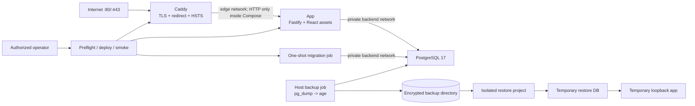
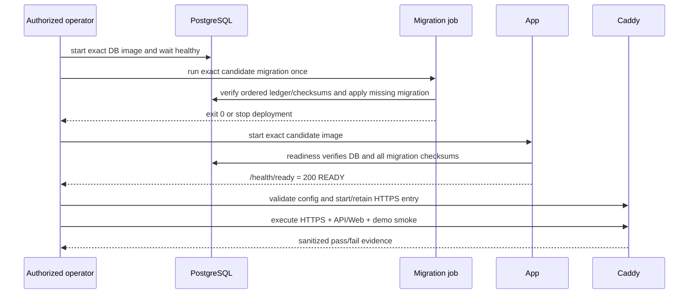

# Technical Design: LP-05 部署与发布就绪

- Status: Proposed
- FeatureId: `lp-05-deployment-release-8c3f1a6d5e20`
- Branch: `codex/lp-05-deployment-release`
- Authoritative baseline: `46e021d261fd8a663c83430a551f5674365ccf14`
- Requirements authority: `d273a79212723513d8ac7150fb141949f6b19472`
- Requirements: [requirements.md](./requirements.md)
- Current phase: F2 — Deployment contract and feature design

## 1. Scope And Delivery Boundary

LP-05 把 LP-01 至 LP-04 已验收的 Node.js/TypeScript 模块化单体、React SPA、PostgreSQL
17 和合成演示打包成单服务器发布候选，并提供 HTTPS、迁移、备份、隔离恢复、smoke、凭据
轮换、回滚和运维证据。它不新增业务模型、API、数据库迁移、Skill 语义或 Web 旅程。

交付明确分成两个权限阶段：

1. **发布就绪实现阶段**：在本仓库实现并验证生产镜像、Compose/Caddy、运维脚本、隔离测试和
   文档；正常走技术计划审查、GoalRun、代码审查和外部合并。此阶段不连接生产服务器，不修改
   DNS，不使用生产秘密，也不对公网发布。
2. **外部部署与验收阶段**：代码合并后，等待用户提供精确服务器/域名/平台/备份位置/秘密交付
   方式和合成数据公开许可，并对精确 merge commit、候选摘要和目标给出独立显式授权。Main 先做
   只读预检，再按本设计执行最小变更并提交脱敏证据。没有这份授权时，功能保持
   `RELEASE_AWAITING_AUTHORIZATION`，不得声称 REQ-026/AC-019 通过。

### 1.1 Goals

- 从精确 Git 提交生成不挂载源码、可识别、可离线传输且不使用 `latest` 的应用 OCI 候选。
- 只暴露 80/443；应用与数据库不发布宿主端口，数据库仅在私有网络可达。
- 显式执行 `backup → migrate → app ready → HTTPS smoke → demo smoke`，失败即停止。
- 每日生成加密 PostgreSQL custom-format 备份并保留最近 7 份，至少完成一次隔离恢复证明。
- 保持 LP-01 至 LP-04 的 API、幂等、人类确认、安全 cookie、同源 Web 和合成演示契约。
- 产生绑定源提交、镜像 ID、目标、迁移、备份/恢复和 smoke 的脱敏证据。

### 1.2 Non-goals

- 不建设 Kubernetes、高可用、多区域、零停机、自动扩缩、企业监控或通用 CI/CD 平台。
- 不自动获取服务器、SSH、DNS、证书、备份或长期秘密权限。
- 不在本特性下创建 tag、GitHub Release、包、镜像仓库发布或外部 Skill 市场发布。
- 不自动 down migration，不自动恢复生产数据库，不清理业务历史来制造回滚成功。
- 不把公开读取重新描述为登录/鉴权，也不向 AI Skill 暴露 human-control 凭据。

## 2. Architecture And Ownership



| Component | Planned location | Owns | Must not own |
| --- | --- | --- | --- |
| App image | `deploy/Containerfile` | Node runtime, compiled packages/API, built Web, migrations, version metadata | Secrets, source mounts, production data |
| Secret-aware entrypoint | `deploy/runtime/entrypoint.mjs` | Read bounded Compose secret files, build runtime env, log safe release ID, exec one process | Printing secret values or accepting secret CLI args |
| Production Compose | `deploy/compose.production.yaml` | Service/network/volume/health/restart/resource boundary | Target-specific secrets or DNS mutations |
| Caddy config | `deploy/Caddyfile` | HTTP→HTTPS, public TLS, HSTS, proxying, dynamic no-store policy | Business authorization, body-schema validation, dynamic response cache |
| Candidate tooling | `scripts/lp05/candidate/**` | Build/inspect/export candidate and emit manifest | Registry publication or implied deployment success |
| Deployment tooling | `scripts/lp05/deploy/**` | Preflight, ordered transitions, rollback selection, evidence | SSH/DNS credential acquisition or unbounded retries |
| Backup/restore tooling | `scripts/lp05/database/**` | Encrypted stream backup, retention, isolated restore proof | Production reset/drop/automatic restore |
| Smoke tooling | `scripts/lp05/smoke/**` | HTTPS, headers, health, public API/Web, demo and credential rotation checks | Direct DB mutation as acceptance substitute |
| Versioned runbook | `docs/operations/lp05.md` | Human prerequisites, commands, failure/recovery and limits | Secret values or target-specific credentials |
| Lifecycle | installed `engineering-main` workflow | Requirements/plan/code/merge/acceptance/closure authority | Server configuration or business state |

Existing ownership remains unchanged: Fastify owns API limits and response contracts; PostgreSQL owns business
state; migration ledgers own schema readiness; Caddy is transport only; deployment evidence does not become a second
business-state authority.

## 3. Candidate And Image Contract

### 3.1 Immutable Build

`deploy/Containerfile` is multi-stage and uses reviewed base-image references pinned by version and digest in
`deploy/images.lock.json`. The builder runs `npm ci`, `npm run build` and production pruning. The runtime contains
only production dependencies, package manifests, compiled `dist` trees, `apps/web/dist`, the three immutable SQL
migrations, version metadata and the entrypoint. It runs as numeric non-root UID/GID, has no package manager cache,
Git metadata, test database, local demo journal or secret.

The candidate command builds for an explicit `linux/amd64` or `linux/arm64` platform, never supplies a secret build
argument, exports an OCI archive below ignored `.lp05-release/`, and verifies the loaded image ID. A local tag is a
human-readable alias only; image ID plus archive SHA-256 is authority. Runtime Compose refuses `latest` and refuses a
candidate whose manifest/source/platform/image ID does not match.

### 3.2 `ReleaseCandidateManifestV1`

The generator emits canonical JSON and rejects unknown fields.

| Field | Type | Required / validation | Authority and persistence |
| --- | --- | --- | --- |
| `schemaVersion` | literal `"1.0"` | Required | Versioned tooling contract |
| `releaseId` | `lp05-<12 hex>-<platform>` | Derived from source commit and platform | Human-safe candidate name |
| `sourceCommit` | 40 lowercase hex | Exact clean checked-out HEAD | Git authority |
| `sourceTree` | 40 lowercase hex | `HEAD^{tree}` | Detects rewritten content |
| `createdAt` | RFC3339 UTC | Required | Evidence timestamp only |
| `platform` | `linux/amd64` or `linux/arm64` | Explicit input | Must equal authorized target |
| `applicationVersion` | `0.1.0+<12 hex>` | Derived | Safe runtime label |
| `imageName` / `imageId` | safe name / `sha256:<64 hex>` | Exact inspected local image | Runtime authority |
| `ociArchive` | basename, byte size, SHA-256 | Regular file inside exact ignored output dir | Transfer integrity; no absolute path |
| `baseImages` | Node, PostgreSQL, Caddy refs and digests | Exact lock-file values; no `latest` | Supply-chain trace |
| `migrationCatalog` | ordered ID/checksum array | Exactly current three migration definitions | Readiness compatibility |
| `webAssetsSha256` | SHA-256 | Deterministic digest of built Web tree | Build-content trace |
| `openapiSha256` | SHA-256 | Current `openapi/lp03.v1.json` | Contract trace |
| `verification` | command, commit, status | `npm run verify` PASS on same commit | Candidate gate |
| `syntheticDataOnly` | literal `true` | Required | Public-demo safety declaration |

The manifest contains no host, username, token, cookie, database URL, request body or business private text.

## 4. Production Topology And Configuration

### 4.1 Compose Services

| Service | Image/process | Network and exposure | Health/start rule | Runtime hardening |
| --- | --- | --- | --- | --- |
| `postgres` | pinned `postgres:17.10-alpine@sha256:…` | `backend` only; no `ports` | `pg_isready`; persistent named/bind volume | Official non-root process, read-only secrets, bounded restart |
| `migrate` | exact app image; `node packages/db/dist/cli/migrate.js` | `backend` only | Starts after DB healthy; must exit 0 | non-root, read-only rootfs, no public network, no restart |
| `app` | exact candidate image | `backend` + `edge`; no `ports` | Starts after migration success; `/health/ready` must pass | non-root, read-only rootfs, `tmpfs /tmp`, cap-drop all, no-new-privileges |
| `caddy` | pinned Caddy image | `edge`; host 80/443 only | Starts after app healthy; validates config before replacement | non-root/high internal ports, limited writable certificate volumes, cap-drop all |

`backend` is Compose-internal. `edge` contains only Caddy and app. PostgreSQL, app health port, backup location,
secret files and admin operations are never published. Named services are reached by Compose DNS; no host database
port is accepted by production config validation.

### 4.2 Startup Ordering



Compose dependency conditions are convenience gates; the deployment controller independently polls with bounded
deadlines and records results. Restart policy never converts a failed migration into success and never retries a
one-shot migration indefinitely.

### 4.3 Secret And Non-secret Inputs

Production uses an operator-owned directory outside Git and outside the Web root. Examples contain invalid
placeholders only.

| Input | Kind | Consumer | Rule |
| --- | --- | --- | --- |
| `DEPLOY_DOMAIN`, `ACME_EMAIL` | non-secret config | Caddy | Validated hostname/email; no URL credentials |
| `RELEASE_ID`, `SOURCE_COMMIT`, `APP_IMAGE_ID` | non-secret config | validator/Compose | Must match candidate manifest |
| DB name/user, deploy/backup roots | non-secret config | Compose/scripts | Safe bounded values and absolute approved roots |
| PostgreSQL password | Compose secret file | PostgreSQL and app entrypoint | At least 32 random bytes; never interpolated into a logged command |
| AI bearer | Compose secret file | app entrypoint | Distinct, bounded, never available to Caddy/Skill |
| human-control token | Compose secret file | app entrypoint | Base64url 32 bytes, distinct from AI bearer |
| age recipient | public config file | backup | Public key/fingerprint may be logged |
| age identity | external restricted file | restore only | Never mounted into normal app/DB/Caddy |
| TLS private material | Caddy data volume | Caddy only | Never copied into repo or evidence |

`entrypoint.mjs` reads only declared regular files below `/run/secrets`, rejects symlinks/oversize/empty values,
constructs `DATABASE_URL` in memory, exports runtime variables and starts Node without putting secrets in process
arguments. It logs only `releaseId`, `sourceCommit`, Node version and platform. Tests scan image layers, history,
Compose output and logs against exact in-memory fixture secrets.

### 4.4 HTTPS, Headers And Request Semantics

- Caddy obtains a trusted certificate only after authorized DNS/80/443 preflight; plain HTTP always redirects to
  the same HTTPS host.
- Caddy adds HSTS and preserves Fastify Helmet CSP, `X-Content-Type-Options`, frame and referrer protections.
- Dynamic `/api/**`, `/health/**` and `/openapi.json` responses receive `Cache-Control: no-store`; hashed Web assets
  retain the app's immutable cache behavior and SPA shells retain `no-cache`.
- Caddy passes method, path, query, body, `Authorization`, `Idempotency-Key`, cookie and standard forwarded metadata
  unchanged. It never logs auth/cookie header values.
- Fastify remains the only request-size/schema authority. The proxy must not decompress, rewrite, lower or bypass the
  existing 64 KiB ordinary and 256 KiB report behavior. Boundary smoke asserts the existing API statuses/envelopes.

## 5. Deployment Attempt State Machine

### 5.1 Authorized Input Envelope

Before any external mutation, Main presents an exact proposal containing:

- merge commit, candidate-manifest SHA-256, OCI archive SHA-256/image ID and platform;
- sanitized target host alias/fingerprint, domain, resolved IPs, OS/runtime versions and approved deploy root;
- backup root, age recipient fingerprint, retention responsibility and available capacity;
- explicit confirmation that only LP-04 synthetic data may be publicly readable;
- exact operations permitted: transfer/load candidate, Compose/migration, backup, HTTPS, smoke and optionally
  credential rotation;
- excluded operations: DNS changes unless separately listed, production restore, tags/Releases/packages/registry;
- rollback image ID and stop conditions.

Authorization evidence is bound to that envelope. A different target, candidate, domain or operation set requires
new authorization.

### 5.2 `DeploymentAttemptV1`

The controller writes an atomic mode-0600 record below an approved host state directory, not Git/Web/backup roots.

| Field | Type | Rule |
| --- | --- | --- |
| `schemaVersion` | literal `"1.0"` | Reject unknown fields |
| `attemptId` | safe ID | Unique per authorized attempt |
| `candidateManifestSha256` / `sourceCommit` / `imageId` | digests/SHA | Exact authorized values |
| `target` | domain, host fingerprint, platform | Sanitized; no login secret/IP credential |
| `state` | state enum below | Only legal transitions |
| `startedAt` / `updatedAt` / `finishedAt` | RFC3339 UTC/null | Monotonic |
| `previousRelease` | release ID, source commit, image ID or null | Required before replacement |
| `backupRef` | backup ID, manifest SHA-256 or null | Required after backup gate |
| `migration` | expected/applied checksum digest, status | No SQL/body output |
| `health` / `smoke` | bounded assertion summaries | Request IDs/statuses/URLs only; no bodies/secrets |
| `rollback` | status, previous image ID, reason code | No automatic DB restore |
| `knownLimitations` | bounded string array | Must include any unproved external condition |

States and legal forward transitions:

```text
PREPARED
  -> PREFLIGHT_PASSED
  -> BACKUP_VERIFIED
  -> MIGRATION_SUCCEEDED
  -> APP_READY
  -> HTTPS_READY
  -> SMOKE_PASSED
  -> DEPLOYED

Any non-terminal state -> FAILED
FAILED + known previous application -> ROLLING_BACK -> ROLLED_BACK | ROLLBACK_FAILED
```

Each transition is persisted only after its independent oracle passes. `DEPLOYED` is operational evidence, not
formal Lifecycle acceptance. The script has bounded timeouts, no unbounded retry, and refuses a second active
attempt for the same target. An interrupted attempt resumes from persisted facts only after re-validating external
state; it never repeats migration or claims success from the record alone.

## 6. Backup, Restore And Rollback

### 6.1 Encrypted Backup

`backup` uses the exact running PostgreSQL container's `pg_dump --format=custom` and streams directly through `age`
to a same-directory temporary encrypted file under the authorized backup root. It uses `umask 077`, fsync/rename,
then verifies non-zero size, ciphertext SHA-256, `age` envelope readability and a bounded `pg_restore --list`
through a decrypt stream. Plaintext is not written to disk.

`BackupManifestV1` records: schema version, backup ID/time, source release/commit/image, database name (not URL),
PostgreSQL version, migration-catalog digest, ciphertext basename/size/SHA-256, age recipient fingerprint, backup
command version and verification status. It contains no password, URL, row data or key. Retention deletes only
verified backup+manifest pairs older than the newest seven, only inside the resolved approved root, and never
deletes the newly created backup after a failed run.

### 6.2 Isolated Restore Proof

Restore requires an explicit backup path, age identity reference and generated Compose project name prefixed
`lp05-restore-`. The controller rejects the production Compose project name, production DB container/volume labels,
production domain and any non-loopback app port. It creates a new DB volume, decrypts into `pg_restore`, runs the
exact candidate migration/readiness, starts an isolated app on loopback and replays only LP-04 public synthetic
reads. It compares the expected three migration IDs/checksums and selected Idea/project/report IDs from public API
results.

Cleanup may remove only resources carrying the exact restore attempt labels after the evidence is persisted.
Production DB/network/volume are inspected before and after and must have unchanged identity. A restore failure
never falls back to production.

### 6.3 Application Rollback

The deploy state captures the previous exact image ID and config digest before replacement. On migration, startup,
readiness or smoke failure, the operator can restore the previous app image/config, wait for readiness and rerun
core reads. Additive migrations remain. No automatic down or DB restore occurs. Production DB restore is a separate
destructive operation requiring a verified pre-deploy backup, demonstrated incompatibility and new explicit
authorization.

## 7. Smoke, Rotation And Evidence

### 7.1 Smoke Matrix

The same TypeScript smoke engine supports `local` and `external` modes. Local mode uses loopback/internal TLS and
cannot satisfy public DNS/certificate criteria. External mode requires an HTTPS origin with no userinfo/path/query,
rejects private/loopback targets unless explicitly running local mode, and performs only declared synthetic actions.

| Assertion family | Oracle |
| --- | --- |
| Candidate identity | candidate manifest, loaded image ID, container labels, release log marker |
| Network | only 80/443 published; DB/app/admin/backup paths absent from host listeners |
| TLS/redirect | HTTP same-host redirect; trusted certificate hostname/validity; TLS and HSTS |
| Health | live 200; ready 200; controlled DB-unready fixture makes ready/business fail in local test |
| Security/cache | CSP, content type, frame/referrer, no-store dynamic, no-cache shell, immutable hashed asset |
| Request boundaries | existing ordinary/report below/above-limit status and error envelope through proxy |
| Public contract | `/openapi.json`, proposer/executor, project details, confirmation SPA and core public API reads |
| Synthetic story | exact LP-04 synthetic IDs show Idea pool, project, progress/items, two reports and completion |
| Secret absence | logs/evidence/history/image/config scan against injected fixture values and secret patterns |
| Operational state | Compose health/restart counts, disk/certificate/backup status, no failed active attempt |

Smoke output is bounded JSON; failures use stable assertion IDs and sanitized reason codes. It never dumps complete
response bodies, environment, headers, cookies or database URLs.

### 7.2 Credential Rotation

Rotation is a separately selected operation within an authorized deployment envelope. The operator writes new
secret files atomically, validates AI and human values remain distinct, replaces only app, waits for readiness and:

- uses an existing synthetic idempotent write/replay to prove old AI bearer is 401 and new bearer succeeds;
- uses an existing synthetic confirmation ID read to prove old human-control token is 401 and new token succeeds;
- proves neither credential appears in logs or evidence.

If validation fails, the previous secret files are restored atomically and the app is restarted; no confirmation
decision is made and no capability cookie is exposed to AI tooling.

### 7.3 `DeploymentEvidenceV1`

The final sanitized record includes candidate/source/image digests, target domain and host fingerprint, attempt ID,
deployment time, migration digest, backup/restore manifest digests, public URL, certificate summary, assertion IDs,
LP-04 synthetic resource IDs, rollback availability, known limitations and overall `PASS`/`FAIL`. `PASS` requires
all required external assertions and an isolated restore proof. Evidence stays in the approved host state directory;
its SHA-256 and bounded sanitized content may be sent to Lifecycle roles. Raw logs and secrets are never committed.

## 8. Minimal Operations And Failure Detection

Versioned `ops-status` checks Compose service health, restart counters, DB readiness, Caddy certificate expiry,
filesystem free space, newest verified backup age, last timer result and last deployment smoke. It exits non-zero and
prints stable reason codes for unhealthy app/DB, restart loop, certificate risk, low disk, stale/failed backup or
failed smoke. The runbook maps each code to inspection and recovery commands using redacted logs.

A provided systemd timer example runs backup daily and retains seven verified copies. Installation/enabling is an
external server mutation covered only by deployment authorization. No SLO, paging or third-party monitoring is
claimed.

## 9. Lifecycle, Release And Acceptance Semantics

- Technical-plan approval authorizes only a GoalRun for repository implementation.
- Code approval/merge authorizes neither deployment nor DNS/server mutation.
- The deployment controller can run only after a separately presented exact target/candidate authorization.
- Default LP-05 scope excludes every supported publication artifact: no tag, GitHub Release, package, registry image
  or external Skill publication. The OCI archive is a local release-candidate transfer artifact and is not published.
- Server deployment is recorded by `DeploymentEvidenceV1`; it is not fabricated as a GitHub/PyPI lifecycle target.
- Only after external `PASS` evidence is independently reconciled does Main present the exact merge commit,
  deployment evidence digest and no-artifact reason for explicit acceptance-only/no-publish authorization.
- A final `ACCEPTED_NO_PUBLISH` label means “accepted without tag/package/repository publication”; it does **not**
  mean production deployment was skipped. If any external criterion is missing, no acceptance is requested.
- If the user later requests a tag, Release, package or registry publication, it is a new explicit release proposal
  and cannot be inferred from LP-05 confirmation.

## 10. Compatibility And Safety Invariants

1. No migration, domain, application, contract, OpenAPI, report Schema, Skill or Web source change is planned.
2. API methods, paths, statuses, bodies, request identity, authorization and confirmation cookie remain unchanged.
3. Caddy never caches dynamic responses or strips authorization/idempotency/cookie semantics.
4. Public instances contain only clearly labelled LP-04 synthetic data; no real private data is accepted as demo
   input.
5. Restore, backup retention and cleanup resolve and validate exact roots/labels before deletion; no broad glob/root
   deletion is permitted.
6. Production restore, DNS change, credential rotation and artifact publication each need explicit authority; one
   authorization does not imply another.

## 11. Planned Paths

Expected repository changes after plan PASS:

- `deploy/Containerfile`, `.dockerignore`, `deploy/images.lock.json`;
- `deploy/compose.production.yaml`, `deploy/Caddyfile`, invalid-placeholder config examples;
- `deploy/runtime/**`, `deploy/systemd/**`;
- `scripts/lp05/candidate/**`, `scripts/lp05/deploy/**`, `scripts/lp05/database/**`,
  `scripts/lp05/smoke/**`, `scripts/lp05/shared/**` and matching unit tests;
- `tests/deployment/**` or dedicated LP-05 acceptance tests;
- `docs/operations/lp05.md`, feature verification/evidence-schema documentation;
- `README.md`, `CHANGELOG.md`, `package.json`, `.gitignore`, `docs/project-management.md` and the LP-05 source plan.

Forbidden without a new confirmed handoff: domain/application/database contract code, migrations, public API/OpenAPI,
report Schema, LP-04 Skill/fixtures/client evidence, Web product behavior and unrelated lifecycle/plugin code.

## 12. Verification Strategy

| Layer | Required proof |
| --- | --- |
| Unit | manifest/config/path/state transitions, atomic records, retention, redaction, rollback selection |
| Static contract | pinned images, no `latest`, no host DB/app port, non-root/read-only/cap-drop, invalid placeholders |
| Container | clean build, exact labels/files, non-root UID, read-only root, secret/layer/history absence |
| Local production acceptance | Compose ordering, migration, readiness, proxy headers/cache/body limits, app rollback |
| Database safety | encrypted backup, manifest, isolated restore, migration checksum and public synthetic reads |
| Rotation | old/new AI and human credentials, distinct secrets, no log leakage |
| Regression | complete `npm run verify`, LP-01–LP-04 acceptance and browser stories |
| External release | authorized target, trusted HTTPS, smoke, backup/restore, synthetic demo, evidence digest |

Implementation tests use disposable loopback projects and databases with exact safe labels. They never require or
touch a production target. External assertions remain visibly unproved until the separate authorized release phase.

## 13. Traceability

| Requirement area | Design sections | Acceptance criteria |
| --- | --- | --- |
| Immutable candidate/version | 3, 4 | 1–3, 13–14 |
| Private topology/HTTPS/headers/body boundaries | 2, 4, 7 | 2–6, 14 |
| Secret injection and rotation | 4.3, 7.2 | 7–8, 16 |
| Backup/retention/isolated restore | 6 | 9–12, 16–18 |
| Ordered deploy/failure/rollback | 5–6 | 3, 11–12, 20 |
| Smoke/demo/evidence/observability | 7–8 | 13–18 |
| Project management and authorization truth | 1, 9, 11 | 19–20 |

## 14. Remaining External Inputs

There are no unresolved repository-design choices. The following remain intentionally external and block only the
real deployment phase: target host/OS/architecture/runtime/disk, domain/DNS/80/443, backup root/recipient/capacity,
secure credential delivery, explicit synthetic-public-read consent and exact deployment authorization. Main must
present discovered facts and the candidate envelope rather than fill them with assumptions.
