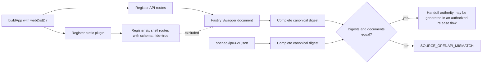

# Technical Design: LP-05 Production OpenAPI And Connection Handoff Parity Hotfix

- FeatureId: `lp-05-openapi-handoff-hotfix-8d3f6a1c2e90`
- Branch: `codex/lp-05-openapi-handoff-hotfix`
- DeliveryMode: `AGILE_REVIEWED`
- Requirements authority: `8947bb8b7496fc7465a26fb18d43d0224d7d0e84`
- Status: Proposed for confirmed-mode plan binding

## Problem And Outcome

`buildApp` registers six HTML shell routes only when `webDistDir` is present. Fastify Swagger currently treats
those routes as API operations, so production `/openapi.json` differs from the frozen
`openapi/lp03.v1.json` generated without Web hosting. The deployment handoff generator correctly rejects that
drift with `SOURCE_OPENAPI_MISMATCH`.

The hotfix keeps every Web URL and response behavior unchanged while marking the shell routes as hidden from
Swagger. A production-equivalent test starts the app with a real non-empty Web directory and proves that its
complete canonical OpenAPI document equals the committed document byte-for-data after JSON parsing.

## Goals And Non-goals

Goals:

- Restore one complete machine-readable OpenAPI authority in development and production-equivalent runtime.
- Keep the six SPA shell/deep-link routes and static asset behavior unchanged.
- Preserve complete-document hashing and every existing handoff/source/Skill authority check.
- Add a regression that fails if a Web shell route becomes visible to Swagger again.

Non-goals:

- No business API, schema, security, database, authentication, profile or handoff-format change.
- No compatibility whitelist, required-route projection or ignored additive API drift.
- No production access, deployment, credential operation or production handoff generation in implementation.
- No reuse or rewriting of the current production release, candidate, proposal or failed initialization history.

## Boundaries And Public Contract

The public machine API remains exactly `openapi/lp03.v1.json`. The Web shell routes remain public browser URLs,
but are not API operations and therefore are intentionally absent from Swagger.

| Surface | Current | Desired | Compatibility |
| --- | --- | --- | --- |
| Business API routes | Present in frozen and runtime OpenAPI | Unchanged | No API change |
| `/openapi.json` | Includes six HTML routes when Web hosting is enabled | Equals frozen OpenAPI in every runtime mode | Restores declared contract |
| Six SPA shell routes | Serve `index.html`; appear in runtime Swagger | Continue serving `index.html`; hidden from Swagger | Browser behavior unchanged |
| Static assets, CSP, cache, 404 | Existing strict behavior | Unchanged | Existing tests retained |
| Handoff/source/Skill validation | Complete digest and Git authority checks | Unchanged | Still fail closed |

The six hidden shell routes are:

- `/`
- `/proposer`
- `/executor`
- `/proposer/projects/:projectId`
- `/executor/projects/:projectId`
- `/confirmations/:confirmationId`

## Implementation Contract

`apps/api/src/app.ts` owns Web route registration. Each shell route receives Fastify route schema metadata
`hide: true`. The same immutable route option is reused for all six registrations so a newly added shell route
must make an explicit Swagger visibility choice.

No new persisted object, schema, lifecycle, configuration field or public command is introduced. The only new
test artifact is a temporary directory containing `index.html` and one static asset; the test owns it for its
process lifetime and removes it during teardown.

## Data And Control Flow

The browser path is independent: a shell request still reaches the same handler, returns `index.html` with
`cache-control: no-cache`, and remains protected by the existing CSP. Static assets continue through
`@fastify/static` with immutable caching.

## Equality And Failure Rules

The regression loads the committed `openapi/lp03.v1.json`, requests `/openapi.json` from an app configured with
a real `webDistDir`, and asserts:

1. deep structural equality of the complete parsed documents;
2. equality of `openapiCompatibilityDigest` for both complete documents;
3. the baseline digest remains
   `5b2cbcd605e9a8304e1f22e331b36b67c54b1976d49a499af31ed6a8e0d6adb7`;
4. none of the six shell paths is present in the runtime OpenAPI;
5. all six browser routes still return the shell.

Existing client-profile tests continue proving that request/schema/component/parameter/security drift changes
the complete digest and that matching authority can create a non-secret handoff while wrong source authority is
rejected. The hotfix does not add a fallback: any equality or authority failure remains terminal for handoff
generation and initialization.

## Safety, Privacy And Authorization

- Tests use only temporary Web files, placeholder credentials and repository OpenAPI bytes.
- No test reads environment bearer values or performs a network/production write.
- Logs and committed evidence contain only route names, commits and non-secret digests.
- Production candidate construction, proposal, deployment, post-deploy observation and handoff generation remain
  separate actions requiring their existing explicit authority.

## Rollout And Rollback

The code change is backward compatible and takes effect when a new candidate is built from the eventual merge
commit. After merge, build and verify a new platform-specific LP-05 candidate and prepare a new proposal; do not
reuse `lp05-d181bf9a02a8-amd64` or its proposal. Production deployment is not part of this plan authority.

Rollback before deployment is a normal code revert. After an independently authorized deployment, use the
existing LP-05 attempt/rollback procedure. Reverting restores the known OpenAPI mismatch and therefore also
restores fail-closed initialization; it must never be described as a successful handoff state.

## Risks And Decisions

| Risk | Control |
| --- | --- |
| Hiding a real API route | Only the six enumerated HTML shell routes receive `hide: true` |
| Equality test accidentally uses generator mode | Test supplies a real non-empty `webDistDir` and verifies shell/asset responses |
| Digest gate is weakened | Production and frozen documents are compared in full; existing mutation tests remain |
| Browser behavior regresses | Existing CSP/cache/404 checks remain and all six shell routes are asserted |
| Merge is mistaken for deployment authority | Candidate/proposal/deployment/handoff steps remain explicitly separated |

No open design decisions remain.
