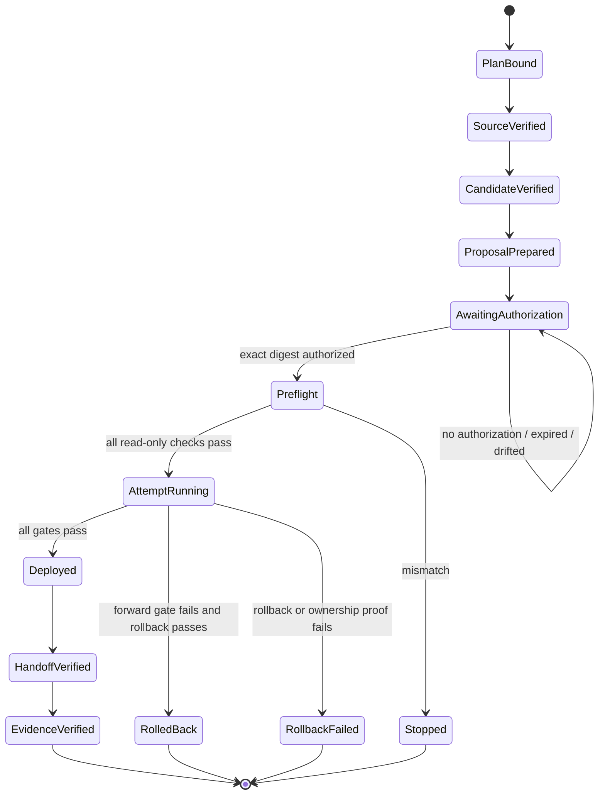

# Technical Design: LP-05 0c4c304 生产版本发布

- FeatureId: `lp-05-production-release-0c4c304-7b1e9a4d2c60`
- Branch: `codex/lp-05-production-release-0c4c304`
- DeliveryMode: `AGILE_REVIEWED`
- Requirements authority: `7fe0414dba94a675a101e6588d3fc320ab670648`
- Release source commit: `0c4c30410e9a2cc2c848047214654ab9df2585a2`
- Release source tree: `e95778ede5ed3b947c37a1a4129374a63195b452`
- Target: `idea.zhanghao.work` / `115.29.237.117` / `linux/amd64`
- Status: Proposed

## Purpose

本 feature 不增加发布引擎，也不修改产品代码。它为已合并且已审查的 `0c4c304…` 建立一次
可复现、可授权、可回滚的生产升级：从独立 detached source worktree 构建候选，验证候选和目标，
生成闭合 proposal，等待用户对精确 `proposalSha256` 的单独授权，然后复用现有 LP-05 控制器执行
升级、恢复演练、外部复验和非秘密客户端连接 handoff。

## Authority Boundaries

| Authority | Controls | Does not control |
| --- | --- | --- |
| Confirmed requirements | release scope, source, target, delivery mode | production mutation |
| This committed plan | preparation order and verification obligations | candidate bytes or user authorization |
| Candidate manifest | exact source/tree/platform/image/archive identity | target or operations |
| `DeploymentProposalV1` | candidate + target + operations + exclusions | execution before explicit approval |
| User-authorized envelope | one attempt within 24 hours | drifted target, bytes, operations or second attempt |
| Existing LP-05 controller | bounded backup/deploy/restore/rollback mechanics | code repair, DNS, credential rotation, production DB restore |
| Deployment evidence | observed result of one attempt | lifecycle acceptance/closure |

The lifecycle feature records why this release is being prepared. The deployed runtime's existing
`DeploymentAuthorizationEnvelopeV1` validator remains the technical execution authority and is not widened in
this release-only feature. Its established workflow/source-task binding is retained; the new lifecycle feature ID,
requirements/plan commits and candidate identity are recorded in the release verification record so the two
authorities remain traceable without changing controller code.

## Source And Candidate Isolation

The candidate builder derives identity from `HEAD` and refuses a dirty tree. Therefore the feature worktree that
contains planning/evidence commits must never be used as candidate source. Main creates a temporary detached
worktree at exact commit `0c4c304…`, verifies its tree equals `e95778e…`, and runs:

```text
npm run release:lp05:candidate -- --platform linux/amd64
npm run release:lp05:verify-candidate -- \
  --manifest .lp05-release/lp05-0c4c30410e9a-amd64/manifest.json \
  --reviewed-head ef4485b6d25c9f799c9422d45b96b6e38c78c3e1 \
  --merge-commit 0c4c30410e9a2cc2c848047214654ab9df2585a2 \
  --reachable-from-base --production
```

The output directory is outside Git history and is copied to a mode-0700 staging directory only after manifest
verification. The release ID must be `lp05-0c4c30410e9a-amd64`. No floating image tag or ARM artifact is accepted.

## Preparation State Machine



Only `ProposalPrepared -> Preflight` crosses the production mutation authority boundary. Merely building,
reviewing or presenting a proposal does not cross it.

## Proposal Contract

Main creates a canonical `DeploymentProposalV1` using the existing closed schema. It binds:

- workflow/execution authority required by the existing controller;
- merge/source commit `0c4c304…` and verified candidate identity;
- exact HTTPS domain, public IP, target ID, deploy/state/backup roots and `linux/amd64` platform;
- current production release as `previousRelease`, read immediately before proposal generation;
- current toolchain observations and backup policy;
- every existing mandatory operation, including backup, migration, deploy, external smoke, post-deploy backup,
  isolated restore, post-restore smoke and cleanup;
- every existing mandatory exclusion, including DNS mutation, credential rotation, broad deletion, production DB
  restore, tags/packages/registry/GitHub Release and a second attempt;
- explicit synthetic public-read consent and proposal timestamp.

Canonical JSON is hashed with SHA-256. Main presents both the complete non-secret JSON and digest. Any later
change creates a new proposal; the user never authorizes a template or partial object.

## Production Execution

After exact authorization, Main creates one authorization envelope and one attempt request. Preflight is read-only
and rechecks candidate bytes, DNS/TLS, IP, host architecture/toolchain, current release/config/image, database
identity, exact Docker ownership, backup destination/free space and authorization freshness. Failure stops before
forward mutation.

The existing controller then owns this order:

1. pre-migration encrypted safety backup and verification;
2. explicit additive migration against configured production identity;
3. exact application/image/config upgrade and local readiness;
4. public HTTPS, headers, Web/API and synthetic journey observation;
5. post-deploy encrypted backup;
6. strictly isolated restore and restored-story verification;
7. proof that production resources/data did not change during restore;
8. exact cleanup of attempt-owned restore resources;
9. second public smoke and terminal journal result.

Main does not run ad-hoc SSH fixes or reinterpret caller-authored PASS as evidence. A discovered code, migration,
runner or host-contract defect stops the release and returns to a separate Requirements feature.

## OpenAPI And Web Proof

Success requires one active external observation to prove all of the following from production:

- `/health/live` and `/health/ready` return expected ready envelopes over valid HTTPS;
- proposer, executor, project and confirmation page routes remain browser-accessible;
- core public API reads and the LP-04 synthetic journey pass;
- canonical live `/openapi.json` equals `0c4c304…:openapi/lp03.v1.json` completely and has digest
  `5b2cbcd605e9a8304e1f22e331b36b67c54b1976d49a499af31ed6a8e0d6adb7`;
- the six SPA shell paths are absent from OpenAPI while their Web routes remain available.

Partial path checks, file SHA alone or an operator-authored success flag are insufficient.

## Deployment Connection Handoff

After and only after terminal deployment/evidence success, Main invokes the existing client-profile handoff
generator with observed release/source/Skill/OpenAPI facts. The resulting `DeploymentConnectionHandoffV1` is
non-secret and must validate against the shipped schema and repository authority. It contains no bearer source,
raw token, human-control credential, database material or SSH/DNS secret.

The handoff is delivered separately from the AI bearer. A handoff-generation failure leaves the production
deployment fact intact but keeps client delivery incomplete; Main must not hand-edit the file.

## Operator Experience Truth Table

| Observed state | Main reports | Allowed next action |
| --- | --- | --- |
| Candidate build or verification failed | Not deployable; exact failing gate | Fix through a separate feature |
| Proposal exists but is not authorized | Awaiting exact digest authorization | Present JSON and digest only |
| Authorization expired or drifted | Authorization invalid; no attempt started | Regenerate and reauthorize |
| Preflight failed | Production unchanged | Investigate, then new proposal if facts change |
| Attempt rolled back | New release not published; previous app restored | Preserve evidence and decide follow-up |
| Rollback failed | Manual investigation required | No further automatic mutation |
| Deployment passed, handoff failed | Site upgraded; client delivery incomplete | Regenerate through the validated tool |
| Deployment and handoff passed | Release evidence ready | Explicit lifecycle acceptance/closure |

## Evidence And History

Feature verification records exact plan commit, source commit/tree, candidate manifest/archive/image digests,
proposal/envelope/attempt IDs and digests, public/restore evidence digests, previous/new release identities and
handoff digest. Secret values and raw transcripts remain outside Git. All older proposals, failed attempts,
manual cleanup, backups, releases and lifecycle records remain append-only and unchanged.

## Failure And Rollback

- Before mutation: stop; production remains unchanged.
- During upgrade: use only the existing upgrade rollback, restoring previous exact application/image/config while
  preserving additive database changes and production data.
- Never apply fresh-install empty-resource deletion, down migration or production DB restore to this upgrade.
- Ownership/evidence ambiguity terminalizes fail-closed and requires human investigation.
- Candidate, target or operation drift always requires a new proposal and authorization.

## Compatibility And Release Scope

The expected product/API/database/Skill behavior is unchanged except that production now serves the already
merged OpenAPI parity fix. This feature creates no tag, GitHub Release, package, registry artifact, Skill
marketplace release, DNS change or credential rotation. Those remain independent authorities.

## Open Decisions

None. Candidate byte identities, current previous-release facts and `proposalSha256` are intentionally resolved
during execution and must be shown before production mutation.
