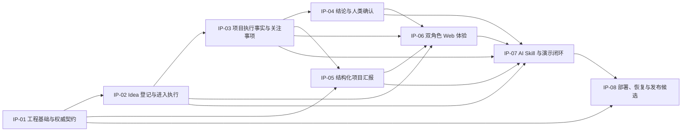
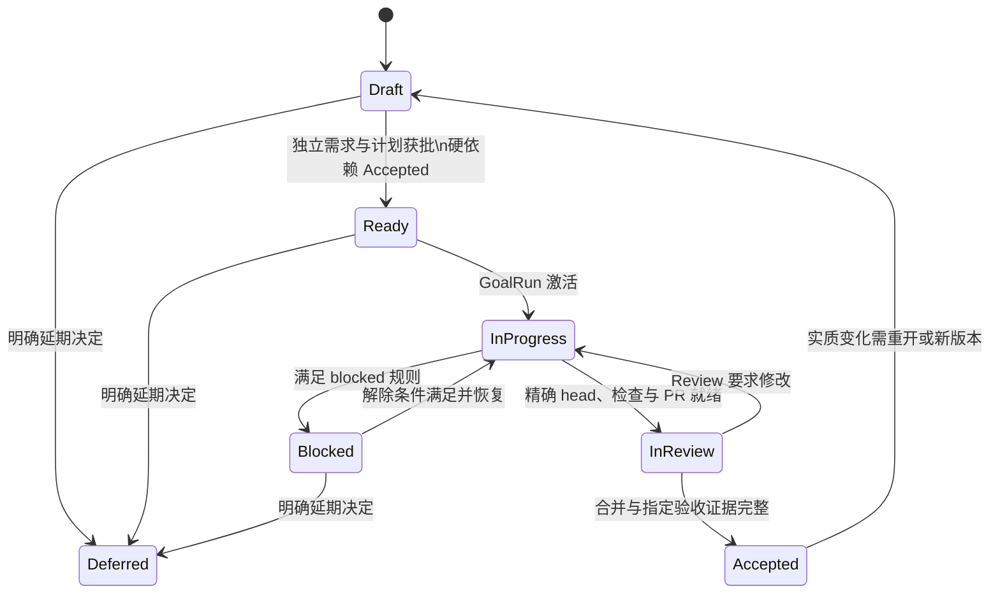

# Technical Design: v0.1 可独立验收实施计划拆分与管理

- Status: Proposed F2 Design
- FeatureId: `v0-1-project-management-6f4b1a2d9c07`
- Branch: `codex/v0-1-project-management`
- Requirements: [requirements.md](./requirements.md)
- Requirements commit: `b4f9a802744431c5ef424787b363c08a24d64d5b`
- Requirements SHA-256: `9ca2a55d914d614c9c3d85772a041cbffdd2318407c99db38b6214ff14e51bdc`
- Current lifecycle stage: `PLAN_DRAFTING`
- Updated: 2026-07-28

## 1. Background

v0.1 已有确认需求、领域模型、结构化汇报协议、技术架构和 Slice 0–9
总实施计划，但尚不能把其中一部分作为独立 feature 执行和验收。项目需要在不改变
既有产品范围的前提下，建立：

1. 一份项目级权威入口，用于查看组合状态、依赖、阻塞和发布就绪度；
2. 八份稳定、独立、可追踪的实施计划；
3. 从每份计划到独立 Engineering Lifecycle authority 的一对一边界；
4. 状态、证据和验收记录的一致性与纠偏规则。

本设计只定义仓库内 Markdown 管理契约。它不实现 v0.1 运行时能力，也不把当前
RequirementsHandoff 解释为 IP-01–IP-08 的批量实现授权。

## 2. Goals

- 建立 `docs/project-management.md` 作为唯一项目级状态入口。
- 建立 `docs/implementation-plans/v0-1/` 下的 IP-01–IP-08 八份独立计划。
- 让每份计划具有稳定 ID、独立范围、依赖、入口门禁、验证和验收记录。
- 保证 `REQ-001`–`REQ-028`、`AC-001`–`AC-020` 和 Slice 0–9 无孤立项。
- 让每个 IP 后续分别获得 RequirementsHandoff、计划 Review、GoalRun、PR、精确
  head Code Review、合并和收尾记录。
- 用 Git 提交作为项目入口与独立计划状态同步更新的原子边界。

## 3. Non-goals

- 不实现 API、数据库、领域、Web、Skill、测试或部署代码。
- 不修改已确认 v0.1 产品范围、技术架构或 2026-08-06 目标日期。
- 不把 Markdown 文档建设成通用 Issue Tracker 或人员排期系统。
- 不在当前 feature 中注册、启动或合并 IP-01–IP-08。
- 不把 `Accepted` 当作合并、部署或发布授权。
- 不复制上游需求、协议和总计划的完整正文。

## 4. Ownership and authority

权威顺序从高到低：

1. 已确认 RequirementsHandoff 与 durable Engineering Lifecycle 状态；
2. Review 的精确 snapshot 结果、Git commit、PR head、required checks 和 merge proof；
3. 对应 IP 独立计划中的范围、门禁、证据和验收记录；
4. `docs/project-management.md` 中的组合摘要。

若低层记录与高层事实冲突，低层记录必须标记为 stale，受影响状态不得晋级。

| Artifact | Owner | Responsibility | Must not do |
| --- | --- | --- | --- |
| 已确认需求 | Requirements | 定义业务范围和验收意图 | 编写技术实现或自批计划 |
| 独立 IP 计划 | Main | 写设计、实施步骤、检查和证据要求 | 绕过 Requirements 或 Review |
| Review records | Review | 审查精确计划/代码 snapshot | 修改 Main 的实现或替 Main 合并 |
| 项目管理入口 | Main | 汇总权威状态、依赖、阻塞和下一步 | 成为第二份详细计划 |
| 验收记录 | 指定验收方；Main 记录 | 对精确 commit 和证据作结论 | 用口头进度替代证据 |

## 5. Document topology

```text
docs/project-management.md
docs/implementation-plans/v0-1/
├── ip-01-foundation-contracts.md
├── ip-02-idea-intake.md
├── ip-03-execution-facts.md
├── ip-04-conclusion-confirmation.md
├── ip-05-structured-reporting.md
├── ip-06-dual-role-web.md
├── ip-07-ai-skill-demo.md
└── ip-08-deployment-release.md
```

详细来源继续保留在：

- `docs/feature/v0-1-project-plan/requirements.md`
- `docs/feature/v0-1-project-plan/domain-model.md`
- `docs/feature/v0-1-project-plan/structured-report-protocol.md`
- `docs/feature/v0-1-project-plan/technical-architecture.md`
- `docs/feature/v0-1-project-plan/implementation-plan.md`

原总计划是拆分来源，不再承担当前项目状态台账职责。实现本 feature 时在原总计划
顶部增加指向项目管理入口的说明，避免形成并行状态源。

## 6. Dependency model



关键路径为：

```text
IP-01 -> IP-02 -> IP-03 -> IP-04/IP-05 -> IP-06 -> IP-07 -> IP-08
```

`IP-04` 与 `IP-05` 在 IP-03 被接受后可以并行。所有依赖边均为硬依赖；
后继计划只有在所有硬依赖均为 `Accepted` 时才能进入 `Ready`。

## 7. Markdown data contract

本 feature 没有新的运行时对象、数据库表或公共 API。它定义以下 Markdown
管理对象。

### 7.1 `ProjectPlanSummary`

位于 `docs/project-management.md`，每个 IP 一行。

| Field | Type | Required | Owner | Validation |
| --- | --- | --- | --- | --- |
| `PlanId` | `IP-01`–`IP-08` | yes | Main | 唯一且稳定 |
| `Title` | text | yes | Main | 与独立计划标题一致 |
| `Version` | positive integer | yes | Main | 与独立计划一致 |
| `Status` | controlled enum | yes | Main | 与独立计划一致 |
| `Dependencies` | Plan ID list | yes | Main | 仅已知 ID、无环 |
| `TargetDate` | ISO date/range | yes | Main | 来自确认总计划 |
| `LifecycleFeatureId` | text or `Unassigned` | yes | Requirements/Main | 不得推断 |
| `Evidence` | links or `None` | yes | Main | 可复核且无秘密 |
| `Blocker` | short text or `None` | yes | Main | `Blocked` 时必填 |
| `NextStep` | short text | yes | Main | 指向有权限的下一动作 |

### 7.2 `ImplementationPlan`

每个 IP 文件包含固定元数据和章节。

| Field | Type | Required | Default | Validation |
| --- | --- | --- | --- | --- |
| `PlanId` | stable ID | yes | none | 与文件名和索引一致 |
| `Version` | integer | yes | `1` | 实质变化递增 |
| `Status` | controlled enum | yes | `Draft` | 必须有状态证据 |
| `TargetDate` | date/range | yes | source plan | 不表示完成状态 |
| `Dependencies` | Plan ID list | yes | per graph | 全部接受前不得 Ready |
| `RequirementsBaseline` | path + commit | yes | confirmed v0.1 | 可定位 |
| `LifecycleFeatureId` | text | yes | `Unassigned` | 独立 handoff 后填写 |
| `FeatureBranch` | text | yes | `Unassigned` | 独立 feature 分支 |
| `AcceptanceOwner` | text | yes | `Pending assignment` | 由独立需求确认 |
| `AcceptedBy` | text | yes | blank | 仅验收后填写 |
| `AcceptedAt` | strict UTC | yes | blank | 仅验收后填写 |
| `AcceptedCommit` | 40-char SHA | yes | blank | 仅验收后填写 |
| `AcceptanceEvidence` | link list | yes | blank | 仅验收后填写 |

固定章节为：

1. Business outcome
2. Scope
3. Non-goals
4. Inputs and entry gate
5. Deliverables
6. Execution plan
7. Failure, retry, rollback and recovery
8. Verification matrix
9. Independent acceptance checklist
10. Traceability
11. Risks, external inputs and blockers
12. Next step
13. Change history
14. Acceptance record

### 7.3 `BlockerRecord`

| Field | Required | Rule |
| --- | --- | --- |
| `Reason` | yes | 具体、可验证 |
| `Impact` | yes | 指明受影响计划和门禁 |
| `ExitCondition` | yes | 可观察 |
| `CurrentAction` | yes | 有 owner |
| `ReviewAt` | yes | 严格 UTC 或明确外部事件 |

### 7.4 `ChangeRecord`

| Field | Required | Rule |
| --- | --- | --- |
| `ChangedAt` | yes | 严格 UTC |
| `Change` | yes | 描述状态/范围/依赖/证据变化 |
| `Reason` | yes | 不得只写“更新” |
| `Evidence` | yes | commit、Review、check 或 handoff |

## 8. Status lifecycle



文档状态与 Engineering Lifecycle 的对应关系：

| Plan status | Minimum lifecycle evidence |
| --- | --- |
| `Draft` | 尚无该 IP 的完整 authority，或计划仍在修订 |
| `Ready` | 独立 RequirementsHandoff + PASS plan review + 依赖 `Accepted` |
| `In Progress` | 对应 GoalRun 为 active |
| `Blocked` | 对应 GoalRun/外部条件满足 durable blocked 记录要求 |
| `In Review` | 实现完成并绑定精确 PR head，等待或进行 Code Review/验收 |
| `Accepted` | 精确实现已合并，Must 证据通过，指定验收记录完整 |
| `Deferred` | 有明确决定、原因、影响与恢复条件 |

`APPROVE`、代码提交存在或目标日期到达，均不能单独产生 `Accepted`。

## 9. Update transaction

一次状态更新必须在同一个 Git 变更集中完成：

1. 重新读取 durable lifecycle 和独立计划；
2. 验证请求者对目标状态有权限；
3. 更新独立 IP 计划中的状态、证据、阻塞、下一步或验收记录；
4. 更新 `docs/project-management.md` 对应摘要；
5. 追加两处需要的变更记录；
6. 运行一致性检查；
7. 提交并推送同一 commit。

如果第 3–6 步任一失败，不提交部分更新。若发现已提交的不一致，项目入口标记
`stale`，受影响计划停止晋级，随后用补偿提交纠正并保留原因。

## 10. Traceability contract

主归属必须满足：

- `REQ-001`–`REQ-027` 各有且仅有一个主要 IP；
- `REQ-028` 归本项目管理 feature；
- Slice 0–9 各有且仅有一个主要 IP；
- AC-001–AC-020 至少关联一个 IP；
- 每个 IP 至少拥有一个独立可观察验收场景。

计划文件记录自身主要与辅助映射；项目入口保存完整矩阵。辅助映射不能替代或重复
主要归属。

## 11. Validation and proof

实现阶段使用只读、确定性检查：

- 文件集与稳定路径存在；
- 八个 `PlanId`、文件名和索引一一对应；
- 所有必需元数据和章节存在；
- 状态只使用受控枚举；
- 依赖 ID 有效且图无环；
- 项目入口与独立计划的版本、状态、依赖一致；
- REQ、AC、Slice 追踪满足覆盖与唯一性；
- 相对 Markdown 链接解析到仓库内文件；
- `Accepted` 记录完整；非 `Accepted` 计划不伪造验收字段；
- 文档不包含密钥值、个人配置或真实私密数据；
- `git diff --check` 通过。

验证可以使用 `/private/tmp` 中的临时脚本，不把一次性证明工具或输出提交到仓库。

## 12. Failure and recovery

| Failure | Required response |
| --- | --- |
| 缺少文件/章节/映射 | 保持 `Draft`，补齐后重新审查 |
| 依赖环或未知 ID | 阻止受影响计划开始，修订依赖 |
| 入口与计划状态不同 | 标记 stale，停止晋级，同提交纠正 |
| 证据缺失或 head 不匹配 | 拒绝 `In Review`/`Accepted` |
| Review 要求修改 | 回到 `In Progress`，保留 finding 与恢复动作 |
| 验收后实质变化 | 递增版本或重开，保留原验收记录 |
| 外部部署条件缺失 | IP-08 保持 `Blocked`/`Draft`，不影响无依赖本地工作 |

## 13. Safety, privacy, and authorization

- 文档只能存放公开可提交的管理元数据与证据引用。
- 不记录 token、cookie、数据库 URL、服务器凭据、个人配置或真实私密业务样本。
- 状态更新不扩大 Main、Requirements、Review 或用户的既有权限。
- 当前 handoff 只授权创建计划体系；IP-01–IP-08 必须分别取得独立 authority。
- Main 不自批计划、不自审代码、不自记录外部合并证明。

## 14. Compatibility, rollout, and rollback

这是新增的仓库文档契约，不改变运行时兼容性。

Rollout：

1. 计划 Review 通过后创建九份目标文档；
2. 所有 IP 初始状态为 `Draft`；
3. 为原总计划增加“历史来源/非状态台账”说明；
4. 验证后提交、推送并准备独立 PR；
5. 合并后，后续 IP 从 IP-01 开始分别进入 Requirements。

Rollback：

- 合并前可回退本 feature 的文档提交，不影响运行时；
- 合并后若入口契约有问题，使用补偿提交修正，不静默删除历史；
- 已产生的独立 IP authority、Review 或验收记录不可被管理入口回退覆盖。

## 15. Observability

项目管理文档本身就是人可读投影；权威证明来自：

- RequirementsHandoff message ID 与 requirements commit；
- plan/code review message ID 与 immutable report；
- GoalRun identity；
- Git commit、PR URL/head、required checks、merge SHA；
- 指定验收方、UTC 时间和验收证据；
- 外部部署证明与发布授权。

不在仓库保存原始 token、完整私密日志或临时签名 URL。

## 16. Open decisions

无阻塞性开放决定。各 IP 的实现级选择仍需在其独立 RequirementsHandoff 和技术计划
中确认；本设计不预先批准这些选择。
