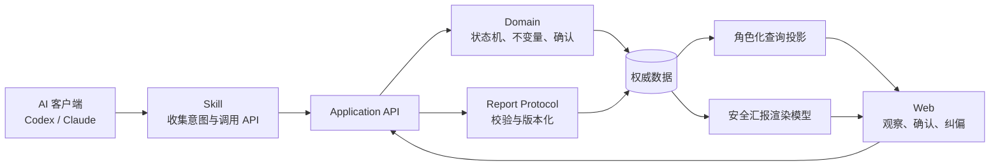
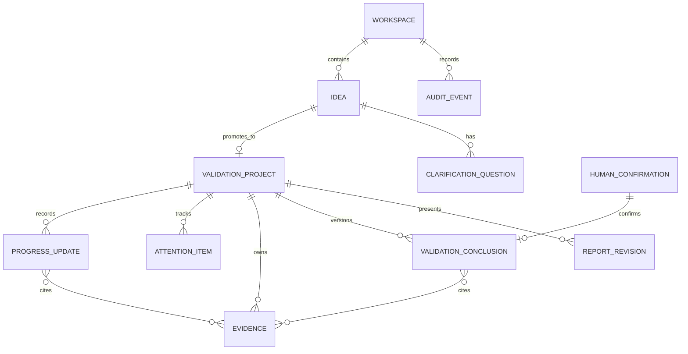
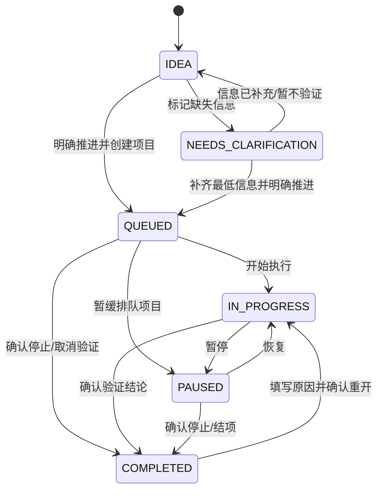

# v0.1 领域模型

- Status: Proposed F2 Design
- Feature: `v0-1-project-plan`
- Requirements baseline: `aedb210b95cbbeabc69ce776ed6966b36677196b`
- Requirements handoff: `06fba28fce0ebd758c8a53936b827ae346e4c76a858d72f443737bac6ac6f36c`
- Updated: 2026-07-27

## 1. 目标与边界

本模型服务于单工作空间、无用户系统的 v0.1，覆盖从 Idea 登记、澄清、
进入执行、进展汇报、问题与支持、验证结论到完成和重开的最小闭环。

领域模型必须保证：

1. 系统中的业务对象是权威事实，AI 生成的汇报只是展示层内容。
2. Idea 可以长期停留在 Idea 池，不会因创建而自动进入执行。
3. 每个 Idea 在 v0.1 最多关联一个首要验证项目。
4. 所有状态变化、确认、纠正与重开均可追溯，不使用静默覆盖或物理删除。
5. 高影响操作由人确认；普通进展更新可由 AI 代操作但必须记录来源。
6. 同一请求可安全重试，并发写入不会静默覆盖较新的事实。

v0.1 不在该模型中引入账户、成员、权限组、多租户、MCP 或一对多项目拆分。

## 2. 统一语言

| 中文概念 | 稳定英文标识 | 定义 |
| --- | --- | --- |
| 工作空间 | `Workspace` | v0.1 的单一数据边界；所有对象都属于同一工作空间 |
| 想法 | `Idea` | 想法提出者提交的原始意图及其澄清状态 |
| 验证项目 | `ValidationProject` | Idea 进入执行后承载目标、假设、进展和结论的对象 |
| 进展更新 | `ProgressUpdate` | 一次不可变的执行汇报事实 |
| 关注事项 | `AttentionItem` | 阻塞、待确认问题或支持请求的联合类型 |
| 证据 | `Evidence` | 支撑进展或结论的链接、产物、指标或说明 |
| 验证结论 | `ValidationConclusion` | 由证据、限制、不确定性和建议去向组成的版本化结论 |
| 人类确认 | `HumanConfirmation` | 对高影响操作的明确批准或拒绝记录 |
| 结构化汇报 | `ReportRevision` | AI 提交、经校验并由 Web 渲染的展示快照 |
| 领域事件 | `AuditEvent` | 由成功命令产生的追加式审计记录 |
| 操作者上下文 | `ActorContext` | 声明谁发起操作、扮演什么角色、使用什么客户端 |

## 3. 领域边界



| 边界 | 负责 | 不负责 |
| --- | --- | --- |
| Skill | 解释自然语言、补齐最小输入、生成 API 请求、解释结构化错误 | 保存独立状态、跳过确认、推断请求已成功 |
| Application API | 鉴别命令、幂等、并发控制、调用领域规则、返回稳定错误 | 自由解释自然语言、执行 AI 生成代码 |
| Domain | 聚合、不变量、生命周期、确认、纠正、审计事件 | 页面布局、客户端提示词 |
| Report Protocol | 校验展示文档、解析引用、保存版本、生成安全渲染输入 | 改写项目状态、确认、操作者或审计历史 |
| Query Projection | 为想法提出者和执行者生成不同读取模型 | 成为另一份可写权威状态 |
| Web | 切换视角、观察、必要确认、纠偏、安全渲染 | 建立平行业务规则或信任汇报中的权威字段 |

## 4. 聚合与对象

### 4.1 `Idea` 聚合

`Idea` 是登记与澄清阶段的聚合根。进入执行后，它保留原始意图并指向唯一的
`ValidationProject`；面向列表的完整生命周期状态由 Idea 的登记状态和关联项目状态组合得出。

| 字段 | 类型 | 约束 |
| --- | --- | --- |
| `id` | `IdeaId` | 服务端生成、不可变，建议格式 `idea_<ulid>` |
| `workspaceId` | `WorkspaceId` | v0.1 固定为单工作空间 |
| `title` | string | 1–120 字符 |
| `intentSummary` | string | 原始意图的忠实摘要，不得把假设写成事实 |
| `desiredOutcome` | string | 可空；缺失时进入待澄清项 |
| `proposer` | `ActorContext` | 声明的想法提出者 |
| `knownFacts` | `Statement[]` | 已知事实；每项有来源 |
| `assumptions` | `Statement[]` | 尚未验证的假设 |
| `clarificationQuestions` | `ClarificationQuestion[]` | 未回答与已回答问题均保留 |
| `intakeStatus` | `IDEA \| NEEDS_CLARIFICATION` | 仅用于尚未创建项目的阶段 |
| `projectId` | `ProjectId?` | v0.1 至多一个；创建后不可换绑 |
| `version` | integer | 乐观并发版本，从 1 开始 |
| `createdAt` / `updatedAt` | instant | 服务端时间 |

`Statement` 至少包含 `id`、`text`、`sourceType`、`sourceRef`、`recordedAt`。
`ClarificationQuestion` 至少包含 `id`、`question`、`status`、`answer`、
`answeredBy`、`answeredAt`。

### 4.2 `ValidationProject` 聚合

`ValidationProject` 是执行阶段的聚合根。它不复制 Idea 原始内容，只保存
`ideaId` 并承载执行状态。

| 字段 | 类型 | 约束 |
| --- | --- | --- |
| `id` | `ProjectId` | 服务端生成、不可变，建议格式 `proj_<ulid>` |
| `ideaId` | `IdeaId` | 必须存在且未绑定其他项目 |
| `goal` | string | 项目的可验证目标 |
| `hypotheses` | `Hypothesis[]` | 每项有描述、验证状态和证据引用 |
| `phase` | `CLARIFYING \| PLANNING \| BUILDING \| VALIDATING \| CONCLUDING` | 描述工作阶段，不代替生命周期状态 |
| `status` | `QUEUED \| IN_PROGRESS \| PAUSED \| COMPLETED` | 由状态机控制 |
| `nextSteps` | `NextStep[]` | 当前计划；完成项保留在历史更新中 |
| `latestProgressUpdateId` | `ProgressUpdateId?` | 最近一次成功进展 |
| `latestReportRevision` | integer | 0 表示尚无结构化汇报 |
| `activeConclusionId` | `ConclusionId?` | 完成时必须指向已确认结论 |
| `completedAt` | instant? | 最近一次完成时间 |
| `version` | integer | 所有业务写入的乐观并发版本 |
| `createdAt` / `updatedAt` | instant | 服务端时间 |

### 4.3 追加式项目记录

以下对象由 `ValidationProject` 约束，但以追加式记录单独存储，避免项目聚合随历史无限增长。

#### `ProgressUpdate`

| 字段 | 必填内容 |
| --- | --- |
| 身份 | `id`、`projectId`、`sequence` |
| 汇报 | `summary`、`completedWork[]`、`nextSteps[]` |
| 状态快照 | `projectStatusAtSubmission`、`phaseAtSubmission` |
| 证据 | `evidenceIds[]` |
| 时间与来源 | `occurredAt`、`submittedAt`、`submittedBy` |
| 追踪 | `requestId`、`correlationId` |

进展更新不可修改项目状态；若同一次用户意图还要求状态变化，应用层必须执行一个显式状态命令，
并在同一事务中记录两个事件。已保存的进展不可覆盖，只能追加纠正记录。

#### `AttentionItem`

`AttentionItem` 是带判别字段的联合类型：

| `type` | 必填专属字段 |
| --- | --- |
| `BLOCKER` | `background`、`impact`、`status`、解除时的 `resolution` |
| `DECISION_REQUEST` | `background`、`options[]` 或 `recommendation`、`decisionImpact`、`waitingForRole` |
| `SUPPORT_REQUEST` | `supportNeeded`、`reason`、`impact`、`expectedResponderRole` |

共有字段为 `id`、`projectId`、`title`、`status`、`createdBy`、`createdAt`、
`updatedAt`、`resolvedAt`。状态为 `OPEN | NEEDS_INFO | RESOLVED | CLOSED`。
解决或关闭不会删除原始描述和回应历史。

#### `Evidence`

| 字段 | 说明 |
| --- | --- |
| `id`、`projectId` | 证据只能被同项目对象引用 |
| `kind` | `LINK \| ARTIFACT \| METRIC \| NOTE` |
| `title`、`summary` | 人可理解的说明 |
| `locator` | 可选 HTTPS URL 或受控产物标识；不得是可执行内容 |
| `capturedAt`、`recordedAt` | 事实发生时间与系统记录时间分开 |
| `recordedBy` | 操作者上下文 |

#### `ValidationConclusion`

| 字段 | 说明 |
| --- | --- |
| `id`、`projectId`、`version` | 结论版本不可变 |
| `evidenceSummary`、`evidenceIds[]` | 支撑结论的说明与引用 |
| `limitations[]`、`uncertainties[]` | 不得省略已知限制 |
| `recommendation` | `CONTINUE \| ADJUST \| STOP \| TRANSFER` |
| `recommendationNote` | 对建议去向的补充 |
| `status` | `DRAFT \| PENDING_CONFIRMATION \| CONFIRMED \| SUPERSEDED` |
| `confirmationId` | `CONFIRMED` 时必填 |

### 4.4 治理对象

#### `ActorContext`

```text
actorType: HUMAN | AI | SYSTEM
role: PROPOSER | EXECUTOR | MAINTAINER | SYSTEM
displayName: string
client: string?
onBehalfOfRole: PROPOSER | EXECUTOR | MAINTAINER | null
```

v0.1 没有身份系统，因此这些字段表示“声明的归属”，不能被描述为已认证身份。
服务部署仍应有独立的访问保护；其方案在技术设计阶段确定。

#### `HumanConfirmation`

| 字段 | 说明 |
| --- | --- |
| `id` | `confirm_<ulid>` |
| `subjectType` / `subjectId` | 被确认的结论或命令 |
| `operation` | `CONFIRM_CONCLUSION \| COMPLETE_PROJECT \| STOP_PROJECT \| TRANSFER_PROJECT \| REOPEN_PROJECT` |
| `decision` | `APPROVE \| REJECT` |
| `payloadDigest` | 确认时看到的不可变请求摘要 |
| `confirmedBy` / `confirmedAt` | 必须是声明为人类的操作者和服务端时间 |
| `note` | 可选说明；重开时原因必须非空 |

确认只对 `payloadDigest` 对应的操作有效；内容变化后必须重新确认。
当一次确认载荷同时包含最终结论和对应的完成、停止或移交动作时，可以由同一条
`HumanConfirmation` 原子批准两者，不要求用户重复确认。

#### `AuditEvent`

所有成功命令追加一个事件，至少包含：

```text
eventId, aggregateType, aggregateId, aggregateVersion, eventType,
occurredAt, actorContext, reason, correlationId, requestId,
beforeSummary, afterSummary, relatedEventId
```

`beforeSummary` 和 `afterSummary` 只保存审计所需字段，不保存敏感请求全文。
纠正或撤销使用新事件并通过 `relatedEventId` 指向原事件。

## 5. 关系模型



## 6. 生命周期

### 6.1 面向用户的组合生命周期

列表中的 `lifecycleState` 是查询投影，不允许客户端直接写入：

```text
Idea 无项目:
  intakeStatus=IDEA                 -> IDEA
  intakeStatus=NEEDS_CLARIFICATION  -> NEEDS_CLARIFICATION

Idea 有项目:
  project.status=QUEUED             -> QUEUED
  project.status=IN_PROGRESS        -> IN_PROGRESS
  project.status=PAUSED             -> PAUSED
  project.status=COMPLETED          -> COMPLETED
```

这样避免 Idea 与项目同时保存两份可能冲突的执行状态。

### 6.2 状态机



### 6.3 转换门禁

| 命令 | 前置状态 | 必要条件 | 人类确认 |
| --- | --- | --- | --- |
| `PromoteIdea` | `IDEA` / `NEEDS_CLARIFICATION` | 目标、至少一个假设、明确推进意图 | 推进意图必须来自想法提出者；不要求二次确认 |
| `StartProject` | `QUEUED` | 存在下一步 | 否 |
| `PauseProject` | `QUEUED` / `IN_PROGRESS` | 非空原因 | 否 |
| `ResumeProject` | `PAUSED` | 非空恢复说明与下一步 | 否 |
| `CompleteProject` | `QUEUED` / `IN_PROGRESS` / `PAUSED` | 已确认结论；完成摘要 | 是 |
| `StopProject` | 非 `COMPLETED` | `recommendation=STOP` 的结论 | 是 |
| `TransferProject` | 非 `COMPLETED` | `recommendation=TRANSFER` 的结论 | 是 |
| `ReopenProject` | `COMPLETED` | 非空原因；保留旧结论和完成记录 | 是 |

## 7. 关键不变量

1. 一个 `Idea` 在 v0.1 最多绑定一个 `ValidationProject`。
2. 未收到显式 `PromoteIdea` 命令时，Idea 永远不会创建项目。
3. 项目状态只能通过状态机命令改变，进展、汇报或页面渲染不能隐式改变状态。
4. `COMPLETED` 项目必须引用一个 `CONFIRMED` 结论。
5. 高影响命令的确认摘要必须与待执行请求的摘要完全一致。
6. 证据、关注事项、结论和汇报引用必须属于同一项目和工作空间。
7. 任何成功写入都同时递增聚合 `version` 并追加 `AuditEvent`。
8. 已保存的进展、结论版本、汇报版本和审计事件不可原地修改或物理删除。
9. 纠正、撤销、关闭和重开均以补偿记录表达，并引用被纠正事件。
10. AI 汇报中的文本、状态描述或表格永远不能覆盖项目、确认、操作者和历史。

## 8. 命令、幂等与并发

所有写命令使用统一信封：

```json
{
  "requestId": "req_01K...",
  "expectedVersion": 4,
  "actor": {
    "actorType": "AI",
    "role": "EXECUTOR",
    "displayName": "Codex",
    "client": "codex",
    "onBehalfOfRole": "EXECUTOR"
  },
  "reason": "提交本轮原型验证进展",
  "payload": {}
}
```

- `requestId` 在“命令类型 + 聚合 ID”范围内唯一。
- 同一 `requestId` 与相同规范化载荷重试时返回首次结果，且不产生第二条记录。
- 同一 `requestId` 携带不同载荷返回 `IDEMPOTENCY_CONFLICT`。
- `expectedVersion` 与当前版本不一致返回 `VERSION_CONFLICT`，包含当前版本但不泄露无关数据。
- 状态写入、追加记录、最新指针和审计事件必须在同一数据库事务中完成。
- 服务端生成 `createdAt`、`updatedAt`、序号和审计版本；客户端时间只作为 `occurredAt`。

## 9. 读取投影

### 9.1 想法提出者视图

每项至少包含：

- Idea 标题、组合生命周期、最近更新时间；
- 是否已有项目、项目当前进度摘要和下一步；
- 等待想法提出者处理的 `DECISION_REQUEST`；
- 期望想法提出者响应的 `SUPPORT_REQUEST`；
- 最新已确认结论及建议去向；
- 最近状态变化及可执行的纠偏动作。

### 9.2 执行者视图

按 `COMPLETED` 与非 `COMPLETED` 分组，每项至少包含：

- 项目目标、阶段、状态、最近进展和下一步；
- 未解决阻塞、待确认问题、支持请求；
- 最近证据和结论状态；
- 最新有效结构化汇报版本；
- 当前版本和允许的状态命令。

两个视图来自同一权威对象，仅排序和突出内容不同。

## 10. 失败与恢复

| 失败 | 行为 |
| --- | --- |
| 输入信息不足 | 保存 Idea 与明确的待澄清问题，不自动创建项目 |
| 非法状态转换 | 不写入，返回当前状态、允许命令和恢复建议 |
| 并发冲突 | 不覆盖较新数据，返回当前版本供客户端重新读取 |
| 网络超时 | 客户端使用同一 `requestId` 重试 |
| 错误进展或事项 | 追加纠正/关闭记录，不修改历史正文 |
| 结论证据不足 | 允许保持草稿或待确认，限制与不确定性必须显式保存 |
| 错误完成 | 通过确认后的 `ReopenProject` 重开，原结论和完成事件仍可追溯 |
| 汇报无效或渲染失败 | 遵循结构化汇报协议，保留上一份有效版本 |

## 11. 实现映射建议

这是逻辑领域模型，不预设具体框架。最小持久化可以映射为：

```text
workspaces
ideas
clarification_questions
validation_projects
project_hypotheses
progress_updates
attention_items
attention_item_responses
evidence
validation_conclusions
human_confirmations
report_revisions
audit_events
idempotency_records
```

应用服务负责跨 `Idea` 与 `ValidationProject` 的事务，领域层负责状态机与不变量，
查询层生成两个角色投影。若未来拆分服务，再通过可靠事件和投影替代本地事务；
v0.1 不提前引入分布式一致性。

## 12. 需求追踪

| 设计内容 | 需求与验收 |
| --- | --- |
| Idea、澄清、显式推进 | REQ-001–005；AC-001–004 |
| 项目、进展、证据 | REQ-004–006、REQ-012；AC-005 |
| 阻塞、待确认、支持 | REQ-007–009、REQ-016–017；AC-006–009 |
| 结论与人类确认 | REQ-010、DEC-003、DEC-005；AC-010 |
| 生命周期、纠正和重开 | REQ-011–013、DEC-009–010；AC-011–012 |
| 双角色读取投影 | REQ-014–018；AC-004、AC-006、AC-013 |
| 幂等、错误与恢复 | REQ-019；AC-014 |
| 汇报与权威事实隔离 | REQ-021–025、ASM-006–007；AC-016–018 |

## 13. 后续设计输入

下一步技术设计与实施计划需要基于本模型确定：

- API 资源、命令端点和统一错误信封；
- 数据库选型、事务边界与迁移策略；
- 高影响确认在无用户系统条件下的最小交互；
- Skill 的意图分类、字段收集和重试策略；
- Web 两类查询投影与通用渲染器；
- 单元、状态机、契约、并发和端到端测试矩阵。
