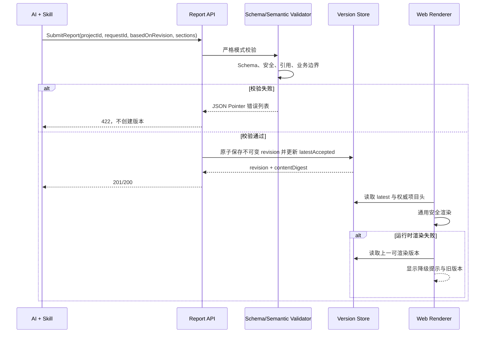

# v0.1 结构化汇报协议

- Protocol name: `project-report`
- Protocol version: `1.0`
- Status: Proposed F2 Design
- Requirements baseline: `aedb210b95cbbeabc69ce776ed6966b36677196b`
- Machine-readable schema:
  [structured-report.v1.schema.json](../../../packages/contracts/schemas/structured-report.v1.schema.json)
- Updated: 2026-07-27

## 1. 协议目标

该协议允许 AI 为不同验证项目提交不同结构、不同顺序的展示内容，Web 使用同一个
通用渲染器呈现。协议只描述“如何展示”，不承载项目的权威状态。

协议必须同时满足：

1. 支持章节、文本、指标、列表、表格、时间线、证据引用和行动项引用。
2. AI 只能提交声明式 JSON，不能提交 HTML、JavaScript、CSS、模板或可执行表达式。
3. 未知字段和未知块类型默认拒绝，错误必须包含可定位的 JSON Pointer。
4. 权威状态、确认、操作者、审计历史由服务端固定区域渲染，汇报无法覆盖。
5. 保存使用不可变版本；校验或渲染失败时仍可读取上一份有效版本。
6. 同一提交可安全重试，并发编辑不会静默覆盖。

## 2. 处理流程



## 3. 提交信封

AI 提交的根对象是 `ReportSubmissionV1`：

| 字段 | 类型 | 规则 |
| --- | --- | --- |
| `schemaVersion` | string | 固定为 `"1.0"` |
| `projectId` | string | 必须匹配 URL 中的项目且项目存在 |
| `clientRequestId` | string | 幂等键，格式 `req_<ulid>` 或等价安全标识 |
| `basedOnRevision` | integer | 0 表示首次提交，否则必须等于当前最新版本 |
| `locale` | string | v0.1 默认 `zh-CN` |
| `title` | string | 汇报标题，不是项目权威标题 |
| `summary` | string? | 本次汇报的简短说明 |
| `generatedAt` | RFC 3339 instant? | 客户端生成时间，仅作参考 |
| `generator` | object? | AI 客户端名称与版本，不作为认证信息 |
| `sections` | array | 1–20 个有序章节 |

根对象 `additionalProperties` 为 `false`。AI 不得提交 `projectStatus`、
`phase`、`confirmation`、`actor`、`auditEvents`、`reportId`、`revision` 或服务端时间。

## 4. 内容模型

### 4.1 `Section`

```json
{
  "id": "sec_overview",
  "title": "本周验证概览",
  "description": "聚焦结论、证据和下一步",
  "blocks": []
}
```

- `id` 在同一汇报中唯一并保持稳定。
- `title` 1–120 字符，`description` 最多 500 字符。
- 每个章节包含 1–30 个有序块。
- 协议不接受像素、CSS 类名、脚本回调或任意布局代码；响应式布局由 Web 决定。

### 4.2 块类型

| `type` | 用途 | 关键约束 |
| --- | --- | --- |
| `text` | 段落与有限 Markdown | 禁止原始 HTML、图片、脚本、内联样式 |
| `metrics` | 一组指标 | 每组 1–12 项；值为字符串或数字 |
| `list` | 有序/无序/检查列表 | 每块 1–50 项；勾选只表示汇报内容 |
| `table` | 小型结构化表格 | 1–8 列、最多 100 行；单元格只接受标量 |
| `timeline` | 项目叙事时间线 | 最多 50 项；不得冒充审计事件 |
| `evidence_refs` | 引用权威 Evidence | 只提交 `evidenceId`，标题和链接由服务端补全 |
| `action_refs` | 引用权威 AttentionItem | 只提交 `attentionItemId`，状态与负责人由服务端补全 |

`evidence_refs` 和 `action_refs` 的引用必须存在、属于同一项目且当前调用方可读取。
如果 AI 需要展示尚未成为权威对象的建议，只能先通过业务 API 创建相应对象，
或者用普通 `text` / `list` 明确标记为建议。

## 5. 完整示例

```json
{
  "schemaVersion": "1.0",
  "projectId": "proj_01K0EXAMPLE000000000000000",
  "clientRequestId": "req_01K0EXAMPLE0000000000000000",
  "basedOnRevision": 3,
  "locale": "zh-CN",
  "title": "CEO 想法验证周报",
  "summary": "本周完成原型访谈，核心价值假设获得初步支持。",
  "generatedAt": "2026-07-27T13:00:00Z",
  "generator": {
    "name": "codex",
    "version": "1"
  },
  "sections": [
    {
      "id": "sec_overview",
      "title": "验证概览",
      "blocks": [
        {
          "id": "blk_summary",
          "type": "text",
          "markdown": "已完成 5 次访谈。**这是初步信号，不代表完成验证。**"
        },
        {
          "id": "blk_metrics",
          "type": "metrics",
          "items": [
            {
              "id": "metric_interviews",
              "label": "完成访谈",
              "value": 5,
              "unit": "次",
              "trend": "up"
            },
            {
              "id": "metric_interest",
              "label": "愿意继续试用",
              "value": "4/5",
              "note": "样本量较小"
            }
          ]
        }
      ]
    },
    {
      "id": "sec_evidence",
      "title": "证据与行动",
      "blocks": [
        {
          "id": "blk_evidence",
          "type": "evidence_refs",
          "evidenceIds": [
            "evi_01K0EXAMPLE00000000000000000"
          ]
        },
        {
          "id": "blk_actions",
          "type": "action_refs",
          "attentionItemIds": [
            "attn_01K0EXAMPLE0000000000000000"
          ]
        }
      ]
    }
  ]
}
```

## 6. 文本与安全规则

### 6.1 有限 Markdown

`text.markdown` 允许：

- 普通段落、换行；
- `**粗体**`、`*斜体*`、行内代码；
- 有序和无序列表；
- HTTPS 链接。

不允许：

- 原始 HTML、SVG、`style`、`iframe`、表单；
- 图片、`data:`、`javascript:`、`file:` 或其他协议；
- Mermaid、模板表达式、事件处理器；
- 自动执行的嵌入内容。

服务端保存前执行语法和 URL 校验；Web 仍必须转义输出并使用受限 Markdown 渲染器。

### 6.2 大小与复杂度

| 限制 | v1 值 |
| --- | --- |
| UTF-8 JSON 总大小 | 256 KiB |
| 章节数 | 1–20 |
| 每章节块数 | 1–30 |
| 文本块 | 10,000 字符 |
| 指标项 | 1–12 |
| 列表项 | 1–50 |
| 表格 | 1–8 列、0–100 行 |
| 时间线项 | 1–50 |
| 单个字符串 | 由 Schema 对应字段限制，最长不超过 10,000 |

达到限制时返回错误，不截断后保存，避免 AI 误以为完整内容已持久化。

## 7. 校验顺序

服务端按固定顺序校验，并一次返回最多 50 条错误：

1. HTTP 内容类型和 256 KiB 大小。
2. JSON 语法。
3. `schemaVersion` 支持范围。
4. JSON Schema Draft 2020-12 结构校验。
5. 语义校验：章节/块 ID 唯一、表格列键与单元格键匹配。
6. 安全校验：Markdown、URL、禁止内容。
7. 项目边界：URL 与 `projectId` 一致，项目存在。
8. 引用完整性：Evidence 和 AttentionItem 存在且属于同一项目。
9. 幂等与乐观并发：`clientRequestId`、`basedOnRevision`。

任一步失败都不创建 `ReportRevision`，也不改变当前有效版本。

## 8. 成功响应

首次创建返回 HTTP `201`；同一幂等请求重放返回 HTTP `200`：

```json
{
  "ok": true,
  "data": {
    "reportId": "report_01K0EXAMPLE00000000000000",
    "projectId": "proj_01K0EXAMPLE000000000000000",
    "revision": 4,
    "previousRevision": 3,
    "contentDigest": "sha256:4f8b...",
    "acceptedAt": "2026-07-27T13:00:01Z"
  },
  "meta": {
    "requestId": "req_01K0EXAMPLE0000000000000000",
    "idempotentReplay": false
  }
}
```

`reportId`、`revision`、`contentDigest` 和 `acceptedAt` 均由服务端产生。

## 9. 错误响应

统一错误信封：

```json
{
  "ok": false,
  "error": {
    "code": "REPORT_VALIDATION_FAILED",
    "message": "结构化汇报包含 2 个错误。",
    "retryable": false,
    "details": [
      {
        "path": "/sections/1/blocks/0/evidenceIds/0",
        "code": "REFERENCE_NOT_FOUND",
        "message": "证据不存在或不属于该项目。"
      }
    ]
  },
  "meta": {
    "requestId": "req_01K0EXAMPLE0000000000000000"
  }
}
```

| HTTP | `error.code` | 含义与恢复 |
| --- | --- | --- |
| 400 | `INVALID_JSON` | 修复 JSON 语法后使用同一意图的新请求重试 |
| 400 | `PROJECT_ID_MISMATCH` | 使 URL 与载荷项目一致 |
| 404 | `PROJECT_NOT_FOUND` | 重新读取项目列表，不猜测 ID |
| 409 | `REPORT_REVISION_CONFLICT` | 读取最新版本、合并后用新 `clientRequestId` 提交 |
| 409 | `IDEMPOTENCY_CONFLICT` | 同一 ID 对应不同内容；生成新 ID 或恢复原内容 |
| 413 | `REPORT_PAYLOAD_TOO_LARGE` | 精简内容，不依赖服务端截断 |
| 422 | `REPORT_SCHEMA_UNSUPPORTED` | 改用支持的协议版本 |
| 422 | `REPORT_VALIDATION_FAILED` | 按 `details[].path` 修正 |
| 422 | `REPORT_UNSAFE_CONTENT` | 移除不允许的 Markdown、URL 或可执行内容 |
| 422 | `REPORT_REFERENCE_INVALID` | 创建/修正权威对象后重试 |
| 409 | `PROJECT_COMPLETED` | 已完成项目需先按领域规则重开才能发布新汇报 |
| 500 | `REPORT_STORE_FAILED` | 结果未知时使用同一 `clientRequestId` 安全重试 |

## 10. 幂等、并发与版本

- 幂等范围为 `projectId + clientRequestId`。
- 服务端对规范化 JSON 计算内容摘要。
- 相同幂等键和相同摘要返回原成功结果；不新增 revision。
- 相同幂等键和不同摘要返回 `IDEMPOTENCY_CONFLICT`。
- `basedOnRevision` 必须等于项目最新 revision；首次提交为 0。
- 校验、保存 revision、更新最新指针和写审计事件在同一事务中完成。
- 每个 `ReportRevision` 不可变；修订只能创建下一版本。
- 已完成项目冻结汇报写入；重开后可基于完成前最后版本继续。

## 11. 服务端快照与渲染

服务端持久化对象在提交内容之外增加：

```text
reportId, revision, previousRevision, contentDigest,
acceptedAt, submittedBy, renderStatus, renderFailure
```

`renderStatus` 为 `UNVERIFIED | RENDERABLE | RENDER_FAILED`：

1. API 通过校验并保存后，revision 初始为 `UNVERIFIED`。
2. 共用的渲染模型验证成功后标记为 `RENDERABLE` 并成为 `latestRenderableRevision`。
3. Web 运行时若捕获块渲染异常，记录安全的失败摘要并回退到
   `latestRenderableRevision` 之前的版本。
4. 页面显示“最新汇报暂不可展示，当前为上一有效版本”，但权威项目头仍显示最新业务事实。
5. 失败内容只在受控诊断接口中可见，不能作为可执行 DOM 注入页面。

## 12. 权威信息隔离

项目页由两部分组成：

```text
固定权威区域（服务端查询投影）
  - 项目状态与阶段
  - 最近进展与更新时间
  - 待确认、阻塞、支持请求
  - 人类确认结果
  - 变更历史与当前允许操作

可变汇报区域（本协议）
  - sections[]
  - 受控内容块
  - 对 Evidence / AttentionItem 的引用
```

如果汇报文本声称“项目已完成”但权威状态仍为 `IN_PROGRESS`，页面必须继续显示
`IN_PROGRESS`，并可把文本仅视为普通陈述。协议不提供隐藏、替换或重命名权威区域的能力。

## 13. 兼容与演进

- `schemaVersion` 使用 `major.minor`。
- v1 服务端只接受明确支持的版本；不猜测未来字段含义。
- 向后兼容的新可选字段提升 minor 版本。
- 新块类型、字段语义变化或删除字段提升 major 版本。
- 服务端至少保留已保存 revision 的原始 JSON 与版本号，以便旧版本只读渲染或迁移。
- Schema 升级必须提供契约测试和迁移/回滚说明；不得原地改写历史 revision。

## 14. 测试与验收矩阵

| 测试 | 证明 |
| --- | --- |
| 两个项目提交不同章节和块顺序 | 通用渲染器无需项目专用页面，覆盖 AC-016 |
| 每种块类型的合法/非法边界 | Schema 与语义校验一致 |
| 未知字段、未知块、HTML、危险 URL | 严格拒绝且返回 JSON Pointer |
| 引用其他项目的 Evidence/AttentionItem | 跨项目引用被拒绝 |
| 汇报声称虚假状态 | 权威区域不被覆盖，覆盖 AC-018 |
| 相同幂等键重试 | 只生成一个 revision |
| 旧 `basedOnRevision` 并发提交 | 返回 409，不覆盖新版本 |
| 校验失败 | 不创建 revision，上一有效版本保持 |
| 渲染器人为抛错 | 页面降级到上一可渲染版本，覆盖 AC-017 |
| 已完成项目提交汇报 | 冻结并指引重开 |

## 15. 需求追踪

| 协议内容 | 需求与验收 |
| --- | --- |
| 章节与七种块类型 | REQ-021、REQ-023；AC-016 |
| 严格 Schema 与可定位错误 | REQ-022；AC-017 |
| 权威对象引用与固定项目头 | REQ-024、ASM-007；AC-018 |
| 版本、不覆盖与渲染回退 | REQ-025；AC-017 |
| 幂等、结构化响应与恢复 | REQ-019；AC-014 |
| AI 只提交声明式数据 | ASM-006、DEC-007 |
