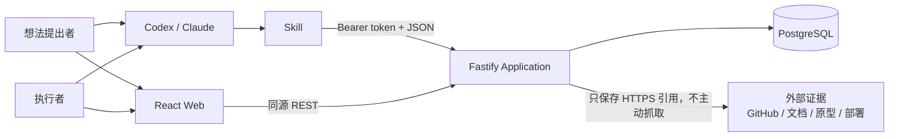
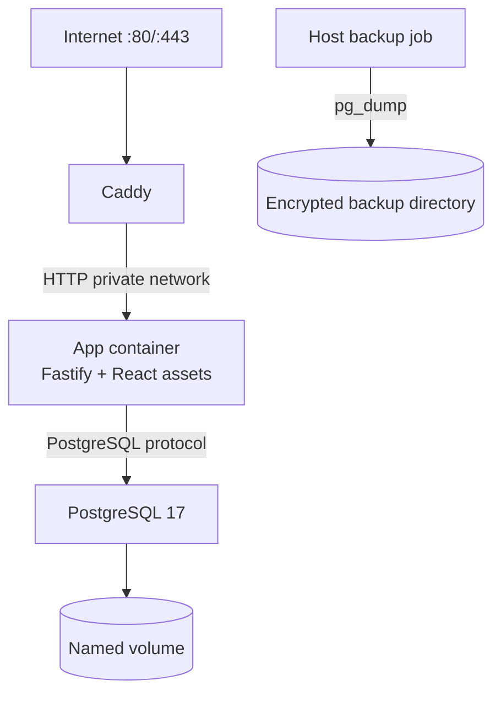

# v0.1 技术架构

- Status: Completed F2 Technical Design
- Feature: `v0-1-project-plan`
- Requirements baseline: `aedb210b95cbbeabc69ce776ed6966b36677196b`
- Requirements handoff: `06fba28fce0ebd758c8a53936b827ae346e4c76a858d72f443737bac6ac6f36c`
- Domain model: [domain-model.md](./domain-model.md)
- Report protocol: [structured-report-protocol.md](./structured-report-protocol.md)
- Updated: 2026-07-27

## 1. 架构结论

v0.1 采用 **TypeScript 模块化单体 + PostgreSQL + React 单页应用**：

- 一个 Node.js 进程提供 REST API、OpenAPI、静态 Web 资源和健康检查；
- 一个 PostgreSQL 实例保存所有权威状态、历史与结构化汇报版本；
- Caddy 负责公网 HTTPS、反向代理和安全响应头；
- Docker Compose 在单台个人服务器上运行 `caddy`、`app`、`db` 三个服务；
- Skill 是仓库中的 Markdown 契约，通过 REST API 操作同一份权威数据；
- v0.1 不引入微服务、消息队列、缓存集群、MCP、通用文件上传或用户系统。

选择模块化单体不是把边界混在一起。Idea、Project、Report、Confirmation、Query
各自拥有独立应用服务和仓储接口，只共享同一进程和数据库事务，以满足截止时间、
可追溯性和一致性要求。

## 2. 架构驱动因素

优先级从高到低：

1. 2026-08-06 前形成可部署、可重复演示的端到端闭环。
2. 项目状态、确认和历史必须可信，AI 展示内容不能覆盖权威事实。
3. Codex、Claude 等可以通过稳定、可纠错、可重试的 API 操作。
4. 两类 Web 视图共用数据，但突出不同工作内容。
5. 结构化汇报必须严格校验、安全渲染并保留旧版本。
6. 单人可以理解、部署、备份、恢复和继续演进。

非目标包括高并发、跨区域高可用、企业身份体系、多租户和微服务扩缩容。

## 3. 技术栈

| 层 | 选择 | v0.1 理由 |
| --- | --- | --- |
| Runtime | Node.js 22 LTS | 与 Fastify 5 明确兼容；避免 Current 版本风险 |
| Language | TypeScript strict mode | API、领域、Web 和契约使用同一类型系统 |
| Package layout | npm workspaces + `package-lock.json` | 无额外包管理器依赖；单锁文件 |
| API | Fastify 5 | 原生 JSON Schema、结构化日志、插件隔离、易测试 |
| API docs | `@fastify/swagger` + OpenAPI 3.1 | Skill 开发和契约核对的机器可读入口 |
| Database | PostgreSQL 17 | 成熟、仍受支持；事务、JSONB、约束和索引足够 |
| SQL access | Drizzle ORM + committed SQL migrations | TypeScript Schema、显式 SQL 迁移、事务 API |
| Report validation | Ajv 8 `Ajv2020` + `ajv-formats` | 独立执行 JSON Schema Draft 2020-12 严格校验 |
| Web | React + Vite + TypeScript | 快速构建双视图和数据驱动渲染器 |
| Server state | TanStack Query | 缓存、失效和错误状态，不建立客户端权威状态 |
| Markdown | AST allowlist renderer，不启用 raw HTML | 支持有限 Markdown，阻断可执行内容 |
| Unit/integration | Vitest | 同一 TypeScript 工具链 |
| Browser E2E | Playwright | 验证双视图、确认和渲染降级 |
| Edge | Caddy | 自动 HTTPS、反向代理和简单单机运维 |
| Packaging | Docker multi-stage + Docker Compose | 本地与个人服务器使用同一构建产物 |

实现时锁定最新兼容补丁版本和容器镜像摘要，不使用浮动 `latest` 标签。

### 3.1 官方支持依据

- [Node.js Releases](https://nodejs.org/en/about/previous-releases)
- [Fastify LTS](https://fastify.dev/docs/latest/Reference/LTS/)
- [Fastify Validation and Serialization](https://fastify.dev/docs/latest/Guides/Getting-Started/#validate-your-data)
- [PostgreSQL Versioning Policy](https://www.postgresql.org/support/versioning/)
- [Ajv JSON Schema Draft 2020-12](https://ajv.js.org/json-schema.html#draft-2020-12-breaking)
- [Ajv Strict Mode](https://ajv.js.org/strict-mode.html)
- [Drizzle Transactions](https://orm.drizzle.team/docs/transactions)
- [Docker Compose in Production](https://docs.docker.com/compose/how-tos/production/)
- [Caddy Automatic HTTPS](https://caddyserver.com/docs/automatic-https)

## 4. 系统上下文



## 5. 部署拓扑



- 只有 Caddy 暴露宿主机端口。
- `app` 与 `db` 仅加入 Compose 私有网络。
- App 镜像使用非 root 用户和只读根文件系统；临时目录单独挂载。
- PostgreSQL 使用命名卷；生产 `compose.production.yaml` 不挂载源码。
- 健康检查控制启动顺序，但迁移由显式一次性命令执行，不在多个 App 实例启动时竞争。

## 6. 仓库与模块

计划中的代码结构：

```text
.
├── apps/
│   ├── api/
│   │   └── src/
│   │       ├── app.ts
│   │       ├── server.ts
│   │       ├── config.ts
│   │       ├── plugins/
│   │       ├── routes/
│   │       └── static/
│   └── web/
│       └── src/
│           ├── app/
│           ├── api/
│           ├── features/
│           ├── report-renderer/
│           └── styles/
├── packages/
│   ├── contracts/
│   │   ├── schemas/
│   │   └── src/
│   ├── domain/
│   │   └── src/
│   │       ├── ideas/
│   │       ├── projects/
│   │       ├── confirmations/
│   │       └── shared/
│   ├── application/
│   │   └── src/
│   │       ├── commands/
│   │       ├── queries/
│   │       └── ports/
│   └── db/
│       ├── src/
│       └── migrations/
├── skills/idea-validation/
├── tests/
│   ├── contract/
│   ├── integration/
│   └── e2e/
├── deploy/
├── scripts/
└── docs/
```

依赖方向固定为：

```text
apps/api -> application -> domain
apps/api -> db implements application ports
apps/web -> contracts
application -> contracts + domain
db -> domain + application ports
domain -> no framework / no database
```

CI 使用依赖边界测试禁止 `domain` 反向导入 Fastify、Drizzle、React 或环境变量。

## 7. 运行时组件

| 组件 | 职责 |
| --- | --- |
| HTTP Adapter | 路由、鉴权、Schema、状态码、统一错误信封 |
| Command Service | 幂等、并发版本、事务、领域命令、审计事件 |
| Query Service | 想法提出者/执行者投影，分页和排序 |
| Domain | 状态机、不变量、结论和确认规则 |
| Report Service | Ajv2020、语义/安全/引用校验、版本与摘要 |
| Confirmation Service | 单次确认 token、摘要绑定、批准/拒绝 |
| Repositories | 领域对象与 PostgreSQL 的映射 |
| Web App | 两种角色视图、确认、纠偏、通用汇报渲染 |
| Skill | 自然语言到 API 操作的收集、调用、重试和解释 |

## 8. 数据设计

### 8.1 表与存储形态

| 表 | 主要内容 | 说明 |
| --- | --- | --- |
| `workspaces` | 单工作空间 | 预置一行 |
| `ideas` | Idea 核心、登记状态、版本 | `project_id` 唯一可空 |
| `idea_statements` | 事实与假设 | 类型列区分 |
| `clarification_questions` | 问题与回答 | 历史不删除 |
| `validation_projects` | 项目状态、阶段、版本、最新指针 | 条件更新实现乐观锁 |
| `project_hypotheses` | 假设及验证状态 | 引用证据 |
| `progress_updates` | 不可变进展 | 数组字段可用 JSONB |
| `attention_items` | 阻塞/待确认/支持 | 判别类型 + 受约束 JSONB 详情 |
| `attention_item_responses` | 回应和解决历史 | 追加式 |
| `evidence` | 证据元数据与 HTTPS locator | v0.1 不存二进制 |
| `validation_conclusions` | 版本化结论 | 完成时引用 confirmed 版本 |
| `human_confirmations` | 摘要绑定的确认 | 保存 token hash，不保存原 token |
| `report_revisions` | 原始 JSONB、摘要、版本、渲染状态 | 不可变 |
| `audit_events` | 追加式领域审计 | 不保存密钥和全文请求 |
| `idempotency_records` | 请求摘要与成功响应 | 唯一约束防重复 |

关键约束由数据库再次保障：

- `ideas.project_id` 唯一；
- `report_revisions(project_id, revision)` 唯一；
- `idempotency_records(scope, request_id)` 唯一；
- 所有外键带 `workspace_id` 或通过项目关系验证边界；
- 业务历史默认 `ON DELETE RESTRICT`；
- 项目完成要求结论的跨表规则在事务服务中检查并通过集成测试证明。

### 8.2 文件与外部链接

v0.1 不建设通用上传服务：

- 系统内部保存结构化状态、报告 JSON、证据元数据和外部 HTTPS URL；
- GitHub、文档、Figma、录屏、部署和看板内容保留在外部；
- 服务端不主动抓取 URL，避免 SSRF、超时和版权复制；
- Web 外链使用 `noopener noreferrer` 并明确显示来源域名；
- `ARTIFACT` 的内部对象存储接口保留为未来扩展，本期不实现。

## 9. REST API

基路径为 `/api/v1`。成功和错误均使用结构化 JSON，所有响应包含 `requestId`。

### 9.1 公开读取

```text
GET /ideas
GET /ideas/:ideaId
GET /projects?view=proposer|executor&group=open|completed
GET /projects/:projectId
GET /projects/:projectId/history
GET /projects/:projectId/reports/latest
GET /health/live
GET /health/ready
```

列表使用游标分页；默认页大小 20，最大 100。两个 `view` 值只影响投影，
不创建两套状态。

### 9.2 AI 写入

以下端点要求 `Authorization: Bearer <AI_API_TOKEN>`：

```text
POST /ideas
POST /ideas/:ideaId/clarifications
POST /ideas/:ideaId/promotions

POST /projects/:projectId/transitions
POST /projects/:projectId/progress-updates
POST /projects/:projectId/attention-items
POST /projects/:projectId/attention-items/:itemId/responses
POST /projects/:projectId/evidence
POST /projects/:projectId/conclusions
POST /projects/:projectId/reports
POST /projects/:projectId/corrections
```

所有写请求使用 `requestId` 和 `expectedVersion`；结构化汇报使用其协议定义的
`clientRequestId` 与 `basedOnRevision`。

### 9.3 Web 控制能力

公开 Web 只读。需要回应、暂停、恢复或纠正时，部署者使用一次生成的控制链接：

1. 原始 `WEB_CONTROL_TOKEN` 只出现在 URL fragment，不进入服务器日志。
2. Web 将其交换为 `HttpOnly; Secure; SameSite=Strict` 的短时控制 cookie。
3. 服务端只保存并配置 token hash；cookie 只授予单工作空间控制能力，不声明用户身份。
4. 普通 Web 写操作复用同一业务端点和领域规则，但使用控制 cookie 而不是 AI Bearer token。
5. 未持有控制能力时，Web 隐藏写按钮并保持可读。

这不是账户或角色权限系统，也不影响两个视图无需登录直接切换。

### 9.4 高影响确认

完成、停止、移交、最终结论和重开采用两阶段操作：

1. AI 提交命令，API 完成普通校验并返回 HTTP `202 CONFIRMATION_REQUIRED`。
2. 服务端保存操作摘要、一次性 token hash 和 30 分钟过期时间。
3. 返回的 Web 地址把原 token 放在 URL fragment 中，避免进入服务器访问日志和 Referrer。
4. Web 将 token 交换为 `HttpOnly; Secure; SameSite=Strict` 的短时确认 cookie，并清除 fragment。
5. 页面展示摘要、影响和证据；持有该一次性链接的人批准或拒绝。
6. 服务端重新计算摘要、重新校验当前聚合版本并原子执行。
7. token 使用一次后失效；内容或版本变化必须重新请求确认。

这不是用户系统：不识别人是谁，只证明持有人明确批准了某个不可变操作。
审计中的 `confirmedBy` 仍是声明身份。

## 10. 校验与契约

- 普通路由使用 Fastify 完整 JSON Schema 校验请求和响应。
- 结构化汇报使用独立的 `Ajv2020` 实例；不与 Fastify 默认 Schema 实例混用。
- Ajv 开启 strict mode，并显式注册 `date-time` 等 formats。
- OpenAPI 从路由 Schema 生成，CI 检查生成文件无未提交差异。
- [structured-report.v1.schema.json](./schemas/structured-report.v1.schema.json)
  在实现初期移动到 `packages/contracts/schemas/`，文档链接同步更新，保证只有一个规范源。
- TypeScript 类型从 Schema 推导或生成，不手写第二份不受检验的协议类型。

## 11. 事务、并发与幂等

普通事务使用 PostgreSQL `READ COMMITTED`，并通过显式版本条件防止丢失更新：

```sql
UPDATE validation_projects
SET status = $new_status, version = version + 1
WHERE id = $id AND version = $expected_version
RETURNING *;
```

返回零行即 `VERSION_CONFLICT`。

一个成功命令的以下写入必须处于同一事务：

- 幂等记录占位；
- 聚合状态或追加式事实；
- 最新指针；
- `audit_events`；
- 完成后的幂等响应。

同一幂等键遇到进行中事务时短暂等待，超过 2 秒返回可重试冲突；
相同摘要重放返回原响应，不再次执行；不同摘要返回 `IDEMPOTENCY_CONFLICT`。

## 12. 超时、重试与失败恢复

| 边界 | 策略 |
| --- | --- |
| HTTP 请求体 | 普通 1 MiB；汇报 256 KiB |
| API handler | 10 秒硬超时；数据库语句 5 秒 |
| 数据库连接 | 3 秒；有限连接池 |
| AI 客户端重试 | 仅网络错误、429、503；指数退避并复用 request ID |
| 业务 4xx | 不自动重试；按结构化错误修正 |
| 并发 409 | 重新读取、合并并使用新 request ID |
| 外部链接 | 服务端不抓取，因此不进入事务 |
| 关闭 | 停止接收新流量，等待在途请求后关闭连接池 |

未知写入结果必须使用相同幂等键重试，不能先生成新 ID。

## 13. 结构化汇报运行时

写入管线：

```text
body limit
-> JSON syntax
-> schemaVersion
-> Ajv2020 strict Schema
-> semantic uniqueness/table checks
-> Markdown AST/URL allowlist
-> same-project reference checks
-> idempotency/revision checks
-> immutable revision + audit event
```

Web 渲染器：

- 以 `block.type` 映射七个固定 React 组件，不支持动态 import 或表达式；
- `text` 不启用 raw HTML；
- Evidence/AttentionItem 由权威查询补全，忽略汇报中伪造状态；
- 权威项目头在汇报组件之外渲染；
- Error Boundary 捕获块错误，回退到上一 `latestRenderableRevision`；
- 失败通过受限、限流的客户端诊断端点记录，不包含原始 token 或敏感正文。

## 14. 安全、访问与隐私

### 14.1 访问边界

- Web 读取和角色切换无需登录，符合单工作空间演示约束。
- AI 写 API 使用一个部署级 Bearer token；它不是用户账户。
- 普通 Web 写操作需要不含身份信息的控制能力 cookie；公开访问保持只读。
- 高影响操作使用单次摘要绑定确认 token。
- Web 与 API 同源；生产 CORS 不允许通配符。
- 确认 POST 需要 SameSite cookie 和 CSRF token。

### 14.2 防护

- Bearer token、确认 token、数据库 URL 和 cookie 从日志中自动脱敏；
- 读取按 IP 限流，AI 写入按 token 限流，控制/确认交换使用更严格的 IP 限流；
- 所有 SQL 通过参数化查询；
- Caddy 设置 CSP、`X-Content-Type-Options`、`Referrer-Policy` 和 frame 限制；
- Markdown/URL 使用解析器 allowlist，不依赖正则替换；
- 外部 URL 仅允许 HTTPS，不进行服务器端 fetch；
- API Schema 使用 `additionalProperties: false`；
- 错误响应不暴露堆栈、SQL、绝对路径或密钥。

### 14.3 已知限制

由于没有用户系统：

- `ActorContext` 是声明身份，不是身份认证；
- 拿到部署级 API token 的客户端可以执行普通写操作；
- 拿到 Web 控制链接的人可以执行普通 Web 控制操作；
- 公开页面可能暴露演示数据。

因此 v0.1 只保存演示/非敏感数据。若要处理公司真实敏感信息，必须先回到需求阶段增加身份、
权限和数据分类。

## 15. 可观察性

App 输出 JSON 日志到 stdout：

```text
timestamp, level, requestId, route, method, statusCode, durationMs,
actorType, actorRole, aggregateType, aggregateId, errorCode
```

不记录 Authorization、cookie、确认 token、完整请求体或汇报正文。

健康检查：

- `/health/live`：进程事件循环可响应；
- `/health/ready`：数据库查询成功且迁移版本匹配；
- Compose 和 Caddy 只把 ready 实例视为可用。

v0.1 使用日志和健康检查，不引入 Prometheus 集群。关键演示路径的错误计数可从日志聚合。

## 16. 配置契约

生产启动需要：

| 环境变量 | 要求 | 说明 |
| --- | --- | --- |
| `NODE_ENV` | 必填 | 生产固定为 `production` |
| `PORT` | 必填 | App 私网监听端口 |
| `DATABASE_URL` | secret | PostgreSQL 连接；日志必须脱敏 |
| `PUBLIC_BASE_URL` | 必填 | HTTPS 公网根地址，用于确认链接 |
| `AI_API_TOKEN` | secret | AI 普通写入的部署级 Bearer token |
| `WEB_CONTROL_TOKEN_HASH` | secret | Web 控制链接原始 token 的不可逆 hash |
| `CONFIRMATION_TOKEN_PEPPER` | secret | 一次性 token hash 的服务端 pepper |
| `LOG_LEVEL` | 必填 | 生产默认 `info` |
| `DB_POOL_MAX` | 可选 | 单机默认 10，必须有上限 |
| `TRUST_PROXY` | 必填 | 只信任 Compose 中的 Caddy 地址范围 |
| `APP_VERSION` | 构建注入 | Git SHA 或镜像版本，用于健康与审计 |

- `apps/api/src/config.ts` 在进程接受流量前统一校验配置，缺失或格式错误立即失败。
- `.env.example` 只包含占位符和生成说明，不包含真实值。
- 不使用带默认值的生产密钥，不把配置对象整体打印到日志。
- 请求体大小、确认有效期和重试上限作为代码常量进入测试；若未来可配置，先补充边界测试。

## 17. 迁移、备份与恢复

- Drizzle Schema 是代码模型，生成的 SQL migration 必须提交。
- 开发可重建数据库；生产只运行 `drizzle-kit migrate`，禁止 `push --force`。
- 部署前执行备份，再执行迁移，再启动新 App。
- 每日 `pg_dump --format=custom`，保留最近 7 份；备份目录不进入 Git。
- 发布前至少完成一次从备份恢复到临时数据库的 smoke test。
- v0.1 所有迁移优先 additive：新增表、列、索引；避免删除或重命名。

## 18. 部署、回滚与发布

部署顺序：

1. 构建不可变 App 镜像并运行单元/集成/E2E。
2. 在服务器备份数据库。
3. 拉取新镜像并执行迁移 job。
4. 启动 App，等待 readiness。
5. Caddy 切换到新 App。
6. 执行演示 smoke 和 API contract smoke。

回滚：

- App 回滚到上一镜像；
- additive migration 默认保留，不做自动 down；
- 若迁移破坏兼容性则停止发布并从预部署备份恢复；
- 结构化汇报保留旧 Schema 原文和版本，客户端按版本读取。

真正发布到个人域名和服务器需要用户提供部署目标、DNS/端口条件和外部写入授权。

## 19. 测试与证明

| 层 | 必须证明 |
| --- | --- |
| Domain unit | 全部合法/非法状态转换、不变量、确认摘要 |
| Property/state model | 随机命令序列不会产生非法完成、双项目或历史删除 |
| Contract | OpenAPI、普通 Schema、Report Schema 正反例 |
| Repository integration | 事务回滚、唯一约束、版本冲突、幂等重放 |
| API integration | HTTP 状态、错误信封、token 脱敏、body limit |
| Web component | 七种块、角色投影、权威状态隔离、Error Boundary |
| Browser E2E | Idea 到完成/重开、两视图、确认、报告回退 |
| Deployment smoke | Compose、迁移、readiness、HTTPS、备份恢复 |

CI 门禁：

```text
npm ci
npm run format:check
npm run lint
npm run typecheck
npm run test
npm run test:contract
npm run build
npm run test:e2e
docker compose config --quiet
caddy validate --config deploy/Caddyfile
```

## 20. 被拒绝的方案

| 方案 | 暂不采用原因 |
| --- | --- |
| 微服务 + 消息队列 | 增加部署和一致性成本，v0.1 没有独立扩缩容需求 |
| Next.js 全栈 | SSR 不是需求；API 领域边界和静态 SPA 更直接 |
| SQLite | 本地简单，但并发、JSONB、备份和未来部署升级不如 PostgreSQL 稳定 |
| Python API + TypeScript Web | 框架成熟，但两种语言增加十天内共享契约和维护成本 |
| AI 生成 HTML/组件代码 | 违反声明式安全边界 |
| 通用文件上传/对象存储 | 不是 Must，增加安全与运维面；v0.1 使用外链证据 |
| 登录和权限系统 | 明确非目标；单次确认 token 满足高影响操作治理 |
| 服务端抓取外部证据 | 引入 SSRF、版权、超时和缓存一致性问题 |

## 21. 需求追踪

| 架构能力 | 需求 |
| --- | --- |
| Idea、澄清、项目状态与事务 | REQ-001–013 |
| 双角色查询投影与免登录切换 | REQ-014–018 |
| REST API、幂等、结构化错误和 Skill 边界 | REQ-019–020 |
| Report Service、七块渲染、安全与旧版本回退 | REQ-021–025 |
| Compose、Caddy、备份恢复、演示数据 | REQ-026–027 |
| 设计、架构和实施门禁 | REQ-028 |

## 22. F2 完成门禁

本架构与已有领域模型、结构化汇报协议共同覆盖：

- 组件和所有权边界；
- 数据、API、命令、配置和错误契约；
- 生命周期、幂等、并发、超时与恢复；
- 访问、确认、安全、审计和隐私限制；
- 兼容、迁移、部署、回滚和备份；
- 单元、契约、集成、E2E 和部署证明。

F2 在本文档提交后完成。实现必须遵循后续
[implementation-plan.md](./implementation-plan.md) 的切片，不得绕过确认需求或扩大 v0.1 范围。
