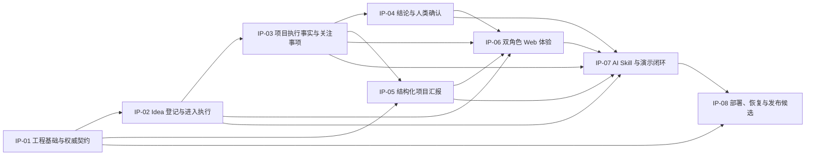

# v0.1 项目管理

- Portfolio: `v0.1`
- ProjectionState: `Current`
- TargetDemoDate: `2026-08-06`
- ManagementFeatureId: `v0-1-project-management-6f4b1a2d9c07`
- ManagementBranch: `codex/v0-1-project-management`
- ReviewRejectionRecord: `ImmutableReviewResult+ChangeRecord;NoRejectedAcceptanceRecord`
- RequirementsAuthority: [confirmed project-management requirements](./feature/v0-1-project-management/requirements.md)
- ApprovedDesign: [technical design](./feature/v0-1-project-management/design.md)
- ApprovedImplementationPlan: [implementation plan](./feature/v0-1-project-management/implementation-plan.md)
- ProductBaseline: [confirmed v0.1 requirements](./feature/v0-1-project-plan/requirements.md)
- SourcePlan: [historical v0.1 slice plan](./feature/v0-1-project-plan/implementation-plan.md)
- UpdatedAt: `2026-07-28T14:04:22Z`

本文件是 v0.1 唯一的项目级状态入口。它只维护组合状态、依赖、阻塞、下一步、
验收摘要和发布就绪度；详细范围、步骤、验证和验收正文只存在于对应 IP 计划。
任何状态变化都必须以 durable Engineering Lifecycle、Git/PR/Review 和指定验收方
的精确证据为依据，不能根据目标日期推断。

## 1. Portfolio summary

| PlanId | Title | Version | Status | ProjectionState | Dependencies | TargetDate | LifecycleFeatureId | Evidence | Blocker | LatestAcceptanceRecordId | CurrentAcceptedRecordId | ActiveStalenessRecordId | NextStep |
| --- | --- | ---: | --- | --- | --- | --- | --- | --- | --- | --- | --- | --- | --- |
| [IP-01](./implementation-plans/v0-1/ip-01-foundation-contracts.md) | 工程基础与权威契约 | 1 | Draft | Current | None | 2026-07-28 | Unassigned | None | None | None | None | None | Requirements 为 IP-01 形成独立确认快照与 handoff |
| [IP-02](./implementation-plans/v0-1/ip-02-idea-intake.md) | Idea 登记与进入执行 | 1 | Draft | Current | IP-01 | 2026-07-29 | Unassigned | None | None | None | None | None | 等待 IP-01 Accepted 后创建独立需求 |
| [IP-03](./implementation-plans/v0-1/ip-03-execution-facts.md) | 项目执行事实与关注事项 | 1 | Draft | Current | IP-02 | 2026-07-30 | Unassigned | None | None | None | None | None | 等待 IP-02 Accepted 后创建独立需求 |
| [IP-04](./implementation-plans/v0-1/ip-04-conclusion-confirmation.md) | 结论与人类确认 | 1 | Draft | Current | IP-03 | 2026-07-31 | Unassigned | None | None | None | None | None | 等待 IP-03 Accepted 后创建独立需求 |
| [IP-05](./implementation-plans/v0-1/ip-05-structured-reporting.md) | 结构化项目汇报 | 1 | Draft | Current | IP-01, IP-03 | 2026-08-01 | Unassigned | None | None | None | None | None | 等待 IP-01 与 IP-03 Accepted 后创建独立需求 |
| [IP-06](./implementation-plans/v0-1/ip-06-dual-role-web.md) | 双角色 Web 体验 | 1 | Draft | Current | IP-02, IP-03, IP-04, IP-05 | 2026-08-02 | Unassigned | None | None | None | None | None | 等待四个依赖 Accepted 后创建独立需求 |
| [IP-07](./implementation-plans/v0-1/ip-07-ai-skill-demo.md) | AI Skill 与演示闭环 | 1 | Draft | Current | IP-02, IP-03, IP-04, IP-05, IP-06 | 2026-08-03 | Unassigned | None | None | None | None | None | 等待五个依赖 Accepted 后创建独立需求 |
| [IP-08](./implementation-plans/v0-1/ip-08-deployment-release.md) | 部署、恢复与发布候选 | 1 | Draft | Current | IP-01, IP-07 | 2026-08-04–2026-08-06 | Unassigned | None | None | None | None | None | 等待 IP-01 与 IP-07 Accepted，并取得外部部署输入 |

当前事实：

- 八份计划均为 `Draft`，未注册独立 lifecycle feature，未开始运行时实现。
- 当前 management feature 只创建计划体系，不替代任何 IP 的独立需求确认。
- `ProjectionState=Current` 只表示两处 Markdown 投影一致，不表示计划已获执行授权。

## 2. Dependency graph and critical path



关键路径：

```text
IP-01 -> IP-02 -> IP-03 -> IP-04/IP-05 -> IP-06 -> IP-07 -> IP-08
```

`IP-04` 与 `IP-05` 可在 IP-03 被验收后并行。所有边都是硬依赖；任一硬依赖
未处于 `Accepted` 时，后继计划不能进入 `Ready`、`In Progress`、`In Review`
或 `Accepted`。

## 3. Status, authority, and recovery

| Status | Minimum evidence |
| --- | --- |
| Draft | 尚无完整独立 authority，或需求/计划仍在修订 |
| Ready | 独立 RequirementsHandoff、PASS plan review、全部硬依赖 Accepted |
| In Progress | 唯一 GoalRun 已由 Main 激活 |
| Blocked | durable Goal/外部 impasse 与完整 BlockerRecord |
| In Review | 实现、检查和 PR 已绑定精确 head |
| Accepted | 精确实现已合并，Must 证据与指定验收记录完整 |
| Deferred | 有明确延期决定、原因、影响和恢复条件 |

允许转换：

| Source | Target | Authority and gate |
| --- | --- | --- |
| Draft | Ready | Requirements + Review + Main；独立计划获批且依赖 Accepted |
| Draft | Deferred | 用户/Requirements 明确延期 |
| Ready | In Progress | Main 激活唯一 GoalRun |
| Ready | Deferred | 用户/Requirements 明确延期 |
| In Progress | Blocked | Main/platform 证明真实 impasse |
| In Progress | In Review | Main 绑定精确 PR head 与全部检查 |
| In Progress | Deferred | 用户明确延期且当前 Goal 安全停止 |
| Blocked | In Progress | Main/platform 证明解除并恢复 |
| Blocked | Deferred | 用户/Requirements 明确延期 |
| In Review | In Progress | Review 要求修改，或指定验收方拒绝且可立即修复 |
| In Review | Blocked | Review/验收失败且恢复受真实 impasse 阻塞 |
| In Review | Deferred | 用户/Requirements 明确延期 |
| In Review | Accepted | merge、Must、依赖、Review 和指定验收证据全部通过 |
| Deferred | Draft | 需求、计划或 authority 必须重做 |
| Deferred | Ready | 原 authority 仍有效、依赖满足并明确恢复 |
| Accepted | Draft | 用户/Requirements 批准实质变化并追加 Superseded 记录 |

Code Review 的 `REQUEST_CHANGES` 只引用 immutable Review result 并追加
ChangeRecord，不创建验收 `Rejected` 记录。只有 `AcceptanceOwner` 的明确决定
才能产生 `Accepted` 或 `Rejected` AcceptanceRecord。

### Lifecycle authority evidence

计划处于非 `Draft` 状态，或 `Draft` 已携带 `LifecycleFeatureId`、
`LifecycleEvidence`、AcceptanceRecord / Superseded history 时，项目入口
`Evidence` 与独立计划 `LifecycleEvidence` 必须持续指向同一个、由 40 字符 commit
固定的结构化 authority bundle：

```text
[authority bundle](https://github.com/zhanghao1903/idea-trace-validation/blob/<commit>/<path>.json)
```

bundle 只是可审计的缓存投影，不能自行产生 authority。checker 必须从当前仓库
Git common-dir 对应的 Codex canonical lifecycle `config.json` schema 1 与
`state.json` schema 2 解析 message、routing、feature stage 与 GoalRun。durable
message 只接受 workflowctl 支持的 `RequirementsHandoff`、
`TechnicalPlanReviewRequest` / `TechnicalPlanReviewResult`、
`CodeReviewRequest` / `CodeReviewResult`；未知类型一律使 canonical context
失效。canonical root 必须与 workflowctl 一致：环境中存在 `CODEX_HOME` 时使用其
用户展开（包括字面 `~`）并规范化后的目录，否则使用当前用户 home 下的 `.codex`；
不得固定到某个用户 home。config/state 必须满足完整 workflowctl 不变量，包括精确 key 集、严格 UTC
时间、feature/plan/PR 阶段门禁、GoalRun history、唯一 activeGoal、
developmentQueue 和 dispatch ledger/payload digest；仅有 schemaVersion 与浅层
feature/stage 不构成 authority。生产 checker 必须只读调用当前安装的 workflowctl
`validate_config` / `validate_state`，并把本地防御校验与 canonical validator
取交集；validator 不可发现、不可执行或拒绝任一 nested artifact/cross-field
状态时均 fail closed，不得复制一个更宽松的浅层替代实现。checker 同时从 GitHub API 解析精确
PR/base/head、PR 文件、仓库 required-check 集合、check result、merge event、
merge commit 和验收 review；缺少任一外部读取、引用不存在或投影不一致时一律
fail closed。生产运行不得通过仓库内文件或命令行覆盖 canonical lifecycle root；
生产 CLI 不存在 state/config override。测试 authority 只能由 negative harness
生成的独立 test build 在构建时固定；该 build 必须在路径规范化前逐段拒绝
state/config 的 symlink、hardlink、tracked inode alias 和 common-dir 不一致。

七种状态、十六条边、source roles、authority 类型、prerequisite 与精确
source/target durable-stage 集合必须来自同一个可穷举 registry。`Draft` 覆盖真实
workflowctl 的 `REQUIREMENTS_CONFIRMED`、`PLAN_DRAFTING`、
`PLAN_REVIEW_PENDING`、`PLAN_CHANGES_REQUESTED`；`Draft→Ready` 必须从
`PLAN_REVIEW_PENDING` 到 `PLAN_APPROVED` / `DEVELOPMENT_QUEUED`。
`Deferred` 保留延期前合法 stage：pre-plan `Draft→Deferred` 不要求虚构 PASS
plan；有计划、Goal 或 PR 的延期只校验该边实际需要的既有 authority。registry
必须与上表逐边一致：`In Progress→Deferred` 只接受 `user + main`，
`Deferred→Draft` 只接受 `requirements + main`，`In Review→Accepted` 的转换
source roles 为 `external-merge-owner + acceptance-owner + main`；Code Review
approval 是 prerequisite，不得混入该转换的 actor route。

延期、重开与恢复决定统一解析仓库 OWNER 的未编辑 GitHub 结构化决定，不得发明
lifecycle message 类型。决定中的 `authorityRole` 只能是 `user` 或
`requirements`；Requirements authority 必须用 `requirementsMessageId` 绑定同一
feature 的 durable `RequirementsHandoff`，user authority 必须写 `None`。
`Deferred→Ready` 还必须通过 `previousDecisionMessageId` 绑定紧邻的 immutable
延期决定，不能把旧 plan-review PASS 当作恢复决定。所有决定都必须包含原因和恢复
条件。`Accepted→Draft` 必须追加 Superseded AcceptanceRecord、增加计划版本、
接受新 feature 的 RequirementsHandoff，并把新 bundle 绑定到旧 feature、最新
Superseded record 与被替代的 Accepted record。首次重开还必须把 Superseded
record 的 `SubmittedCommit`、DecisionActor/DecisionAt、RecordedAt、Reason、
新旧 Requirements/acceptance evidence、status-decision message 与 transition
message lineage 固定在原始 `Accepted→Draft` authority；后续 Draft 提交不得用
第二条 Superseded record 和另一组决定替换它。

bundle 必须把 PlanId/version、独立 lifecycle feature/branch 和
AcceptanceOwner 绑定到精确 RequirementsHandoff、PASS 技术计划 Review，以及该
状态转换的 source roles。进入 `In Progress` 后还必须绑定 canonical GoalRun 和
真实实现 head；进入 `In Review` 后必须绑定 durable CodeReviewRequest、live
独立 PR/head、完整 PR 文件与 repository-required checks；进入 `Accepted` 后
必须先取得 durable `APPROVE`/`READY` CodeReviewResult，再取得同一 request/head
的 durable `APPROVE`/`MERGED` observation，并与 GitHub merge event、配置的 merge
method、merge commit 文件以及 `AcceptanceOwner` 本人的 `APPROVED` GitHub PR
review 完全一致；因此分配 `AcceptanceOwner` 时必须填写可由 GitHub API 精确解析的
login。`READY`/`MERGED` 是 merge 状态，不是 CodeReview decision。
所有引用 commit 必须在当前 Git 历史中可达，bundle 中的实现路径必须等于该实现
head 相对 PASS plan commit 的完整 Git diff，并等于 live PR 文件集；任意
actor/feature/branch 文本、通用 URL、
自造 64 字符 message ID、仅有 SHA 外观的 commit 或 repository-authored JSON
均不构成 authority。

所有 GitHub collection authority 必须分页到完成。PR files、check runs、combined
statuses、reviews 与 merge-commit files 的每页都进入
`authoritySnapshotDigest`；非末页不是 100 项、重复 identity、声明总数与完整结果
不一致或第二页缺失时一律失败。秘密扫描必须先规范化 JSON Unicode 转义，再从
JSON 对象和保守的缩进/点分隔文本解析层级路径；`public.vendor.api.key`、
`public.vendor.apiKeys`、`database.url`、escaped `api_key` 等敏感路径下的
标量、数组、对象、flow-style object/array 与跨行结构一律拒绝；敏感分类必须统一
规范化单数/复数 credential container。balanced flow-style container 必须在 tracked
行中的任意语法偏移被解析，包括 `const config = { ...apiKeys... }` 这类 source-like
assignment；无法安全解析时保守 fail closed。diagnostic 只记录规范化字段路径，不记录值。

Main 必须比较 parent/head 状态。任何业务状态变化都只能使用上表允许的边，并由
bundle 中精确 `from`/`to`、message ID、source roles、时间和原因授权。旧或新任一
投影为 `Stale` 时业务状态必须保持不变；只允许同步/清除 staleness 的补偿动作。
最新验收结果为 `Rejected` 时，状态只能恢复为 `In Progress` 或 `Blocked`，并
绑定同一拒绝决定、失败 Must、恢复动作及需要的 BlockerRecord。Review 拒绝必须
解析为 durable `REQUEST_CHANGES`；验收方拒绝必须解析为该 owner 在精确 head 上
提交的 `CHANGES_REQUESTED` GitHub review。

任何带 authority 的 reopened `Draft` 在后续 `Draft→Draft` 提交中仍必须重新解析
canonical bundle。当前 version/feature/branch/evidence、最新 Superseded record
及其 related Accepted record 必须连续一致；Evidence 发生变化时，独立计划与
portfolio 必须在同一提交各追加同步 ChangeRecord。删除、不可达、错绑或只改
Evidence 而不追加 ChangeRecord 均 fail closed。即使新 Evidence、第二条
Superseded record 和两处 ChangeRecord 完全同步，只要没有独立、明确支持的
compensating transition，也必须拒绝替换原始重开 authority。

## 4. Synchronization and staleness

范围、依赖、状态、门禁、证据、阻塞或下一步变化时，Main 必须在同一 Git 变更中：

1. 读取 durable lifecycle、Git/PR/Review 和验收 authority；
2. 更新对应独立计划；
3. 更新本文件的同一摘要行；
4. 追加 ChangeRecord，以及需要的 AcceptanceRecord、BlockerRecord 或
   StalenessRecord；
5. 运行 summary parity、依赖、链接、追踪和 authority 检查；
6. 只在全部通过后提交并推送。

发现冲突时，两处投影都设置 `ProjectionState=Stale`，指向同一个活动
StalenessRecord，并停止业务状态晋级。Main 重新读取高层 authority、在同一补偿
提交中纠正两处投影且检查通过后，才能清除活动 pointer 并恢复 `Current`；历史
记录不得删除。

### Staleness history

| RecordId | PlanId | DetectedAt | DetectedBy | Reason | ConflictingAuthority | AffectedFields | RecoveryAction | ClearedAt | ClearedBy | ClearEvidence |
| --- | --- | --- | --- | --- | --- | --- | --- | --- | --- | --- |
<!-- No staleness records at initialization. -->

## 5. Acceptance summary

| PlanId | AcceptanceOwner | LatestResult | AcceptedBy | AcceptedAt | AcceptedCommit | AcceptanceEvidence |
| --- | --- | --- | --- | --- | --- | --- |
| IP-01 | Pending assignment | None | None | None | None | None |
| IP-02 | Pending assignment | None | None | None | None | None |
| IP-03 | Pending assignment | None | None | None | None | None |
| IP-04 | Pending assignment | None | None | None | None | None |
| IP-05 | Pending assignment | None | None | None | None | None |
| IP-06 | Pending assignment | None | None | None | None | None |
| IP-07 | Pending assignment | None | None | None | None | None |
| IP-08 | Pending assignment | None | None | None | None | None |

完整、追加式验收历史只保存在对应 IP 计划。本表只投影当前摘要；旧
`AcceptedCommit`、actor、时间和证据不可覆盖。

## 6. Primary requirement and slice trace

<!-- PRIMARY-TRACE-START -->
| Type | ID | Primary plan |
| --- | --- | --- |
| Requirement | REQ-001 | IP-02 |
| Requirement | REQ-002 | IP-02 |
| Requirement | REQ-003 | IP-02 |
| Requirement | REQ-004 | IP-02 |
| Requirement | REQ-005 | IP-02 |
| Requirement | REQ-006 | IP-03 |
| Requirement | REQ-007 | IP-03 |
| Requirement | REQ-008 | IP-03 |
| Requirement | REQ-009 | IP-03 |
| Requirement | REQ-010 | IP-04 |
| Requirement | REQ-011 | IP-01 |
| Requirement | REQ-012 | IP-01 |
| Requirement | REQ-013 | IP-03 |
| Requirement | REQ-014 | IP-06 |
| Requirement | REQ-015 | IP-06 |
| Requirement | REQ-016 | IP-06 |
| Requirement | REQ-017 | IP-06 |
| Requirement | REQ-018 | IP-06 |
| Requirement | REQ-019 | IP-01 |
| Requirement | REQ-020 | IP-07 |
| Requirement | REQ-021 | IP-05 |
| Requirement | REQ-022 | IP-05 |
| Requirement | REQ-023 | IP-05 |
| Requirement | REQ-024 | IP-05 |
| Requirement | REQ-025 | IP-05 |
| Requirement | REQ-026 | IP-08 |
| Requirement | REQ-027 | IP-07 |
| Requirement | REQ-028 | Management feature |
| Slice | Slice 0 | IP-01 |
| Slice | Slice 1 | IP-01 |
| Slice | Slice 2 | IP-02 |
| Slice | Slice 3 | IP-03 |
| Slice | Slice 4 | IP-04 |
| Slice | Slice 5 | IP-05 |
| Slice | Slice 6 | IP-06 |
| Slice | Slice 7 | IP-07 |
| Slice | Slice 8 | IP-08 |
| Slice | Slice 9 | IP-08 |
<!-- PRIMARY-TRACE-END -->

辅助关系不改变上述唯一主归属。例如 IP-06 会读取 IP-02–IP-05 的权威事实，
IP-07 会演练前序 API，IP-08 会验证全部计划的发布组合。

## 7. Acceptance-criteria coverage

| Acceptance criterion | Plans |
| --- | --- |
| AC-001 | IP-02, IP-07 |
| AC-002 | IP-02 |
| AC-003 | IP-02 |
| AC-004 | IP-02, IP-06 |
| AC-005 | IP-01, IP-03 |
| AC-006 | IP-03, IP-06 |
| AC-007 | IP-03 |
| AC-008 | IP-03, IP-06 |
| AC-009 | IP-03, IP-06 |
| AC-010 | IP-04 |
| AC-011 | IP-01, IP-02, IP-03, IP-04 |
| AC-012 | IP-03, IP-04 |
| AC-013 | IP-06 |
| AC-014 | IP-01, IP-02, IP-03, IP-04, IP-05 |
| AC-015 | IP-07 |
| AC-016 | IP-05, IP-06 |
| AC-017 | IP-05, IP-06 |
| AC-018 | IP-05, IP-06 |
| AC-019 | IP-07, IP-08 |
| AC-020 | IP-01, IP-02, IP-03, IP-04, IP-05, IP-06, IP-07, IP-08 |

## 8. Release readiness

| Gate | Current result | Evidence / blocker |
| --- | --- | --- |
| IP-01–IP-08 all Accepted | NOT READY | All eight plans are Draft |
| Required checks green on every IP | NOT READY | No independent PR exists |
| Production deployment authorized | NOT READY | External authorization not supplied |
| Domain/DNS/80/443 available | NOT READY | External inputs not supplied |
| Backup restore proven | NOT READY | Belongs to IP-08 |
| Repeatable demo passes on candidate | NOT READY | Belongs to IP-07/IP-08 |

任何单份 IP 的验收都不等于 v0.1 已部署或发布。只有八份计划全部 `Accepted`，
且 IP-08 的域名、HTTPS、部署、备份恢复和演示证据完整时，组合发布就绪度才可
变为 Ready。

## 9. External inputs and blockers

IP-08 最迟需要系统维护者提供并明确授权：

- 个人服务器部署方式；
- 域名、DNS 修改能力和可访问的 80/443 端口；
- 数据库/备份磁盘空间；
- AI、确认和 Web 控制凭据的安全生成与交付方式；
- 演示数据公开范围；
- 生产部署授权。

这些输入不得进入仓库、Issue、PR、日志或演示数据。缺少它们不阻塞前序本地计划，
但会阻塞 IP-08 的外部验收。

## 10. Portfolio change history

| ChangedAt | Actor | Change | Reason | Evidence |
| --- | --- | --- | --- | --- |
| 2026-07-28T14:04:22Z | Engineering Main | 创建唯一项目入口，登记 IP-01–IP-08 为 Draft/Current | 实施已确认的计划拆分与管理需求 | [approved management plan](./feature/v0-1-project-management/implementation-plan.md) |

ChangeRecord 只追加。错误通过新的补偿记录纠正，不修改旧行。

## 11. Next authorized actions

1. Requirements 仅为 IP-01 建立独立、版本化、经用户确认的需求快照。
2. IP-01 完成独立 plan review、GoalRun、PR、精确 head Code Review、合并和验收。
3. 依赖满足后，按图逐份注册后续 IP；不得批量共享 handoff、分支、计划审批、
   GoalRun、PR 或验收结论。
4. 每次变化都在对应独立计划与本入口同提交同步，并重新运行确定性检查。
